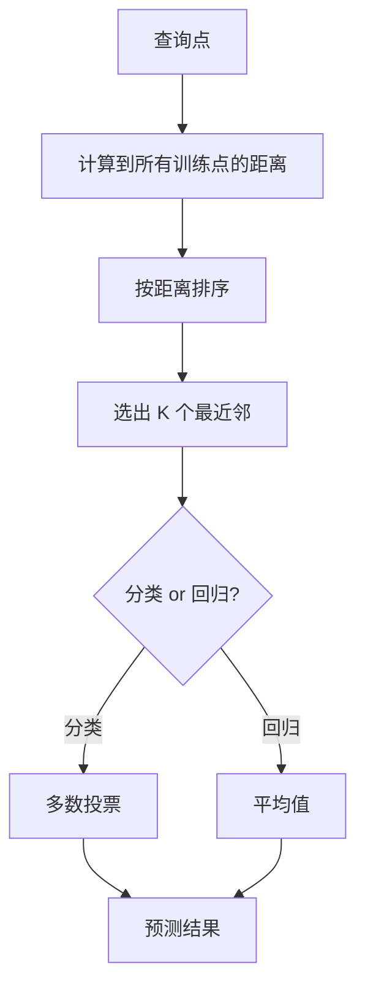
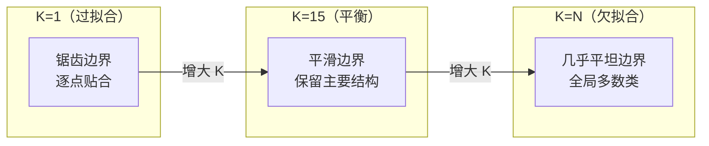
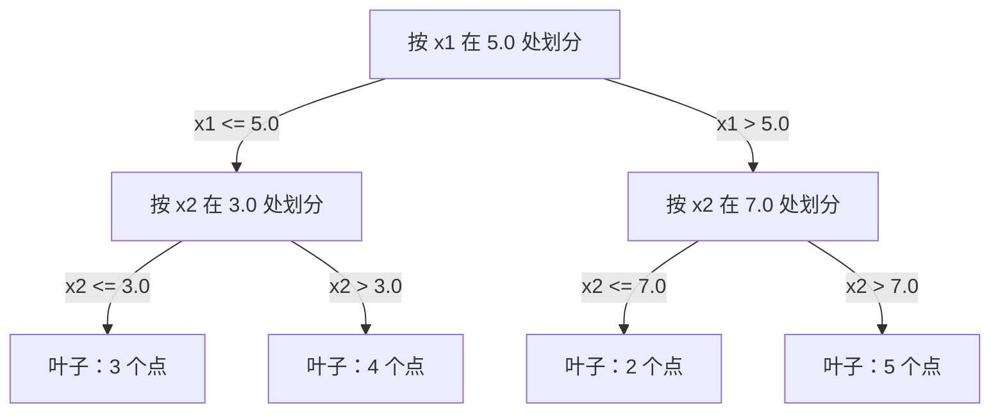

# K 近邻与距离

> 把训练数据都存起来，预测时看最近的邻居。朴素，但往往真有用。

**类型:** 构建
**语言:** Python
**先修:** 第 1 阶段，第 14 课（范数与距离）
**时长:** ~90 分钟

## 学习目标
- 从零实现 KNN 分类和回归，支持可配置的 K 与距离加权投票
- 解释特征尺度为什么会影响距离计算，并演示标准化的重要性
- 对比欧氏、曼哈顿、余弦等距离度量在文本与高维场景的适用性
- 理解维度灾难对邻域结构的影响，以及 K、权重与投票策略对偏差-方差的作用

## 问题背景

你有一批历史数据，来了一条新样本，需要分类或回归。与线性回归、SVM 不同，不先拟合参数，而是直接找出距离该点最近的 K 个训练点，用它们的标签或目标来推断输出。

这就是 KNN。它没有训练过程，没有可学习参数，甚至没有优化损失函数。核心动作是：保存全量训练集，在预测时按距离找邻居。

它看起来简单到有些“不像算法”，但在中小规模问题上常常表现不错。更重要的是，它把你带回几个根本问题：距离度量怎么选、维度灾难如何发生、惰性学习与积极学习的差异。

现代 AI 里，KNN 也无处不在：向量数据库做 embedding 检索、RAG 找相似 chunk、推荐系统找相似用户或物品，本质动作都在做近邻搜索。

## 核心概念

### KNN 的工作方式

有一个带标签的数据集和一个查询点：

1. 计算查询点到训练集中每个点的距离
2. 按距离升序排序
3. 取最近的 K 个邻居
4. 分类任务：对 K 个邻居投票
5. 回归任务：对 K 个邻居取平均或加权平均



整个算法就是这些：无拟合、无反向传播、无 epoch。

### 如何选择 K

K 是核心超参数，直接控制偏差-方差权衡。

| K | 行为 |
|---|---|
| K=1 | 决策边界紧贴每个点，训练误差低，方差高，容易过拟合 |
| 小 K（如 3~5） | 对局部结构敏感，可学到更复杂边界 |
| 大 K | 边界更平滑，对噪声更稳，但可能欠拟合 |
| K=N | 每个点都投同一个结果，偏差最大 |

一个常用起点是 `K = sqrt(N)`。二分类可优先用奇数避免平票。



### 距离度量

“近”是什么，完全取决于距离定义，不同距离会改变邻居与预测。

**L2（欧氏距离）**是默认选择，几何含义是直线距离。

```text
d(a, b) = sqrt(sum((a_i - b_i)^2))
```

它对特征尺度敏感，先标准化非常关键。

**L1（曼哈顿距离）**是绝对差之和，对离群值更稳，因为没有平方放大。

```text
d(a, b) = sum(|a_i - b_i|)
```

**余弦距离**比较向量夹角，不看模长。文本和 embedding 常用。

```text
d(a, b) = 1 - (a · b) / (||a|| * ||b||)
```

**闵可夫斯基距离**用参数 `p` 统一 L1/L2 家族。

```text
d(a, b) = (sum(|a_i - b_i|^p))^(1/p)

p=1：曼哈顿
p=2：欧氏
p->inf：Chebyshev（各维最大绝对差）
```

度量选型建议：

| 数据类型 | 常用度量 | 原因 |
|---|---|---|
| 数值特征且量纲接近 | L2 | 空间直观，默认首选 |
| 数值特征且有异常值 | L1 | 抗离群值更稳 |
| 文本 embedding | 余弦 | 幅值通常是噪声，方向更代表语义 |
| 高维稀疏 | 余弦或 L1 | L2 在高维下更容易退化 |
| 混合特征 | 自定义组合 | 每类特征用合适距离再融合 |

### 加权 KNN

标准 KNN 让 K 个邻居等权重，但距离更近的点通常更有信息。可用距离倒数做加权：

```text
weight_i = 1 / (distance_i + epsilon)

分类：加权投票
回归：weighted average = sum(w_i * y_i) / sum(w_i)
```

`epsilon` 用来避免查询点与训练点重合时除零。加权后，对 K 的依赖通常更弱，因为远邻的贡献会被压低。

### 维度灾难

高维空间里 KNN 会退化，这不是感觉问题，而是数学问题。

**问题一：距离集中。** 维度升高时，最大距离与最小距离之比趋近 1。点与点之间越来越“差不多远”，最近邻的意义变弱。

```text
随机均匀点在 d 维下：
d=2:    max/min 距离比变化较大
d=100:  max/min 距离比大约 1.01
d=1000: max/min 距离比大约 1.001
```

**问题二：体积爆炸。** 想在固定比例内找到 K 个邻居，搜索半径必须快速变大，最终会覆盖几乎整个空间。

**问题三：角落主导。** 单位超立方体里，大量体积集中在角落，内切球占比随维度上升急剧缩水。

实践经验：KNN 在约 20~50 维前还能稳定工作。超过后通常要先降维（PCA、UMAP、t-SNE），或者改用更适合高维近邻结构的搜索方法。

### KD-tree：加速近邻搜索

朴素 KNN 每次都对全部点算距离，复杂度是 `O(n * d)`。KD-tree 通过按轴划分空间来加速。



查询时先下沉到包含查询点的叶子，再回溯检查可能有更近点的分支。

低维下平均查询时间可以接近 `O(log n)`。但维度一高，KD-tree 会退化到 `O(n)`，因为回溯能剪掉的分支越来越少。

### Ball tree：中等维度更稳

Ball tree 用同心球而不是轴对齐盒子分区，每个节点是一个“中心 + 半径”的球，包住子树里的所有点。

优点：
- 在中等维度（大约 50 维以内）通常比 KD-tree 更稳
- 更适合非轴对齐结构
- 包络更紧，搜索时能剪掉更多分支

KD-tree 和 Ball tree 都是精确算法。若是百万级点、上百维的大规模搜索，通常会换成近似最近邻方法，比如 HNSW、IVF、PQ。第 14 课已经讲过这些。

### 惰性学习 vs 积极学习

KNN 是惰性学习：训练时几乎不做事，推理时才做全部计算。多数其他算法（线性回归、SVM、神经网络）是积极学习：训练时花大量计算建模，推理时更快。

| 维度 | 惰性学习（KNN） | 积极学习（SVM/神经网） |
|---|---|---|
| 训练成本 | `O(1)`，基本就是存数据 | `O(n * epochs)` |
| 预测成本 | 每次 `O(n * d)` | 通常 `O(d)` 或 `O(参数量)` |
| 推理内存 | 需保存全部训练数据 | 只需模型参数 |
| 新数据适配 | 新增点即可生效 | 常需重训 |
| 决策边界 | 在线计算 | 训练后固定 |

惰性学习适合：
- 数据持续变化频繁
- 查询很少
- 训练时间必须极小
- 数据规模不大，朴素搜索仍可接受

### KNN 的回归

回归任务里，KNN 会对 K 个近邻的目标值做平均，或做距离加权平均：

```text
prediction = (1/K) * sum(y_i for i in K 最近邻)

或

prediction = sum(w_i * y_i) / sum(w_i)
where w_i = 1 / distance_i
```

KNN 回归通常给出分段常值或分段平滑的预测，不能外推。训练目标若都在 `[0, 100]`，预测也不会突然变成 200。

```figure
knn-smoothness
```

## 实现

### 步骤 1：距离函数

实现 L1、L2、余弦和 Minkowski 距离。这些直接对应第 14 课。

```python
import math

def l2_distance(a, b):
    return math.sqrt(sum((ai - bi) ** 2 for ai, bi in zip(a, b)))

def l1_distance(a, b):
    return sum(abs(ai - bi) for ai, bi in zip(a, b))

def cosine_distance(a, b):
    dot_val = sum(ai * bi for ai, bi in zip(a, b))
    norm_a = math.sqrt(sum(ai ** 2 for ai in a))
    norm_b = math.sqrt(sum(bi ** 2 for bi in b))
    if norm_a == 0 or norm_b == 0:
        return 1.0
    return 1.0 - dot_val / (norm_a * norm_b)

def minkowski_distance(a, b, p=2):
    if p == float('inf'):
        return max(abs(ai - bi) for ai, bi in zip(a, b))
    return sum(abs(ai - bi) ** p for ai, bi in zip(a, b)) ** (1 / p)
```

### 步骤 2：KNN 分类器和回归器

实现完整 KNN：可配置 K、距离函数，以及是否距离加权，还能切换分类/回归模式。

```python
class KNN:
    def __init__(self, k=5, distance_fn=l2_distance, weighted=False,
                 task="classification"):
        self.k = k
        self.distance_fn = distance_fn
        self.weighted = weighted
        self.task = task
        self.X_train = None
        self.y_train = None

    def fit(self, X, y):
        self.X_train = X
        self.y_train = y

    def predict(self, X):
        return [self._predict_one(x) for x in X]
```

### 步骤 3：KD-tree（选做）

实现 KD-tree：每层按当前维度中位数划分，查询时先下沉再回溯。

```python
class KDTree:
    def __init__(self, X, indices=None, depth=0):
        self.axis = depth % len(X[0])
        ...

    def query(self, point, k=1):
        ...
```

完整实现见 `code/knn.py`。

### 步骤 4：特征标准化

KNN 对量纲特别敏感，不能直接比较不同量纲特征。

```python
def standardize(X):
    n = len(X)
    d = len(X[0])
    means = [sum(X[i][j] for i in range(n)) / n for j in range(d)]
    stds = [
        max(1e-10, (sum((X[i][j] - means[j]) ** 2 for i in range(n)) / n) ** 0.5)
        for j in range(d)
    ]
    return [[((X[i][j] - means[j]) / stds[j]) for j in range(d)] for i in range(n)], means, stds
```

## 使用方式

```python
from sklearn.neighbors import KNeighborsClassifier
from sklearn.preprocessing import StandardScaler
from sklearn.pipeline import Pipeline

clf = Pipeline([
    ("scaler", StandardScaler()),
    ("knn", KNeighborsClassifier(n_neighbors=5, metric="euclidean")),
])
clf.fit(X_train, y_train)
print(f"Accuracy: {clf.score(X_test, y_test):.4f}")
```

Scikit-learn 在数据足够大、维度足够低时，会自动使用 KD-tree 或 Ball tree。高维数据则回退到朴素搜索。你可以通过 `algorithm` 参数手动指定。

大规模近邻搜索（百万级向量）通常用 FAISS、Annoy 或向量数据库：

```python
import faiss

index = faiss.IndexFlatL2(dimension)
index.add(embeddings)
distances, indices = index.search(query_vectors, k=5)
```

## 练习

1. 在二维三类数据上实现 KNN 分类，分别画出 `K=1`、`K=5`、`K=15` 和 `K=N` 的决策边界。观察从过拟合到欠拟合的变化。

2. 生成 1000 个随机点，分别在 2、5、10、50、100、500 维下，计算最远距离与最近距离之比。画出比值随维度变化的曲线，直观看到维度灾难。

3. 在文本分类任务上（使用 TF-IDF 向量）比较 L1、L2 和余弦距离。哪种度量准确率最好？为什么文本场景里余弦通常更占优？

4. 实现 KD-tree，并测量在 2D、10D、50D 的 1k、10k、100k 数据集上，它的查询耗时与朴素检索耗时。维度升到多少时，KD-tree 不再比朴素更快？

5. 为 `y = sin(x) + noise` 实现一个加权 KNN 回归器。与非加权 KNN 对比 `K=3、10、30` 的平滑性差异。说明为什么加权会让大 K 时的预测更平滑。

## 关键术语

| 术语 | 实际含义 |
|------|----------------------|
| KNN | 非参数算法。对查询点找 K 个最近邻后做投票或平均 |
| 惰性学习 | 不在训练期做参数学习；推理期才计算 |
| 积极学习 | 训练期进行大量计算得到紧凑参数化模型 |
| 维度灾难 | 高维下距离集中、邻域退化，导致 KNN 失效 |
| KD-tree | 按轴递归划分的二叉树，低维时查询更快 |
| Ball tree | 用球体嵌套的树结构，中维度下常优于 KD-tree |
| 加权 KNN | 邻近点权重更高的 KNN 变体 |
| 特征标准化 | 将不同量纲映射到可比尺度，KNN 必需步骤 |
| 多数投票 | 分类场景下按 K 邻居类别计数 |
| 朴素检索 | 对全部训练点算距离，精确但慢 |
| 近似近邻 | HNSW、LSH、IVF 等，牺牲精度换速度 |
| Voronoi 图 | K=1 下每个点定义的最近域，边界是 Voronoi 边界 |

## 延伸阅读

- [Cover & Hart: Nearest Neighbor Pattern Classification (1967)](https://ieeexplore.ieee.org/document/1053964)
- [Friedman, Bentley, Finkel: An Algorithm for Finding Best Matches in Logarithmic Expected Time (1977)](https://dl.acm.org/doi/10.1145/355744.355745)
- [Beyer et al.: When Is "Nearest Neighbor" Meaningful? (1999)](https://link.springer.com/chapter/10.1007/3-540-49257-7_15)
- [scikit-learn Nearest Neighbors documentation](https://scikit-learn.org/stable/modules/neighbors.html)
- [FAISS: A Library for Efficient Similarity Search](https://github.com/facebookresearch/faiss)
