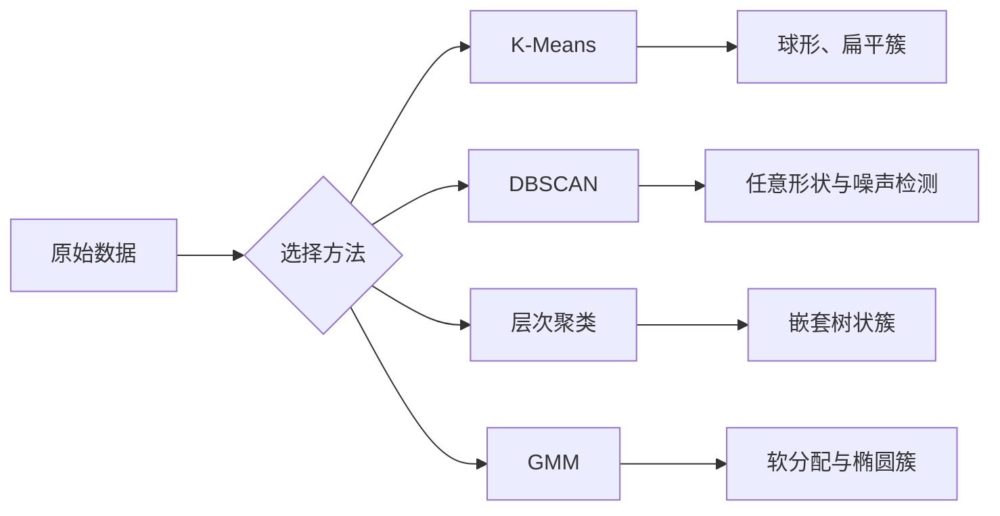

# 无监督学习

> 没有标签，也没有老师，算法要自己发现数据中的结构。

**类型:** 构建 **语言:** Python
**先修:** 第 1 期（范数与距离、概率与分布），第 2 期第 01-06 课
**时长:** ~90 分钟

## 学习目标

- 从零实现 K-Means、DBSCAN 和高斯混合模型，并比较它们的聚类行为
- 用轮廓系数和肘部法则选择更合理的簇数
- 解释何时 DBSCAN 优于 K-Means，以及何者更擅长处理非球形簇和异常点
- 使用聚类方法构建异常检测流程，识别偏离常态的样本

## 问题

前面课程默认你有标签：`输入 -> 正确输出`。现实世界里标签很贵。医院可能有数百万份病历，但没人给每条记录打疾病标签；电商有大量用户会话，但没有手工的用户分群；安全团队有全量网络日志，但没人标注所有异常点。

无监督学习的任务是：在不告诉答案的情况下找到结构。它要把相似样本聚在一起、发现潜藏结构、标注可能异常的样本。若说监督学习是拿着答案键写作业，那么无监督学习就是拿着原始题目自己总结规律。

核心难点是：没有标签就没有“对/错”的直接依据，评估方法必须换。

## 核心概念

### 聚类：把相似样本放一起

聚类把每个样本归入一个簇，使同簇内样本彼此更像、不同簇之间差异更大。关键是：

- 相似到底怎么定义？



### K-Means：经典主力

K-Means 把数据固定分成 `K` 个簇。每个簇由质心表示，所有点归到最近质心。

Lloyd 算法：

1. 随机选择 K 个初始质心
2. 将每个点分配给最近质心
3. 用该簇所有点均值更新质心
4. 直到分配不再变化

目标函数惯性（inertia）是“点到所分配质心的平方距离和”。K-Means 会最小化它，但只保证局部最优；初始化不同会给出不同结果。

### 选择 K

两个常见方式：

**肘部法**：对 `K=1..N` 计算 inertia，找“拐点”。

**轮廓系数**：每点在簇内相似度 `a` 与最近其他簇距离 `b`：
`(b-a)/max(a,b)`，范围 -1 到 1。取均值可评估整体分群质量。

### DBSCAN：基于密度聚类

K-Means 假设球形簇并且事先给 K。DBSCAN 不做这两个假设。它把高密度区域当簇，由稀疏区域分隔。

参数：
- **eps**：邻域半径
- **min_samples**：形成稠密区域的最少点数

点类型：
- **核心点**：在 eps 邻域内至少有 `min_samples` 个点
- **边界点**：在核心点邻域内，但自己不满足核心条件
- **噪声点**：既非核心也非边界，即离群点

DBSCAN 将可互达的核心点连成簇，边界点附着到邻近核心簇，噪声留在外面。

优点：任意形状、自动决定簇数、天然可识别异常；缺点：不同密度簇上容易受影响。

### 层次聚类

构建簇的树结构（树状图）。

凝聚法（自底向上）：

1. 每点自成一个簇
2. 反复合并距离最近的两个簇
3. 到只剩一簇停止
4. 在树上按高度切割得到 K 簇

常见簇间距离定义：
- 单链、全链、平均链
- Ward：最小化簇内方差增量

### 高斯混合模型（GMM）

K-Means 是硬分配（每点只能属于一个簇）；GMM 是软分配（每点对每簇有概率）。

GMM 假设样本由 K 个高斯分布混合生成，每个高斯有自己的均值和协方差。

EM 迭代两步：

- **E 步**：计算每点属于每个高斯的概率
- **M 步**：更新每个高斯参数以最大化似然

GMM 适合椭圆簇与重叠簇的场景。

### 何时选哪个

| 方法 | 适用场景 | 不适用场景 |
|---|---|---|
| K-Means | 大样本、球形簇、K 已知 | 非球形、含明显异常点 |
| DBSCAN | K 未知、异常点检测、任意形状 | 不同密度差异大、高维 |
| 层次聚类 | 小数据、需树状解释 | 大样本（内存开销高） |
| GMM | 重叠簇、需概率分配 | 样本量非常大或极高维 |

### 用聚类做异常检测

- K-Means：离任一质心很远者可疑
- DBSCAN：noise 点天然是异常
- GMM：在所有高斯下概率都很低者异常

```figure
kmeans-step
```

## 代码实现

### 步骤 1：从零实现 K-Means

```python
import math
import random


def euclidean_distance(a, b):
    return math.sqrt(sum((ai - bi) ** 2 for ai, bi in zip(a, b)))


def kmeans(data, k, max_iterations=100, seed=42):
    random.seed(seed)
    n_features = len(data[0])

    centroids = random.sample(data, k)

    for iteration in range(max_iterations):
        clusters = [[] for _ in range(k)]
        assignments = []

        for point in data:
            distances = [euclidean_distance(point, c) for c in centroids]
            nearest = distances.index(min(distances))
            clusters[nearest].append(point)
            assignments.append(nearest)

        new_centroids = []
        for cluster in clusters:
            if len(cluster) == 0:
                new_centroids.append(random.choice(data))
                continue
            centroid = [
                sum(point[j] for point in cluster) / len(cluster)
                for j in range(n_features)
            ]
            new_centroids.append(centroid)

        if all(
            euclidean_distance(old, new) < 1e-6
            for old, new in zip(centroids, new_centroids)
        ):
            print(f"  第 {iteration + 1} 次迭代收敛")
            break

        centroids = new_centroids

    return assignments, centroids
```

### 步骤 2：肘部法与轮廓系数

```python
def compute_inertia(data, assignments, centroids):
    total = 0.0
    for point, cluster_id in zip(data, assignments):
        total += euclidean_distance(point, centroids[cluster_id]) ** 2
    return total


def silhouette_score(data, assignments):
    # 与英文原理一致：计算单点轮廓并平均
    n = len(data)
    if n < 2:
        return 0.0

    clusters = {}
    for i, c in enumerate(assignments):
        clusters.setdefault(c, []).append(i)

    if len(clusters) < 2:
        return 0.0

    scores = []
    for i in range(n):
        own_cluster = assignments[i]
        own_members = [j for j in clusters[own_cluster] if j != i]

        if len(own_members) == 0:
            scores.append(0.0)
            continue

        a = sum(euclidean_distance(data[i], data[j]) for j in own_members) / len(own_members)
        b = float("inf")
        for cluster_id, members in clusters.items():
            if cluster_id == own_cluster:
                continue
            avg_dist = sum(euclidean_distance(data[i], data[j]) for j in members) / len(members)
            b = min(b, avg_dist)

        scores.append(0.0 if max(a, b) == 0 else (b - a) / max(a, b))

    return sum(scores) / len(scores)


def find_best_k(data, max_k=10):
    print("肘部法:")
    inertias = []
    for k in range(1, max_k + 1):
        assignments, centroids = kmeans(data, k)
        inertia = compute_inertia(data, assignments, centroids)
        inertias.append(inertia)
        print(f"  K={k}: inertia={inertia:.2f}")

    print("\n轮廓分数:")
    for k in range(2, max_k + 1):
        assignments, centroids = kmeans(data, k)
```

### 步骤 3：从零实现 DBSCAN（核心概念）

```python
def dbscan(data, eps=0.5, min_samples=5):
    # 仅示意，真实实现还应处理边界条件与效率优化
    labels = [-1] * len(data)
    cluster_id = 0
    visited = [False] * len(data)

    def region_query(i):
        return [j for j, q in enumerate(data) if euclidean_distance(data[i], q) <= eps]

    def expand_seed(seed_set, cid):
        k = 0
        while k < len(seed_set):
            j = seed_set[k]
            if not visited[j]:
                visited[j] = True
                nbrs = region_query(j)
                if len(nbrs) >= min_samples:
                    for n in nbrs:
                        if n not in seed_set:
                            seed_set.append(n)
            if labels[j] == -1:
                labels[j] = cid
            k += 1

    for i in range(len(data)):
        if visited[i]:
            continue
        visited[i] = True
        nbrs = region_query(i)
        if len(nbrs) < min_samples:
            labels[i] = -1
            continue
        labels[i] = cluster_id
        expand_seed(nbrs, cluster_id)
        cluster_id += 1

    return labels
```

### 步骤 4：层次聚类（思路）

```python
# 思路：先每点独立，逐步合并最近簇，直到全体合并；再按截断高度取 K
# 真实实现会记录合并历史用于绘制 dendrogram
```

### 步骤 5：GMM（关键接口）

```python
# 使用 EM：E 步估计后验，M 步更新均值、协方差和混合权重
# 本课代码通过可读实现把这一流程串起来，重点在数学思想
```

### 步骤 6：模型评估与可视化

打印 inertia 曲线、轮廓系数曲线、PCA/TSNE 降维可视化聚类结果。

## 工程实践

### 何时用哪类方法

- 想要稳定、快、规模大：K-Means
- 想处理异常与形状未知：DBSCAN
- 需要树状解释：层次聚类
- 需要软标签概率：GMM

### 模型评估建议

- 聚类不止看视觉，还要看业务可用性
- 用轮廓系数、Calinski-Harabasz、DBI 多指标交叉确认
- 注意标准化：不同量纲会严重影响 K-Means 与距离型方法

### 异常检测流水线（聚类实现版）

```text
训练数据 -> 特征预处理 -> 择算法(如 DBSCAN) -> 获得离群标签/分数 -> 告警 -> 复核
```

## 落地

该课产出：
- `outputs/skill-clustering-chooser.md`：聚类与异常检测方法选择建议
- `code/unsupervised_learning.py`：K-Means/DBSCAN/GMM 及异常检测流程的从零实现

## 练习

1. 在二分类二维数据上比较 K-Means、DBSCAN、GMM 的簇形。
2. 用 DBSCAN 在不同密度数据上调 `eps` 与 `min_samples`，记录噪声比例。
3. 在层次聚类中用单链和 Ward 方法对同一数据切两种版本，看结构是否符合业务语义。
4. 将聚类结果用于异常检测，比较三种方法的误报率与漏报率。
5. 使用轮廓系数与业务规则共同确定是否要继续优化 K 或切换算法。

## 关键术语

| 术语 | 解释 |
|---|---|
| 簇 | 相似样本组成的分组 |
| 质心 | K-Means 用于代表簇的中心 |
| 核心点 | DBSCAN 中满足邻域点数条件的点 |
| 噪声点 | 不属于任何簇的点（通常是异常） |
| 层次树 | 不同聚类粒度的嵌套关系 |
| EM | 高斯混合模型的迭代优化框架 |
| 软分配 | 样本对多个簇都有概率 |

## 延伸阅读

- [scikit-learn 聚类文档](https://scikit-learn.org/stable/modules/clustering.html)
- [DBSCAN 论文（Ester et al.）](https://www.aaai.org/Papers/KDD/1996/KDD96-037.pdf)
- [Handbook of Cluster Analysis](https://link.springer.com/book/)
