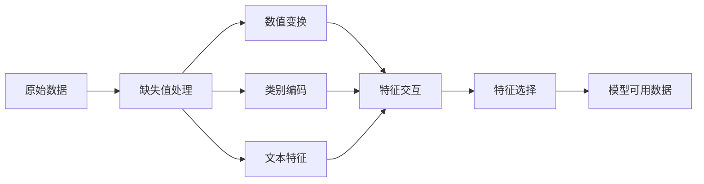

# 特征工程与选择

> 一份好的特征，常常胜过上千条数据样本。

**类型:** Build
**语言:** Python
**先修:** 第 1 期（ML 统计学、线性代数），第 2 期第 01-07 课
**时长:** ~90 分钟

## 学习目标

- 从零实现常见数值变换（标准化、min-max、对数变换、分箱）并知道各自适用场景
- 为类别特征实现 one-hot、label、target 编码，并识别 target encoding 的泄漏风险
- 从零实现 TF-IDF，并说明其为何优于原始词频
- 使用过滤式选择（方差阈值、相关性、互信息）降低维度

## 问题

你已经有数据、算法和大量参数调优，结果却只到“及格线”。有人把原始数据处理一遍，换上更好的特征后，一个简单逻辑回归就把复杂模型打败。

经典 ML 里，表征通常比模型本身更关键。房价模型里“面积/房间数”会远比“原始地址字符串”有信息；模型只能利用你给它的特征表示。

特征工程是把原始数据变成模型更容易抓规律的表达；特征选择是去掉只带噪声不带信号的列。两者结合往往是性能的主杠杆。

## 核心概念

### 特征流水线



### 数值特征处理

原始数值通常不能直接上模型：

- **缩放**：对距离敏感算法（K-Means、KNN、SVM）很关键。
  - min-max：映射到 `[0,1]`
  - 标准化：均值 0，标准差 1
- **对数变换**：压缩右偏分布（收入、人口、词频）
- **分箱**：把连续变量离散为区间，适合非线性但分段关系
- **多项式特征**：`x^2`、`x1*x2` 增加线性模型能力，代价是维度上升

### 类别特征

模型读的是数字，类别需要转码。 

- **One-hot**：每个类别生成一列 0/1。
  - 适合低基数，基数高时会膨胀。
- **Label 编码**：类别映射整数；
  - 适合树模型，非树模型会引入虚假顺序。
- **Target 编码**：用该类别的标签均值替代。
  - 强大但容易泄漏，必须仅用训练集统计并应用到验证/测试。

### 文本特征

- **CountVectorizer**：统计词频
- **TF-IDF**：`TF * IDF`

```text
TF(w, d) = count(w in d) / total_words(d)
IDF(w) = log(total_docs / docs_containing(w))
TF-IDF = TF * IDF
```

TF-IDF 降低高频停用词权重，放大区分度更高的词。

### 缺失值处理

- 删除样本（缺失极少时）
- 均值/中位数填充（数值）
- 众数填充（类别）
- 增加缺失指示列（缺失本身常带信息）
- 时序前向/后向填充

### 特征交互

有时特征单独弱，组合后强。

“体重/身高”比单独 BMI 更能表达健康风险：`BMI = weight / height^2`。

### 特征选择

更多不等于更好，冗余特征会加噪、降速、诱发过拟合。

- **过滤式**：训练前按统计量筛掉
  - 相关性、互信息、方差阈值
- **包装式/嵌入式**：训练中或训练后筛掉
  - L1 将无效特征权重压到 0
  - RFE 反复删最弱特征

```figure
feature-scaling
```

## 代码实现

### 步骤 1：数值变换

```python
import math


def min_max_scale(values):
    min_val = min(values)
    max_val = max(values)
    if max_val == min_val:
        return [0.0] * len(values)
    return [(v - min_val) / (max_val - min_val) for v in values]


def standardize(values):
    n = len(values)
    mean = sum(values) / n
    variance = sum((v - mean) ** 2 for v in values) / n
    std = math.sqrt(variance) if variance > 0 else 1.0
    return [(v - mean) / std for v in values]


def log_transform(values):
    return [math.log(v + 1) for v in values]


def bin_values(values, n_bins=5):
    min_val = min(values)
    max_val = max(values)
    bin_width = (max_val - min_val) / n_bins
    if bin_width == 0:
        return [0] * len(values)
    result = []
    for v in values:
        bin_idx = int((v - min_val) / bin_width)
        bin_idx = min(bin_idx, n_bins - 1)
        result.append(bin_idx)
    return result


def polynomial_features(row, degree=2):
    n = len(row)
    result = list(row)
    if degree >= 2:
        for i in range(n):
            result.append(row[i] ** 2)
        for i in range(n):
            for j in range(i + 1, n):
                result.append(row[i] * row[j])
    return result
```

### 步骤 2：类别编码

```python
def one_hot_encode(values):
    categories = sorted(set(values))
    cat_to_idx = {cat: i for i, cat in enumerate(categories)}
    n_cats = len(categories)

    encoded = []
    for v in values:
        row = [0] * n_cats
        row[cat_to_idx[v]] = 1
        encoded.append(row)

    return encoded, categories


def label_encode(values):
    categories = sorted(set(values))
    cat_to_int = {cat: i for i, cat in enumerate(categories)}
    return [cat_to_int[v] for v in values], cat_to_int


def target_encode(feature_values, target_values, smoothing=10):
    global_mean = sum(target_values) / len(target_values)

    category_stats = {}
    for feat, target in zip(feature_values, target_values):
        if feat not in category_stats:
            category_stats[feat] = {"sum": 0.0, "count": 0}
        category_stats[feat]["sum"] += target
        category_stats[feat]["count"] += 1

    encoding = {}
    for cat, stats in category_stats.items():
        cat_mean = stats["sum"] / stats["count"]
        weight = stats["count"] / (stats["count"] + smoothing)
        encoding[cat] = weight * cat_mean + (1 - weight) * global_mean

    return [encoding[v] for v in feature_values], encoding
```

### 步骤 3：文本特征

```python
def count_vectorize(documents):
    vocab = {}
    idx = 0
    for doc in documents:
        for word in doc.lower().split():
            if word not in vocab:
                vocab[word] = idx
                idx += 1

    vectors = []
    for doc in documents:
        vec = [0] * len(vocab)
        for word in doc.lower().split():
            vec[vocab[word]] += 1
        vectors.append(vec)
    return vectors, vocab
```

### 步骤 4：TF-IDF 从零实现

```python
def tfidf_transform(documents):
    vectors, vocab = count_vectorize(documents)
    n_docs = len(documents)
    n_words = len(vocab)

    df = [0] * n_words
    for doc_vec in vectors:
        for j, c in enumerate(doc_vec):
            if c > 0:
                df[j] += 1

    idf = [math.log((1 + n_docs) / (1 + d)) for d in df]
    tfidf = []
    for vec in vectors:
        total = sum(vec) if sum(vec) > 0 else 1
        row = []
        for j, c in enumerate(vec):
            tf = c / total
            row.append(tf * idf[j])
        tfidf.append(row)
    return tfidf, vocab
```

### 步骤 5：缺失值与标准化（简化）

```python
# 数值列按训练集统计填充，中位数通常比均值更稳健
# 先分桶再标准化，或先标准化再分桶，要遵循训练/验证严格分离
```

### 步骤 6：特征选择

```python
# 过滤式：低方差、相关性、互信息
# 包装式：递归删除重要性最低的特征
# 这里的目标是让输入更紧凑、更稳健
```

### 步骤 7：训练对比

对比原始特征、经过 transform 后特征，以及再做选择后的特征在同一模型上的表现。

## 工程实践

### 使用 sklearn

项目里通常更常用 `sklearn` 的标准组件：

- `MinMaxScaler`, `StandardScaler`
- `OneHotEncoder`, `LabelEncoder`
- `TfidfVectorizer`
- `SelectKBest`, `VarianceThreshold`, `mutual_info_classif`

### 预防数据泄漏

- 任何统计量都只基于训练集
- 再应用到验证集/测试集
- 在交叉验证中，每折都独立拟合预处理器

## 落地

本课建议输出：
- 特征转换/编码函数集合
- 一条可复用流水线配置（缩放、编码、选择）

## 练习

1. 用同一数据分别训练原始特征和工程后特征，比较收敛速度。
2. 对高基数字段做 one-hot 与 target encoding，对比维度和效果。
3. 在文本数据上比较 raw count 与 TF-IDF。
4. 用互信息与方差阈值筛掉低价值特征，验证泛化差异。
5. 尝试构造 2~3 个领域特征交互项，观察效果。

## 关键术语

| 术语 | 说明 |
|---|---|
| 标准化 | 让不同量纲特征共享可比尺度 |
| 目标编码 | 用标签统计替代类别取值 |
| TF-IDF | 根据词频和文档频次加权的文本特征 |
| 过滤式选择 | 先天筛特征、与模型无关 |
| 嵌入式选择 | 在模型训练中顺便筛特征 |

## 延伸阅读

- [scikit-learn 特征处理文档](https://scikit-learn.org/stable/preprocessing.html)
- [scikit-learn 特征选择文档](https://scikit-learn.org/stable/modules/feature_selection.html)
- [PCA 与特征工程相关综述](https://jmlr.org/papers/v15/pedregosa14a.html)
