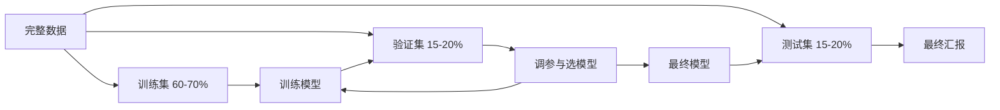

# 模型评估

> 一个模型到底好不好，取决于你如何度量它。

**类型:** 构建 **语言:** Python
**先修:** 第 1 期（概率与分布、统计学），第 2 期第 01-08 课
**时长:** ~90 分钟

## 学习目标

- 从零实现 K 折与分层 K 折交叉验证，并解释为什么类别不平衡时必须分层
- 从零实现精确率、召回率、F1、AUC-ROC 及回归指标（MSE/RMSE/MAE/R²）
- 用学习曲线判断是否是高偏差或高方差
- 识别常见评估误区：数据泄漏、指标选择错误、测试集污染

## 问题

你训练了一个模型，测试集准确率 95%。这是不是好模型？

也许是，也许不是。

如果异常类只有 1%，永远预测负类也能拿到 99% 的准确率，但完全无用；如果在训练集上评估，可能只是“背答案”；若是时序数据随机打乱再切分，模型可能借助未来信息。评估层面出错会让坏模型看起来好。

评估是项目里最容易翻车的环节，必须严谨：错指标、错切分、错比较，最后上线就会失败。

## 核心概念

### 训练/验证/测试



三段集的职责不同：

- 训练集：模型拟合
- 验证集：超参数搜索与模型选择
- 测试集：最终一次性报告性能（使用后不要再反复回调参数）

### K 折交叉验证

小数据下单次切分不稳定；K 折让每个样本都轮流成为验证集。

```text
- 分成 K 份
- 每次用 K-1 份训练，1 份验证
- 取平均分数
```

K=5 或 10 常见。分层 K 折让每折保持类别比例，适合不平衡数据。

### 分类指标

**混淆矩阵（二分类）**

|  | 预测正类 | 预测负类 |
|---|---|---|
| 实际正类 | 真正类（TP） | 假负类（FN） |
| 实际负类 | 假正类（FP） | 真负类（TN） |

基于它导出：

- **Accuracy**：`(TP+TN)/(TP+TN+FP+FN)`，不平衡时很误导
- **Precision**：`TP/(TP+FP)`，关注误报成本
- **Recall**：`TP/(TP+FN)`，关注漏报成本
- **F1**：`2*P*R/(P+R)`，平衡精确率和召回率
- **AUC-ROC**：阈值变化下正负分离能力，0.5 为随机，1.0 为完美

### 回归指标

- **MSE**：均方误差，强惩罚离群点
- **RMSE**：MSE 平方根，单位与目标一致
- **MAE**：平均绝对误差，鲁棒一些
- **R²**：解释方差比例，越接近 1 越好

### 学习曲线

画训练集规模与分数曲线：

- **高偏差**：训练和验证都低并接近，增加数据不明显
- **高方差**：训练高、验证低且差距大，增加数据通常有帮助

### 验证曲线

横轴是超参数，纵轴是训练/验证分数：

- 低复杂度：都低（欠拟合）
- 中等复杂度：验证最好、两条线接近
- 过高复杂度：训练高、验证反降（过拟合）

### 常见错误

- **数据泄漏**：先全量缩放、标准化再切分。
- **不平衡类误用指标**：只看 accuracy。
- **错误指标选择**：场景需要 recall 时却只盯 recall/precision 关系。
- **未分层**：少数类被稀释到某些折里。
- **多次看测试集**：测试集当验证集反复用，导致泄漏。

```figure
precision-recall-threshold
```

## 代码实现

### 步骤 1：train/val/test 划分

```python
import random
import math


def train_val_test_split(X, y, train_ratio=0.6, val_ratio=0.2, seed=42):
    random.seed(seed)
    n = len(X)
    indices = list(range(n))
    random.shuffle(indices)

    train_end = int(n * train_ratio)
    val_end = int(n * (train_ratio + val_ratio))

    train_idx = indices[:train_end]
    val_idx = indices[train_end:val_end]
    test_idx = indices[val_end:]

    X_train = [X[i] for i in train_idx]
    y_train = [y[i] for i in train_idx]
    X_val = [X[i] for i in val_idx]
    y_val = [y[i] for i in val_idx]
    X_test = [X[i] for i in test_idx]
    y_test = [y[i] for i in test_idx]

    return X_train, y_train, X_val, y_val, X_test, y_test
```

### 步骤 2：K 折 / 分层 K 折

```python
def kfold_split(n, k=5, seed=42):
    random.seed(seed)
    indices = list(range(n))
    random.shuffle(indices)

    fold_size = n // k
    folds = []
    for i in range(k):
        start = i * fold_size
        end = start + fold_size if i < k - 1 else n
        val_idx = indices[start:end]
        train_idx = indices[:start] + indices[end:]
        folds.append((train_idx, val_idx))

    return folds


def stratified_kfold_split(y, k=5, seed=42):
    random.seed(seed)
    class_indices = {}
    for i, label in enumerate(y):
        class_indices.setdefault(label, []).append(i)

    for label in class_indices:
        random.shuffle(class_indices[label])

    folds = [{"train": [], "val": []} for _ in range(k)]
    for _, indices in class_indices.items():
        for i in range(k):
            start = i * (len(indices) // k)
            end = start + (len(indices) // k) if i < k - 1 else len(indices)
            val_part = indices[start:end]
            train_part = indices[:start] + indices[end:]
            folds[i]["val"].extend(val_part)
            folds[i]["train"].extend(train_part)

    return [(f["train"], f["val"]) for f in folds]


def cross_validate(X, y, model_fn, k=5, metric_fn=None, stratified=False):
    folds = stratified_kfold_split(y, k) if stratified else kfold_split(len(X), k)
    scores = []
    for train_idx, val_idx in folds:
        X_train = [X[i] for i in train_idx]
        y_train = [y[i] for i in train_idx]
        X_val = [X[i] for i in val_idx]
        y_val = [y[i] for i in val_idx]

        model = model_fn()
        model.fit(X_train, y_train)
        predictions = [model.predict(x) for x in X_val]

        if metric_fn:
            score = metric_fn(y_val, predictions)
        else:
            score = sum(1 for yt, yp in zip(y_val, predictions) if yt == yp) / len(y_val)
        scores.append(score)
    return scores
```

### 步骤 3：混淆矩阵与指标

```python
def confusion_matrix(y_true, y_pred):
    tp = sum(1 for yt, yp in zip(y_true, y_pred) if yt == 1 and yp == 1)
    tn = sum(1 for yt, yp in zip(y_true, y_pred) if yt == 0 and yp == 0)
    fp = sum(1 for yt, yp in zip(y_true, y_pred) if yt == 0 and yp == 1)
    fn = sum(1 for yt, yp in zip(y_true, y_pred) if yt == 1 and yp == 0)
    return tp, tn, fp, fn
```

### 步骤 4：分类指标实现

```python
def precision_score(y_true, y_pred):
    tp, _, fp, _ = confusion_matrix(y_true, y_pred)
    return tp / (tp + fp) if (tp + fp) > 0 else 0.0


def recall_score(y_true, y_pred):
    tp, _, _, fn = confusion_matrix(y_true, y_pred)
    return tp / (tp + fn) if (tp + fn) > 0 else 0.0


def f1_score(y_true, y_pred):
    p = precision_score(y_true, y_pred)
    r = recall_score(y_true, y_pred)
    return 2 * p * r / (p + r) if (p + r) > 0 else 0.0
```

### 步骤 5：回归指标

```python
def mean_squared_error(y_true, y_pred):
    return sum((yt - yp) ** 2 for yt, yp in zip(y_true, y_pred)) / len(y_true)


def rmse(y_true, y_pred):
    return math.sqrt(mean_squared_error(y_true, y_pred))


def mae(y_true, y_pred):
    return sum(abs(yt - yp) for yt, yp in zip(y_true, y_pred)) / len(y_true)
```

### 步骤 6：学习曲线

随着训练样本变化记录训练/验证得分，判断高偏差或高方差。

### 步骤 7：验证曲线

横向扫描超参数，寻找验证分数峰值。

### 步骤 8：与 sklearn 对照

对比同一数据上自实现指标与 sklearn 的指标实现是否一致。

## 工程实践

### 用 sklearn 实践

- 使用 `cross_val_score`, `StratifiedKFold`, `learning_curve`
- 分类用 `precision_recall_fscore_support`, `roc_auc_score`
- 回归用 `mean_squared_error`, `mean_absolute_error`, `r2_score`

### 常见反模式

- 漏掉分层。
- 指标不对应业务成本。
- 在时间序列上乱打乱。

## 落地

该课实践产出包括：
- 一套 `code/main.py` 里的自实现评估函数
- 与 sklearn 对齐的验证输出模板

## 练习

1. 在不平衡数据上比较 accuracy、precision、recall、F1。
2. 试验不分层和分层 K 折的差异。
3. 画训练集规模的学习曲线，判断高偏差/高方差。
4. 用 AUC-ROC 与 PR 曲线解释“阈值与业务代价”的关系。
5. 用交叉验证选择超参数后在测试集上做一次最终汇报。

## 关键术语

| 术语 | 说明 |
|---|---|
| 数据泄漏 | 信息从未来或验证/测试泄露到训练 |
| 分层采样 | 各类比例在各折中保持一致 |
| PR 曲线 | 精确率-召回率随阈值变化曲线 |
| AUC-ROC | 阈值无关的排序指标 |
| 学习曲线 | 训练规模对性能影响的可视化 |

## 延伸阅读

- [scikit-learn 模型评估文档](https://scikit-learn.org/stable/model_evaluation.html)
- [机器学习中的验证策略（DeepL）](https://machinelearningmastery.com/k-fold-cross-validation/)
- [Hands-On ML: 评估章节](https://github.com/ageron/handson-ml2)
