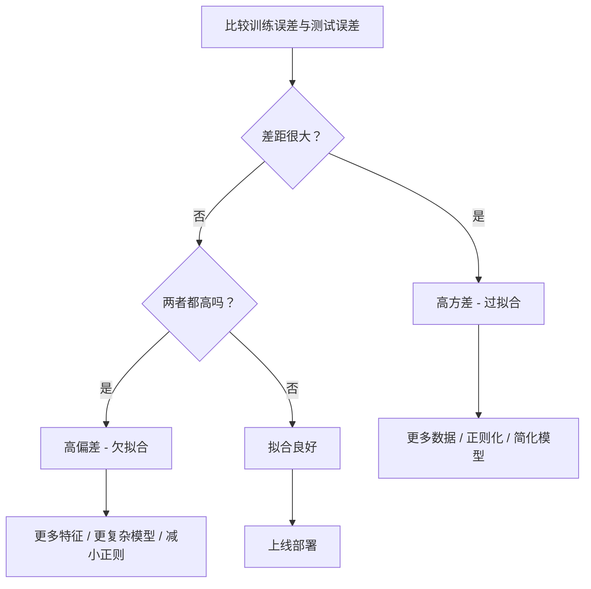
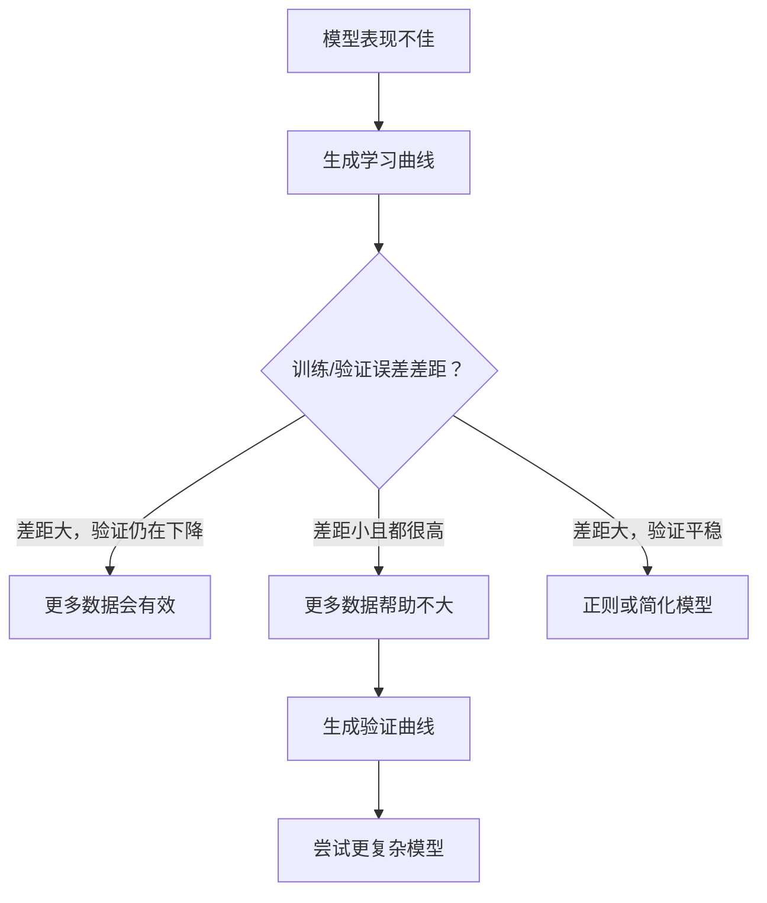

# 偏差-方差权衡

> 所有模型误差都来自三个来源：偏差、方差或噪声。我们通常只能直接控制前两者。

**类型:** Learn  
**语言:** Python  
**先修:** 第 2 期第 01-09 课（机器学习基础、回归、分类、评估）  
**时长:** ~75 分钟

## 学习目标

- 推导期望预测误差中的偏差-方差分解，并说明不可约噪声的作用
- 用训练误差和测试误差形态判断模型偏差高还是方差高
- 解释正则化策略（L1、L2、Dropout、提前停止）如何在偏差和方差之间取舍
- 实现实验脚本，展示随模型复杂度变化的偏差-方差权衡曲线

## 问题

你训练了一个模型，它在测试集上有一些误差。这个误差从哪里来？

如果模型过于简单（比如对曲线数据用线性回归），会持续偏离真实规律，这就是偏差过高。  
如果模型过于复杂（比如用 20 阶多项式去拟合 15 个点），会把训练点几乎全部穿过去，但在新数据上却非常不稳定，这就是方差过高。

对固定容量的模型而言，偏差和方差不可同时最小化：降低偏差往往会提高方差，降低方差往往会提高偏差。理解这个权衡是机器学习里最实用的诊断能力之一——它告诉你该增大模型复杂度还是减小、该加更多数据还是改进特征、该更强正则化还是更弱。

## 核心概念

### 偏差：系统误差

偏差衡量的是“很多次训练后平均预测”和真实函数之间的距离。如果从同一分布反复采样不同训练集，训练同一类模型并取平均预测，那么偏差就是该平均值与真实值的差。

高偏差意味着模型太僵硬，无法表达真实规律。对抛物线拟合直线，无论你给多少数据都不可能捕捉曲率——这就是欠拟合。

```
高偏差（欠拟合）:
  模型几乎总是给出同一类错误预测
  训练误差: 高
  测试误差: 高
  两者差距: 小
```

### 方差：对训练数据的敏感性

方差衡量在不同训练子集上训练后，预测值的波动程度。若训练集微小变化会导致模型预测大幅变化，则方差高。

高方差意味着模型在训练噪声上过拟合而非信号。20 阶多项式会穿过每个训练点，但点之间会大幅振荡，这就会崩塌到新样本上。

```
高方差（过拟合）:
  训练误差低，但测试误差高
  训练误差: 低
  测试误差: 高
  两者差距: 大
```

### 误差分解

对任何输入点 \(x\)，在平方损失下有精确分解：

```
期望误差 = Bias^2 + Variance + 不可约噪声

其中:
  Bias^2   = (E[f̂(x)] - f(x))^2
  Variance = E[(f̂(x) - E[f̂(x)])^2]
  Noise    = E[(y - f(x))^2]             (σ^2)
```

- \(f(x)\) 是真实函数
- \(f̂(x)\) 是模型预测
- \(E[\cdot]\) 表示对不同训练集取期望
- \(y\) 是观测标签（真实函数加噪声）

噪声是不可约的。无论什么模型，面对噪声数据都无法把它完全消除。你的目标是把偏差平方与方差平衡好。

### 模型复杂度与误差


经典的 U 型曲线如下：

| 复杂度 | 偏差 | 方差 | 总误差 |
|--------|------|------|--------|
| 太低 | 高 | 低 | 高（欠拟合） |
| 恰当 | 中等 | 中等 | 最低 |
| 太高 | 低 | 高 | 高（过拟合） |

### 正则化作为偏差-方差控制

正则化会有意识地增加偏差、降低方差，使模型不能把噪声全部记住。

- **L2（Ridge）**：将权重整体往 0 收缩。保留所有特征，但降低其影响力  
- **L1（Lasso）**：将部分权重压到 0，起到特征筛选作用  
- **Dropout**：训练时随机失活神经元，逼迫网络学到冗余表征  
- **提前停止**：在模型过拟合前停止训练

正则化强度（\(\lambda\)、dropout 比例、训练轮数）决定你在偏差-方差曲线上的位置：正则化越强，偏差越高，方差越低。

### 双降现象：现代视角

经典理论说：越过“最佳点”后，复杂度只会变差。2019 年后的研究发现了一个反直觉现象：当继续把模型容量推到远高于插值阈值（有足够参数把训练点完全拟合）时，测试误差有时又会下降。


双降解释了为什么参数远大于样本量的深度网络也可能泛化得很好。经典偏差-方差框架没有错，但对现代大模型场景是不完整的。

关于双降的关键观察：
- 现象会出现在线性模型、决策树、神经网络中
- 更多数据在插值区域反而可能变差（样本维度双降）
- 更多训练轮次也可能触发（轮次维度双降）
- 正则化可缓解峰值，但不会完全消除

为何会这样？在插值阈值附近，模型有“刚好”拟合全部训练点的能力，拟合函数被数据细节强约束，小扰动会引发较大变化，方差峰值很高。超过阈值后，仍有大量解都能拟合训练集，梯度下降这类带有隐式正则效应的算法往往会选取更“平滑”的解，这也是过参数化模型仍能泛化的原因。

| 区域 | 参数数 p 与样本数 n | 表现 |
|------|---------------------|------|
| 欠参数化 | \(p \ll n\) | 经典偏差-方差适用 |
| 插值阈值 | \(p \approx n\) | 方差峰值，测试误差突增 |
| 过参数化 | \(p \gg n\)) | 隐式正则起作用，测试误差下降 |

工程上：用神经网络或大树集成时，不要卡在插值阈值上。要么显式正则化并明显停留在其下方，要么远远走到阈值另一侧；最危险的是刚好停在阈值附近。

### 诊断模型



| 现象 | 诊断 | 处理 |
|------|------|------|
| 训练误差高，测试误差高 | 偏差高 | 增加特征、提高复杂度、减弱正则 |
| 训练误差低，测试误差高 | 方差高 | 增加数据、正则化、简化模型、dropout |
| 训练误差低，测试误差低 | 拟合良好 | 可以上线 |
| 训练误差继续下降，测试误差上升 | 正在过拟合 | 提前停止 |

### 实务策略

**偏差是问题时：**
- 增加多项式或交互特征
- 用更灵活模型（树模型替代线性模型）
- 降低正则化强度
- 继续训练（未收敛时）

**方差是问题时：**
- 增加训练数据
- 使用 bagging（如随机森林）
- 提高正则化（更大的 \(\lambda\)、更高 dropout）
- 特征筛选，去除噪声特征
- 使用交叉验证及早发现过拟合

### 集成方法与方差降低

在实践中，最有效的方差控制手段之一是集成。

**Bagging（Bootstrap Aggregating）** 在不同 bootstrap 样本上训练多个模型，再对预测取平均。单个模型方差高，但平均后方差显著下降。随机森林就是树模型上的 bagging。

数学上：若有 \(N\) 个独立预测，单个方差为 \(\sigma^2\)，则平均后方差约为 \(\sigma^2/N\)。实际模型并非完全独立，下降幅度小于理论上限，但仍明显。

**Boosting** 通过顺序方式减小偏差，每一步模型都修正前面集成的误差，典型代表包括梯度提升树和 AdaBoost。加太多基学习器会过拟合，需要提前停止或正则。

| 方法 | 主要作用 | 偏差变化 | 方差变化 |
|------|----------|----------|----------|
| Bagging | 降方差 | 基本不变 | 降低 |
| Boosting | 降偏差 | 降低 | 可能上升 |
| Stacking | 同时降低 | 依赖元学习器 | 依赖基学习器 |
| Dropout | 隐式 bagging | 略升 | 降低 |

经验规则：基模型偏差高（如浅树、简单线性模型）时优先用 boosting；基模型偏差低但方差高（深树、高阶多项式）时优先用 bagging。

### 学习曲线

学习曲线是最实用的诊断工具之一。它们展示训练集规模变化时训练误差与验证误差的变化，比单次 train/test 比较更能告诉你“多些数据是否有用”。


如何读曲线：

| 场景 | 训练误差 | 验证误差 | 差距 | 含义 | 处理 |
|------|---------|---------|------|------|------|
| 偏差高 | 高 | 高 | 小 | 模型未学到真实模式 | 增强特征、复杂模型、减小正则 |
| 方差高 | 低 | 高 | 大 | 模型记忆训练数据 | 更多数据、正则、简化模型 |
| 拟合良好 | 中 | 中 | 小 | 泛化正常 | 可以上线 |
| 方差改善中 | 低 | 随样本增多下降 | 缩小 | 方差问题可被数据缓解 | 多加数据 |
| 偏差平稳高 | 高 | 高且趋于平坦 | 小且平坦 | 更多数据帮助不大 | 更换模型结构 |

关键判断：当两条曲线都已稳定且差距很小，但误差仍然很高时，继续加数据不会有明显收益；你需要更换模型。若差距大且还在缩小，更多数据通常有帮助。

### 如何绘制学习曲线

两种常见方式：

**方式 1：固定模型，变训练集大小。** 保持超参数不变，用逐步增大的子集训练，并记录每个规模下的 train/val 误差。

**方式 2：固定数据，变模型复杂度。** 固定训练数据，在复杂度参数上扫描（多项式阶数、树深、层数等），同时看训练与验证误差。这是验证曲线，直接可视化偏差-方差权衡。

两者互补。前者告诉你“多数据是否有效”；后者告诉你“换模型是否更好”。在做下一步决策前都应该跑一次。



```figure
bias-variance
```

## 动手实现

`code/bias_variance.py` 中包含完整的偏差-方差分解实验脚本。流程如下：

### 第 1 步：从已知函数生成合成数据

我们使用 \(f(x)=\sin(1.5x)+0.5x\) 加高斯噪声。知道真值函数时，可以直接计算精确偏差和方差。

```python
def true_function(x):
    return np.sin(1.5 * x) + 0.5 * x

def generate_data(n_samples=30, noise_std=0.5, x_range=(-3, 3), seed=None):
    rng = np.random.RandomState(seed)
    x = rng.uniform(x_range[0], x_range[1], n_samples)
    y = true_function(x) + rng.normal(0, noise_std, n_samples)
    return x, y
```

### 第 2 步：Bootstrap 采样与多项式拟合

每个多项式阶数下，重复采样许多次训练集并拟合模型，在固定测试网格上记录预测，从而得到每个点的预测分布。

```python
def fit_polynomial(x_train, y_train, degree, lam=0.0):
    X = np.column_stack([x_train ** d for d in range(degree + 1)])
    if lam > 0:
        penalty = lam * np.eye(X.shape[1])
        penalty[0, 0] = 0
        w = np.linalg.solve(X.T @ X + penalty, X.T @ y_train)
    else:
        w = np.linalg.lstsq(X, y_train, rcond=None)[0]
    return w
```

我们使用 200 个不同的 bootstrap 样本。每个样本都来自同一底层分布但包含不同样本点。

### 第 3 步：计算 Bias² 与 Variance 分解

在每个测试点上有 200 组预测后，可直接按定义计算：

```python
mean_pred = predictions.mean(axis=0)
bias_sq = np.mean((mean_pred - y_true) ** 2)
variance = np.mean(predictions.var(axis=0))
total_error = np.mean(np.mean((predictions - y_true) ** 2, axis=1))
```

- `mean_pred`：通过 bootstrap 近似的 \(E[\hat f(x)]\)
- `bias_sq`：平均预测与真值差值的平方
- `variance`：bootstrap 预测在每个点的离散程度
- `total_error`：应接近 `bias_sq + variance + noise`

### 第 4 步：学习曲线

学习曲线在固定模型复杂度下扫描训练集大小，判断模型受数据限制还是受容量限制。

```python
def demo_learning_curves():
    sizes = [10, 15, 20, 30, 50, 75, 100, 150, 200, 300]
    degree = 5

    for n in sizes:
        train_errors = []
        test_errors = []
        for seed in range(50):
            x_train, y_train = generate_data(n_samples=n, seed=seed * 100)
            w = fit_polynomial(x_train, y_train, degree)
            train_pred = predict_polynomial(x_train, w)
            train_mse = np.mean((train_pred - y_train) ** 2)
            test_pred = predict_polynomial(x_test, w)
            test_mse = np.mean((test_pred - y_test) ** 2)
            train_errors.append(train_mse)
            test_errors.append(test_mse)
        # 对多个随机种子取平均即为学习曲线一个点
```

对高方差模型（如小样本下 degree=5）可见：
- 训练误差起始较低，样本变多后因记忆难度上升逐步升高
- 测试误差起始较高，随数据增多而下降
- 两者差距随数据增长收敛

对高偏差模型（如 degree=1）而言，两者很快都收敛到较高水平，多数据也难以改善。

### 第 5 步：正则化扫描

代码还提供 `demo_regularization_sweep()`：固定高阶多项式（degree=15），从 0.001 到 100 扫描 Ridge 惩罚强度。它从另一个角度展示偏差-方差权衡：不改变复杂度，而改变约束强度。

```python
def demo_regularization_sweep():
    alphas = [0.001, 0.005, 0.01, 0.05, 0.1, 0.5, 1.0, 5.0, 10.0, 50.0, 100.0]
    for alpha in alphas:
        results = bias_variance_decomposition([15], lam=alpha)
        r = results[15]
        print(f"alpha={alpha:.3f}  bias={r['bias_sq']:.4f}  var={r['variance']:.4f}")
```

低 alpha 时，degree 15 几乎不受约束，方差占主导，模型在每个 bootstrap 样本上会追噪声。高 alpha 时，惩罚太强，模型接近常数函数，偏差占主导。最优点通常位于两端之间。

这与扫面阶数本质一致，只是惩罚强度是连续控制杆，使用上更平滑、更可控。

## 上手使用

sklearn 提供了 `learning_curve` 和 `validation_curve`，可不必手写 bootstrap 循环就完成诊断。

### 验证曲线：扫面模型复杂度

```python
from sklearn.model_selection import validation_curve
from sklearn.pipeline import make_pipeline
from sklearn.preprocessing import PolynomialFeatures
from sklearn.linear_model import Ridge

degrees = list(range(1, 16))
train_scores_all = []
val_scores_all = []

for d in degrees:
    pipe = make_pipeline(PolynomialFeatures(d), Ridge(alpha=0.01))
    train_scores, val_scores = validation_curve(
        pipe, X, y, param_name="polynomialfeatures__degree",
        param_range=[d], cv=5, scoring="neg_mean_squared_error"
    )
    train_scores_all.append(-train_scores.mean())
    val_scores_all.append(-val_scores.mean())
```

得到的就是偏差-方差权衡曲线：若验证分数相对训练分数更差，说明方差占主导；若两者都差，偏差占主导。

### 学习曲线：扫面训练集大小

```python
from sklearn.model_selection import learning_curve

pipe = make_pipeline(PolynomialFeatures(5), Ridge(alpha=0.01))
train_sizes, train_scores, val_scores = learning_curve(
    pipe, X, y, train_sizes=np.linspace(0.1, 1.0, 10),
    cv=5, scoring="neg_mean_squared_error"
)
train_mse = -train_scores.mean(axis=1)
val_mse = -val_scores.mean(axis=1)
```

将 `train_mse` 与 `val_mse` 对比 `train_sizes`，曲线形状基本能解释大部分问题。

### 正则化扫描 + 交叉验证

```python
from sklearn.model_selection import cross_val_score

alphas = [0.001, 0.01, 0.1, 1.0, 10.0, 100.0]
for alpha in alphas:
    pipe = make_pipeline(PolynomialFeatures(10), Ridge(alpha=alpha))
    scores = cross_val_score(pipe, X, y, cv=5, scoring="neg_mean_squared_error")
    print(f"alpha={alpha:>7.3f}  MSE={-scores.mean():.4f} +/- {scores.std():.4f}")
```

固定模型复杂度下扫面正则项。你会看到同样的权衡：alpha 小 => 方差大，alpha 大 => 偏差大。

### 诊断工作流（完整）

实际项目中常按顺序执行：

1. 训练模型，算训练误差与测试误差
2. 若两者都高：偏差问题，转向步骤 4
3. 若训练低而测试高：方差问题，先看学习曲线判断更多数据是否有用；若无效则加正则
4. 在主复杂度参数上做验证曲线，找最佳点
5. 在最佳点再看学习曲线。若差距仍大，说明需要更多数据或更强正则
6. 用 `cross_val_score` 在不同 alpha 下比较 Ridge/Lasso，选交叉验证误差最低的值

通常这个过程在大多数表格数据集上只需要十几分钟计算，但可以比盲试节省数小时。

## 交付内容

本课产出：`outputs/prompt-model-diagnostics.md`

## 练习

1. 设 `noise_std=0`（无噪声）再跑一遍分解。不可约误差项会怎样？最优复杂度是否变化？
2. 将训练样本从 30 增加到 300。方差成分如何变化？最优阶数是否移动？
3. 在实验中加入 L2 正则（Ridge）。固定高阶多项式（degree=15），扫面 \(\lambda\) 从 0 到 100。画出偏差平方与方差随 \(\lambda\) 变化曲线。
4. 把真实函数从多项式改成 \(\sin(x)\)。分解形态变化了吗？是否还存在明显最优阶数？
5. 实现一个简单的 bagging 包装器：对多个 bootstrap 样本训练 10 个模型并平均预测。验证其能在不明显增加偏差的前提下降低方差。

## 关键术语

| 术语 | 常见说法 | 实际含义 |
|------|---------|----------|
| 偏差 | “模型太简单” | 由模型假设错误带来的系统误差，即平均预测与真实值之差 |
| 方差 | “模型过拟合” | 对训练数据敏感导致的误差；不同训练集下预测变化程度 |
| 不可约误差 | “数据里的噪声” | 数据生成过程本身的随机性，任何模型都无法消除 |
| 欠拟合 | “学不到东西” | 偏差高，连训练集上的模式也未学好 |
| 过拟合 | “记忆训练数据” | 方差高，训练噪声无法泛化 |
| 正则化 | “约束模型复杂度” | 在优化目标中加入惩罚项，通过抬高偏差换取降低方差 |
| 双降（Double Descent） | “更大参数可能更好” | 当模型容量远超插值阈值后，测试误差可能再次下降 |
| 模型复杂度 | “模型有多灵活” | 模型拟合任意规律的能力，受架构、特征和正则控制 |

## 延展阅读

- [Hastie, Tibshirani, Friedman: Elements of Statistical Learning, Ch. 7](https://hastie.su.domains/ElemStatLearn/) -- 偏差-方差分解的经典阐释
- [Belkin 等：Reconciling modern machine learning practice and the bias-variance trade-off (2019)](https://arxiv.org/abs/1812.11118) -- 双降现象论文
- [Nakkiran 等：Deep Double Descent (2019)](https://arxiv.org/abs/1912.02292) -- 样本与轮次双降论文
- [Scott Fortmann-Roe: Understanding the Bias-Variance Tradeoff](http://scott.fortmann-roe.com/docs/BiasVariance.html) -- 清晰的可视化解释
