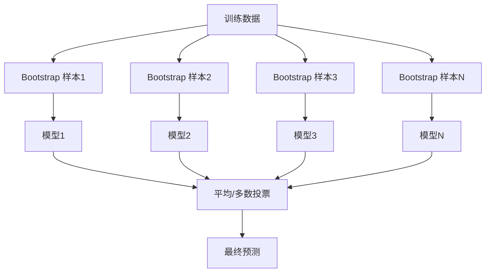
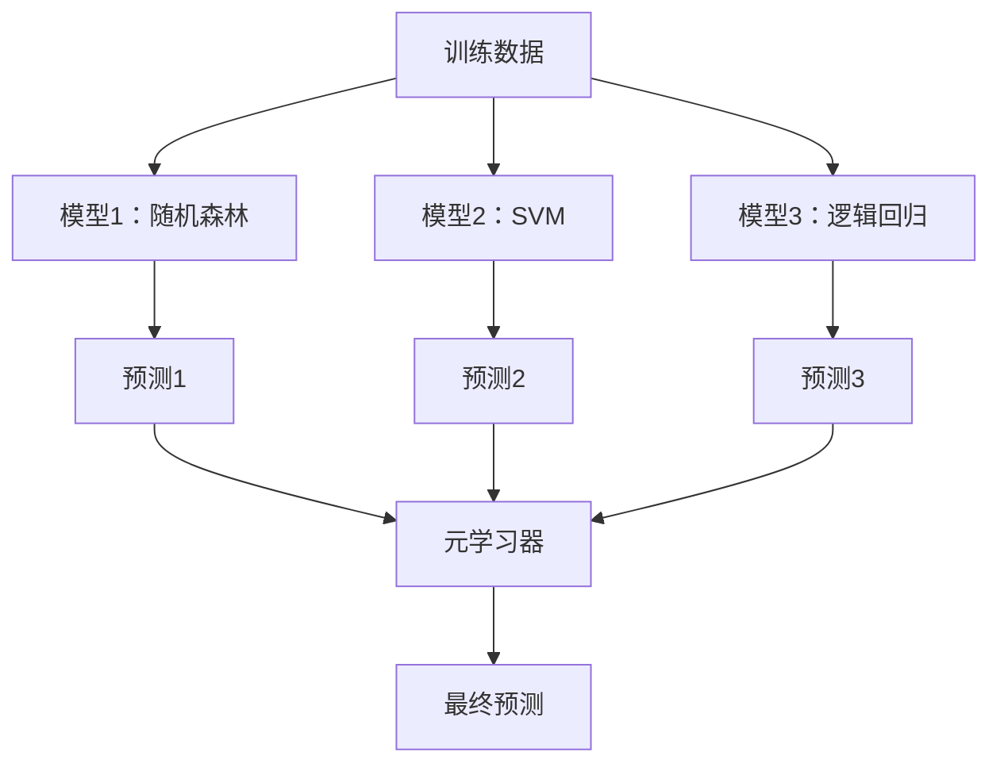

# 集成方法

> 一组弱学习器只要组合得当，就能变成一个更强的学习器。它不是比喻，而是定理里的结论。

**类型:** Build  
**语言:** Python  
**先修:** 第 2 期第 10 课（偏差与方差权衡）  
**时长:** ~120 分钟

## 学习目标

- 从零实现 AdaBoost 与梯度提升树，理解 boosting 如何按顺序修正误差
- 对比 Bagging 与 Boosting 的训练范式：前者降方差，后者降偏差
- 理解随机森林与提升树在偏差-方差曲线中的不同作用
- 掌握学习率、树深度、子采样比率对迭代收敛与泛化的影响

## 问题

一棵决策树训练快、可解释性好，但容易过拟合；一条线性模型不容易过拟合，但面对复杂边界往往欠拟合。你可以花很多天手工调架构，也可以把多个“差一点”的模型组合起来，通常效果更好。

这就是集成学习在做的事。它也是表格式数据竞赛里最常见的高分套路，也是多数生产系统里的主力方案。集成能直观看到偏差-方差权衡：bagging 主要降方差，boosting 主要降偏差，stacking 学会按输入选择不同模型。

## 核心方法

### 为什么集成有效

设有 \(N\) 个互相独立且准确率都高于 0.5 的分类器，少数服从多数的投票准确率为：

```
P(多数正确) = Σ_{k > N/2} C(N, k) * p^k * (1-p)^{N-k}
```

当每个分类器准确率为 60% 时，21 个模型的多数表决约可达 74%；101 个可提升到 84%。不同模型的错误“互相抵消”是关键。

前提是**多样性**。若所有模型都犯同样错误，集成不再有效。我们通过以下方式制造多样性：

- 不同训练子样本（bagging）
- 不同特征子集（随机森林）
- 顺序纠错（boosting）
- 不同模型家族（stacking）

### Bagging（Bootstrap Aggregating）

bagging 用不同的 bootstrap 样本训练多个模型，再对预测取平均（或多数投票）。



每个 bootstrap 是“有放回”采样，大小与原始训练集相同。每次采样通常覆盖约 63.2% 的原始唯一样本，剩下约 36.8% 为 out-of-bag，可直接当作天然验证集。

Bagging 降低方差的代价很小。单棵树在各自 bootstrap 上过拟合不一样，平均后这些噪声会互相抵消。

**随机森林**是带随机特征子集分裂的 bagging。每次分裂只从特征子集中选候选，进一步增加多样性。分类常用 `sqrt(n_features)`，回归常用 `n_features / 3`。

### Boosting（顺序纠错）

Boosting 按顺序训练模型。每个新模型重点关注前一轮错得多的样本。


boosting 降低偏差。每一步都修正前面集成的系统误差，最终预测是所有基模型加权和。权重更高的模型通常效果更好。

注意：模型数加太多会过拟合，特别是持续拟合难分类本（其中一些只是噪声）。

### AdaBoost

AdaBoost 是最经典的 boosting 之一，可与任何基学习器配合，实践中常见于深度为 1 的 stump。

算法：

```
1. 初始化权重：w_i = 1/N
2. 对 t=1..T:
   a. 用带权训练弱分类器 h_t
   b. 计算加权误差:
      err_t = Σ(w_i * I(h_t(x_i) != y_i)) / Σw_i
   c. 计算模型权重:
      alpha_t = 0.5 * ln((1 - err_t)/err_t)
   d. 更新样本权重:
      w_i <- w_i * exp(-alpha_t * y_i * h_t(x_i))
   e. 归一化权重
3. 输出: H(x) = sign(Σ alpha_t * h_t(x))
```

误差更低的模型得到更高的 alpha。被错分样本被加权更高，下轮模型更关注它们。

### 梯度提升（Gradient Boosting）

梯度提升将这种顺序思想扩展到任意损失。它不重设样本权重，而是用当前集成的残差（损失梯度）拟合新模型。

```
1. 初始化: F_0(x) = argmin_c Σ L(y_i, c)
2. 对 t=1..T:
   a. 计算伪残差:
      r_i = -∂L(y_i, F_{t-1}(x_i)) / ∂F_{t-1}(x_i)
   b. 拟合树 h_t 到 r_i
   c. 选择步长:
      gamma_t = argmin_γ Σ L(y_i, F_{t-1}(x_i)+γ h_t(x_i))
   d. 更新:
      F_t(x)=F_{t-1}(x)+lr*gamma_t*h_t(x)
3. 输出 F_T(x)
```

对平方误差而言，伪残差就是普通残差 `y_i - F_{t-1}(x_i)`。每棵树就在“当前误差”上拟合，直观易解释。

学习率（shrinkage）控制每棵树贡献比例，值越小需要更多树，但泛化通常更稳，常见范围 0.01~0.3。

### XGBoost 为什么在表格数据领先

XGBoost 在梯度提升基础上做了系统优化：

- 正则化目标（L1/L2）约束叶子权重，防止单叶子过度自信
- 二阶导近似，让分裂更稳更准
- 缺失值感知分裂，缺失值方向可学习
- 列采样，进一步带来多样性
- 有序权重分位数草图，跨设备找分裂点快
- 缓存友好的块布局，提升 CPU 利用率

在表格数据里，XGBoost/LightGBM 常常优于神经网络。若数据天然是行列结构，先试梯度提升通常是更快更稳的选择。

### Stacking（元学习）

stacking 用多个基模型输出作为元模型的特征。



元模型学习“在某类输入上信任哪个基模型”。例如随机森林在某些区域更准、SVM 在其他区域更稳，它会分配不同权重。

防止泄漏：基模型输出要用交叉验证生成。不能在同一份训练数据上先训练基模型再直接拿它们预测同一份数据来做元特征。

### Voting

最简单的集成：

- 硬投票：对类别标签做多数表决
- 软投票：对预测概率取平均再取最大值（通常更好，因为保留了置信度）

## 动手实现

### 步骤 1：决策树桩（基学习器）

`code/ensembles.py` 中从零实现了主要算法，先从一个“只有一次分裂”的决策树桩开始。

```python
class DecisionStump:
    def __init__(self):
        self.feature_idx = None
        self.threshold = None
        self.polarity = 1
        self.alpha = None

    def fit(self, X, y, weights):
        n_samples, n_features = X.shape
        best_error = float("inf")

        for f in range(n_features):
            thresholds = np.unique(X[:, f])
            for thresh in thresholds:
                for polarity in [1, -1]:
                    pred = np.ones(n_samples)
                    pred[polarity * X[:, f] < polarity * thresh] = -1
                    error = np.sum(weights[pred != y])
                    if error < best_error:
                        best_error = error
                        self.feature_idx = f
                        self.threshold = thresh
                        self.polarity = polarity

    def predict(self, X):
        n = X.shape[0]
        pred = np.ones(n)
        idx = self.polarity * X[:, self.feature_idx] < self.polarity * self.threshold
        pred[idx] = -1
        return pred
```

### 步骤 2：AdaBoost 从零实现

```python
class AdaBoostScratch:
    def __init__(self, n_estimators=50):
        self.n_estimators = n_estimators
        self.stumps = []
        self.alphas = []

    def fit(self, X, y):
        n = X.shape[0]
        weights = np.full(n, 1 / n)

        for _ in range(self.n_estimators):
            stump = DecisionStump()
            stump.fit(X, y, weights)
            pred = stump.predict(X)

            err = np.sum(weights[pred != y])
            err = np.clip(err, 1e-10, 1 - 1e-10)

            alpha = 0.5 * np.log((1 - err) / err)
            weights *= np.exp(-alpha * y * pred)
            weights /= weights.sum()

            stump.alpha = alpha
            self.stumps.append(stump)
            self.alphas.append(alpha)

    def predict(self, X):
        total = sum(a * s.predict(X) for a, s in zip(self.alphas, self.stumps))
        return np.sign(total)
```

### 步骤 3：梯度提升树从零实现

```python
class GradientBoostingScratch:
    def __init__(self, n_estimators=100, learning_rate=0.1, max_depth=3):
        self.n_estimators = n_estimators
        self.lr = learning_rate
        self.max_depth = max_depth
        self.trees = []
        self.initial_pred = None

    def fit(self, X, y):
        self.initial_pred = np.mean(y)
        current_pred = np.full(len(y), self.initial_pred)

        for _ in range(self.n_estimators):
            residuals = y - current_pred
            tree = SimpleRegressionTree(max_depth=self.max_depth)
            tree.fit(X, residuals)
            update = tree.predict(X)
            current_pred += self.lr * update
            self.trees.append(tree)

    def predict(self, X):
        pred = np.full(X.shape[0], self.initial_pred)
        for tree in self.trees:
            pred += self.lr * tree.predict(X)
        return pred
```

### 步骤 4：对照 sklearn

代码会把自实现结果与 sklearn 的 `AdaBoostClassifier`、`GradientBoostingClassifier` 做一致性对比，并并排输出各方法结果。

## 使用建议

### 何时选哪个方法

| 方法 | 作用 | 适用场景 | 注意事项 |
|------|------|----------|----------|
| Bagging / 随机森林 | 降方差 | 噪声大、特征多 | 不能直接处理偏差问题 |
| AdaBoost | 降偏差 | 数据相对干净，基模型简单 | 对离群点敏感 |
| 梯度提升 | 降偏差 | 表格数据、竞赛建模 | 训练慢，需防过拟合 |
| XGBoost / LightGBM | 两者 | 生产级表格模型 | 参数较多 |
| Stacking | 两者 | 追求最后 1-2% 提升 | 流程复杂，元模型也会过拟合 |
| 投票（Voting） | 降方差 | 快速融合差异模型 | 模型之间要足够多样 |

### 表格数据生产推荐顺序

通常建议尝试：

1. 默认参数的 **LightGBM 或 XGBoost**
2. 调参：`n_estimators`, `learning_rate`, `max_depth`, `min_child_weight`
3. 若仍差一截，构建 3~5 个不同模型的 stacking
4. 全流程使用交叉验证

在表格任务中，神经网络通常不如梯度提升稳。虽然仍有 TabNet、NODE 等尝试，但要打败调得好的 XGBoost 很难。

## 输出

本课产出：
- `outputs/prompt-ensemble-selector.md`：帮你按数据特征挑选集成策略的提示词
- `outputs/skill-ensemble-builder.md`：集成方法选择与执行手册
- `code/ensembles.py`：自实现与 sklean 对比版本

## 练习

1. 修改 AdaBoost，记录每轮训练准确率，画出迭代次数 vs 准确率曲线。什么时候收敛？
2. 在回归树中加入随机特征子采样，实现自写随机森林。训练 100 棵树（`max_features=sqrt(n_features)`）并平均预测，与单树对比方差降低程度。
3. 给梯度提升加提前停止：每轮记录验证损失，连续 10 轮无提升则停止。实际需要多少棵树？
4. 用逻辑回归、决策树、KNN 构建 3 个基模型，再用逻辑回归做元学习器做 stacking，5 折交叉验证生成元特征。与单模型对比。
5. 在同一数据集上跑默认参数 XGBoost，与自写梯度提升对比准确率与耗时。

## 关键术语

| 术语 | 常见说法 | 实际含义 |
|------|----------|----------|
| Bagging | “在子样本上训练后平均” | 对不同 bootstrap 样本训练模型并平均，降低方差 |
| Boosting | “重点关注难样本” | 顺序训练，每步修正当前集成误差，主要降偏差 |
| AdaBoost | “重放样本权重” | 基于错分重采样权重更新 |
| 梯度提升 | “拟合残差” | 每步拟合当前模型残差或其梯度 |
| XGBoost | “Kaggle 利器” | 带工程优化与正则的梯度提升框架 |
| Stacking | “模型之上再建模型” | 把基模型预测作为元学习器输入 |
| 随机森林 | “好多随机树” | 决策树 bagging + 分裂时随机选特征 |
| 集成多样性 | “错误不一致” | 模型间误差要低相关，才能互补 |
| out-of-bag | “免费验证” | bootstrap 外样本天然可作验证集 |

## 推荐阅读

- [Schapire & Freund: Boosting: Foundations and Algorithms](https://mitpress.mit.edu/9780262526036/) -- AdaBoost 经典著作
- [Friedman: Greedy Function Approximation: A Gradient Boosting Machine (2001)](https://statweb.stanford.edu/~jhf/ftp/trebst.pdf) -- 梯度提升原始论文
- [Chen & Guestrin: XGBoost (2016)](https://arxiv.org/abs/1603.02754) -- XGBoost 论文
- [Wolpert: Stacked Generalization (1992)](https://www.sciencedirect.com/science/article/abs/pii/S0893608005800231) -- stacking 经典论文
- [scikit-learn Ensemble Methods](https://scikit-learn.org/stable/modules/ensemble.html) -- 官方实践文档
