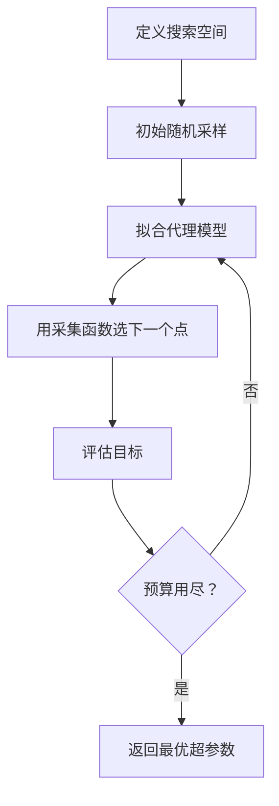
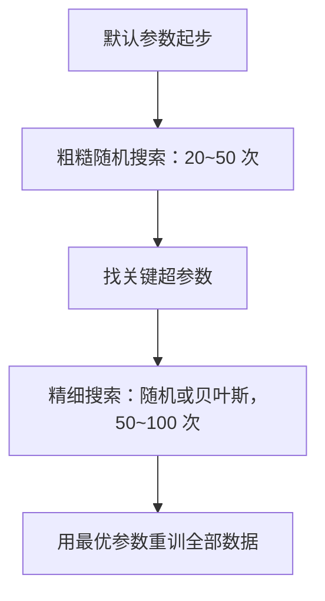
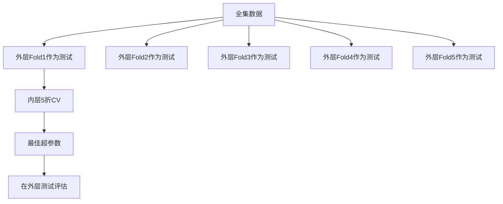

# 超参数调优

> 超参数是训练前先调好的旋钮；它们决定训练过程是否走对方向。

**类型:** 构建 **语言:** Python  
**先修:** 第 2 期第 11 课（集成方法）  
**时长:** ~90 分钟

## 学习目标

- 从零实现网格搜索、随机搜索和贝叶斯优化，并比较搜索效率
- 理解搜索空间、先验、预算与提前停止对调参的影响
- 建立支持跨验证的搜索流程，避免在验证集上过拟合
- 根据时间和算力制定适合项目约束的调参策略

## 问题

一个梯度提升模型通常有很多旋钮：学习率、树数、深度、每叶最小样本、采样比、列采样比。假设每个参数有 5 个候选值，网格规模就是 \(5^6=15{,}625\)。每组训练 10 秒，总耗时 43 小时。

网格搜索看似朴素，实务里经常最慢。随机搜索通常更有效；贝叶斯优化更进一步，它会根据历史评估结果“学会”去哪儿试。最关键的是先知道该用什么策略、该调哪些参数，避免盲目枚举。

## 核心概念

### 参数与超参数

模型参数在训练中更新（权重、偏置、分裂阈值）。超参数由训练前人工设置，决定学习过程本身。

| 超参数 | 控制作用 | 常见范围 |
|--------|---------|---------|
| 学习率 | 每步更新幅度 | 0.001 到 1.0 |
| 树数/epoch | 训练长度 | 10 到 10,000 |
| 最大深度 | 模型复杂度 | 1 到 30 |
| 正则（lambda） | 抑制过拟合 | 0.0001 到 100 |
| 批大小 | 梯度噪声 | 16 到 512 |
| Dropout | 随机失活比例 | 0 到 0.5 |

### 网格搜索

网格搜索尝试每个组合，完整穷举。优点是简单，缺点是指数级增长。

```
二维网格示例
  学习率: [0.01, 0.1, 1.0]
  最大深度: [3, 5, 7]
  总评估数: 9
```

其根本问题是：若某个参数关键、其余不敏感，大部分评估都在浪费。上述 9 次里只有 3 个有效学习率值，信息效率很低。

### 随机搜索

随机搜索不是枚举，而是从分布中采样。相同预算下它往往覆盖更多信息。

```
网格: 3 个学习率 * 3 个深度 = 9 种组合
随机: 可获得 9 个学习率 + 9 个深度（通常互异）
```

常见经验：多数任务里只有 1~2 个超参数真正关键，随机搜索在高维空间比网格更快发现好区域。

### 贝叶斯优化

随机搜索不会“记住”历史结果；贝叶斯优化会。



关键组件：

**代理模型（Surrogate）**：用廉价模型近似代价昂贵的目标函数，常见是高斯过程。它在每个点给出“均值+不确定性”。

**采集函数（Acquisition）**：在“开发”与“探索”间权衡。  
- 期望改进（EI）：这个点预期提升有多大？  
- 上置信界（UCB）：预测值 + 不确定性倍数  
- 改进概率（PI）：该点超过当前最好值的概率

### 提前停止（Pruning）

并非每个试验都要跑完；若 10 轮后模型明显不好，直接淘汰。

- Patience：验证损失连续 N 轮没提升就停
- Median pruning：中位数剪枝
- Hyperband：先给很多配置少量资源，再逐步给少数优秀配置更多预算

Hyperband 常把 81 个配置先各训练 1 轮，剩下 1/3 再给 3 个，下一轮再留 1/3，通常比跑满预算快 10~50 倍。

### 学习率调度

学习率通常最关键，直接把它当常数通常不是最优。常见调度器：

| 调度器 | 公式 | 适合场景 |
|--------|------|---------|
| Step 降低 | 每 N 个 epoch 乘 0.1 | 经典 CNN |
| 余弦退火 | \(lr * 0.5 * (1 + cos(\pi t/T))\) | 现代常用 |
| Warmup+退火 | 先线性升温再退火 | Transformer |
| One-cycle | 一个周期内升降 | 快速收敛 |
| ReduceLROnPlateau | 指标停滞时降低 | 更稳妥 |

### 调参实践



### 交叉验证内嵌式调参

单一验证划分容易过拟合调参结果。推荐：

- 外层：评估模型泛化
- 内层：在外层训练集上搜索超参数



在 `sklearn` 中可直接用 `GridSearchCV`、`RandomizedSearchCV`，但实际生产中更常见的是 `optuna`。

## 动手实现

### 步骤 1：网格搜索

`code/tuning.py` 包含网格、随机、简单贝叶斯优化三部分。

```python
def grid_search(model_fn, param_grid, X_train, y_train, X_val, y_val):
    keys = list(param_grid.keys())
    values = list(param_grid.values())
    best_score = -float("inf")
    best_params = None
    n_evals = 0

    for combo in itertools.product(*values):
        params = dict(zip(keys, combo))
        model = model_fn(**params)
        model.fit(X_train, y_train)
        score = evaluate(model, X_val, y_val)
        n_evals += 1
        if score > best_score:
            best_score = score
            best_params = params

    return best_params, best_score, n_evals
```

### 步骤 2：随机搜索

```python
def random_search(model_fn, param_distributions, X_train, y_train, X_val, y_val, n_iter=50, seed=42):
    rng = np.random.RandomState(seed)
    best_score = -float("inf")
    best_params = None

    for _ in range(n_iter):
        params = {k: sample(v, rng) for k, v in param_distributions.items()}
        model = model_fn(**params)
        model.fit(X_train, y_train)
        score = evaluate(model, X_val, y_val)

        if score > best_score:
            best_score = score
            best_params = params

    return best_params, best_score, n_iter
```

### 步骤 3：简化贝叶斯优化

```python
class SimpleBayesianOptimizer:
    def __init__(self, search_space, n_initial=5):
        self.search_space = search_space
        self.n_initial = n_initial
        self.X_observed = []
        self.y_observed = []

    def suggest(self):
        if len(self.X_observed) < self.n_initial:
            return sample_random(self.search_space)

        candidates = [sample_random(self.search_space) for _ in range(500)]
        X_cand = np.array([to_vector(c) for c in candidates])
        mu, var = self._fit_gp(X_cand)
        ei = self._expected_improvement(mu, var, max(self.y_observed))
        return candidates[np.argmax(ei)]

    def observe(self, params, score):
        self.X_observed.append(to_vector(params))
        self.y_observed.append(score)
```

### 步骤 4：统一比较

用同一合成目标，比较三种搜索在同预算下的最优得分；贝叶斯通常更快收敛到好区域。

### 步骤 5：Optuna / sklearn 内建调参

`optuna` 支持中值剪枝与可视化。对于中小规模问题可优先 `sklearn` 的网格与随机搜索；当预算有限时可直接上 `optuna`.

## 误区与实践建议

1. **先调学习率。** 对梯度类模型通常最关键。  
2. **对数空间采样。** 学习率、正则更适合 log-scale。  
3. **早停替代固定迭代。** 先把树数/epoch 设高，让早停决定合适值。  
4. **预算分配。** 60% 用于最关键的 2 个超参数，剩下给次要参数。  
5. **阈值、F1、AUPRC 与业务目标绑定。** 只盯着最小 loss 往往不够。

### 推荐流程

| 模型 | 重点调参 | 推荐策略 | 预算 |
|------|----------|----------|------|
| 随机森林 | `n_estimators`, `max_depth`, `min_samples_leaf` | 随机搜索 50 次 | 低（训练快） |
| 梯度提升 | `learning_rate`, `n_estimators`, `max_depth` | 贝叶斯 + 早停 | 中 |
| 神经网络 | `learning_rate`, `weight_decay`, `batch_size` | 贝叶斯/随机 100+ 次 | 高 |
| SVM | `C`, `gamma` | 对数网格 25~50 次 | 低 |
| XGBoost | `learning_rate`, `max_depth`, `subsample`, `colsample` | 贝叶斯 100~200 次 + 提前停止 | 中 |

经验值：若不确定，随机搜索设置为 `2 * d` 次（d 为超参数个数）的经验值常常有效，很多时候优于“精细网格”。

## 使用示例

```python
from sklearn.model_selection import cross_val_score, GridSearchCV
from sklearn.ensemble import GradientBoostingRegressor

inner_cv = GridSearchCV(
    GradientBoostingRegressor(),
    param_grid={"learning_rate":[0.01,0.05,0.1],"max_depth":[2,3,5],"n_estimators":[50,100,200]},
    cv=5,
    scoring="neg_mean_squared_error",
)

outer_scores = cross_val_score(inner_cv, X, y, cv=5, scoring="neg_mean_squared_error")
print(f"Nested CV MSE: {-outer_scores.mean():.4f} +/- {outer_scores.std():.4f}")
```

### Optuna 示例

```python
import optuna

def objective(trial):
    lr = trial.suggest_float("learning_rate", 1e-4, 1e-1, log=True)
    n_est = trial.suggest_int("n_estimators", 50, 500)
    max_depth = trial.suggest_int("max_depth", 2, 10)

    model = GradientBoostingRegressor(
        learning_rate=lr, n_estimators=n_est, max_depth=max_depth
    )
    model.fit(X_train, y_train)
    return mean_squared_error(y_val, model.predict(X_val))
```

## 练习

1. 用同一预算对比网格和随机搜索（比如各 50 次），重复 10 次种子，比较命中率。
2. 自实现 Hyperband，验证其在样本效率上的收益。
3. 对一个 from-scratch 梯度提升实现加学习率退火（余弦退火）测试性能变化。
4. 用 Optuna 调一个真实数据集上的 `RandomForestClassifier`，画参数重要性图，检验是否符合你的理解。
5. 实现 EI 采集函数并可视化探索-开发平衡。

## 关键术语

| 术语 | 常见说法 | 实际含义 |
|------|----------|----------|
| 网格搜索 | “全量试所有” | 穷举组合，确定性高但代价高 |
| 随机搜索 | “随机抽参数” | 覆盖性强，常更高效 |
| 贝叶斯优化 | “智能选点” | 用历史结果拟合代理模型，平衡探索和利用 |
| 超参数 | “要调的设置” | 训练前固定，不直接学习 |
| 早停 | “到点自动停” | 基于验证指标防止无效训练 |
| Hyperband | “自适应预算分配” | 大量小预算 + 少量优胜者加预算 |
| 采集函数 | “下一步去哪儿” | EI/UCB/PI 等策略 |

## 延展阅读

- [Bergstra & Bengio: Random Search for Hyper-Parameter Optimization (2012)](https://jmlr.org/papers/v13/bergstra12a.html) -- 随机搜索论文
- [Snoek et al., Practical Bayesian Optimization of ML Algorithms (2012)](https://arxiv.org/abs/1206.2944) -- 贝叶斯优化核心文献
- [Li et al., Hyperband: A Novel Bandit-Based Approach (2018)](https://jmlr.org/papers/v18/16-558.html) -- Hyperband 理论与实践
- [Optuna: A Next-generation Hyperparameter Optimization Framework](https://arxiv.org/abs/1907.10902) -- Optuna 框架
