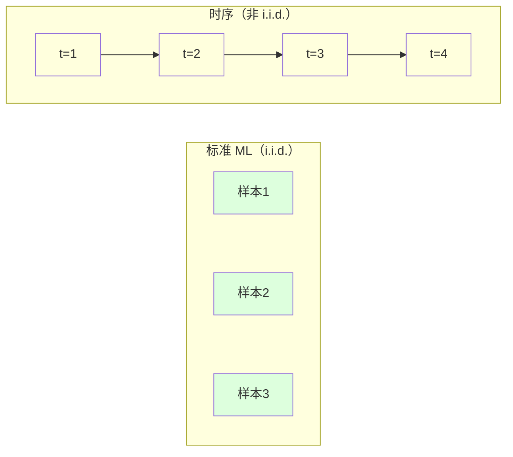

# 时间序列基础

> 过去确实常为未来提供参考，但先检验平稳性，不要把趋势和季节性混为误差。

**类型:** Build
**语言:** Python
**先修:** 第 2 期第 01-09 课
**时长:** ~90 分钟

## 学习目标

- 从零拆解时间序列：趋势、季节性和残差
- 掌握平稳性检验与为什么非平稳会误导模型
- 实现滞后特征和滑动统计，将时序转为监督学习问题
- 对比滚动验证与随机拆分，建立面向时间场景的评估逻辑

## 问题

时间序列数据天然有顺序：日销售、小时温度、CPU 使用率、周度股价。你想预测下一刻、下一周、下一季度。

传统机器学习流程（随机划分、独立同分布假设、随机 CV）在这里会失效。时间上相邻样本强相关，随机切分会把未来信息泄露到训练阶段。看似很好的回测，落地后常常塌掉。

一个随机 CV 下 95% 的准确率，在时间切分下可能只有 55%。这不是技术细节，而是线上可用与否的分水岭。

本课讲三件事：时序为何不同、如何诚实评估、如何把时序转成普通模型可用的特征。

## 核心概念

### 时间序列有何不同

标准 ML 假设 i.i.d.：各样本独立同分布。时序通常不满足：

- **不独立。** 今天股价依赖昨天，周销售与前周相关。
- **分布漂移。** 冬春销售分布不同。

这会影响特征构造、评估方式和模型选择。



### 时间序列组成

一条序列常可分为：

- **趋势（Trend）**：长期上升/下降方向
- **季节性（Seasonality）**：周期波动（每天、每周、每年）
- **残差（Residual）**：无法被趋势和季节性解释的部分

在没有明显趋势、季节性不显著时，更适合直接回归/树模型；若结构明显，先拆分再建模更稳。

常见做法：

```text
y_t = Trend_t + Seasonality_t + Residual_t
```

### 平稳性

平稳序列是统计特征（均值、方差、协方差）随时间稳定的序列。训练/预测时，非平稳数据会让模型把漂移误解成可学习模式。

平稳检验指标：

- **单位根检验（ADF）**：p 值显著小于阈值时可认为平稳
- **KPSS 检验**：与 ADF 互补

```python
is_stationary = adf_p < alpha
```

若不平稳，先做差分：

```text
d_t = y_t - y_{t-1}
```

### 自相关

自相关表示当前值和滞后值之间的关系。自相关图（ACF）可告诉你模型需要几阶滞后。

```text
ACF(k) = Corr(y_t, y_{t-k})
```

若 `ACF(7)` 在周频上高，说明可能有周季节性。

### 滞后特征：将时序转为监督学习

把“时间点”转成“表格”：

- `y_t`：当前值作为标签
- `y_{t-1}, y_{t-2}, ...`：上一时刻/多阶滞后
- `rolling_mean_7`：过去 7 个值均值

```python
# 一个简单示例
features = [
    values[:-1],
    values[:-2],
    rolling_mean(values, window=7),
]
```

这样就能复用线性回归、随机森林、梯度提升树。

### 滚动验证（walk-forward）

时序不能随机验证，必须按时间顺序切：

1. 用前 `t` 段训练
2. 在下一段验证
3. 滑动窗口向前

```python
for t in range(start, len(data)-horizon):
    train = values[:t]
    val = values[t:t+horizon]
```

### ARIMA 直觉

ARIMA 可用来建模：
- 自回归（AR）
- 差分（I）
- 移动平均（MA）

它假设未来可由过去滞后和历史误差线性组合。适合平稳且趋势较弱的单变量问题。

### 何时用什么

- 仅短期、结构稳定：ARIMA/ARMA 能快起步
- 多变量、非线性、强季节：树模型 + 特征工程
- 长期复杂依赖：可上更高级时序模型

### 预测视野与策略

要明确预测步长：

- **短期**：1-12 步，强调短期误差
- **中期**：按业务周期（周、月）平衡
- **长期**：重视趋势方向、区间覆盖，不只看点估计

### 常见误区

1. **随机划分。** 会泄露未来。
2. **不做差分就建模。** 容易把趋势当特征。
3. **过多滞后。** 特征维度爆炸，噪声变大。
4. **把所有特征同时扩展太多。** 训练过慢且泛化差。

## 实战：从零实现

### 滞后特征生成器

构造 `lag=1..N` 与滚动统计：

```python
def make_lag_features(values, lags, window):
    X, y = [], []
    for i in range(max(lags), len(values)-1):
        row = []
        for lag in lags:
            row.append(values[i-lag])
        row.append(sum(values[i-window:i]) / window)
        X.append(row)
        y.append(values[i+1])
    return X, y
```

### 滚动交叉验证

按折数切时间窗：

```python
folds = []
for fold in range(k):
    train_end = (fold + 1) * step
    val_end = train_end + horizon
    folds.append((0, train_end, train_end, val_end))
```

### 简单自回归模型

AR 类模型本质是线性回归：

```text
y_t = b + w1*y_{t-1} + w2*y_{t-2} + ... + eps
```

### 平稳性检查

打印 ADF/p 值、滚动均值和滚动方差；若均值/方差随时间漂移，先差分。

### 自相关图

ACF/PACF 决定滞后阶和 MA 阶数。

## 工程实践

### sklearn 的 TimeSeriesSplit

`TimeSeriesSplit` 在不打乱数据的前提下切分时间窗，适合快速比较模型。

### 评估指标

- MAE、RMSE（回归误差）
- MAPE（相对误差）
- MASE（与基线比较）

### 滚动特征

滚动统计可稳定噪声，但窗口长度过小会更噪，过大会滞后。

## 落地标准

### 先打赢基线

时序模型至少要胜过：
- 持续最后值
- 简单移动平均
- 同期同周期“同频复用”基线

### 实用建议

- 所有时间切分都按时间戳排序
- 特征窗口固定，不跨未来泄露
- 记录训练时间、推理时间、延迟预算
- 报告预测区间而不只报点估计

## 练习

1. 对一个月销售序列做 ADF 检验和一次差分，观察平稳性提升。
2. 构造 1、3、7、14 日滞后和 7 日滚动均值，比较线性回归与随机森林。
3. 用 `TimeSeriesSplit` 做 4 折对比，并对比随机 CV 的结果差异。
4. 实现 `walk-forward` 验证并画出真实值和预测值曲线。
5. 在样本外一周滚动更新模型参数，记录误差是否下降。

## 关键术语

| 术语 | 说明 |
|---|---|
| 平稳性 | 均值和方差随时间基本稳定 |
| 滞后特征 | 使用过去 `t-k` 的值作为当前输入 |
| 滚动窗口 | 在固定长度窗口上计算统计量 |
| Walk-forward | 按时间不断扩展训练窗口并评估 |
| 差分 | 用相邻值差值去除趋势 |

## 延伸阅读

- [Hyndman, Forecasting: Principles and Practice](https://otexts.com/fpp2/) - 系统的时序建模入门
- [scikit-learn 时间序列实践文档](https://scikit-learn.org/stable/modules/generated/sklearn.model_selection.TimeSeriesSplit.html) - 时间切分工具说明
- [Statsmodels 诊断与平稳性检验](https://www.statsmodels.org/stable/tsa.html) - ADF、ACF 等常用实现
