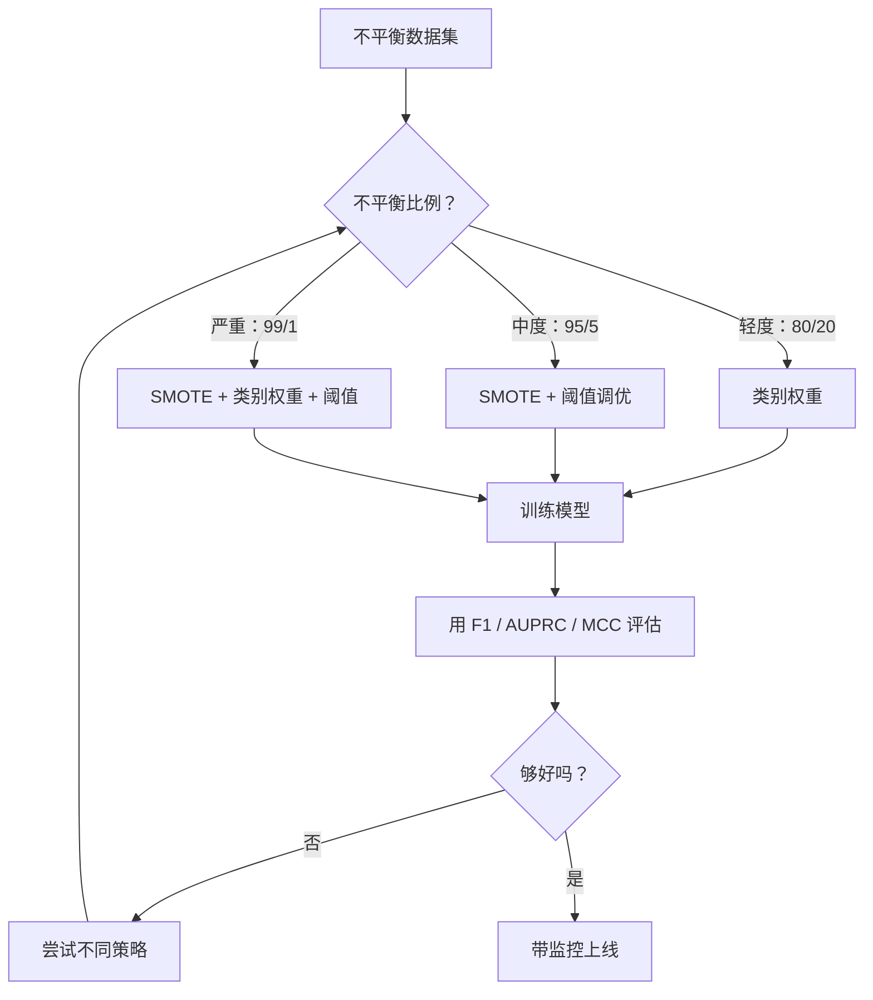
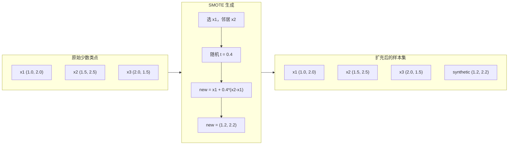
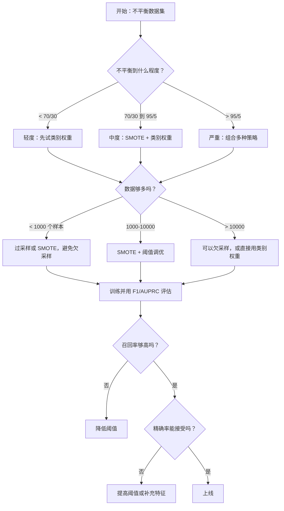

# 处理类别不平衡数据

> 当你的数据里 99% 都是“正常样本”时，准确率往往会骗人。

**类型：** 构建  
**语言：** Python  
**先修：** 第 2 阶段第 01-09 课，尤其是评估指标相关内容  
**时长：** ~90 分钟

## 学习目标

- 从零实现 SMOTE，并说明合成过采样和随机复制的差别
- 用 F1、AUPRC 和 Matthews Correlation Coefficient 评估不平衡分类，而不是只看准确率
- 比较类别加权、阈值调优和重采样策略，并能根据不平衡比例选择合适方案
- 搭建一个完整的不平衡数据处理流程，把 SMOTE、类别权重和阈值优化组合起来

## 问题

你在做欺诈检测模型。它拿到了 99.9% 的准确率。你很开心。然后你发现，它对每一笔交易都预测成“非欺诈”。

这不是 bug。只要只有 0.1% 的交易是欺诈，模型这么做反而是最合理的。它学到的是：永远猜多数类可以把总体错误压到最低。数学上没错，但完全没用。

这种情况在真实分类任务里到处都有。疾病诊断：阳性率 1%。网络入侵：攻击率 0.01%。制造缺陷：缺陷率 0.5%。垃圾邮件过滤：20%。流失预测：5%。越重要的少数类，往往越稀少。

准确率之所以失效，是因为它把所有正确预测都算成同样的价值。把正常交易判对，和把欺诈交易拦下来，在准确率里都只加 1 分。但拦下欺诈，才是这个模型存在的原因。我们需要的是能强迫模型关注稀有但重要类别的指标、技术和训练策略。

## 核心概念

### 为什么准确率会失效

假设数据集中有 1000 个样本：990 个负类，10 个正类。一个永远预测负类的模型：

|  | 预测为正 | 预测为负 |
|--|---|---|
| 实际为正 | 0（TP） | 10（FN） |
| 实际为负 | 0（FP） | 990（TN） |

准确率 = (0 + 990) / 1000 = 99.0%

但模型没有抓到任何欺诈、任何疾病、任何缺陷。准确率却说它很好。这就是为什么不平衡问题里只看 accuracy 很危险。

### 更好的指标

**精确率** = TP / (TP + FP)。在所有被判为正类的样本里，有多少是真的正类？精确率高，说明误报少。

**召回率** = TP / (TP + FN)。在所有真实正类里，我们抓住了多少？召回率高，说明漏报少。

**F1 分数** = 2 * precision * recall / (precision + recall)。它是精确率和召回率的调和平均，会比算术平均更严厉地惩罚两者失衡。

**F-beta 分数** = (1 + beta^2) * precision * recall / (beta^2 * precision + recall)。当 beta > 1 时更看重召回率；当 beta < 1 时更看重精确率。F2 在欺诈检测里很常见，因为漏掉欺诈通常比误报更糟。

**AUPRC**（Precision-Recall 曲线下面积）。它和 AUC-ROC 类似，但在不平衡数据里更有信息量。随机分类器的 AUPRC 等于正类比例，而不是像 ROC 那样固定为 0.5，因此更容易看出改进。

**Matthews Correlation Coefficient** = (TP * TN - FP * FN) / sqrt((TP+FP)(TP+FN)(TN+FP)(TN+FN))。它的取值范围是 -1 到 +1。只有当模型在两个类别上都表现不错时，它才会给出高分。即使类别比例差很多，它也能保持平衡。

对于上面那个“永远预测负类”的模型：precision = 0/0（未定义，通常记为 0）、recall = 0/10 = 0、F1 = 0、MCC = 0。这些指标会正确地告诉你：这个模型没用。

### 不平衡数据处理流程



### SMOTE：合成少数类过采样

随机过采样只是复制已有少数类样本。它能起作用，但因为模型反复看到完全相同的点，容易过拟合。

SMOTE 会生成新的少数类样本，而且这些样本是合理的，不是拷贝。算法如下：

1. 对每个少数类样本 x，在其他少数类样本里找 k 个最近邻
2. 随机选一个邻居
3. 在 x 和这个邻居之间的线段上生成一个新样本

公式：`new_sample = x + random(0, 1) * (neighbor - x)`

这样做会在真实少数类点之间插值，在特征空间里生成同一片区域的新样本，而不是简单复制旧数据。



### 常见采样策略对比

**随机过采样**：把少数类样本复制到和多数类一样多。
- 优点：简单，不会丢信息
- 缺点：完全重复的样本会导致过拟合，训练时间也会变长

**随机欠采样**：把多数类样本删到和少数类一样多。
- 优点：训练快，做法简单
- 缺点：会丢掉有用的多数类信息，方差更高

**SMOTE**：通过插值生成新的少数类样本。
- 优点：能生成新数据，和随机过采样相比更不容易过拟合
- 缺点：在决策边界附近可能生成噪声样本，而且不考虑多数类分布

| 策略 | 数据变化 | 风险 | 适用场景 |
|----------|-------------|------|-------------|
| 过采样 | 复制少数类 | 过拟合 | 小数据集，中等程度不平衡 |
| 欠采样 | 删除多数类 | 信息损失 | 大数据集，希望更快训练 |
| SMOTE | 增加合成少数类 | 边界噪声 | 中等不平衡，少数类样本足够做 k-NN |

### 类别权重

与其改数据，不如改模型对错误的重视程度。给少数类的误分类更高的权重。

对于一个二分类问题，假设有 950 个负类和 50 个正类：
- 负类权重 = n_samples / (2 * n_negative) = 1000 / (2 * 950) = 0.526
- 正类权重 = n_samples / (2 * n_positive) = 1000 / (2 * 50) = 10.0

正类权重是负类的 19 倍。把一个正类样本分错，代价相当于分错 19 个负类样本。模型会被迫关注少数类。

在逻辑回归里，这会改变损失函数：

```text
weighted_loss = -sum(w_i * [y_i * log(p_i) + (1-y_i) * log(1-p_i)])
```

其中 `w_i` 由样本 i 所属类别决定。

从数学上看，类别权重和过采样在期望上是等价的，只是它不需要真的造新数据，所以更快，也没有复制样本带来的过拟合风险。

### 阈值调优

大多数分类器都会输出概率。默认阈值通常是 0.5：如果 `P(positive) >= 0.5`，就预测正类。但 0.5 只是个约定值，不是定律。类别不平衡时，最优阈值通常要低得多。

流程如下：
1. 训练模型
2. 在验证集上拿到预测概率
3. 把阈值从 0.0 扫到 1.0
4. 在每个阈值下计算 F1 或你选定的指标
5. 选出指标最好的阈值


模型可能对某笔欺诈交易输出 `P(fraud) = 0.15`。阈值为 0.5 时，它会被判成非欺诈；阈值降到 0.10 时，它就能被正确识别。概率是否校准得特别准不如排序是否合理重要。只要欺诈样本的概率通常比非欺诈更高，就总能找到一个能分开的阈值。

### 成本敏感学习

类别权重可以看成更一般形式的成本敏感学习。与其统一给所有错误一个成本，不如直接指定不同误分类的代价：

| | 预测为正 | 预测为负 |
|--|---|---|
| 实际为正 | 0（正确） | C_FN = 100 |
| 实际为负 | C_FP = 1 | 0（正确） |

漏掉一笔欺诈交易（FN）的代价是误报（FP）的 100 倍。模型优化的是总成本，而不是总错误数。

当你能估计真实业务成本时，这是最合理的方法。漏诊癌症和多做一次活检的代价显然不一样。把这些成本写清楚，模型才会做出正确权衡。

### 决策流程图



```figure
class-imbalance
```

## 动手实现

### 第 1 步：生成不平衡数据集

