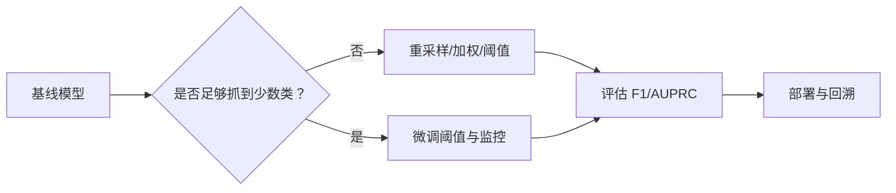
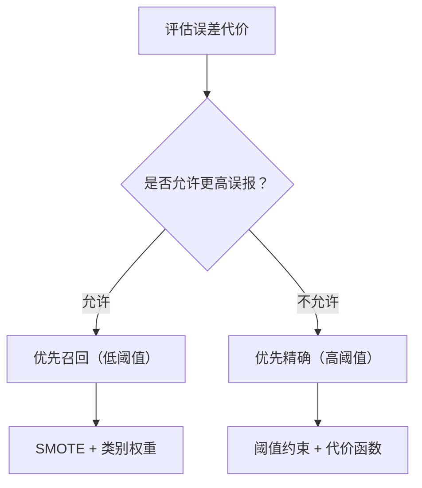

# 不平衡数据处理

> 当 99% 样本都在“正常类”，准确率很可能是在蒙你。

**类型:** 构建 **语言:** Python
**先修:** 第 2 期第 01-09 课（尤其评估指标）
**时长:** ~90 分钟

## 学习目标

- 理解类别不平衡对指标和训练策略的影响
- 从零实现 SMOTE、类别加权与阈值调参
- 掌握 F1、PR 曲线、AUPRC 在少数类问题中的含义
- 在代价敏感场景下选择“少漏报”或“少误报”策略

## 问题

你训练了一个欺诈检测模型，测试准确率是 99.9%，你很快骄傲了。随后发现它把所有交易都判为“非欺诈”。

这并不奇怪：当欺诈只占 0.1% 时，盲猜“正常类”可极大降低整体误差。模型数学上正确，但对业务没有意义。

现实中的少数类问题随处可见：疾病诊断阳性率 1%，入侵检测 0.01%，缺陷率 0.5%。越重要的少数类，通常越稀有。

Accuracy 不行，因为它把“猜对阴性”和“抓住阳性”视作同等。漏掉一个欺诈和正确分类一个正常样本，同权，这会把指标导向错误方向。

## 核心概念

### 为什么准确率失效

假设 1000 条中 990 正常，10 异常。

|  | 预测阳性 | 预测阴性 |
|---|---|---|
| 实际阳性 | 0 (TP) | 10 (FN) |
| 实际阴性 | 0 (FP) | 990 (TN) |

Accuracy = 99.0%

该模型把所有少数类都漏掉，但 accuracy 仍很高。对业务，这相当于失败。

### 更好的指标

**精确率** = TP/(TP+FP)，预测为正的样本里有多少真阳。

**召回率** = TP/(TP+FN)，所有真实阳性中抓到了多少。

**F1** = 2*P*R/(P+R)，用调和平均平衡精确率与召回率。

**F-beta** = (1+β²)PR/(β²P+R)，β>1 更重视召回，β<1 更重视精确率。欺诈场景常用 F2，因为漏报代价更高。

**AUPRC** 对少数类更友好，反映“检出阳性后还能保持精确率”的能力。

### 少数类流水线

完整流水线通常是：

1. 先看分布严重程度（imbalance ratio）
2. 选择数据层或算法层策略
3. 在验证集上搜索阈值
4. 以任务代价定义选型标准

### SMOTE

SMOTE 在少数类样本之间插值，生成合成样本，区别于简单重复采样。它能扩充样本多样性，但会模糊边界噪声。

算法：对每个少数类样本找 k 个近邻，随机选邻居与其按比例插值。

### 采样策略对比

- **随机过采样**：复制少数类，简单但容易过拟合
- **随机欠采样**：减少多数类，快但丢信息
- **SMOTE**：平衡更好，保留多数类信息，但更重

### 类别权重

损失函数可按类别加权：减少多数类影响，放大少数类损失。

适用于多数主导的分类器（如逻辑回归、树模型）的简单改法。

### 阈值调参

概率模型默认阈值 0.5 只适合平衡类。少数类任务常把阈值调低以提高召回，或者调高以减少误报。

### 成本敏感学习

把不同错误分配不同代价：

- FN 成本（漏报）高：阈值应下降，优先召回
- FP 成本高：阈值应上升，优先精确

很多项目里需要两条业务线同时满足：

- 风险控制：尽量少漏报
- 用户体验：尽量少误报

### 决策流

## 代码实现

### 第 1 步：构造不平衡数据

先生成可控比例的不平衡二分类数据，便于实验。

### 第 2 步：从零实现 SMOTE

对每个少数类样本生成邻居内的插值样本。

### 第 3 步：随机过采样/欠采样

- random oversampling：复制少数类
- random undersampling：降采样多数类

### 第 4 步：带类权重的逻辑回归

在训练时加入 `class_weight`，将少数类权重放大。

### 第 5 步：阈值调参

在验证集上扫描阈值 0~1，选择能最大化 F1 或 F2 的点。

### 第 6 步：评估函数

输出 confusion matrix、precision、recall、F1、AUPRC、PR 曲线。

### 第 7 步：对比方法

比较以下四种：

- 无处理
- 仅过采样
- 仅类别权重
- SMOTE + 类别权重 + 阈值优化

## 工程实践

### 与 sklearn 结合

scikit-learn 生态下，可结合 `imblearn` 的 `SMOTE`，以及 `precision_recall_curve` 做阈值搜索（若你装了依赖）。

## 落地

本课产出：
- 一套可复用的类别不平衡流程（训练-验证-阈值-上线）

## 练习

1. 改变 `class_sep` 和样本比例，观察决策边界变化。
2. 在同一数据上分别比较 F1 与 F2 的最优阈值。
3. 在不同 FN/FP 成本下画出最优阈值-代价曲线。
4. 对合成和真实数据分别评估 `SMOTE + threshold` 与仅 `class_weight`。

## 关键术语

| 术语 | 解释 |
|---|---|
| 欠采样 | 减少多数类样本 |
| 过采样 | 增加少数类样本 |
| 边界扩张 | 让少数类区域更容易被覆盖 |
| Matthews 相关系数（MCC） | 考虑 TP/FN/FP/TN 的综合平衡指标 |
| PR 曲线 | precision-recall 随阈值变化曲线 |

## 延伸阅读

- [Precision-Recall 曲线 - scikit-learn](https://scikit-learn.org/stable/modules/generated/sklearn.metrics.precision_recall_curve.html)
- [Imbalanced-learn 文档](https://imbalanced-learn.org)
- [He and Garcia, Learning from imbalanced data (2015)](https://ieeexplore.ieee.org/document/7358046)

