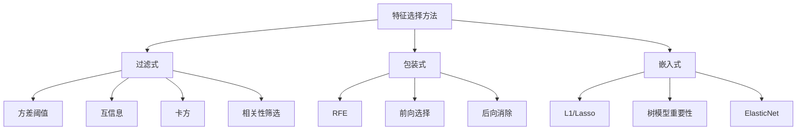
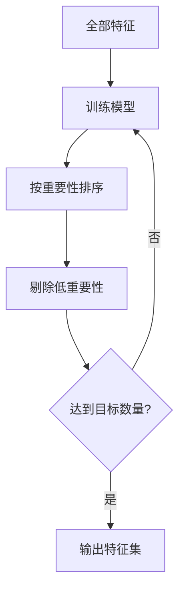

# 特征选择

> 不是特征越多越好，真正有用的才是好特征。

**类型:** 构建 **语言:** Python
**先修:** 第 2 期第 01-09 课及第 8 课（特征工程）
**时长:** ~75 分钟

## 学习目标

- 从零实现过滤式特征筛选（方差阈值、互信息、卡方）
- 实现包装式筛选（RFE、前向选择）并比较差异来源
- 解释高维、共线、冗余特征对泛化与稳定性的影响
- 用实测展示筛选策略对精度、训练耗时与可解释性的影响

## 问题

你有 500 个特征，模型训练慢、过拟合重、难解释。直觉上你加了更多特征，本想提高性能，结果反而变差。

这是“维度灾难”：维度变大后，空间体积急剧增大，样本变稀疏，点间距离收敛，模型需要指数级数据才能找到真实结构。噪声特征会淹没信号特征。

特征选择就是去噪：剔除无效特征、冗余特征，只保留与目标信息更紧密的特征，得到更快训练、更好泛化、可解释性更高的模型。

目标不是用更多信息，而是用对的那一部分信息。

## 核心概念

### 三大类方法

每种方法可分为三类：



- **过滤式（Filter）**：和模型无关，先打分后筛选，快但忽略交互。
- **包装式（Wrapper）**：用模型评估特征子集，通常效果更好但慢。
- **嵌入式（Embedded）**：训练时同时选择特征。

### 方差阈值

若某个特征几乎不变，信息很少。

例如 1000 个样本里 999 个是 0，方差几乎 0，模型几乎分不出该特征。

```text
Var(feature) < 阈值 -> 移除
```

适合先清理“明显废特征”。

### 互信息

互信息衡量 X 与 Y 的信息共享程度，能捕捉非线性关系。

```text
I(X;Y) = sum_x sum_y p(x,y) log(p(x,y)/(p(x)p(y)))
```

若 X,Y 独立，互信息为 0。X 与目标关系非线性时，相关系数可能为 0，但互信息仍能检测到。

连续特征通常先分箱。分箱过少丢信息，过多引入噪声。

### RFE（递归特征消除）

利用模型权重/重要性迭代删特征：

1. 用全部特征训练
2. 按重要性排序
3. 去除最低的一部分
4. 重复直到目标数量



RFE 能捕捉交互，通常更稳，但计算更慢。

### L1/Lasso

在损失中加 L1 正则：

```text
loss = error + alpha * sum(|w_i|)
```

L1 会将一些权重压到 0，相当于训练中内置筛选。

### 树模型重要性

决策树分裂本身带来特征重要性：

- 哪个特征分裂带来更高 impurity 降低
- 降低总的不纯度越多，重要性越高

需警惕高基数特征偏置。

### 置换重要性

打乱一个特征列，观察验证性能下降幅度：

- 下降越大 -> 该特征越关键
- 几乎无下降 -> 该特征可删

比树内置重要性更稳健，但速度更慢。

### 对比表

| 方法 | 类别 | 速度 | 非线性建模 | 特征交互 |
|---|---|---|---|---|
| 方差阈值 | Filter | 很快 | 否 | 否 |
| 互信息 | Filter | 快 | 部分 | 否 |
| 相关性过滤 | Filter | 快 | 否 | 否 |
| RFE | Wrapper | 慢 | 取决于模型 | 是 |
| L1/Lasso | Embedded | 快 | 否（线性） | 否 |
| 树重要性 | Embedded | 中等 | 是 | 是 |
| 置换重要性 | 泛用 | 慢 | 是 | 是 |

### 决策流程


## 代码实现

### 第 1 步：构造可控合成数据

生成一批已知真信号特征和噪声特征，便于后验观察。

### 第 2 步：方差筛选

直接按阈值移除低方差列。

### 第 3 步：互信息离散化

连续特征分箱后计算互信息，并按分数取 top-k。

### 第 4 步：RFE

使用线性模型反复训练并删特征。

### 第 5 步：L1 特征选择

训练带 L1 惩罚的线性模型，筛除权重为零特征。

### 第 6 步：树模型重要性

对决策树/随机森林计算重要性后选 top-k。

### 第 7 步：汇总比较

同一训练/验证划分下比较：

- 精度/Recall
- 训练时长
- 选择特征数量与泛化差异

## 工程实践

### sklearn 参考

真实项目中可先用 `VarianceThreshold`、`SelectKBest`（互信息）快速筛一遍，再用嵌入式方法细化。

## 落地

建议产出：
- 一个可复现的特征选择流水线（从生成到评估）

## 练习

1. 生成高维低信噪数据，比较未筛选与筛选后的精度和训练时间。
2. 增加冗余特征（如 `x2 = x1 + 噪声`），观察互信息、L1、树重要性的差异。
3. 使用前向选择和 RFE 在同一任务上比较稳定性与计算成本。
4. 把 top-k 从 5 到 100 扫描，给出偏差-方差变化曲线。

## 关键术语

| 术语 | 解释 |
|---|---|
| 过滤式 | 不依赖模型的预筛选 |
| 包装式 | 用模型评估子集的选择 |
| 嵌入式 | 与模型训练同阶段选择 |
| 特征冗余 | 两个特征高度相关，信息重复 |
| 特征交互 | 组合特征比单变量更能解释标签 |

## 延伸阅读

- [scikit-learn 特征选择](https://scikit-learn.org/stable/modules/feature_selection.html)
- [Guyon and Elisseeff, An Introduction to Feature Selection (2003)](https://jmlr.org/papers/v3/guyon03a.html)
- [Peng et al., Mutual information for feature selection](https://www.sciencedirect.com/science/article/pii/S0378873319300146)
