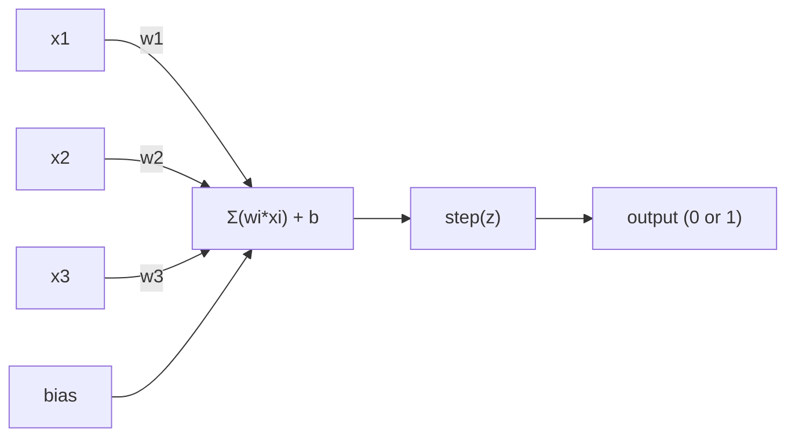
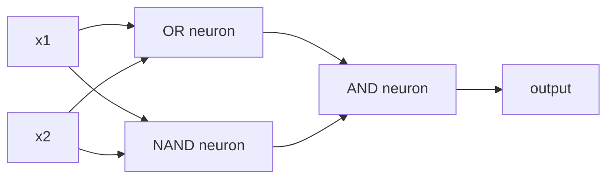

# 感知机

> 感知机是神经网络的“最小单元”。打开它，里面就是权重、偏置和一个决策规则。

**类型:** 构建
**语言:** Python
**先修:** 第一阶段（线性代数直觉）
**时长:** ~60 分钟

## 学习目标

- 用 Python 从零实现感知机，包含权重更新规则和阶跃激活函数
- 解释单层感知机只能处理线性可分问题，并演示 XOR 失败案例
- 通过组合 OR、NAND 与 AND 门构建多层感知机，解决 XOR
- 用 sigmoid 激活和反向传播训练两层网络，让其自动学习 XOR

## 问题背景

你已经知道向量和点积，也知道矩阵可以把输入变换为输出。但机器如何“学习”该用哪种变换呢？

感知机给出答案。它是最简单的学习机：拿输入、乘上权重、加上偏置，再做二分类决策，然后不断调整参数。就这么简单。每个神经网络都可以看作这种结构的层层叠加。

理解感知机，就等于理解“学习”在代码里到底意味着什么：不断调节数字，让输出更贴近真实结果。

## 核心概念

### 单神经元，单决策

一个感知机接收 n 个输入，将每个输入乘以对应权重并求和，加上偏置，再经过激活函数得到输出。



阶跃函数很“硬”：加权和加偏置结果 z 在 >= 0 时输出 1，否则输出 0。

```
step(z) = 1  if z >= 0
           0  if z < 0
```

这就是一个线性分类器。权重和偏置定义了一条直线（高维空间是超平面），把输入空间分成两个区域。

### 决策边界

对两个输入，感知机在二维平面里画一条线：

```
  x2
  ┤
  │  Class 1        /
  │    (0)          /
  │                /
  │               / w1·x1 + w2·x2 + b = 0
  │              /
  │             /     Class 2
  │            /        (1)
  ┼───────────/──────────── x1
```

线的一侧输出 0，另一侧输出 1。训练就是不断移动这条线，使其正确分开各类。

### 学习规则

感知机更新规则很直接：

```
For each training example (x, y_true):
    y_pred = predict(x)
    error = y_true - y_pred

    For each weight:
        w_i = w_i + learning_rate * error * x_i
    bias = bias + learning_rate * error
```

如果预测正确，error = 0，参数不变；若应为 1 却预测 0，则权重增大；若应为 0 却预测 1，则权重减小。学习率控制每步更新的幅度。

### XOR 问题

先看下这几类逻辑门：

```
AND gate:           OR gate:            XOR gate:
x1  x2  out         x1  x2  out         x1  x2  out
0   0   0           0   0   0           0   0   0
0   1   0           0   1   1           0   1   1
1   0   0           1   0   1           1   0   1
1   1   1           1   1   1           1   1   0
```

AND 和 OR 都是线性可分的：可以用一条线把 0 和 1 分开；XOR 则不行。单条直线无法同时分开 [0,1]、[1,0] 与 [0,0]、[1,1]。

```
AND (separable):        XOR (not separable):

  x2                      x2
  1 ┤  0     1            1 ┤  1     0
    │     /                 │
  0 ┤  0 / 0              0 ┤  0     1
    ┼──/──────── x1         ┼──────────── x1
       line works!          no single line works!
```

这是一个根本限制：单层感知机只能解决线性可分问题。Minsky 与 Papert 在 1969 年给出了这一结论，直接让神经网络研究沉寂了约十年。

修复方法是把感知机堆叠成多层。多层感知机可以把两个线性决策组合成非线性决策，从而解决 XOR。

```figure
perceptron-boundary
```

## 动手实现

### 步骤 1：实现 Perceptron 类

```python
class Perceptron:
    def __init__(self, n_inputs, learning_rate=0.1):
        self.weights = [0.0] * n_inputs
        self.bias = 0.0
        self.lr = learning_rate

    def predict(self, inputs):
        total = sum(w * x for w, x in zip(self.weights, inputs))
        total += self.bias
        return 1 if total >= 0 else 0

    def train(self, training_data, epochs=100):
        for epoch in range(epochs):
            errors = 0
            for inputs, target in training_data:
                prediction = self.predict(inputs)
                error = target - prediction
                if error != 0:
                    errors += 1
                    for i in range(len(self.weights)):
                        self.weights[i] += self.lr * error * inputs[i]
                    self.bias += self.lr * error
            if errors == 0:
                print(f"Converged at epoch {epoch + 1}")
                return
        print(f"Did not converge after {epochs} epochs")
```

### 步骤 2：在逻辑门数据上训练

```python
and_data = [
    ([0, 0], 0),
    ([0, 1], 0),
    ([1, 0], 0),
    ([1, 1], 1),
]

or_data = [
    ([0, 0], 0),
    ([0, 1], 1),
    ([1, 0], 1),
    ([1, 1], 1),
]

not_data = [
    ([0], 1),
    ([1], 0),
]

print("=== AND Gate ===")
p_and = Perceptron(2)
p_and.train(and_data)
for inputs, _ in and_data:
    print(f"  {inputs} -> {p_and.predict(inputs)}")

print("\n=== OR Gate ===")
p_or = Perceptron(2)
p_or.train(or_data)
for inputs, _ in or_data:
    print(f"  {inputs} -> {p_or.predict(inputs)}")

print("\n=== NOT Gate ===")
p_not = Perceptron(1)
p_not.train(not_data)
for inputs, _ in not_data:
    print(f"  {inputs} -> {p_not.predict(inputs)}")
```

### 步骤 3：观察 XOR 失败

```python
xor_data = [
    ([0, 0], 0),
    ([0, 1], 1),
    ([1, 0], 1),
    ([1, 1], 0),
]

print("\n=== XOR Gate (single perceptron) ===")
p_xor = Perceptron(2)
p_xor.train(xor_data, epochs=1000)
for inputs, expected in xor_data:
    result = p_xor.predict(inputs)
    status = "OK" if result == expected else "WRONG"
    print(f"  {inputs} -> {result} (expected {expected}) {status}")
```

它永远不会收敛。这是单层感知机无法学习 XOR 的硬性证据。

### 步骤 4：两层网络解决 XOR

关键是这个恒等式：XOR = (x1 OR x2) AND NOT(x1 AND x2)。将其分解为三台感知机：



```python
def xor_network(x1, x2):
    or_neuron = Perceptron(2)
    or_neuron.weights = [1.0, 1.0]
    or_neuron.bias = -0.5

    nand_neuron = Perceptron(2)
    nand_neuron.weights = [-1.0, -1.0]
    nand_neuron.bias = 1.5

    and_neuron = Perceptron(2)
    and_neuron.weights = [1.0, 1.0]
    and_neuron.bias = -1.5

    hidden1 = or_neuron.predict([x1, x2])
    hidden2 = nand_neuron.predict([x1, x2])
    output = and_neuron.predict([hidden1, hidden2])
    return output


print("\n=== XOR Gate (multi-layer network) ===")
for inputs, expected in xor_data:
    result = xor_network(inputs[0], inputs[1])
    print(f"  {inputs} -> {result} (expected {expected})")
```

四个样本全部正确。多层叠加可以形成单层无法表达的决策边界。

### 步骤 5：训练一个两层网络

上一步我们手工设定了权重，这在实际里行不通，因为真实问题里不会提前知道正确权重。正确做法是用 sigmoid 替换 step，然后用反向传播自动学习权重。

```python
class TwoLayerNetwork:
    def __init__(self, learning_rate=0.5):
        import random
        random.seed(0)
        self.w_hidden = [[random.uniform(-1, 1), random.uniform(-1, 1)] for _ in range(2)]
        self.b_hidden = [random.uniform(-1, 1), random.uniform(-1, 1)]
        self.w_output = [random.uniform(-1, 1), random.uniform(-1, 1)]
        self.b_output = random.uniform(-1, 1)
        self.lr = learning_rate

    def sigmoid(self, x):
        import math
        x = max(-500, min(500, x))
        return 1.0 / (1.0 + math.exp(-x))

    def forward(self, inputs):
        self.inputs = inputs
        self.hidden_outputs = []
        for i in range(2):
            z = sum(w * x for w, x in zip(self.w_hidden[i], inputs)) + self.b_hidden[i]
            self.hidden_outputs.append(self.sigmoid(z))
        z_out = sum(w * h for w, h in zip(self.w_output, self.hidden_outputs)) + self.b_output
        self.output = self.sigmoid(z_out)
        return self.output

    def train(self, training_data, epochs=10000):
        for epoch in range(epochs):
            total_error = 0
            for inputs, target in training_data:
                output = self.forward(inputs)
                error = target - output
                total_error += error ** 2

                d_output = error * output * (1 - output)

                saved_w_output = self.w_output[:]
                hidden_deltas = []
                for i in range(2):
                    h = self.hidden_outputs[i]
                    hd = d_output * saved_w_output[i] * h * (1 - h)
                    hidden_deltas.append(hd)

                for i in range(2):
                    self.w_output[i] += self.lr * d_output * self.hidden_outputs[i]
                self.b_output += self.lr * d_output

                for i in range(2):
                    for j in range(len(inputs)):
                        self.w_hidden[i][j] += self.lr * hidden_deltas[i] * inputs[j]
                    self.b_hidden[i] += self.lr * hidden_deltas[i]
```

```python
net = TwoLayerNetwork(learning_rate=2.0)
net.train(xor_data, epochs=10000)
for inputs, expected in xor_data:
    result = net.forward(inputs)
    predicted = 1 if result >= 0.5 else 0
    print(f"  {inputs} -> {result:.4f} (rounded: {predicted}, expected {expected})")
```

与步骤 4 的两点差异：第一，step 被 sigmoid 替代，函数是连续且可导的，梯度才存在；第二，`train` 会把输出误差反向传回隐藏层，按各参数对误差的贡献比例更新权重。这就是 20 行内的反向传播。

这也是通向第 03 课的桥梁。`d_output` 和 `hidden_deltas` 后面的数学细节，会在下一课的链式法则里完整推导。

## 立即上手

你刚写出的全部逻辑，在 sklearn 里有对应的一行：

```python
from sklearn.linear_model import Perceptron as SkPerceptron
import numpy as np

X = np.array([[0,0],[0,1],[1,0],[1,1]])
y = np.array([0, 0, 0, 1])

clf = SkPerceptron(max_iter=100, tol=1e-3)
clf.fit(X, y)
print([clf.predict([x])[0] for x in X])
```

只要 5 行。你自己写的 30 行 `Perceptron` 做的事情是一样的。

只要 5 行。你自己写的 30 行 Perceptron 做的事情是一样的。sklearn 版本增加了收敛检查、多种损失函数和稀疏输入支持，但核心循环不变：加权和、阶跃、按误差更新。

真正差别在规模上，生产网络会发生这些变化：

- 阶跃函数换成 sigmoid、ReLU 或其他平滑激活
- 权重通过反向传播自动学习（第 03 课）
- 层数从 2 增加到 3、10、100+ 层
- 核心逻辑仍然相同：每层把上一层输出再变换成新的特征

单层感知机只能画直线；叠加起来，就能近似画出任意形状。

## 本课成果

本课会输出：
- `outputs/skill-perceptron.md` - 说明何时用单层结构，何时用多层结构的技能说明文档

## 练习

1. 用 Perceptron 训练 NAND 门（NAND 是万用门，任何逻辑电路都能由它拼成）。验证其 weights 和 bias 是否构成正确的决策边界。
2. 修改 Perceptron，在每轮训练时记录决策边界（w1*x1 + w2*x2 + b = 0）并打印；再看它在 AND 门上的变化轨迹。
3. 实现一个三输入感知机：当 3 个输入中至少有 2 个为 1 时输出 1（多数表决）。它是线性可分吗？为什么？

## 关键术语

| 术语 | 常见说法 | 更准确的含义 |
|------|---------|-------------|
| 感知机 | “一个假的神经元” | 一个线性分类器：输入与权重点积加偏置，再经过步进函数 |
| 权重 | “输入重要程度” | 缩放每个输入对决策贡献大小的系数 |
| 偏置 | “阈值” | 平移决策边界的常数项，让感知机即使输入为零也能触发输出 |
| 激活函数 | “把值压缩的函数” | 加权和后接的非线性映射；感知机常用步进函数，现代网络常用 sigmoid/ReLU |
| 线性可分 | “能画条线分开” | 存在一条超平面可完美划分类别 |
| XOR 问题 | “感知机做不了的事” | 单层网络不能学习非线性可分函数的经典反例 |
| 决策边界 | “分类器切换位置” | 满足 w*x + b = 0 的超平面，把输入空间分为两类 |
| 多层感知机 | “真正的神经网络” | 将感知机按层连接，每层输出作为下一层输入 |

## 进一步阅读

- Frank Rosenblatt, 《Perceptron: A Probabilistic Model for Information Storage and Organization in the Brain》 (1958) — 这篇开创性论文奠定了感知机思想
- Minsky & Papert, 《Perceptrons》 (1969) — 证明了 XOR 无法由单层网络解决，并一度使感知机研究停滞
- Michael Nielsen, 《Neural Networks and Deep Learning》第一章 (http://neuralnetworksanddeeplearning.com/) — 免费在线资源，形象说明感知机如何组网
