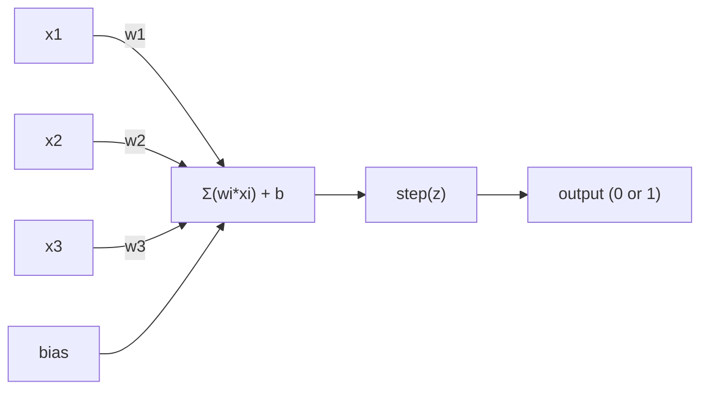
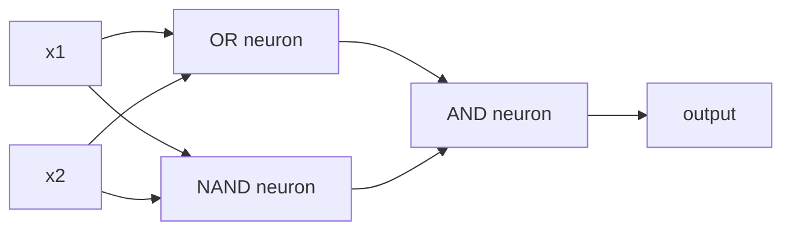

# 感知机

> 感知机是神经网络的最小单元。拆开来看，里面就是权重、偏置和一个决策。

**类型:** 构建
**语言:** Python
**先修:** 第一阶段（线性代数直觉）
**时长:** ~60 分钟

## 学习目标

- 从零实现感知机，包括权重更新规则和阶跃激活函数
- 解释为什么单个感知机只能解决线性可分问题，并演示 XOR 失败案例
- 通过组合 OR、NAND 和 AND 门构建多层感知机来解决 XOR
- 用 sigmoid 激活和反向传播训练一个两层网络，让它自动学会 XOR

## 问题

你已经了解向量和点积，也知道矩阵能将输入变成输出。但机器究竟是怎么“学会”该用哪种变换的？

感知机回答了这个问题。它是最简单的学习机器：接收输入，乘以权重，加上偏置，然后做二分类判断。接着根据结果调整参数。就这么简单。所有神经网络，都是把这个想法一层层堆起来。

理解感知机，就等于理解了代码里的“学习”到底是什么意思：不断调整数字，直到输出和现实一致。

## 核心概念

### 一个神经元，一个决策

感知机会接收 `n` 个输入，把每个输入乘上对应权重，求和，加上偏置，再经过激活函数。



阶跃函数非常直接：如果加权和再加偏置大于等于 0，就输出 1；否则输出 0。

```text
step(z) = 1  if z >= 0
          0  if z < 0
```

这就是一个线性分类器。权重和偏置定义了一条线（高维情况下是超平面），把输入空间分成两个区域。

### 决策边界

对于两个输入，感知机会在二维空间里画出一条直线：

```text
  x2
  ┤
  │  Class 1        /
  │    (0)          /
  │                /
  │               /  w1·x1 + w2·x2 + b = 0
  │              /
  │             /     Class 2
  │            /        (1)
  ┼───────────/──────────── x1
```

直线一侧输出 0，另一侧输出 1。训练就是不断移动这条线，直到它把类别正确分开。

### 学习规则

感知机的学习规则很简单：

```text
对于每个训练样本 (x, y_true)：
    y_pred = predict(x)
    error = y_true - y_pred

    对每个权重：
        w_i = w_i + learning_rate * error * x_i
    bias = bias + learning_rate * error
```

如果预测正确，`error = 0`，什么都不变。如果预测成 0 但正确答案是 1，权重就增大。如果预测成 1 但正确答案是 0，权重就减小。学习率决定每次调整幅度有多大。

### XOR 问题

问题从这里开始出现。看这几个逻辑门：

```text
AND gate:           OR gate:            XOR gate:
x1  x2  out         x1  x2  out         x1  x2  out
0   0   0           0   0   0           0   0   0
0   1   0           0   1   1           0   1   1
1   0   0           1   0   1           1   0   1
1   1   1           1   1   1           1   1   0
```

AND 和 OR 都是线性可分的：能用一条直线把 0 和 1 分开。XOR 不是。没有一条直线能把 `[0,1]` 和 `[1,0]` 从 `[0,0]` 与 `[1,1]` 中分开。

```text
AND (separable):        XOR (not separable):

  x2                      x2
  1 ┤  0     1            1 ┤  1     0
    │     /                 │
  0 ┤  0 / 0              0 ┤  0     1
    ┼──/──────── x1         ┼──────────── x1
       line works!          no single line works!
```

这是一条根本限制。单个感知机只能解决线性可分问题。Minsky 和 Papert 在 1969 年证明了这一点，神经网络研究也因此沉寂了将近十年。

解决办法是把感知机叠成层。多层感知机能把两个线性决策组合成一个非线性决策，从而解决 XOR。

```figure
perceptron-boundary
```

## 动手实现

### 步骤 1：实现 Perceptron 类

```python
class Perceptron:
    def __init__(self, n_inputs, learning_rate=0.1):
        self.weights = [0.0] * n_inputs
        self.bias = 0.0
        self.lr = learning_rate

    def predict(self, inputs):
        total = sum(w * x for w, x in zip(self.weights, inputs))
        total += self.bias
        return 1 if total >= 0 else 0

    def train(self, training_data, epochs=100):
        for epoch in range(epochs):
            errors = 0
            for inputs, target in training_data:
                prediction = self.predict(inputs)
                error = target - prediction
                if error != 0:
                    errors += 1
                    for i in range(len(self.weights)):
                        self.weights[i] += self.lr * error * inputs[i]
                    self.bias += self.lr * error
            if errors == 0:
                print(f"Converged at epoch {epoch + 1}")
                return
        print(f"Did not converge after {epochs} epochs")
```

### 步骤 2：训练逻辑门

```python
and_data = [
    ([0, 0], 0),
    ([0, 1], 0),
    ([1, 0], 0),
    ([1, 1], 1),
]

or_data = [
    ([0, 0], 0),
    ([0, 1], 1),
    ([1, 0], 1),
    ([1, 1], 1),
]

not_data = [
    ([0], 1),
    ([1], 0),
]

print("=== AND Gate ===")
p_and = Perceptron(2)
p_and.train(and_data)
for inputs, _ in and_data:
    print(f"  {inputs} -> {p_and.predict(inputs)}")

print("\n=== OR Gate ===")
p_or = Perceptron(2)
p_or.train(or_data)
for inputs, _ in or_data:
    print(f"  {inputs} -> {p_or.predict(inputs)}")

print("\n=== NOT Gate ===")
p_not = Perceptron(1)
p_not.train(not_data)
for inputs, _ in not_data:
    print(f"  {inputs} -> {p_not.predict(inputs)}")
```

### 步骤 3：观察 XOR 失败

```python
xor_data = [
    ([0, 0], 0),
    ([0, 1], 1),
    ([1, 0], 1),
    ([1, 1], 0),
]

print("\n=== XOR Gate (single perceptron) ===")
p_xor = Perceptron(2)
p_xor.train(xor_data, epochs=1000)
for inputs, expected in xor_data:
    result = p_xor.predict(inputs)
    status = "OK" if result == expected else "WRONG"
    print(f"  {inputs} -> {result} (expected {expected}) {status}")
```

它永远不会收敛。这就是单个感知机无法学习 XOR 的直接证明。

### 步骤 4：用两层网络解决 XOR

诀窍是：XOR = `(x1 OR x2) AND NOT (x1 AND x2)`。把三个感知机组合起来：



```python
def xor_network(x1, x2):
    or_neuron = Perceptron(2)
    or_neuron.weights = [1.0, 1.0]
    or_neuron.bias = -0.5

    nand_neuron = Perceptron(2)
    nand_neuron.weights = [-1.0, -1.0]
    nand_neuron.bias = 1.5

    and_neuron = Perceptron(2)
    and_neuron.weights = [1.0, 1.0]
    and_neuron.bias = -1.5

    hidden1 = or_neuron.predict([x1, x2])
    hidden2 = nand_neuron.predict([x1, x2])
    output = and_neuron.predict([hidden1, hidden2])
    return output


print("\n=== XOR Gate (multi-layer network) ===")
for inputs, expected in xor_data:
    result = xor_network(inputs[0], inputs[1])
    print(f"  {inputs} -> {result} (expected {expected})")
```

四种情况都能正确分类。把感知机堆叠成层，就能形成单个感知机做不到的决策边界。

### 步骤 5：训练两层网络

第 4 步是手工指定权重。对于 XOR 这没问题，但现实问题里你并不知道正确权重是什么。解决办法是：把阶跃函数换成 sigmoid，然后通过反向传播自动学习权重。

```python
class TwoLayerNetwork:
    def __init__(self, learning_rate=0.5):
        import random
        random.seed(0)
        self.w_hidden = [[random.uniform(-1, 1), random.uniform(-1, 1)] for _ in range(2)]
        self.b_hidden = [random.uniform(-1, 1), random.uniform(-1, 1)]
        self.w_output = [random.uniform(-1, 1), random.uniform(-1, 1)]
        self.b_output = random.uniform(-1, 1)
        self.lr = learning_rate

    def sigmoid(self, x):
        import math
        x = max(-500, min(500, x))
        return 1.0 / (1.0 + math.exp(-x))

    def forward(self, inputs):
        self.inputs = inputs
        self.hidden_outputs = []
        for i in range(2):
            z = sum(w * x for w, x in zip(self.w_hidden[i], inputs)) + self.b_hidden[i]
            self.hidden_outputs.append(self.sigmoid(z))
        z_out = sum(w * h for w, h in zip(self.w_output, self.hidden_outputs)) + self.b_output
        self.output = self.sigmoid(z_out)
        return self.output

    def train(self, training_data, epochs=10000):
        for epoch in range(epochs):
            total_error = 0
            for inputs, target in training_data:
                output = self.forward(inputs)
                error = target - output
                total_error += error ** 2

                d_output = error * output * (1 - output)

                saved_w_output = self.w_output[:]
                hidden_deltas = []
                for i in range(2):
                    h = self.hidden_outputs[i]
                    hd = d_output * saved_w_output[i] * h * (1 - h)
                    hidden_deltas.append(hd)

                for i in range(2):
                    self.w_output[i] += self.lr * d_output * self.hidden_outputs[i]
                self.b_output += self.lr * d_output

                for i in range(2):
                    for j in range(len(inputs)):
                        self.w_hidden[i][j] += self.lr * hidden_deltas[i] * inputs[j]
                    self.b_hidden[i] += self.lr * hidden_deltas[i]
```

```python
net = TwoLayerNetwork(learning_rate=2.0)
net.train(xor_data, epochs=10000)
for inputs, expected in xor_data:
    result = net.forward(inputs)
    predicted = 1 if result >= 0.5 else 0
    print(f"  {inputs} -> {result:.4f} (rounded: {predicted}, expected {expected})")
```

第 4 步和第 5 步有两个关键差异。第一，sigmoid 替代了阶跃函数，它是平滑的，因此梯度存在。第二，`train` 方法会把误差从输出层往隐藏层反传，并按各自对误差的贡献调整每个权重。这就是 20 行代码里的反向传播。

这也是通往第 03 课的桥梁。`d_output` 和 `hidden_deltas` 背后的数学，就是把链式法则应用到网络图上。第 03 课我们会正式推导它。

## 实际使用

你刚刚从零实现的功能，在一个导入里就有：

```python
from sklearn.linear_model import Perceptron as SkPerceptron
import numpy as np

X = np.array([[0,0],[0,1],[1,0],[1,1]])
y = np.array([0, 0, 0, 1])

clf = SkPerceptron(max_iter=100, tol=1e-3)
clf.fit(X, y)
print([clf.predict([x])[0] for x in X])
```

五行代码。你自己写的 30 行 `Perceptron` 类做的是同一件事。`sklearn` 版本额外加了收敛检查、多种损失函数和稀疏输入支持，但核心循环是一样的：加权求和、阶跃判断、根据误差更新权重。

真正的差距在规模上。生产网络会发生这些变化：

- 阶跃函数会变成 sigmoid、ReLU 或其他平滑激活函数
- 权重通过反向传播自动学习（第 03 课）
- 层数会变深：3 层、10 层、100+ 层
- 但原理不变：每一层都从上一层输出中构造新的特征

单个感知机只能画直线。把它们堆起来，就能画出任意形状。

## 交付物

本课产出：
- `outputs/skill-perceptron.md` - 说明单层和多层架构分别适合什么场景的 skill 文档

## 练习

1. 用感知机训练 NAND 门。NAND 是通用门，任何逻辑电路都能由它构成。验证权重和偏置是否形成了正确的决策边界。
2. 修改 `Perceptron` 类，让它在每个 epoch 记录决策边界（`w1*x1 + w2*x2 + b = 0`）。打印它在 AND 门训练过程中的移动轨迹。
3. 实现一个 3 输入感知机：当 3 个输入里至少有 2 个为 1 时输出 1。这个问题是否线性可分？为什么？

## 术语表

| 术语 | 常见说法 | 实际含义 |
|------|---------|---------|
| 感知机 | “假的神经元” | 一个线性分类器：输入和权重做点积，再加偏置，最后经过阶跃函数 |
| 权重 | “输入有多重要” | 一个乘子，决定每个输入对最终决策的贡献大小 |
| 偏置 | “阈值” | 一个常数项，用于平移决策边界，让感知机在输入全为 0 时也能触发 |
| 激活函数 | “压缩数值的东西” | 加权求和后再应用的函数。感知机用阶跃函数，现代网络常用 sigmoid/ReLU |
| 线性可分 | “能画一条线分开” | 数据集能被一个超平面完美分成两类 |
| XOR 问题 | “感知机做不到的事” | 证明单层网络无法学习非线性可分函数 |
| 决策边界 | “分类器切换的位置” | 方程 `w*x + b = 0` 所对应的超平面，把输入空间分成两个类别 |
| 多层感知机 | “真正的神经网络” | 把感知机按层堆叠起来，每层输出作为下一层输入 |

## 延伸阅读

- Frank Rosenblatt, “The Perceptron: A Probabilistic Model for Information Storage and Organization in the Brain” (1958) -- 开启这一切的原始论文
- Minsky & Papert, “Perceptrons” (1969) -- 证明了单层网络无法解决 XOR，也让感知机研究沉寂了十年
- Michael Nielsen, “Neural Networks and Deep Learning”, Chapter 1 (http://neuralnetworksanddeeplearning.com/) -- 免费在线版，最适合直观理解感知机如何组合成网络

