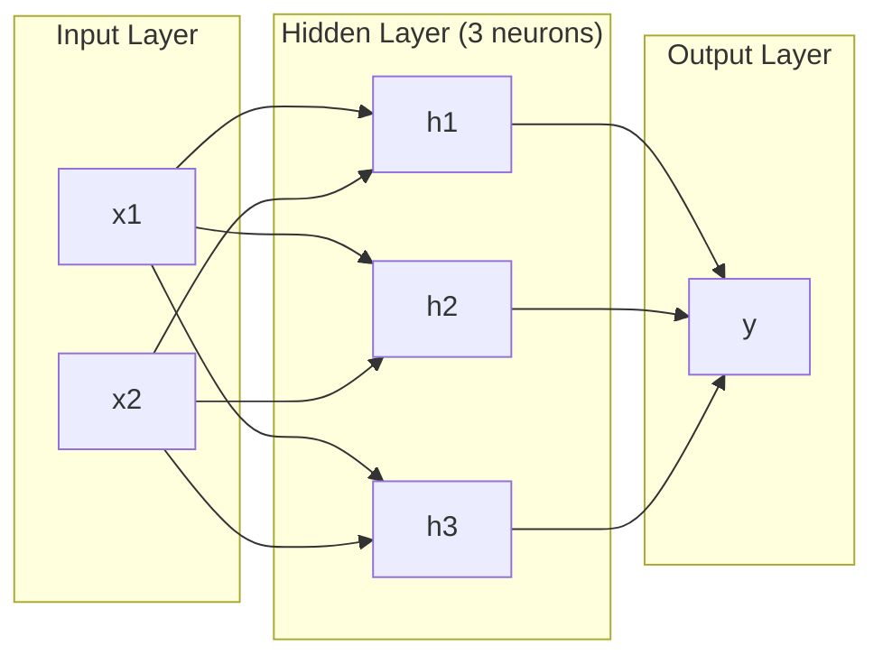
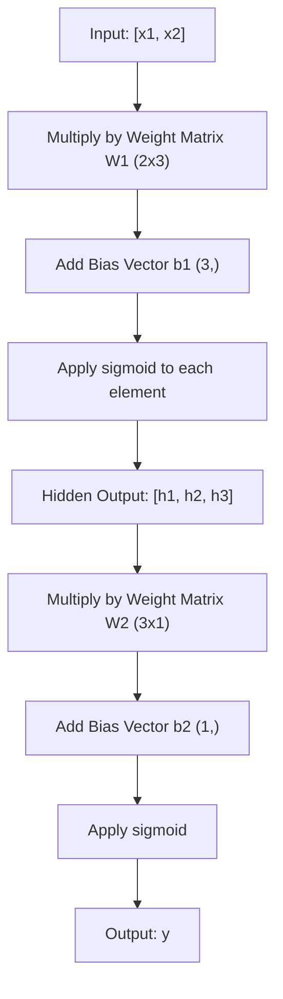
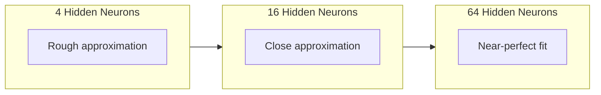

# 多层网络与前向传播

> 一个神经元会画一条直线。把它们层层叠加后，能画出更复杂的形状。

**Type:** Build
**Languages:** Python
**Prerequisites:** Phase 01（数学基础）、课程 03.01（感知机）
**Time:** ~90 分钟

## 学习目标

- 用 Layer 和 Network 类从零实现一个能完成完整前向传播的多层网络
- 跟踪网络每一层的矩阵维度，定位维度不匹配问题
- 解释非线性激活函数叠加如何让模型学习曲线型决策边界
- 使用 2-2-1 结构和手工设置的 sigmoid 权重完成 XOR

## 问题

单个神经元只是个“画线器”：它在输入空间中只能给出一条直线。现实中的 AI 问题——图像识别、语言理解、下围棋——都需要曲线形状。把神经元叠成多层，才能得到这些曲线。

1969 年，Minsky 和 Papert 证明了这个限制是致命的：单层网络无法学习 XOR。它不是“难学”，而是数学上不可能。XOR 的真值表把 [0,1]、[1,0] 一组，[0,0]、[1,1] 另一组，任意一条直线都无法同时分开它们。

这直接让神经网络研究资金中断了十年以上。后来才看得更清楚：单层不够，必须堆叠。第一层先把输入空间切出新特征，第二层再把这些特征组合，得到单条线永远做不到的决策。

这就是多层网络。它是今天生产环境所有深度学习模型的基础。前向传播——输入从输入层经过隐藏层到输出层的数据流转——是后续一切都能工作的起点。

## 核心概念

### 层：输入层、隐藏层、输出层

多层网络里有三类层：

**输入层**：严格说不算一层，它只持有原始输入。两个特征就有两个输入节点，这一层不做计算。

**隐藏层**：真正干活的地方。每个神经元接收上一层的全部输出，乘上权重并加上偏置，再经过激活函数。叫“隐藏层”是因为这些值不会直接出现在训练数据里。

**输出层**：最终答案。二分类任务一般用一个神经元加 sigmoid；多分类则每个类别一个神经元。



这就是一个 2-3-1 网络：两个输入、三隐藏神经元、一个输出。每一条连线都有权重，除了输入层外每个神经元都有偏置。

每一层都会产生一个向量，叫做隐藏状态。文本任务里，隐藏状态常常提高维度，例如把一个词编码为 768 维语义向量；图像任务里则常会降维，把几百万像素压缩成可处理的表征。隐藏状态是学习真正发生的地方。

### 神经元与激活函数

每个神经元做三步：

1. 每个输入乘以对应权重
2. 对乘积求和并加上偏置
3. 将和送入激活函数

本课先用 sigmoid：

```
sigmoid(z) = 1 / (1 + e^(-z))
```

Sigmoid 会把任意实数压到 (0, 1) 区间。大的正数更接近 1，负数更接近 0，零映射为 0.5。平滑的曲线让学习成立——和单层感知机里硬切换的 step 不同，sigmoid 在每个点都有梯度。

### 前向传播：数据如何流动

前向传播把输入按层推向输出，直到得到最终值。前向传播本身不更新参数，只做计算：乘法、加法、激活、重复。



每层按这个顺序执行三类运算：

```
z = W * input + b       (linear transformation)
a = sigmoid(z)           (activation)
```

一层的输出会作为下一层的输入，这就是前向传播。

### 矩阵维度

维度追踪是深度学习里最重要的调试技能之一。看 2-3-1 网络：

| 步骤 | 操作 | 维度 | 结果形状 |
|------|------|------|---------|
| 输入 | x | -- | (2,) |
| 隐藏层线性变换 | W1 * x + b1 | W1: (3, 2), b1: (3,) | (3,) |
| 隐藏层激活 | sigmoid(z1) | -- | (3,) |
| 输出层线性变换 | W2 * h + b2 | W2: (1, 3), b2: (1,) | (1,) |
| 输出层激活 | sigmoid(z2) | -- | (1,) |

原则是：第 k 层权重矩阵 W 的形状为 (当前层神经元数, 上一层神经元数)；行数对应当前层，列数对应前一层。如果形状对不上，通常就是 bug。

### 通用逼近定理

1989 年，George Cybenko 证明了一个很重要的结论：只要有足够多隐藏神经元，单隐层网络可以以任意精度逼近任意连续函数。

这并不代表单层网络一定是最优方案，而是说这种结构在理论上足够表达。实践里，深层网络（层多、每层神经元更少）往往能用更少参数完成同样功能，这也是深度学习有效的原因之一。

直观理解：隐藏层中的每个神经元学一个“局部波峰”或特征。只要波峰放得够多、位置够对，平滑曲线就能被拼出来。神经元越多，逼近越精细。



### 可组合性

神经网络是可组合的：可以堆叠、串联、并行使用。Whisper 模型用 encoder 先处理音频，再用单独的 decoder 生成文本；现代 LLM 多数是 decoder-only；BERT 是 encoder-only；T5 属于 encoder-decoder。架构选择决定了模型能力边界。

```figure
mlp-forward
```

## 动手实现

全程用 Python 原生实现，不用 numpy，每个矩阵操作手写。

### 步骤 1：Sigmoid 激活

```python
import math

def sigmoid(x):
    x = max(-500.0, min(500.0, x))
    return 1.0 / (1.0 + math.exp(-x))
```

把输入限制在 [-500, 500] 是为了防止指数溢出。`math.exp(500)` 仍可表示；`math.exp(1000)` 会变成无穷。

### 步骤 2：Layer 类

深度学习里最核心的操作是矩阵乘。每一层、每个注意力头、每次前向传播，本质都是矩阵乘。线性层会把输入向量乘以权重矩阵再加偏置，即 y = Wx + b，这一个公式占据了神经网络约 90% 的计算量。

Layer 保存一组权重矩阵和偏置向量。forward 接收输入向量并返回激活后的输出。

```python
class Layer:
    def __init__(self, n_inputs, n_neurons, weights=None, biases=None):
        if weights is not None:
            self.weights = weights
        else:
            import random
            self.weights = [
                [random.uniform(-1, 1) for _ in range(n_inputs)]
                for _ in range(n_neurons)
            ]
        if biases is not None:
            self.biases = biases
        else:
            self.biases = [0.0] * n_neurons

    def forward(self, inputs):
        self.last_input = inputs
        self.last_output = []
        for neuron_idx in range(len(self.weights)):
            z = sum(
                w * x for w, x in zip(self.weights[neuron_idx], inputs)
            )
            z += self.biases[neuron_idx]
            self.last_output.append(sigmoid(z))
        return self.last_output
```

权重矩阵形状是 (n_neurons, n_inputs)。每一行对应一个神经元在所有输入上的权重。forward 会逐个神经元计算加权和与偏置、经过 sigmoid 后收集结果。

### 步骤 3：Network 类

网络就是一组层的列表。前向传播把它们串起来：第 k 层的输出作为第 k+1 层输入。

```python
class Network:
    def __init__(self, layers):
        self.layers = layers

    def forward(self, inputs):
        current = inputs
        for layer in self.layers:
            current = layer.forward(current)
        return current
```

这就是完整的前向传播，只有四行核心逻辑：输入进来，逐层流转，最终输出。

### 步骤 4：用手工权重做 XOR

第一课里我们把 XOR 通过 OR、NAND、AND 的感知机组合解决了。现在用 Layer 和 Network 来实现同样思路。网络结构是 2-2-1：两个输入、两个隐藏神经元、一个输出。

```python
hidden = Layer(
    n_inputs=2,
    n_neurons=2,
    weights=[[20.0, 20.0], [-20.0, -20.0]],
    biases=[-10.0, 30.0],
)

output = Layer(
    n_inputs=2,
    n_neurons=1,
    weights=[[20.0, 20.0]],
    biases=[-30.0],
)

xor_net = Network([hidden, output])

xor_data = [
    ([0, 0], 0),
    ([0, 1], 1),
    ([1, 0], 1),
    ([1, 1], 0),
]

for inputs, expected in xor_data:
    result = xor_net.forward(inputs)
    predicted = 1 if result[0] >= 0.5 else 0
    print(f"  {inputs} -> {result[0]:.6f} (rounded: {predicted}, expected: {expected})")
```

较大的权重（20、-20）让 sigmoid 在边界附近更像 step 函数。第一个隐藏神经元近似 OR，第二个近似 NAND，输出神经元再做 AND，合起来就是 XOR。

### 步骤 5：圆形分类

更难一点：判断二维点是位于原点半径 0.5 圆内还是外。这个问题需要曲线型决策边界，单个感知机做不到。

```python
import random
import math

random.seed(42)

data = []
for _ in range(200):
    x = random.uniform(-1, 1)
    y = random.uniform(-1, 1)
    label = 1 if (x * x + y * y) < 0.25 else 0
    data.append(([x, y], label))

circle_net = Network([
    Layer(n_inputs=2, n_neurons=8),
    Layer(n_inputs=8, n_neurons=1),
])
```

随机权重下，这个网络通常表现很差，但前向传播依然能跑通。前向传播只是计算。真正学出好边界靠的是反向传播，这部分将在第 03 课讲。

```python
correct = 0
for inputs, expected in data:
    result = circle_net.forward(inputs)
    predicted = 1 if result[0] >= 0.5 else 0
    if predicted == expected:
        correct += 1

print(f"Accuracy with random weights: {correct}/{len(data)} ({100*correct/len(data):.1f}%)")
```

随机权重时准确率常常低于多数类基线。训练后（第 03 课）同样的 8 隐藏神经元结构可以学到一条曲线边界，区分圆内外。

## 立即上手

PyTorch 把上面的逻辑压成了四行：

```python
import torch
import torch.nn as nn

model = nn.Sequential(
    nn.Linear(2, 8),
    nn.Sigmoid(),
    nn.Linear(8, 1),
    nn.Sigmoid(),
)

x = torch.tensor([[0.0, 0.0], [0.0, 1.0], [1.0, 0.0], [1.0, 1.0]])
output = model(x)
print(output)
```

`nn.Linear(2, 8)` 对应你写的 Layer：权重矩阵形状 (8, 2)，偏置形状 (8,)。`nn.Sigmoid()` 就是逐元素 sigmoid。`nn.Sequential` 就是 Network：按顺序把层串起来。

差别在于性能和规模。PyTorch 可以跑 GPU、能处理百万级批次，并且自动求反向传播梯度；但它实现的前向逻辑和你手写的是一致的。

## 本课产出

本课会产出一个可复用的网络结构设计提示词：

- `outputs/prompt-network-architect.md`

当你要决定某个问题该用几层、每层多少神经元、选什么激活函数时，就用这个提示词。

## 练习

1. 构建一个 2-4-2-1 的网络（两个隐藏层），用随机权重对 XOR 做前向传播。打印每个隐藏层中间输出，观察表示如何逐层变化。

2. 把圆形分类里隐藏层规模从 8 改成 2，再改成 32，每次都用随机权重做前向传播。神经元数量变化会影响输出范围和分布吗？为什么？

3. 在 Network 类里实现 `count_parameters` 方法，返回可训练权重和偏置的总数量。用 784-256-128-10（MNIST 经典架构）测试，算出总参数量。

4. 构建 3-4-4-2 网络的前向传播。喂入归一化到 0-1 的 RGB 颜色值，观察两个输出。这是一个两分类的简易颜色分类结构。

5. 把 sigmoid 改成“泄漏步进”：当 z < 0 时返回 0.01 * z，否则返回 1.0。用步骤 4 的手工权重跑 XOR。还能得到结果吗？为什么平滑 sigmoid 比硬切分更值得？

## 关键术语

| 术语 | 常见说法 | 更准确的理解 |
|------|----------|-------------|
| Forward pass | “运行模型” | 将输入依次经过每层：权重乘法、加偏置、激活，最终生成输出 |
| Hidden layer | “中间那一层” | 输入与输出之间的层，其值在训练数据里不可直接观察 |
| Multi-layer network | “深度神经网络” | 神经元分层串接，每层输出作为下一层输入的结构 |
| Activation function | “非线性” | 线性变换之后的映射，使决策边界能够出现曲线特征 |
| Sigmoid | “S 形函数” | sigma(z) = 1/(1+e^(-z))，把任意实数压到 (0,1)，且处处可导、平滑 |
| Weight matrix | “参数矩阵” | 形状为 (当前层神经元数, 上一层神经元数) 的矩阵，表示可学习的连接强度 |
| Bias vector | “偏移量” | 在矩阵乘结果后加上的向量，让神经元在输入全零时也能激活 |
| Universal approximation | “神经网络啥都能学” | 单隐层网络在神经元足够多时可逼近任意连续函数，但“足够多”可能意味着非常大 |
| Linear transformation | “矩阵乘步骤” | z = W * x + b，激活前的运算，把输入映射到新的空间 |
| Decision boundary | “分类边界” | 输入空间中网络输出越过阈值的分割面 |

## 进一步阅读

- Michael Nielsen, "Neural Networks and Deep Learning", Chapter 1-2 (http://neuralnetworksanddeeplearning.com/) -- 关于前向传播和网络结构最清晰的免费入门说明，附交互式可视化
- Cybenko, "Approximation by Superpositions of a Sigmoidal Function" (1989) -- 原始的通用逼近定理论文，文笔出乎意外地易读
- 3Blue1Brown, "But what is a neural network?" (https://www.youtube.com/watch?v=aircAruvnKk) -- 20 分钟可视化讲解，帮助你建立正确的层、权重、前向传播心理模型
- Goodfellow, Bengio, Courville, "Deep Learning", Chapter 6 (https://www.deeplearningbook.org/) -- 多层网络的标准参考手册，在线可读
