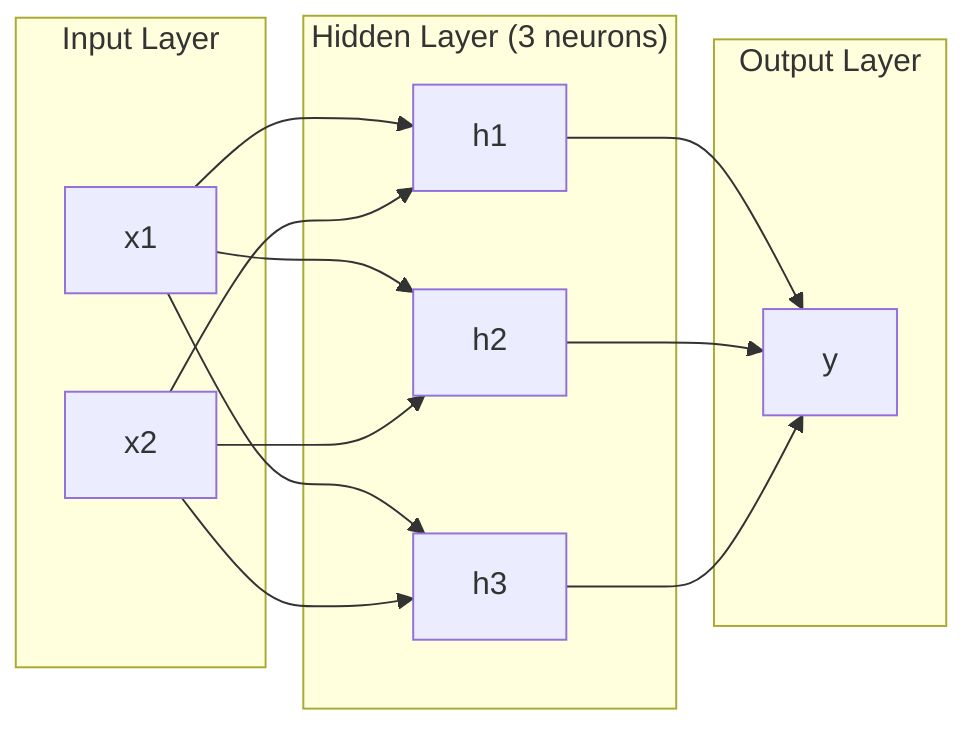
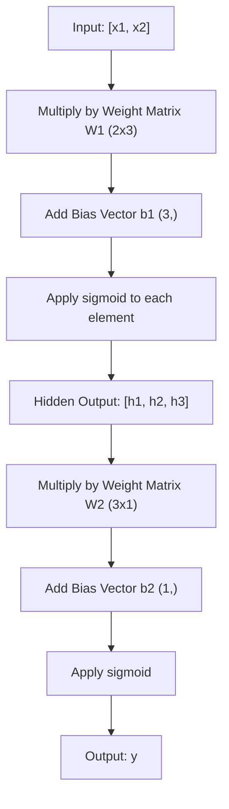
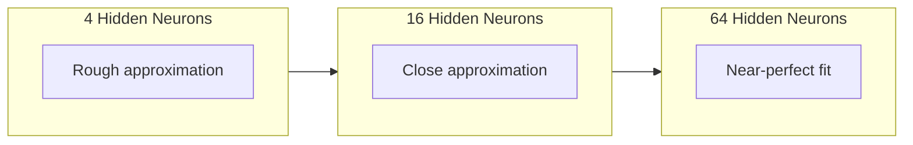

# 多层网络与前向传播

> 一个神经元只能画直线。把它们堆起来，你就能画出任何东西。

**类型:** 构建
**语言:** Python
**先修:** 第 1 阶段，第 03 课（感知机）
**时长:** ~90 分钟

## 学习目标
- 使用 `Layer` 和 `Network` 类从零搭建一个完整的多层前向传播网络
- 跟踪网络每一层的矩阵维度，并定位 shape 不匹配问题
- 解释多层非线性叠加为什么能让网络学习曲线决策边界
- 使用 2-2-1 结构和手工调好的 sigmoid 权重求解 XOR

## 问题

单个神经元只能画一条线。就这么简单。它只能在数据上画出一条直线。而 AI 里的真实问题，比如图像识别、语言理解、围棋，靠的都是曲线。把神经元堆成层，才能得到这些曲线。

1969 年，Minsky 和 Papert 证明了这一限制是致命的：单层网络学不会 XOR。不是“学得很慢”，而是数学上根本学不会。XOR 真值表把 `[0,1]` 和 `[1,0]` 放在一边，把 `[0,0]` 和 `[1,1]` 放在另一边，任何一条直线都不可能同时把它们分开。

这件事让神经网络研究沉寂了十多年。后来回头看，解决办法其实很直接：别只用一层。把神经元堆成层。让第一层把输入空间切成新的特征，再让第二层把这些特征组合成单层画不出来的决策。

这就是多层网络。它是今天所有深度学习模型的基础。前向传播，也就是数据从输入层经过隐藏层流到输出层的过程，是一切工作的第一步。

## 概念

### 层：输入层、隐藏层、输出层

多层网络有三种层：

**输入层** - 严格来说不算真正的层。它只保存原始数据。两个特征就对应两个输入节点，这里不做计算。

**隐藏层** - 计算发生的地方。每个神经元接收前一层的所有输出，对它们做加权和，加上偏置，再通过激活函数。之所以叫“隐藏”，是因为这些值不会直接出现在训练数据里。

**输出层** - 最终答案。二分类通常用一个带 sigmoid 的神经元；多分类则通常每个类别对应一个神经元。



这是一个 2-3-1 网络：两个输入，三个隐藏神经元，一个输出。每条连接都有权重，每个神经元（输入层除外）都有偏置。

每一层都会产生一个由数值组成的向量，叫做隐藏状态。对文本来说，隐藏状态会提升维度，比如把一个词编码成 768 个数字来表达语义；对图像来说，隐藏状态会压缩维度，把几百万像素压成更容易处理的表示。学习就发生在隐藏状态里。

### 神经元与激活函数

每个神经元做三件事：

1. 把每个输入乘以对应的权重
2. 把所有乘积求和，再加上偏置
3. 把结果送入激活函数

先用 sigmoid：

```
sigmoid(z) = 1 / (1 + e^(-z))
```

Sigmoid 会把任何数压到 `(0, 1)`。大的正数趋近 1，大的负数趋近 0，0 映射到 0.5。这条平滑曲线让学习成为可能 - 和感知机的硬阈值不同，sigmoid 在任何地方都有梯度。

### 前向传播：数据如何流动

前向传播会把输入逐层送入网络，直到到达输出。这个阶段不学习，只做计算：乘法、加法、激活、重复。



每一层都按这个顺序执行：

```
z = W * input + b       (linear transformation)
a = sigmoid(z)           (activation)
```

上一层的输出就是下一层的输入。这就是完整的前向传播。

### 矩阵维度

跟踪维度是深度学习里最重要的调试能力。以 2-3-1 网络为例：

| Step | Operation | Dimensions | Result Shape |
|------|-----------|------------|-------------|
| Input | x | -- | (2,) |
| Hidden linear | W1 * x + b1 | W1: (3, 2), b1: (3,) | (3,) |
| Hidden activation | sigmoid(z1) | -- | (3,) |
| Output linear | W2 * h + b2 | W2: (1, 3), b2: (1,) | (1,) |
| Output activation | sigmoid(z2) | -- | (1,) |

规则是：第 k 层权重矩阵 W 的形状是 `(当前层神经元数, 前一层神经元数)`。行对应当前层，列对应前一层。如果形状对不上，你就有 bug。

### 通用近似定理

1989 年，George Cybenko 证明了一件很重要的事：只要隐藏层有足够多的神经元，单隐藏层网络就能以任意精度逼近任意连续函数。

这并不意味着单隐藏层一定最好，而是说它在理论上足够强。实践里，更深的网络（层数更多、每层神经元更少）通常能用更少的总参数学到同样的函数，这就是深度学习有效的原因。

直观上，每个隐藏层神经元都在学一个“凸起”或一个局部特征。把足够多的凸起放在合适的位置，就能逼近任何平滑曲线。神经元越多，凸起越多，逼近越精细。



### 可组合性

神经网络是可组合的。你可以把它们堆叠、串联、并行使用。Whisper 模型用 encoder 网络处理音频，再用单独的 decoder 网络生成文本。现代 LLM 大多是 decoder-only。BERT 是 encoder-only。T5 是 encoder-decoder。架构的选择直接决定了模型能做什么。

```figure
mlp-forward
```

## 动手实现

纯 Python，不用 numpy。所有矩阵运算都从零写。

### 步骤 1：Sigmoid 激活

```python
import math

def sigmoid(x):
    x = max(-500.0, min(500.0, x))
    return 1.0 / (1.0 + math.exp(-x))
```

把输入截断到 `[-500, 500]` 是为了防止溢出。`math.exp(500)` 很大但还能表示，`math.exp(1000)` 就会变成无穷大。

### 步骤 2：Layer 类

深度学习里最重要的操作就是矩阵乘法。每一层、每个注意力头、每次前向传播，本质上都是矩阵乘法。线性层接收输入向量，乘以权重矩阵，再加上偏置：`y = Wx + b`。这一个式子就占了神经网络中绝大多数计算量。

一个 Layer 持有权重矩阵和偏置向量。它的 `forward` 方法接收输入向量并返回经过激活后的输出。

```python
class Layer:
    def __init__(self, n_inputs, n_neurons, weights=None, biases=None):
        if weights is not None:
            self.weights = weights
        else:
            import random
            self.weights = [
                [random.uniform(-1, 1) for _ in range(n_inputs)]
                for _ in range(n_neurons)
            ]
        if biases is not None:
            self.biases = biases
        else:
            self.biases = [0.0] * n_neurons

    def forward(self, inputs):
        self.last_input = inputs
        self.last_output = []
        for neuron_idx in range(len(self.weights)):
            z = sum(
                w * x for w, x in zip(self.weights[neuron_idx], inputs)
            )
            z += self.biases[neuron_idx]
            self.last_output.append(sigmoid(z))
        return self.last_output
```

权重矩阵的形状是 `(n_neurons, n_inputs)`。每一行是一个神经元对所有输入的权重。`forward` 方法会遍历所有神经元，计算加权和加偏置，再应用 sigmoid，最后收集结果。

### 步骤 3：Network 类

网络就是一组层的列表。前向传播把它们串起来：第 k 层的输出就是第 k+1 层的输入。

```python
class Network:
    def __init__(self, layers):
        self.layers = layers

    def forward(self, inputs):
        current = inputs
        for layer in self.layers:
            current = layer.forward(current)
        return current
```

这就是全部前向传播逻辑。只有四行核心逻辑。数据进来，流过每一层，最后从另一端出来。

### 步骤 4：手工调权重求 XOR

在第 01 课里，我们用 OR、NAND 和 AND 感知机组合出了 XOR。现在用 `Layer` 和 `Network` 类再做一遍。这里用 2-2-1 结构：两个输入，两个隐藏神经元，一个输出。

```python
hidden = Layer(
    n_inputs=2,
    n_neurons=2,
    weights=[[20.0, 20.0], [-20.0, -20.0]],
    biases=[-10.0, 30.0],
)

output = Layer(
    n_inputs=2,
    n_neurons=1,
    weights=[[20.0, 20.0]],
    biases=[-30.0],
)

xor_net = Network([hidden, output])

xor_data = [
    ([0, 0], 0),
    ([0, 1], 1),
    ([1, 0], 1),
    ([1, 1], 0),
]

for inputs, expected in xor_data:
    result = xor_net.forward(inputs)
    predicted = 1 if result[0] >= 0.5 else 0
    print(f"  {inputs} -> {result[0]:.6f} (rounded: {predicted}, expected: {expected})")
```

大的权重（20、-20）会让 sigmoid 近似成阶跃函数。第一个隐藏神经元近似 OR，第二个近似 NAND，输出神经元把它们组合成 AND，于是得到 XOR。

### 步骤 5：圆形分类

更难的问题：判断二维点是在以原点为中心、半径为 0.5 的圆内还是圆外。这需要曲线决策边界 - 单个感知机做不到。

```python
import random
import math

random.seed(42)

data = []
for _ in range(200):
    x = random.uniform(-1, 1)
    y = random.uniform(-1, 1)
    label = 1 if (x * x + y * y) < 0.25 else 0
    data.append(([x, y], label))

circle_net = Network([
    Layer(n_inputs=2, n_neurons=8),
    Layer(n_inputs=8, n_neurons=1),
])
```

随机权重下，网络分类效果不会好。但前向传播依然能正常运行。这正是重点 - 前向传播只是计算。权重学不学得好，要靠第 03 课的反向传播。

```python
correct = 0
for inputs, expected in data:
    result = circle_net.forward(inputs)
    predicted = 1 if result[0] >= 0.5 else 0
    if predicted == expected:
        correct += 1

print(f"随机权重下的准确率：{correct}/{len(data)}（{100*correct/len(data):.1f}%）")
```

随机权重通常只能得到很差的准确率，甚至可能比猜多数类还差。训练完成后（第 03 课），同样的 8 隐藏神经元结构就能学出一条曲线边界，把圆内和圆外分开。

## 实际使用

PyTorch 用几行就能做完上面的事：

```python
import torch
import torch.nn as nn

model = nn.Sequential(
    nn.Linear(2, 8),
    nn.Sigmoid(),
    nn.Linear(8, 1),
    nn.Sigmoid(),
)

x = torch.tensor([[0.0, 0.0], [0.0, 1.0], [1.0, 0.0], [1.0, 1.0]])
output = model(x)
print(output)
```

`nn.Linear(2, 8)` 就是你的 `Layer` 类：权重矩阵形状 `(8, 2)`，偏置向量形状 `(8,)`。`nn.Sigmoid()` 就是逐元素应用的 sigmoid。`nn.Sequential` 就是你的 `Network` 类：按顺序把层串起来。

区别只是速度和规模。PyTorch 跑在 GPU 上，能处理百万级样本的 batch，还能自动求导做反向传播。但你刚刚从零实现的前向传播逻辑，和它完全一样。

## 产出

本课会产出一个可复用的网络架构提示词：

- `outputs/prompt-network-architect.md`

当你需要决定网络有多少层、每层多少神经元、该用什么激活函数时，就用它。
## 练习

1. 搭一个 2-4-2-1 网络（两个隐藏层），用随机权重在 XOR 数据上跑前向传播。打印中间隐藏层输出，观察表示在每一层是如何变化的。

2. 把圆形分类器的隐藏层大小从 8 改成 2，再改成 32。每次都用随机权重跑前向传播。隐藏神经元数量会改变输出范围或分布吗？为什么？

3. 在 `Network` 类上实现一个 `count_parameters` 方法，返回所有可训练权重和偏置的总数。用它测试一个 784-256-128-10 的网络（经典 MNIST 架构）。它有多少参数？

4. 为一个 3-4-4-2 网络写前向传播。输入归一化到 0-1 的 RGB 颜色值，观察两个输出。这是一个两分类颜色分类器的结构。

5. 把 sigmoid 替换成一个“漏斗阶跃”函数：当 `z < 0` 时返回 `0.01 * z`，否则返回 `1.0`。用第 4 步同样的手工权重在 XOR 上跑前向传播。它还有效吗？为什么平滑的 sigmoid 比硬截断更好？

## 术语表

| 术语 | 大家常说 | 实际含义 |
|------|----------------|----------------------|
| 前向传播 | “跑一遍模型” | 把输入依次送过每一层，做权重乘法、加偏置、激活，得到输出 |
| 隐藏层 | “中间那部分” | 介于输入和输出之间、在数据里不能直接观察到的层 |
| 多层网络 | “深度神经网络” | 由多层神经元顺序堆叠而成，上一层的输出是下一层的输入 |
| 激活函数 | “非线性部分” | 在线性变换后应用的函数，用于将曲线引入决策边界 |
| Sigmoid | “S 形曲线” | `sigma(z) = 1/(1+e^(-z))`，把任意实数压到 `(0,1)`，平滑且处处可导 |
| 权重矩阵 | “参数” | 形状为 `(当前层神经元数, 前一层神经元数)` 的矩阵，存放可学习连接强度 |
| 偏置向量 | “偏移量” | 在线性变换后加上的向量，让神经元在输入全为 0 时也能激活 |
| 通用近似 | “神经网络什么都能学” | 只要隐藏层神经元足够多，单隐藏层网络就能逼近任意连续函数 - 但“足够多”可能是几十亿级 |
| 线性变换 | “矩阵乘法那一步” | `z = W * x + b`，激活之前把输入映射到新空间的计算 |
| 决策边界 | “分类器切换的地方” | 输入空间里网络输出跨过分类阈值的那条曲面 |

## 延伸阅读

- Michael Nielsen, "Neural Networks and Deep Learning", Chapter 1-2 (http://neuralnetworksanddeeplearning.com/) - 关于前向传播和网络结构最清晰的免费解释，还有交互式可视化
- Cybenko, "Approximation by Superpositions of a Sigmoidal Function" (1989) - 原始通用近似定理论文，出乎意料地好读
- 3Blue1Brown, "But what is a neural network?" (https://www.youtube.com/watch?v=aircAruvnKk) - 20 分钟的层、权重、前向传播视觉讲解，能帮你建立正确直觉
- Goodfellow, Bengio, Courville, "Deep Learning", Chapter 6 (https://www.deeplearningbook.org/) - 多层网络的标准参考，在线可读

