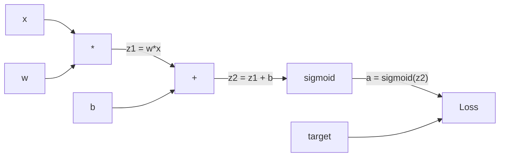
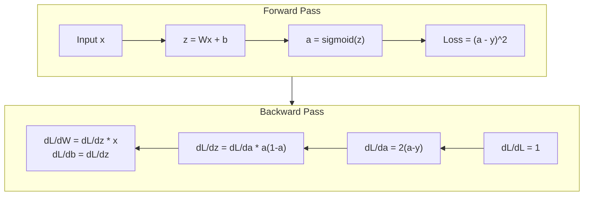
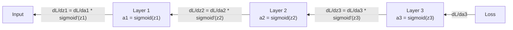

# 反向传播从零开始

> 反向传播是让学习成为可能的算法。没有它，神经网络就只是昂贵的随机数生成器。

**类型:** 构建
**语言:** Python
**先修:** 第 03.02 课（多层网络与前向传播）
**时长:** ~120 分钟

## 学习目标
- 实现一个基于 `Value` 的自动求导引擎，能够构建计算图并通过拓扑排序计算梯度
- 利用链式法则推导加法、乘法和 sigmoid 的反向传播过程
- 只用从零实现的反向传播引擎训练 XOR 和圆形分类
- 识别深层 sigmoid 网络中的梯度消失问题，并解释为什么梯度会指数级衰减

## 问题

你的网络有一个隐藏层，输入 768 个，输出 3072 个。那就是 2,359,296 个权重。它做错了一个预测。到底是哪一个权重导致的？如果挨个测试，每个权重都做一次微调再跑一次前向传播，就要 230 万次前向传播。反向传播只需要一次反向传播就能把 230 万个梯度全部算出来。这不是优化，而是“能不能训练”的分水岭。

最朴素的办法是：拿一个权重，稍微拨动一点，重新跑前向传播，看损失是升还是降。这样可以得到这个权重的梯度。然后对网络里的每个权重都做一次。再乘上成千上万步训练和海量数据，你会需要地质时间才能训练出任何有用东西。

反向传播解决了这个问题。一次前向传播，一次反向传播，所有梯度都能算出来。诀窍就是把微积分里的链式法则系统地应用到计算图上。这是深度学习之所以可行的核心算法。没有它，我们还会卡在玩具问题上。

## 概念

### 链式法则应用到网络上

你在第 01 阶段第 05 课里见过链式法则。快速回顾：如果 `y = f(g(x))`，那么 `dy/dx = f'(g(x)) * g'(x)`。就是沿着链条把导数乘起来。

在神经网络里，这条“链”就是从输入到损失的运算序列。每一层都会做权重乘法、加偏置、再过激活函数。损失函数拿最终输出和目标值做比较。反向传播就是沿着这条链往回追，计算每个操作对误差的贡献。

### 计算图

每次前向传播都会构建一张图。图上的每个节点都是一个操作（乘法、加法、sigmoid），每条边在前向时传值，在反向时传梯度。



前向传播：值从左到右流动。x 和 w 得到 z1 = w*x，再加 b 得到 z2，sigmoid 得到激活 a，最后用损失函数把 a 和目标 y 比较。

反向传播：梯度从右向左流动。从 dL/da 开始（损失随激活变化的程度），乘上 da/dz2（sigmoid 的导数），得到 dL/dz2。然后分解成 dL/db（等于 dL/dz2，因为 z2 = z1 + b）和 dL/dz1。接着 dL/dw = dL/dz1 * x，dL/dx = dL/dz1 * w。

图里的每个节点在反向传播里只做一件事：拿上游传来的梯度，乘以自己的局部导数，再传给下游。

### 前向传播 vs 反向传播



前向传播会保存每个中间值：z、a、每一层的输入。反向传播需要这些值来计算梯度。这就是反向传播的内存-计算权衡：你用更多内存存激活值，换取更高的计算速度，因为只要一趟前向和一趟反向，而不是给每个权重单独跑百万次。

### 梯度如何穿过网络

对于一个三层网络，梯度会沿着每层往回传：



在每一层，梯度都会乘上 sigmoid 的导数。sigmoid 的导数是 `a * (1 - a)`，最大值只有 0.25（当 `a = 0.5` 时）。三层之后，梯度最多会被乘成 `0.25^3 = 0.0156`。十层之后就是 `0.25^10 = 0.000001`。

### 梯度消失

这就是梯度消失问题。sigmoid 会把输出压到 0 和 1 之间，导数始终小于 0.25。堆得越深，梯度越接近 0。前面的层几乎学不到东西，因为收到的梯度接近零。

```
sigmoid(z):     Output range [0, 1]
sigmoid'(z):    Max value 0.25 (at z = 0)

After 5 layers:   gradient * 0.25^5 = 0.001x original
After 10 layers:  gradient * 0.25^10 = 0.000001x original
```

这也是为什么深层 sigmoid 网络几乎无法训练。后面的 ReLU 及其变体会解决这个问题，这会在第 04 课里讲。现在你只要明白：反向传播本身没问题，问题出在它所穿过的函数上。

### 两层网络的梯度推导

我们来具体推导一个网络：输入 x，隐藏层用 sigmoid，输出层也用 sigmoid，损失用 MSE。

前向传播：
```
z1 = W1 * x + b1
a1 = sigmoid(z1)
z2 = W2 * a1 + b2
a2 = sigmoid(z2)
L = (a2 - y)^2
```

反向传播（逐步应用链式法则）：
```
dL/da2 = 2(a2 - y)
da2/dz2 = a2 * (1 - a2)
dL/dz2 = dL/da2 * da2/dz2 = 2(a2 - y) * a2 * (1 - a2)

dL/dW2 = dL/dz2 * a1
dL/db2 = dL/dz2

dL/da1 = dL/dz2 * W2
da1/dz1 = a1 * (1 - a1)
dL/dz1 = dL/da1 * da1/dz1

dL/dW1 = dL/dz1 * x
dL/db1 = dL/dz1
```

每个梯度都只是沿损失往回追到的局部导数的乘积。反向传播就是这么回事。

```figure
backprop-vanishing
```

## 实现

### 步骤 1：Value 节点

计算图里的每个数字都会变成一个 `Value`。它保存数据、本地梯度，以及它是怎么生成的，这样它就知道如何往回算梯度。

```python
class Value:
    def __init__(self, data, children=(), op=''):
        self.data = data
        self.grad = 0.0
        self._backward = lambda: None
        self._children = set(children)
        self._op = op

    def __repr__(self):
        return f"Value(data={self.data:.4f}, grad={self.grad:.4f})"
```

一开始梯度是 0.0，反向函数也还是空操作。`_children` 记录产生当前 Value 的前置节点，方便后面做拓扑排序。

### 步骤 2：带反向函数的运算

每个运算都会创建一个新的 Value，并定义梯度如何向后流动。

```python
def __add__(self, other):
    other = other if isinstance(other, Value) else Value(other)
    out = Value(self.data + other.data, (self, other), '+')

    def _backward():
        self.grad += out.grad
        other.grad += out.grad

    out._backward = _backward
    return out

def __mul__(self, other):
    other = other if isinstance(other, Value) else Value(other)
    out = Value(self.data * other.data, (self, other), '*')

    def _backward():
        self.grad += other.data * out.grad
        other.grad += self.data * out.grad

    out._backward = _backward
    return out
```

对于加法：`d(a+b)/da = 1`，`d(a+b)/db = 1`，所以两个输入都直接拿到输出梯度。

对于乘法：`d(a*b)/da = b`，`d(a*b)/db = a`，所以每个输入都拿到对方的值乘以输出梯度。

`+=` 很关键。一个 Value 可能会出现在多个运算里，它的梯度要把所有路径上的贡献加起来。

### 步骤 3：Sigmoid 和损失

```python
import math

def sigmoid(self):
    x = self.data
    x = max(-500, min(500, x))
    s = 1.0 / (1.0 + math.exp(-x))
    out = Value(s, (self,), 'sigmoid')

    def _backward():
        self.grad += (s * (1 - s)) * out.grad

    out._backward = _backward
    return out
```

Sigmoid 的导数是 `sigmoid(x) * (1 - sigmoid(x))`。我们在前向传播时已经算出了 `s = sigmoid(x)`，直接复用就行，不需要重复计算。

```python
def mse_loss(predicted, target):
    diff = predicted + Value(-target)
    return diff * diff
```

单个输出的 MSE 就是 `(predicted - target)^2`。这里用带负号的 Value 来表示减法。

### 步骤 4：反向传播

拓扑排序可以保证节点以正确顺序处理 - 一个节点的梯度必须先完整累积，再往下传。

```python
def backward(self):
    topo = []
    visited = set()

    def build_topo(v):
        if v not in visited:
            visited.add(v)
            for child in v._children:
                build_topo(child)
            topo.append(v)

    build_topo(self)
    self.grad = 1.0
    for v in reversed(topo):
        v._backward()
```

从损失开始（梯度 = 1.0，因为 dL/dL = 1），沿着排序后的图往回走。每个节点的 `_backward` 会把梯度传给它的子节点。

### 步骤 5：Layer 和 Network

```python
import random

class Neuron:
    def __init__(self, n_inputs):
        scale = (2.0 / n_inputs) ** 0.5
        self.weights = [Value(random.uniform(-scale, scale)) for _ in range(n_inputs)]
        self.bias = Value(0.0)

    def __call__(self, x):
        act = sum((wi * xi for wi, xi in zip(self.weights, x)), self.bias)
        return act.sigmoid()

    def parameters(self):
        return self.weights + [self.bias]


class Layer:
    def __init__(self, n_inputs, n_outputs):
        self.neurons = [Neuron(n_inputs) for _ in range(n_outputs)]

    def __call__(self, x):
        out = [n(x) for n in self.neurons]
        return out[0] if len(out) == 1 else out

    def parameters(self):
        params = []
        for n in self.neurons:
            params.extend(n.parameters())
        return params


class Network:
    def __init__(self, sizes):
        self.layers = []
        for i in range(len(sizes) - 1):
            self.layers.append(Layer(sizes[i], sizes[i + 1]))

    def __call__(self, x):
        for layer in self.layers:
            x = layer(x)
            if not isinstance(x, list):
                x = [x]
        return x[0] if len(x) == 1 else x

    def parameters(self):
        params = []
        for layer in self.layers:
            params.extend(layer.parameters())
        return params

    def zero_grad(self):
        for p in self.parameters():
            p.grad = 0.0
```

每个神经元接收输入、计算加权和加偏置，再过 sigmoid。权重初始化按 `sqrt(2/n_inputs)` 缩放，目的是避免更深层网络里的 sigmoid 太早饱和。Layer 是 Neuron 的列表，Network 是 Layer 的列表。`parameters()` 会把所有可学习的 Value 收集起来，方便统一更新。

### 步骤 6：在 XOR 上训练

```python
random.seed(42)
net = Network([2, 4, 1])

xor_data = [
    ([0.0, 0.0], 0.0),
    ([0.0, 1.0], 1.0),
    ([1.0, 0.0], 1.0),
    ([1.0, 1.0], 0.0),
]

learning_rate = 1.0

for epoch in range(1000):
    total_loss = Value(0.0)
    for inputs, target in xor_data:
        x = [Value(i) for i in inputs]
        pred = net(x)
        loss = mse_loss(pred, target)
        total_loss = total_loss + loss

    net.zero_grad()
    total_loss.backward()

    for p in net.parameters():
        p.data -= learning_rate * p.grad

    if epoch % 100 == 0:
        print(f"Epoch {epoch:4d} | Loss: {total_loss.data:.6f}")

print("\nXOR Results:")
for inputs, target in xor_data:
    x = [Value(i) for i in inputs]
    pred = net(x)
    print(f"  {inputs} -> {pred.data:.4f} (expected {target})")
```

观察损失下降。模型从随机预测逐渐变成正确的 XOR 输出，完全靠反向传播算出梯度，再沿正确方向微调权重。

### 步骤 7：圆形分类

第 02 课里你手工调过圆形分类的权重。现在让网络自己学。

```python
random.seed(7)

def generate_circle_data(n=100):
    data = []
    for _ in range(n):
        x1 = random.uniform(-1.5, 1.5)
        x2 = random.uniform(-1.5, 1.5)
        label = 1.0 if x1 * x1 + x2 * x2 < 1.0 else 0.0
        data.append(([x1, x2], label))
    return data

circle_data = generate_circle_data(80)

circle_net = Network([2, 8, 1])
learning_rate = 0.5

for epoch in range(2000):
    random.shuffle(circle_data)
    total_loss_val = 0.0
    for inputs, target in circle_data:
        x = [Value(i) for i in inputs]
        pred = circle_net(x)
        loss = mse_loss(pred, target)
        circle_net.zero_grad()
        loss.backward()
        for p in circle_net.parameters():
            p.data -= learning_rate * p.grad
        total_loss_val += loss.data

    if epoch % 200 == 0:
        correct = 0
        for inputs, target in circle_data:
            x = [Value(i) for i in inputs]
            pred = circle_net(x)
            predicted_class = 1.0 if pred.data > 0.5 else 0.0
            if predicted_class == target:
                correct += 1
        accuracy = correct / len(circle_data) * 100
        print(f"Epoch {epoch:4d} | Loss: {total_loss_val:.4f} | Accuracy: {accuracy:.1f}%")
```

这里用在线 SGD - 每个样本算完就更新参数，而不是先攒完整个 batch。这会更快打破对称性，也能避免在完整损失面上 sigmoid 过早饱和。每个 epoch 打乱数据顺序，防止网络记住样本顺序。

不需要手工调权重。网络自己学出圆形决策边界。这就是反向传播的威力：你定义架构、损失函数和数据，算法负责找权重。

## 使用方式

PyTorch 用几行就能做完上面的事。核心思想完全一样 - autograd 在前向传播时构建计算图，再反向追踪它来算梯度。

```python
import torch
import torch.nn as nn

model = nn.Sequential(
    nn.Linear(2, 4),
    nn.Sigmoid(),
    nn.Linear(4, 1),
    nn.Sigmoid(),
)
optimizer = torch.optim.SGD(model.parameters(), lr=1.0)
criterion = nn.MSELoss()

X = torch.tensor([[0,0],[0,1],[1,0],[1,1]], dtype=torch.float32)
y = torch.tensor([[0],[1],[1],[0]], dtype=torch.float32)

for epoch in range(1000):
    pred = model(X)
    loss = criterion(pred, y)
    optimizer.zero_grad()
    loss.backward()
    optimizer.step()

print("PyTorch XOR Results:")
with torch.no_grad():
    for i in range(4):
        pred = model(X[i])
        print(f"  {X[i].tolist()} -> {pred.item():.4f} (expected {y[i].item()})")
```

`loss.backward()` 就是你的 `total_loss.backward()`。`optimizer.step()` 就是你手写的 `p.data -= lr * p.grad`。`optimizer.zero_grad()` 就是你的 `net.zero_grad()`。算法一样，只是 PyTorch 的实现可以工业级跑在 GPU 上，还支持混合精度、梯度检查点、数百种层类型。但反向传播的链式法则是同一套。

训练时会经历前向、反向、更新权重这三步；推理时只做前向，不算梯度，也不更新权重。这个区别很重要，因为生产环境里运行的就是推理。当你调用 Claude 或 GPT 这类 API 时，做的就是推理 - 你的提示词沿着网络向前流，最后输出 token，权重并不会改变。理解反向传播很重要，因为它塑造了那整个网络里的每一个权重。

## 产出

本课会产出：
- `outputs/prompt-gradient-debugger.md` - 一个可复用的提示词，用来诊断任意神经网络里的梯度问题（消失、爆炸、NaN）

## 练习

1. 给 `Value` 类补一个 `__sub__` 方法（`a - b = a + (-1 * b)`），再实现 `__neg__`。通过像 `(a - b)^2` 这样的简单表达式手工对比，验证梯度是否正确。

2. 给 `Value` 加一个 `relu` 方法（输出 `max(0, x)`，导数在 `x > 0` 时为 1，否则为 0）。把隐藏层的 sigmoid 换成 relu，再跑一遍 XOR 训练。比较收敛速度。你应该会看到更快的训练 - 这会为第 04 课做铺垫。

3. 给 `Value` 实现整数幂 `__pow__`。把 `mse_loss` 改成真正的 `(predicted - target) ** 2`。验证梯度和原实现一致。

4. 在训练循环里加梯度裁剪：`backward()` 之后，把所有梯度裁到 `[-1, 1]`。训练一个更深的 sigmoid 网络（4 层以上），比较加裁剪和不加裁剪时的损失曲线。这是你对抗梯度爆炸的第一道防线。

5. 做一个可视化：在 XOR 训练结束后，打印网络里每个参数的梯度。找出哪一层的梯度最小。这会直观展示你在概念部分读到的梯度消失问题。

## 关键术语

| 术语 | 大家常说 | 实际含义 |
|------|----------------|----------------------|
| 反向传播 | “网络在学习” | 通过计算图反向应用链式法则，为每个权重求出 `dL/dw` 的算法 |
| 计算图 | “网络结构” | 一个有向无环图，节点是运算，边在前向传值、反向传梯度 |
| 链式法则 | “把导数相乘” | 如果 `y = f(g(x))`，那么 `dy/dx = f'(g(x)) * g'(x)` - 反向传播的数学基础 |
| 梯度 | “最陡上升方向” | 损失对某个参数的偏导数，告诉你如何改这个参数才能降低损失 |
| 梯度消失 | “深层网络学不动” | 当激活函数像 sigmoid 一样饱和时，梯度在层间指数级缩小 |
| 前向传播 | “跑网络” | 依次执行每层的运算，把输入变成输出，并保存中间值 |
| 反向传播 | “算梯度” | 沿计算图反向遍历，利用链式法则在每个节点累积梯度 |
| 学习率 | “学得有多快” | 控制权重更新步长的标量：`w_new = w_old - lr * gradient` |
| 拓扑排序 | “正确顺序” | 图节点的一种排列方式，使每个节点都排在它所依赖的节点之后，确保传播前梯度已累积完成 |
| Autograd | “自动微分” | 在前向计算时构建计算图，并自动求出梯度的系统 - 这就是 PyTorch 的引擎 |

## 延伸阅读

- Rumelhart, Hinton & Williams, "Learning representations by back-propagating errors" (1986) - 让反向传播成为主流、解锁多层网络训练的论文
- 3Blue1Brown, "Neural Networks" 系列 (https://www.youtube.com/playlist?list=PLZHQObOWTQDNU6R1_67000Dx_ZCJB-3pi) - 对反向传播和梯度流最好的视觉解释
