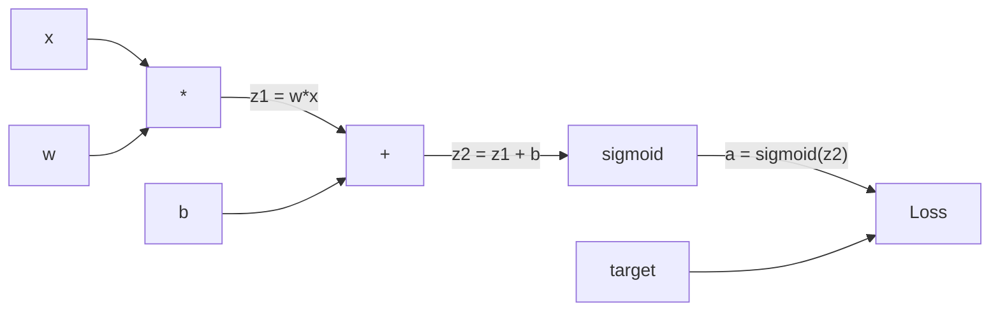
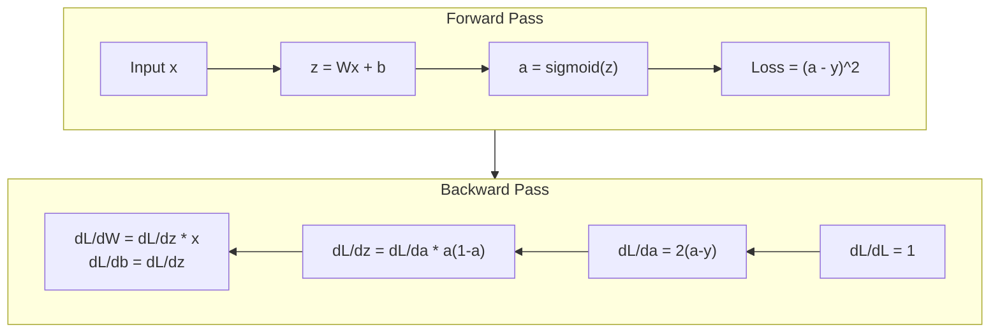
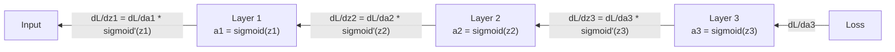

# 反向传播从零开始

> 反向传播是让学习发生的算法。没有它，神经网络就只是高成本的随机数发生器。

**类型:** 构建
**语言:** Python
**先修:** 第 03.02 课（多层网络）
**时长:** ~120 分钟

## 学习目标

- 实现一个基于 Value 的自动求导引擎：构建计算图，并通过拓扑排序计算梯度
- 推导加法、乘法和 sigmoid 的反向传播过程，使用链式法则
- 用你从零实现的反向传播引擎在 XOR 与圆形分类任务上训练多层网络
- 识别深层 sigmoid 网络中的梯度消失问题，并解释为何梯度会指数级衰减

## 主要问题

你的网络有单个隐藏层，输入是 768 维，输出是 3072 维；参数里有 2,359,296 个权重。它给出了错误预测。到底是哪些权重导致误差？如果对每个权重逐一测试，就要做 230 万次前向传播。反向传播只用一次反向过程就能计算出全部 230 万个梯度。这不是“优化”，而是“能否训练得起来”的分水岭。

朴素做法是：挑一个权重，微小扰动它，再跑一遍前向传播，观察损失上升还是下降。这样你得到该权重的梯度；然后对每个权重重复一次，再乘上成千上万步训练和成百万样本。要得到可用模型，几乎要消耗地质时代一样的时间。

反向传播解决了这个问题：一次前向，一次反向，梯度一次算完。核心是微积分里的链式法则，系统地应用在计算图上。这就是让深度学习真正可落地的算法。没有它，我们仍在玩玩具问题。

## 核心概念

### 应用于网络的链式法则

你在第 01 阶段第 05 课见过链式法则。快速回顾：若 y = f(g(x))，则 dy/dx = f'(g(x)) * g'(x)，在链路上逐项相乘导数。

在神经网络里，这条“链”就是从输入到损失的操作序列。每一层都做线性变换、加偏置、激活。损失函数将最终输出与目标值对比。反向传播沿着链条反向追踪，计算每个操作对误差的贡献。

### 计算图

每次前向传播都会构建一张图。每个节点是一个操作（乘法、加法、sigmoid）。每条边都向前传值，向后传梯度。



前向过程：值从左往右流动。x 与 w 形成 z1 = w*x。再加上 b 得到 z2。sigmoid 给出激活 a。再用损失函数把 a 与目标 y 对比。

反向过程：梯度从右往左流动。先从 dL/da（损失对激活的变化率）开始，乘以 da/dz2（sigmoid 导数）。得到 dL/dz2。再拆分成 dL/db（等于 dL/dz2，因为 z2 = z1 + b）和 dL/dz1。最后 dL/dw = dL/dz1 * x，dL/dx = dL/dz1 * w。

图里每个节点在反向阶段只有一件事：拿到上游传来的梯度，乘自身局部导数，再往下分发。

### 前向传播 vs 反向传播



前向传播会保存每个中间值：z、a，以及每一层的输入。反向传播需要这些中间结果来算梯度。这就是反向传播核心的“存算权衡”：你用更多显存（缓存激活）换时间（一次传播替代百万次）。

### 梯度如何在网络中流动

对于 3 层网络，梯度会沿着每一层层层传递：



每一层上，梯度都要乘以 sigmoid 导数。sigmoid 的导数是 a * (1 - a)，最大值是 0.25（a = 0.5 时）。三层时，梯度最大被放大因子为 0.25^3 = 0.0156。十层时是 0.25^10 = 0.000001。

### 梯度消失

这就是梯度消失。sigmoid 把输出压到 0 到 1 之间，导数恒小于 0.25。叠得越深，梯度越接近 0。靠前层几乎收不到有效梯度，学习停滞。

```
sigmoid(z):     输出范围 [0, 1]
sigmoid'(z):    最大值 0.25（在 z = 0 时）

经过 5 层后：   gradient * 0.25^5 = 原始值的 0.001 倍
经过 10 层后：  gradient * 0.25^10 = 原始值的 0.000001 倍
```

这就是深层 sigmoid 网络几乎学不动的原因。解决方案――ReLU 及其变体――会在第 04 课讲到。现在先记住：反向传播本身没错，问题在于它作用于什么结构。

### 两层网络的梯度推导

下面给一个具体例子：输入 x，中间层 sigmoid，输出层 sigmoid，损失用 MSE。

前向过程：
```
z1 = W1 * x + b1
a1 = sigmoid(z1)
z2 = W2 * a1 + b2
a2 = sigmoid(z2)
L = (a2 - y)^2
```

反向过程（按链式法则逐步展开）：
```
dL/da2 = 2(a2 - y)
da2/dz2 = a2 * (1 - a2)
dL/dz2 = dL/da2 * da2/dz2 = 2(a2 - y) * a2 * (1 - a2)

dL/dW2 = dL/dz2 * a1
dL/db2 = dL/dz2

dL/da1 = dL/dz2 * W2
da1/dz1 = a1 * (1 - a1)
dL/dz1 = dL/da1 * da1/dz1

dL/dW1 = dL/dz1 * x
dL/db1 = dL/dz1
```

每个梯度都来自于损失向上回传并乘以局部导数后的结果。这就是反向传播。

```figure
backprop-vanishing
```

## 动手实践

### 步骤 1：Value 节点

我们计算图里的每个数都变成一个 Value。它保存数值、当前梯度、以及它是如何被创建的，这样反向时才能知道如何传播梯度。

```python
class Value:
    def __init__(self, data, children=(), op=''):
        self.data = data
        self.grad = 0.0
        self._backward = lambda: None
        self._children = set(children)
        self._op = op

    def __repr__(self):
        return f"Value(data={self.data:.4f}, grad={self.grad:.4f})"
```

一开始没有梯度（0.0）。还没有反向函数（空操作）。`_children` 用来记录是哪几个 Value 参与生成了当前值，后面便于拓扑排序。

### 步骤 2：带反向函数的运算

每个操作会创建一个新 Value，并定义它如何把梯度向后传递。

```python
def __add__(self, other):
    other = other if isinstance(other, Value) else Value(other)
    out = Value(self.data + other.data, (self, other), '+')

    def _backward():
        self.grad += out.grad
        other.grad += out.grad

    out._backward = _backward
    return out

def __mul__(self, other):
    other = other if isinstance(other, Value) else Value(other)
    out = Value(self.data * other.data, (self, other), '*')

    def _backward():
        self.grad += other.data * out.grad
        other.grad += self.data * out.grad

    out._backward = _backward
    return out
```

加法里，d(a+b)/da = 1、d(a+b)/db = 1，所以两个输入都直接拿到输出梯度。

乘法里，d(a*b)/da = b、d(a*b)/db = a。每个输入都乘另一个输入值，再乘输出梯度。

`+=` 很关键。一个 Value 可能会参与多个操作，它的梯度要累加所有路径上的梯度。

### 步骤 3：Sigmoid 与损失

```python
import math

def sigmoid(self):
    x = self.data
    x = max(-500, min(500, x))
    s = 1.0 / (1.0 + math.exp(-x))
    out = Value(s, (self,), 'sigmoid')

    def _backward():
        self.grad += (s * (1 - s)) * out.grad

    out._backward = _backward
    return out
```

sigmoid 导数是 sigmoid(x) * (1 - sigmoid(x))。我们在前向时已经算过 s = sigmoid(x)，反向直接复用，无需重复计算。

```python
def mse_loss(predicted, target):
    diff = predicted + Value(-target)
    return diff * diff
```

单输出 MSE 就是 (predicted - target)^2，我们用“用负数加法”来表达减法。

### 步骤 4：反向过程

拓扑排序确保我们按正确顺序处理节点；一个节点在向下传播前，梯度已经完全累积完毕。

```python
def backward(self):
    topo = []
    visited = set()

    def build_topo(v):
        if v not in visited:
            visited.add(v)
            for child in v._children:
                build_topo(child)
            topo.append(v)

    build_topo(self)
    self.grad = 1.0
    for v in reversed(topo):
        v._backward()
```

从损失开始（dL/dL = 1）然后按逆拓扑序遍历。每个节点的 `_backward` 会把梯度推送给其子节点。

### 步骤 5：层与网络

```python
import random

class Neuron:
    def __init__(self, n_inputs):
        scale = (2.0 / n_inputs) ** 0.5
        self.weights = [Value(random.uniform(-scale, scale)) for _ in range(n_inputs)]
        self.bias = Value(0.0)

    def __call__(self, x):
        act = sum((wi * xi for wi, xi in zip(self.weights, x)), self.bias)
        return act.sigmoid()

    def parameters(self):
        return self.weights + [self.bias]


class Layer:
    def __init__(self, n_inputs, n_outputs):
        self.neurons = [Neuron(n_inputs) for _ in range(n_outputs)]

    def __call__(self, x):
        out = [n(x) for n in self.neurons]
        return out[0] if len(out) == 1 else out

    def parameters(self):
        params = []
        for n in self.neurons:
            params.extend(n.parameters())
        return params


class Network:
    def __init__(self, sizes):
        self.layers = []
        for i in range(len(sizes) - 1):
            self.layers.append(Layer(sizes[i], sizes[i + 1]))

    def __call__(self, x):
        for layer in self.layers:
            x = layer(x)
            if not isinstance(x, list):
                x = [x]
        return x[0] if len(x) == 1 else x

    def parameters(self):
        params = []
        for layer in self.layers:
            params.extend(layer.parameters())
        return params

    def zero_grad(self):
        for p in self.parameters():
            p.grad = 0.0
```

每个神经元接收输入，先算加权和再加偏置并过 sigmoid。权重初始化按 sqrt(2/n_inputs) 缩放，避免深层网络里 sigmoid 快速饱和。Layer 是一组 Neuron。Network 是一组 Layer。`parameters()` 汇总所有可学习的 Value，以便后续参数更新。

### 步骤 6：在 XOR 上训练

```python
random.seed(42)
net = Network([2, 4, 1])

xor_data = [
    ([0.0, 0.0], 0.0),
    ([0.0, 1.0], 1.0),
    ([1.0, 0.0], 1.0),
    ([1.0, 1.0], 0.0),
]

learning_rate = 1.0

for epoch in range(1000):
    total_loss = Value(0.0)
    for inputs, target in xor_data:
        x = [Value(i) for i in inputs]
        pred = net(x)
        loss = mse_loss(pred, target)
        total_loss = total_loss + loss

    net.zero_grad()
    total_loss.backward()

    for p in net.parameters():
        p.data -= learning_rate * p.grad

    if epoch % 100 == 0:
        print(f"第 {epoch:4d} 轮 | 损失: {total_loss.data:.6f}")

print("\\nXOR 结果：")
for inputs, target in xor_data:
    x = [Value(i) for i in inputs]
    pred = net(x)
    print(f"  {inputs} -> {pred.data:.4f}（期望 {target}）")
```

观察损失下降：随机输出逐步变成了正确的 XOR 输出。这一切完全由反向传播提供梯度，再按梯度方向微调权重实现。

### 步骤 7：圆形分类

在第 02 课你是手工调权重的。这一节让网络自己学习。

```python
random.seed(7)

def generate_circle_data(n=100):
    data = []
    for _ in range(n):
        x1 = random.uniform(-1.5, 1.5)
        x2 = random.uniform(-1.5, 1.5)
        label = 1.0 if x1 * x1 + x2 * x2 < 1.0 else 0.0
        data.append(([x1, x2], label))
    return data

circle_data = generate_circle_data(80)

circle_net = Network([2, 8, 1])
learning_rate = 0.5

for epoch in range(2000):
    random.shuffle(circle_data)
    total_loss_val = 0.0
    for inputs, target in circle_data:
        x = [Value(i) for i in inputs]
        pred = circle_net(x)
        loss = mse_loss(pred, target)
        circle_net.zero_grad()
        loss.backward()
        for p in circle_net.parameters():
            p.data -= learning_rate * p.grad
        total_loss_val += loss.data

    if epoch % 200 == 0:
        correct = 0
        for inputs, target in circle_data:
            x = [Value(i) for i in inputs]
            pred = circle_net(x)
            predicted_class = 1.0 if pred.data > 0.5 else 0.0
            if predicted_class == target:
                correct += 1
        accuracy = correct / len(circle_data) * 100
        print(f"Epoch {epoch:4d} | Loss: {total_loss_val:.4f} | Accuracy: {accuracy:.1f}%")
```

这里使用的是在线 SGD：每个样本算完就更新参数，而不是先累积整批再更新。这样收敛更快，也能避免在完整损失面上出现 sigmoid 饱和。每个 epoch 都打乱样本顺序，防止网络记住输入顺序。

没有手工调参，网络会自己发现圆的分界面。这就是反向传播的威力：定义好结构、损失和数据，算法会自己决定权重。

## 拓展实战

PyTorch 用几行代码就能完成同样事情。核心思想不变：自动求导会在前向时建立计算图，再反向追踪求梯度。

```python
import torch
import torch.nn as nn

model = nn.Sequential(
    nn.Linear(2, 4),
    nn.Sigmoid(),
    nn.Linear(4, 1),
    nn.Sigmoid(),
)
optimizer = torch.optim.SGD(model.parameters(), lr=1.0)
criterion = nn.MSELoss()

X = torch.tensor([[0,0],[0,1],[1,0],[1,1]], dtype=torch.float32)
y = torch.tensor([[0],[1],[1],[0]], dtype=torch.float32)

for epoch in range(1000):
    pred = model(X)
    loss = criterion(pred, y)
    optimizer.zero_grad()
    loss.backward()
    optimizer.step()

print("PyTorch XOR 结果：")
with torch.no_grad():
    for i in range(4):
        pred = model(X[i])
        print(f"  {X[i].tolist()} -> {pred.item():.4f}（期望 {y[i].item()}）")
```

`loss.backward()` 就是你自己的 `total_loss.backward()`。`optimizer.step()` 就是手写的 `p.data -= lr * p.grad`。`optimizer.zero_grad()` 就是 `net.zero_grad()`。算法同一套，封装更完善。PyTorch 还处理了 GPU 加速、混合精度、梯度检查点，甚至上百种层类型。但反向传播的链式回传链条本质一致。

训练分成三步：前向、反向、更新参数。推理只做前向，不求梯度也不更新权重。这点很重要，因为线上服务是“推理”。当你调 Claude、GPT 这些 API 时，本质是在做前向推理――提示词经过网络向前流动，最后输出 token，没有权重更新。反向传播之所以重要，是因为它塑造了训练完成的每一个权重。

## 上线交付

这一课会产出：
- `outputs/prompt-gradient-debugger.md`：一个可复用提示词，用于诊断神经网络中的梯度问题（vanishing、exploding、NaN）

## 练习

1. 在 Value 类里补 `__sub__`（a - b = a + (-1 * b)），再补 `__neg__`。用一个简单表达式如 (a - b)^2 和手工推导结果对比，验证梯度是否正确。

2. 为 Value 实现 `relu` 方法（max(0, x)，导数是 x > 0 时为 1，否则为 0）。把隐藏层从 sigmoid 换成 relu，再在 XOR 上训练一次。比较收敛速度，应更快，这也就是第 04 课的预告。

3. 为 Value 实现整数幂运算 `__pow__`。改写 `mse_loss` 成完整的 `(predicted - target) ** 2`。验证与原实现梯度一致。

4. 给训练循环加梯度裁剪：在 `backward()` 之后，把所有梯度裁剪到 [-1, 1]。训练更深的 sigmoid 网络（4 层及以上）并对比有无裁剪的损失曲线。这是你第一次真正应对梯度爆炸。

5. 做可视化：在 XOR 训练结束后，打印网络所有参数的梯度。找出梯度最小的层。这会展示你在“核心概念”里看到的梯度消失现象。

## 关键词

| 术语 | 人们说 | 实际含义 |
|------|--------|----------|
| 反向传播 | “网络在学习” | 一种算法，通过链式法则从计算图反向计算每个权重的 dL/dw |
| 计算图 | “网络结构” | 有向无环图，节点是操作，边分别承载前向数值和反向梯度 |
| 链式法则 | “乘导数” | 若 y = f(g(x))，则 dy/dx = f'(g(x)) * g'(x)，是反向传播的数学基础 |
| 梯度 | “最陡上升方向” | 损失对参数的偏导数，告诉我们如何调整该参数以降低损失 |
| 梯度消失 | “深层网络不学东西” | 梯度在多个 sigmoid 等饱和激活层里逐层衰减到近零 |
| 前向传播 | “跑网络” | 按层执行运算（乘法、加法、激活）从输入得到输出，并记录中间值 |
| 反向传播 | “算梯度” | 按反向顺序遍历计算图，用链式法则把梯度在每个节点累加并传播 |
| 学习率 | “学习快慢” | 控制权重更新步长的标量：w_new = w_old - lr * gradient |
| 拓扑排序 | “正确顺序” | 一种图中节点排序方式，确保每个节点在它依赖的所有节点之后被处理，避免梯度传播不完整 |
| 自动求导 | “自动微分” | 在前向时构建计算图、在反向时自动算梯度的系统――PyTorch 引擎的核心 |

## 延伸阅读

- Rumelhart, Hinton 与 Williams，"Learning representations by back-propagating errors"（1986）――反向传播主流化并开启多层网络可训练时代的论文
- 3Blue1Brown，"Neural Networks" 系列（https://www.youtube.com/playlist?list=PLZHQObOWTQDNU6R1_67000Dx_ZCJB-3pi）――讲得最清楚、最形象的一套反向传播与梯度流视频


