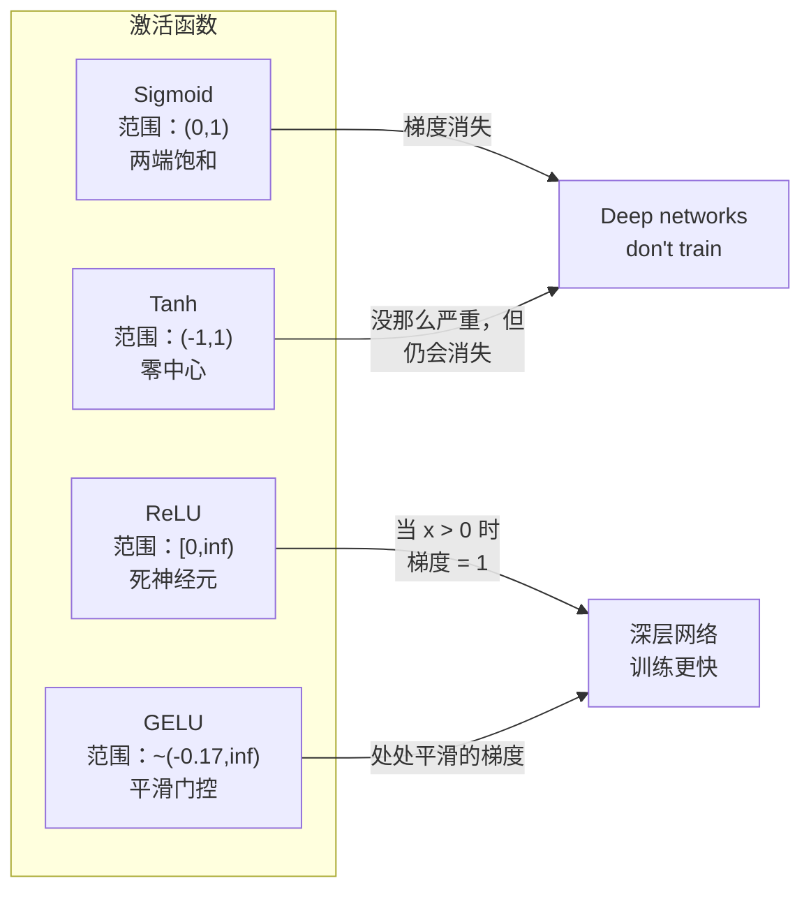
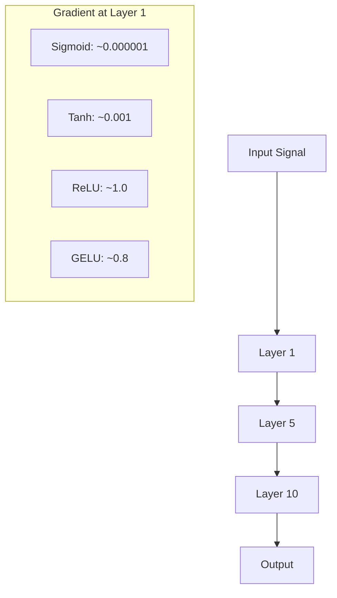
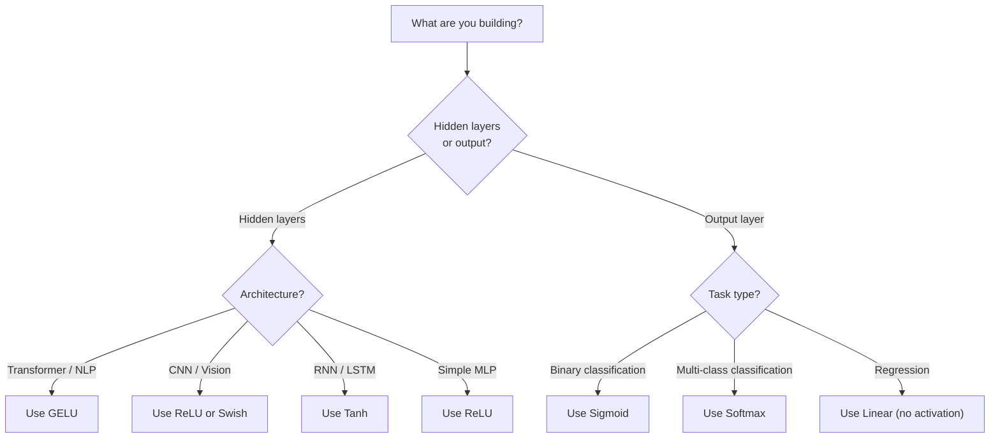

# 激活函数

> 没有非线性时，你的 100 层网络只是一条复杂的矩阵乘法。激活函数才是让神经网络能画出曲线的“门控”。

**类型:** 构建
**语言:** Python
**先修:** 第 03.03 课（反向传播）
**时长:** ~75 分钟

## 学习目标

- 从零实现 sigmoid、tanh、ReLU、Leaky ReLU、GELU、Swish、softmax 及其导数
- 通过 10 层以上不同激活函数的实验，量化验证梯度消失问题
- 在 ReLU 网络里检测“死亡神经元”，并解释 GELU 为什么能避免这一故障
- 为不同架构（Transformer、CNN、RNN、输出层）选择合适的激活函数

## 主要问题

把两次线性变换串起来：y = W2(W1x + b1) + b2。展开后是：y = W2W1x + W2b1 + b2。这本质上就是 y = Ax + c，一层线性变换。无论叠多少线性层，最终都能等价为一次矩阵乘法。你的 100 层网络和单层网络的表达能力一样。

这不只是理论趣闻。它意味着一个纯线性深度网络既学不会 XOR，也分不了螺旋数据，也识别不了人脸。缺少激活函数时，深度只是“名头”，不是真正能力。

激活函数打破线性，把每层输出经过非线性映射，让网络能弯曲决策边界、逼近任意函数并真正学习。选错激活会带来问题：sigmoid 在深层会让梯度消失到 0，未经细致初始化的非有界激活会把梯度放大到发散，ReLU 在大负偏置下还可能让神经元永久“死亡”。激活的选择直接决定网络能否正常学习。

## 核心概念

### 为什么需要非线性

矩阵乘法是可结合的。先乘 A 再乘 B，等价于直接乘 AB。也就是说叠 10 个线性层，在数学上等同于一个大矩阵的一次线性层。所有参数、所有深度都被吞进一层里。你需要一个打断链条的环节，这就是激活函数的作用。

看下这个推导。线性层是 f(x) = Wx + b。叠两个层：

```
Layer 1: h = W1 * x + b1
Layer 2: y = W2 * h + b2
```

代入：

```
y = W2 * (W1 * x + b1) + b2
y = (W2 * W1) * x + (W2 * b1 + b2)
y = A * x + c
```

还是一层。若在中间加一个非线性激活 g()：

```
h = g(W1 * x + b1)
y = W2 * h + b2
```

这时代入关系打断了，W2 * g(W1 * x + b1) + b2 不能再化成单一线性变换。网络能表达非线性函数，每多一层带激活，表达能力就上升。

### Sigmoid

神经网络最早的激活函数之一。

```
sigmoid(x) = 1 / (1 + e^(-x))
```

输出范围是 (0, 1)，平滑可导，能把任意实数映射成类概率值。

导数为：

```
sigmoid'(x) = sigmoid(x) * (1 - sigmoid(x))
```

该导数最大值是 0.25，在 x = 0 处达到。反向传播中梯度在层间连乘，10 层 sigmoid 意味着梯度最多乘上十次 0.25：

```
0.25^10 = 0.000000953674
```

小于百万分之一。梯度几乎被吞没，早期层几乎不更新。你可能看到后面的层在“学”，但前层几乎冻结，深层 sigmoid 网络往往学不动。

另一个问题：sigmoid 总是输出正值（0 到 1），意味着权重梯度符号倾向一致，优化时会有“走锯齿”现象。

### Tanh

sigmoid 的中心化版本。

```
tanh(x) = (e^x - e^(-x)) / (e^x + e^(-x))
```

输出范围 (-1, 1)。以 0 为中心，这能消除 sigmoid 的一些锯齿问题。

导数：

```
tanh'(x) = 1 - tanh(x)^2
```

在 x = 0 时导数最大为 1，比 sigmoid 好四倍。但梯度消失依然存在：当输入过大正负时导数趋近 0。十层仍会压缩梯度，只是没 sigmoid 那么激烈。

### ReLU：关键转折

Rectified Linear Unit。Nair 和 Hinton 在 2010 年推广（函数本身可追溯到 Fukushima 的 1969 工作），这件事改变了深度学习。

```
relu(x) = max(0, x)
```

输出范围：[0, infinity)。导数非常简单：

```
relu'(x) = 1  if x > 0
            0  if x <= 0
```

对正输入不存在梯度消失，梯度等于 1，直接透传。这就是深层网络真正可训练的原因之一――ReLU 可在层间保留梯度量级。

但也有失败模式：死亡神经元。若某神经元的加权输入始终为负（例如较大的负偏置或初始化不当），输出永远是 0，梯度也一直是 0，参数不再更新，神经元永久失效。实践中，ReLU 网络里常会有 10%~40% 神经元在训练中“死亡”。

### Leaky ReLU

解决死亡神经元的最简方案。

```
leaky_relu(x) = x        if x > 0
                alpha * x if x <= 0
```

其中 alpha 是一个小常数，常见 0.01。负半轴不再是平直 0，而是一个小斜率，因此死亡神经元仍有梯度信号，仍有恢复可能。

### GELU：现代默认激活

Gaussian Error Linear Unit，2016 年由 Hendrycks 和 Gimpel 提出。BERT、GPT 及多数现代 Transformer 默认使用它。

```
gelu(x) = x * Phi(x)
```

其中 Phi(x) 是标准正态分布的 CDF。工程上常用近似：

```
gelu(x) ~= 0.5 * x * (1 + tanh(sqrt(2/pi) * (x + 0.044715 * x^3)))
```

GELU 在全域光滑，不像 ReLU 直接硬截断到 0，因此能保留小负值。它还有概率解释：按高斯下取正的概率对每个输入加权。因为梯度更平滑、并且天然避免死亡神经元，GELU 在 Transformer 里通常优于 ReLU。

### Swish / SiLU

2017 年 Ramachandran 等人通过自动搜索提出的自门控激活。

```
swish(x) = x * sigmoid(x)
```

Swish 就是 x * sigmoid(x)。Google 在激活函数空间里做自动搜索得到它――一种“神经网络帮你设计神经网络组件”的思路。

和 GELU 一样，Swish 平滑、非单调，并允许小负值。区别较细：Swish 用 sigmoid 做门控，GELU 用高斯 CDF。实践上两者性能接近。Swish 常见于 EfficientNet 等视觉模型，语言模型里 GELU 更常见。

### Softmax：输出激活

不用于隐藏层。Softmax 把原始得分（logits）向量转成概率分布。

```
softmax(x_i) = e^(x_i) / sum(e^(x_j) for all j)
```

每个输出在 0 到 1 之间，总和为 1。这使它成为多分类最后一层的标准选择。最大 logit 会得到最高概率，但与 argmax 不同，softmax 可导，且保留相对置信度信息。

### 形状对比



### 梯度流对比



### 何时用什么激活



```figure
softmax-temperature
```

## 动手实践

### 步骤 1：实现所有激活函数及其导数

每个函数接收一个实数并返回实数。每个导数函数接收同样的输入并返回该点梯度。

```python
import math

def sigmoid(x):
    x = max(-500, min(500, x))
    return 1.0 / (1.0 + math.exp(-x))

def sigmoid_derivative(x):
    s = sigmoid(x)
    return s * (1 - s)

def tanh_act(x):
    return math.tanh(x)

def tanh_derivative(x):
    t = math.tanh(x)
    return 1 - t * t

def relu(x):
    return max(0.0, x)

def relu_derivative(x):
    return 1.0 if x > 0 else 0.0

def leaky_relu(x, alpha=0.01):
    return x if x > 0 else alpha * x

def leaky_relu_derivative(x, alpha=0.01):
    return 1.0 if x > 0 else alpha

def gelu(x):
    return 0.5 * x * (1 + math.tanh(math.sqrt(2 / math.pi) * (x + 0.044715 * x ** 3)))

def gelu_derivative(x):
    phi = 0.5 * (1 + math.erf(x / math.sqrt(2)))
    pdf = math.exp(-0.5 * x * x) / math.sqrt(2 * math.pi)
    return phi + x * pdf

def swish(x):
    return x * sigmoid(x)

def swish_derivative(x):
    s = sigmoid(x)
    return s + x * s * (1 - s)

def softmax(xs):
    max_x = max(xs)
    exps = [math.exp(x - max_x) for x in xs]
    total = sum(exps)
    return [e / total for e in exps]
```

### 步骤 2：可视化梯度消失位置

在区间 -5 到 5 均匀取 100 个点，统计每种激活函数梯度接近 0 的比例。

```python
def gradient_scan(name, derivative_fn, start=-5, end=5, n=100):
    step = (end - start) / n
    near_zero = 0
    healthy = 0
    for i in range(n):
        x = start + i * step
        g = derivative_fn(x)
        if abs(g) < 0.01:
            near_zero += 1
        else:
            healthy += 1
    pct_dead = near_zero / n * 100
    print(f"{name:15s}: {healthy:3d} healthy, {near_zero:3d} near-zero ({pct_dead:.0f}% dead zone)")

gradient_scan("Sigmoid", sigmoid_derivative)
gradient_scan("Tanh", tanh_derivative)
gradient_scan("ReLU", relu_derivative)
gradient_scan("Leaky ReLU", leaky_relu_derivative)
gradient_scan("GELU", gelu_derivative)
gradient_scan("Swish", swish_derivative)
```

### 步骤 3：梯度消失实验

对比 sigmoid 与 ReLU 在 N 层前向传播中的激活幅度变化。

```python
import random

def vanishing_gradient_experiment(activation_fn, name, n_layers=10, n_inputs=5):
    random.seed(42)
    values = [random.gauss(0, 1) for _ in range(n_inputs)]

    print(f"\n{name} through {n_layers} layers:")
    for layer in range(n_layers):
        weights = [random.gauss(0, 1) for _ in range(n_inputs)]
        z = sum(w * v for w, v in zip(weights, values))
        activated = activation_fn(z)
        magnitude = abs(activated)
        bar = "#" * int(magnitude * 20)
        print(f"  Layer {layer+1:2d}: magnitude = {magnitude:.6f} {bar}")
        values = [activated] * n_inputs

vanishing_gradient_experiment(sigmoid, "Sigmoid")
vanishing_gradient_experiment(relu, "ReLU")
vanishing_gradient_experiment(gelu, "GELU")
```

### 步骤 4：死亡神经元检测器

定义一个 ReLU 网络，用随机输入跑一次，统计哪些神经元始终不“发火”。

```python
def dead_neuron_detector(n_inputs=5, hidden_size=20, n_samples=1000):
    random.seed(0)
    weights = [[random.gauss(0, 1) for _ in range(n_inputs)] for _ in range(hidden_size)]
    biases = [random.gauss(0, 1) for _ in range(hidden_size)]

    fire_counts = [0] * hidden_size

    for _ in range(n_samples):
        inputs = [random.gauss(0, 1) for _ in range(n_inputs)]
        for neuron_idx in range(hidden_size):
            z = sum(w * x for w, x in zip(weights[neuron_idx], inputs)) + biases[neuron_idx]
            if relu(z) > 0:
                fire_counts[neuron_idx] += 1

    dead = sum(1 for c in fire_counts if c == 0)
    rarely_fire = sum(1 for c in fire_counts if 0 < c < n_samples * 0.05)
    healthy = hidden_size - dead - rarely_fire

    print(f"\nDead Neuron Report ({hidden_size} neurons, {n_samples} samples):")
    print(f"  Dead (never fired):     {dead}")
    print(f"  Barely alive (<5%):     {rarely_fire}")
    print(f"  Healthy:                {healthy}")
    print(f"  Dead neuron rate:       {dead/hidden_size*100:.1f}%")

    for i, c in enumerate(fire_counts):
        status = "DEAD" if c == 0 else "WEAK" if c < n_samples * 0.05 else "OK"
        bar = "#" * (c * 40 // n_samples)
        print(f"  Neuron {i:2d}: {c:4d}/{n_samples} fires [{status:4s}] {bar}")

dead_neuron_detector()
```

### 步骤 5：训练对比――Sigmoid vs ReLU vs GELU

在同一圆形数据集（圆内为类别 1，圆外为类别 0）上，用三种激活训练同构 2 层网络，比较收敛速度。

```python
def make_circle_data(n=200, seed=42):
    random.seed(seed)
    data = []
    for _ in range(n):
        x = random.uniform(-2, 2)
        y = random.uniform(-2, 2)
        label = 1.0 if x * x + y * y < 1.5 else 0.0
        data.append(([x, y], label))
    return data


class ActivationNetwork:
    def __init__(self, activation_fn, activation_deriv, hidden_size=8, lr=0.1):
        random.seed(0)
        self.act = activation_fn
        self.act_d = activation_deriv
        self.lr = lr
        self.hidden_size = hidden_size

        self.w1 = [[random.gauss(0, 0.5) for _ in range(2)] for _ in range(hidden_size)]
        self.b1 = [0.0] * hidden_size
        self.w2 = [random.gauss(0, 0.5) for _ in range(hidden_size)]
        self.b2 = 0.0

    def forward(self, x):
        self.x = x
        self.z1 = []
        self.h = []
        for i in range(self.hidden_size):
            z = self.w1[i][0] * x[0] + self.w1[i][1] * x[1] + self.b1[i]
            self.z1.append(z)
            self.h.append(self.act(z))

        self.z2 = sum(self.w2[i] * self.h[i] for i in range(self.hidden_size)) + self.b2
        self.out = sigmoid(self.z2)
        return self.out

    def backward(self, target):
        error = self.out - target
        d_out = error * self.out * (1 - self.out)

        for i in range(self.hidden_size):
            d_h = d_out * self.w2[i] * self.act_d(self.z1[i])
            self.w2[i] -= self.lr * d_out * self.h[i]
            for j in range(2):
                self.w1[i][j] -= self.lr * d_h * self.x[j]
            self.b1[i] -= self.lr * d_h
        self.b2 -= self.lr * d_out

    def train(self, data, epochs=200):
        losses = []
        for epoch in range(epochs):
            total_loss = 0
            correct = 0
            for x, y in data:
                pred = self.forward(x)
                self.backward(y)
                total_loss += (pred - y) ** 2
                if (pred >= 0.5) == (y >= 0.5):
                    correct += 1
            avg_loss = total_loss / len(data)
            accuracy = correct / len(data) * 100
            losses.append(avg_loss)
            if epoch % 50 == 0 or epoch == epochs - 1:
                print(f"    Epoch {epoch:3d}: loss={avg_loss:.4f}, accuracy={accuracy:.1f}%")
        return losses


data = make_circle_data()

configs = [
    ("Sigmoid", sigmoid, sigmoid_derivative),
    ("ReLU", relu, relu_derivative),
    ("GELU", gelu, gelu_derivative),
]

results = {}
for name, act_fn, act_d_fn in configs:
    print(f"\n=== 使用 {name} 训练 ===")
    net = ActivationNetwork(act_fn, act_d_fn, hidden_size=8, lr=0.1)
    losses = net.train(data, epochs=200)
    results[name] = losses

print("\n=== 最终损失对比 ===")
for name, losses in results.items():
    print(f"  {name:10s}: start={losses[0]:.4f} -> end={losses[-1]:.4f} (improvement: {(1 - losses[-1]/losses[0])*100:.1f}%)")
```

## 拓展实战

PyTorch 同时支持函数式和模块式实现：

```python
import torch
import torch.nn as nn
import torch.nn.functional as F

x = torch.randn(4, 10)

relu_out = F.relu(x)
gelu_out = F.gelu(x)
sigmoid_out = torch.sigmoid(x)
swish_out = F.silu(x)

logits = torch.randn(4, 5)
probs = F.softmax(logits, dim=1)

model = nn.Sequential(
    nn.Linear(10, 64),
    nn.GELU(),
    nn.Linear(64, 32),
    nn.GELU(),
    nn.Linear(32, 5),
)
```

Transformer 的隐藏层默认用 GELU，CNN 的隐藏层一般用 ReLU。分类任务输出层用 softmax；回归任务一般不加激活（linear）；输出概率可用 sigmoid。这个顺序通常是一个不错的起点，有证据再调整。

RNN/LSTM 隐层常用 tanh，门控常用 sigmoid；但如果你今天从零实现，通常还不常用 RNN。若 ReLU 网络出现死亡神经元，优先尝试 GELU。不要默认换 Leaky ReLU，除非有明确需求；GELU 在梯度流和死亡神经元上通常更稳。

## 上线交付

本课产出：
- `outputs/prompt-activation-selector.md`：一个可复用提示词，用于按架构快速选激活函数

## 练习

1. 实现 PReLU（Parametric ReLU），将负半轴斜率 alpha 变为可学习参数。用圆形数据集训练并与固定 Leaky ReLU 对比。

2. 将梯度消失实验改成 50 层。分别画出 sigmoid、tanh、ReLU、GELU 在每层的幅度。每个激活函数信号在哪一层开始实际接近 0？

3. 实现 ELU：elu(x) = x if x > 0, alpha * (e^x - 1) if x <= 0。比较同网络下 ELU 与 ReLU 的死亡神经元率。

4. 实现一个“梯度健康监控器”：训练时每个 epoch 计算每层平均梯度幅度。只要某层梯度低于 0.001 或高于 100，打印告警。

5. 将训练对比改为 Lesson 01 的 XOR 数据集，比较三种激活函数收敛速度，为什么与圆形数据集的结论不同？

## 关键术语

| 术语 | 常见说法 | 实际含义 |
|------|----------|----------|
| 激活函数 | “非线性部分” | 作用在每个神经元输出上的函数，打断线性映射，使网络可以学习非线性映射 |
| 梯度消失 | “深层梯度消失” | 当激活导数小于 1 且在层间连乘时，梯度会指数收缩，导致前层几乎无法更新 |
| 梯度爆炸 | “梯度爆掉” | 当有效乘子大于 1 时，梯度在层间指数增长，训练变得不稳定 |
| 死亡神经元 | “不再学习的神经元” | ReLU 某神经元长期输入为负，始终输出 0，梯度也一直是 0 |
| Sigmoid | “压到 0-1 的函数” | logistic 函数 1/(1+e^-x)，历史重要，但在深层网络中容易导致梯度消失 |
| ReLU | “把负值截成 0” | max(0, x)，因保留正向梯度而使深度网络真正可训练 |
| GELU | “Transformer 常用激活” | Gaussian Error Linear Unit，平滑激活，按“输入为正概率”对每个输入加权 |
| Swish/SiLU | “自门控 ReLU” | x * sigmoid(x)，通过自动搜索得到，见于 EfficientNet |
| Softmax | “把得分变概率” | 将 logits 向量归一化为概率分布，所有值在 (0,1) 且和为 1 |
| Leaky ReLU | “不容易死的 ReLU” | max(alpha*x, x)，其中 alpha 很小（如 0.01），通过小负梯度避免神经元死亡 |
| 饱和 | “sigmoid 的平顶区” | 激活导数接近 0 的区域，会阻断梯度传播 |
| Logit | “softmax 前的 raw 分数” | 最后一层未归一化的输出，即 softmax/sigmoid 之前的值 |

## 延伸阅读

- Nair & Hinton, "Rectified Linear Units Improve Restricted Boltzmann Machines"（2010）――ReLU 的关键论文，奠定了深层网络可训练的实践基础
- Hendrycks & Gimpel, "Gaussian Error Linear Units (GELUs)"（2016）――提出成为 Transformer 默认激活的 GELU
- Ramachandran 等，"Searching for Activation Functions"（2017）――通过自动搜索发现 Swish，证明激活可被系统化地自动设计
- Glorot & Bengio, "Understanding the difficulty of training deep feedforward neural networks"（2010）――诊断梯度消失/爆炸并提出 Xavier 初始化
- Goodfellow、Bengio、Courville, "Deep Learning" 第 6.3 章（https://www.deeplearningbook.org/）――系统讲解隐藏单元与激活函数

