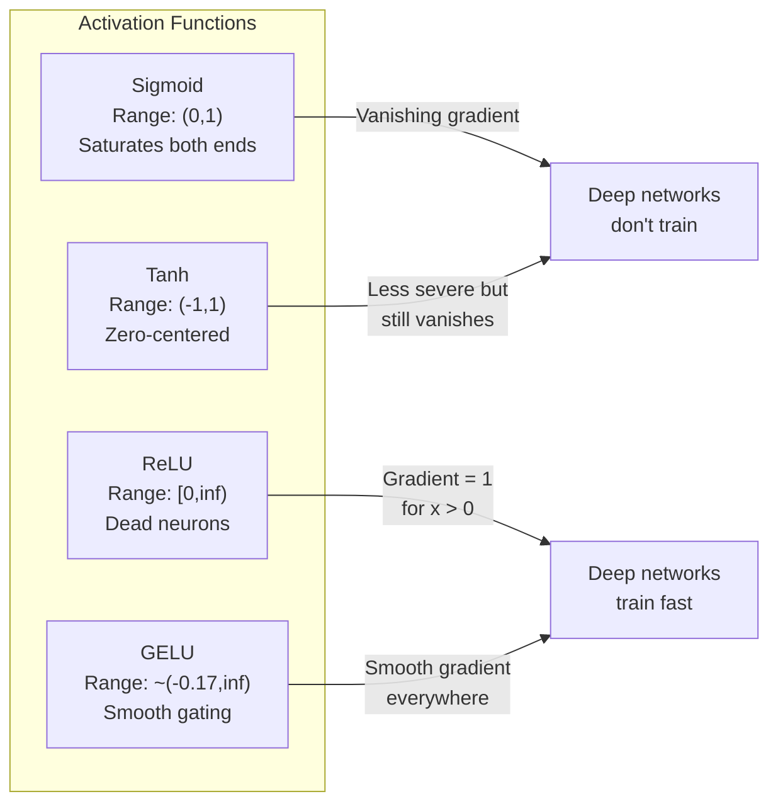
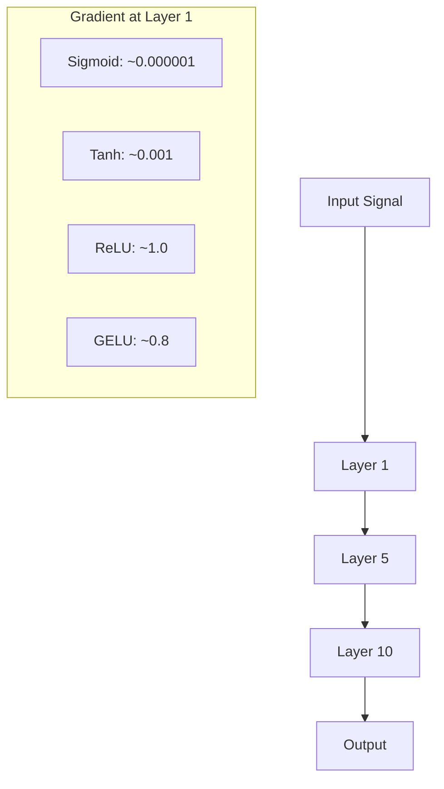
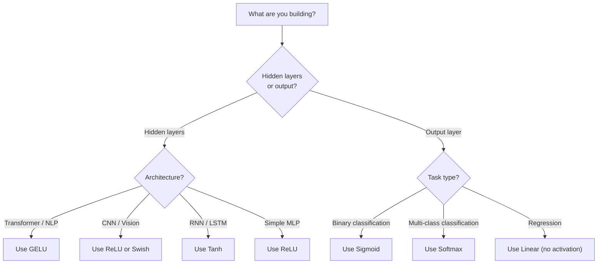

# 激活函数

> 没有非线性，你的 100 层网络只是一个花哨的矩阵乘法。激活函数就是让神经网络能够“拐弯思考”的那道门。

**类型:** 构建
**语言:** Python
**先修:** 第 03.03 课（反向传播）
**时长:** ~75 分钟

## 学习目标
- 从零实现 sigmoid、tanh、ReLU、Leaky ReLU、GELU、Swish 和 softmax 及其导数
- 通过 10 层以上的多层传播实验诊断梯度消失问题
- 识别 ReLU 网络中的死亡神经元，并解释为什么 GELU 能缓解这个问题
- 针对不同架构（Transformer、CNN、RNN、输出层）选择合适的激活函数

## 问题

把两个线性变换叠在一起：`y = W2(W1x + b1) + b2`。展开之后得到 `y = W2W1x + W2b1 + b2`，也就是 `y = Ax + c`，仍然只是一个线性变换。不管你堆多少层线性层，结果都会退化成一次矩阵乘法。你的 100 层网络，表达能力和一层线性层没有本质区别。

这不是纯理论问题。它意味着深度线性网络根本学不会 XOR，学不会螺旋数据集，也认不出人脸。没有激活函数，深度只是一种幻觉。

激活函数打破了线性性。它们通过非线性函数扭曲每层的输出，让网络能够弯曲决策边界、逼近任意函数，并真正学习复杂模式。但如果激活选错了，梯度就会在深层网络里消失到接近 0（sigmoid），或者在没有谨慎初始化时发散到无穷大，或者神经元会永久死亡（大负偏置下的 ReLU）。激活函数的选择，会直接决定你的网络能不能学。

## 概念

### 为什么必须引入非线性

矩阵乘法是可组合的。一个向量先乘 A 再乘 B，等价于直接乘 AB。这意味着把十层线性层堆起来，数学上仍然等价于一层线性层，只不过矩阵更大。所有这些参数、所有这些深度，最后都白费了。你需要某种东西把这条链打断，而激活函数就是做这个的。

证明很简单。线性层计算 `f(x) = Wx + b`。堆两层：

```
Layer 1: h = W1 * x + b1
Layer 2: y = W2 * h + b2
```

代入可得：

```
y = W2 * (W1 * x + b1) + b2
y = (W2 * W1) * x + (W2 * b1 + b2)
y = A * x + c
```

还是一层。若在层之间插入非线性激活 `g()`：

```
h = g(W1 * x + b1)
y = W2 * h + b2
```

代入就不再能化成单个线性变换了。网络因此能够表示非线性函数。每加一层激活函数，表达能力就会增加。

### Sigmoid

这是神经网络最早使用的激活函数之一。

```
sigmoid(x) = 1 / (1 + e^(-x))
```

输出范围是 `(0, 1)`。它平滑、可导，并且能把任意实数映射成类似概率的值。

导数为：

```
sigmoid'(x) = sigmoid(x) * (1 - sigmoid(x))
```

它的最大值是 0.25，出现在 `x = 0`。在反向传播中，梯度会逐层相乘。10 层 sigmoid 意味着梯度最多会被 0.25 连乘 10 次：

```
0.25^10 = 0.000000953674
```

这连原始信号的百万分之一都不到。这就是梯度消失问题。早期层的梯度变得极小，权重几乎不更新。网络看起来像在学习，后面几层的损失在下降，但前面几层其实被冻结了。深层 sigmoid 网络基本训练不动。

另一个问题是，sigmoid 的输出始终为正（0 到 1），这意味着权重梯度的符号往往同向。梯度下降时容易出现“之”字形抖动。

### Tanh

sigmoid 的居中版本。

```
tanh(x) = (e^x - e^(-x)) / (e^x + e^(-x))
```

输出范围是 `(-1, 1)`，以 0 为中心，因此可以消除 sigmoid 的一部分抖动问题。

导数为：

```
tanh'(x) = 1 - tanh(x)^2
```

在 `x = 0` 时，导数为 1.0，比 sigmoid 好四倍。但梯度消失问题依然存在。输入很大或很小时，导数仍然会趋近于 0。10 层 tanh 还是会把梯度压得很厉害，只是没有 sigmoid 那么糟。

### ReLU：真正的突破

Rectified Linear Unit。Nair 和 Hinton 在 2010 年把它推广到深度学习中（虽然这个函数可以追溯到 Fukushima 1969 年的工作），它改变了一切。

```
relu(x) = max(0, x)
```

输出范围是 `[0, infinity)`。导数极其简单：

```
relu'(x) = 1  if x > 0
            0  if x <= 0
```

对正输入来说没有梯度消失。梯度就是 1，直接传过去。这就是深层网络开始真正可训练的原因。ReLU 能够保持梯度在层间的量级。

但它也有失败模式：死亡神经元问题。如果某个神经元的加权输入总是负的（比如偏置过大且为负，或者初始化不合适），它的输出永远是 0，梯度也永远是 0，永远无法更新。它就永久“死”掉了。实践中，ReLU 网络里 10% 到 40% 的神经元可能会在训练中死亡。

### Leaky ReLU

这是解决死亡神经元最简单的办法。

```
leaky_relu(x) = x        if x > 0
                alpha * x if x <= 0
```

其中 alpha 是一个很小的常数，通常取 0.01。负半轴不再是完全平的 0，而是保留一个很小的斜率，这样死亡神经元仍然能收到梯度信号，有机会恢复。

### GELU：现代默认选择

Gaussian Error Linear Unit。Hendrycks 和 Gimpel 在 2016 年提出。BERT、GPT 以及大多数现代 Transformer 的默认激活函数都是它。

```
gelu(x) = x * Phi(x)
```

其中 `Phi(x)` 是标准正态分布的累积分布函数。工程中常用的近似公式是：

```
gelu(x) ~= 0.5 * x * (1 + tanh(sqrt(2/pi) * (x + 0.044715 * x^3)))
```

GELU 在全域上都是平滑的，允许小的负值（不像 ReLU 那样硬截断到 0），而且有一个概率解释：它根据输入在高斯分布下为正的概率来对输入加权。这种平滑门控在 Transformer 里通常比 ReLU 更好，因为它的梯度流更稳定，也完全避免了死亡神经元问题。

### Swish / SiLU

由 Ramachandran 等人在 2017 年通过自动搜索发现的自门控激活函数。

```
swish(x) = x * sigmoid(x)
```

Swish 的形式就是 `x * sigmoid(x)`。Google 通过对激活函数空间的自动搜索发现了它，相当于“一个神经网络在设计神经网络的部分结构”。

和 GELU 一样，它平滑、非单调，并允许小的负值。区别很细：Swish 用 sigmoid 作为门控，GELU 用高斯 CDF。实践中性能非常接近。Swish 常见于 EfficientNet 和一些视觉模型中；语言模型里则是 GELU 占主导。

### Softmax：输出层激活

Softmax 不用于隐藏层。它把原始分数（logits）转换成概率分布。

```
softmax(x_i) = e^(x_i) / sum(e^(x_j) for all j)
```

每个输出都在 0 和 1 之间，且所有输出之和为 1。这让它成为多分类任务的标准输出激活。最大 logit 会得到最高概率，但和 argmax 不同，softmax 是可导的，还保留了相对置信度信息。

### 形状对比



### 梯度流对比



### 什么时候用哪种激活



```figure
softmax-temperature
```

## 实现

### 步骤 1：实现所有激活函数及其导数

每个函数都接收一个浮点数并返回一个浮点数。每个导数函数接收相同输入并返回梯度。

```python
import math

def sigmoid(x):
    x = max(-500, min(500, x))
    return 1.0 / (1.0 + math.exp(-x))

def sigmoid_derivative(x):
    s = sigmoid(x)
    return s * (1 - s)

def tanh_act(x):
    return math.tanh(x)

def tanh_derivative(x):
    t = math.tanh(x)
    return 1 - t * t

def relu(x):
    return max(0.0, x)

def relu_derivative(x):
    return 1.0 if x > 0 else 0.0

def leaky_relu(x, alpha=0.01):
    return x if x > 0 else alpha * x

def leaky_relu_derivative(x, alpha=0.01):
    return 1.0 if x > 0 else alpha

def gelu(x):
    return 0.5 * x * (1 + math.tanh(math.sqrt(2 / math.pi) * (x + 0.044715 * x ** 3)))

def gelu_derivative(x):
    phi = 0.5 * (1 + math.erf(x / math.sqrt(2)))
    pdf = math.exp(-0.5 * x * x) / math.sqrt(2 * math.pi)
    return phi + x * pdf

def swish(x):
    return x * sigmoid(x)

def swish_derivative(x):
    s = sigmoid(x)
    return s + x * s * (1 - s)

def softmax(xs):
    max_x = max(xs)
    exps = [math.exp(x - max_x) for x in xs]
    total = sum(exps)
    return [e / total for e in exps]
```

### 步骤 2：可视化梯度消失的位置

在 -5 到 5 之间取 100 个点，统计每种激活函数的梯度有多少点接近 0。

```python
def gradient_scan(name, derivative_fn, start=-5, end=5, n=100):
    step = (end - start) / n
    near_zero = 0
    healthy = 0
    for i in range(n):
        x = start + i * step
        g = derivative_fn(x)
        if abs(g) < 0.01:
            near_zero += 1
        else:
            healthy += 1
    pct_dead = near_zero / n * 100
    print(f"{name:15s}: {healthy:3d} healthy, {near_zero:3d} near-zero ({pct_dead:.0f}% dead zone)")

gradient_scan("Sigmoid", sigmoid_derivative)
gradient_scan("Tanh", tanh_derivative)
gradient_scan("ReLU", relu_derivative)
gradient_scan("Leaky ReLU", leaky_relu_derivative)
gradient_scan("GELU", gelu_derivative)
gradient_scan("Swish", swish_derivative)
```

### 步骤 3：梯度消失实验

把信号通过 N 层前向传播，比较 sigmoid 和 ReLU 下激活值的变化。

```python
import random

def vanishing_gradient_experiment(activation_fn, name, n_layers=10, n_inputs=5):
    random.seed(42)
    values = [random.gauss(0, 1) for _ in range(n_inputs)]

    print(f"\n{name} through {n_layers} layers:")
    for layer in range(n_layers):
        weights = [random.gauss(0, 1) for _ in range(n_inputs)]
        z = sum(w * v for w, v in zip(weights, values))
        activated = activation_fn(z)
        magnitude = abs(activated)
        bar = "#" * int(magnitude * 20)
        print(f"  Layer {layer+1:2d}: magnitude = {magnitude:.6f} {bar}")
        values = [activated] * n_inputs

vanishing_gradient_experiment(sigmoid, "Sigmoid")
vanishing_gradient_experiment(relu, "ReLU")
vanishing_gradient_experiment(gelu, "GELU")
```

### 步骤 4：死亡神经元检测器

构造一个 ReLU 网络，向其中输入随机数据，统计哪些神经元从不激活。

```python
def dead_neuron_detector(n_inputs=5, hidden_size=20, n_samples=1000):
    random.seed(0)
    weights = [[random.gauss(0, 1) for _ in range(n_inputs)] for _ in range(hidden_size)]
    biases = [random.gauss(0, 1) for _ in range(hidden_size)]

    fire_counts = [0] * hidden_size

    for _ in range(n_samples):
        inputs = [random.gauss(0, 1) for _ in range(n_inputs)]
        for neuron_idx in range(hidden_size):
            z = sum(w * x for w, x in zip(weights[neuron_idx], inputs)) + biases[neuron_idx]
            if relu(z) > 0:
                fire_counts[neuron_idx] += 1

    dead = sum(1 for c in fire_counts if c == 0)
    rarely_fire = sum(1 for c in fire_counts if 0 < c < n_samples * 0.05)
    healthy = hidden_size - dead - rarely_fire

    print(f"\nDead Neuron Report ({hidden_size} neurons, {n_samples} samples):")
    print(f"  Dead (never fired):     {dead}")
    print(f"  Barely alive (<5%):     {rarely_fire}")
    print(f"  Healthy:                {healthy}")
    print(f"  Dead neuron rate:       {dead/hidden_size*100:.1f}%")

    for i, c in enumerate(fire_counts):
        status = "DEAD" if c == 0 else "WEAK" if c < n_samples * 0.05 else "OK"
        bar = "#" * (c * 40 // n_samples)
        print(f"  Neuron {i:2d}: {c:4d}/{n_samples} fires [{status:4s}] {bar}")

dead_neuron_detector()
```

### 步骤 5：训练对比 - Sigmoid vs ReLU vs GELU

在同一个圆形数据集上训练一个两层网络（圆内为类别 1，圆外为类别 0），比较三种激活函数的收敛速度。

```python
def make_circle_data(n=200, seed=42):
    random.seed(seed)
    data = []
    for _ in range(n):
        x = random.uniform(-2, 2)
        y = random.uniform(-2, 2)
        label = 1.0 if x * x + y * y < 1.5 else 0.0
        data.append(([x, y], label))
    return data


class ActivationNetwork:
    def __init__(self, activation_fn, activation_deriv, hidden_size=8, lr=0.1):
        random.seed(0)
        self.act = activation_fn
        self.act_d = activation_deriv
        self.lr = lr
        self.hidden_size = hidden_size

        self.w1 = [[random.gauss(0, 0.5) for _ in range(2)] for _ in range(hidden_size)]
        self.b1 = [0.0] * hidden_size
        self.w2 = [random.gauss(0, 0.5) for _ in range(hidden_size)]
        self.b2 = 0.0

    def forward(self, x):
        self.x = x
        self.z1 = []
        self.h = []
        for i in range(self.hidden_size):
            z = self.w1[i][0] * x[0] + self.w1[i][1] * x[1] + self.b1[i]
            self.z1.append(z)
            self.h.append(self.act(z))

        self.z2 = sum(self.w2[i] * self.h[i] for i in range(self.hidden_size)) + self.b2
        self.out = sigmoid(self.z2)
        return self.out

    def backward(self, target):
        error = self.out - target
        d_out = error * self.out * (1 - self.out)

        for i in range(self.hidden_size):
            d_h = d_out * self.w2[i] * self.act_d(self.z1[i])
            self.w2[i] -= self.lr * d_out * self.h[i]
            for j in range(2):
                self.w1[i][j] -= self.lr * d_h * self.x[j]
            self.b1[i] -= self.lr * d_h
        self.b2 -= self.lr * d_out

    def train(self, data, epochs=200):
        losses = []
        for epoch in range(epochs):
            total_loss = 0
            correct = 0
            for x, y in data:
                pred = self.forward(x)
                self.backward(y)
                total_loss += (pred - y) ** 2
                if (pred >= 0.5) == (y >= 0.5):
                    correct += 1
            avg_loss = total_loss / len(data)
            accuracy = correct / len(data) * 100
            losses.append(avg_loss)
            if epoch % 50 == 0 or epoch == epochs - 1:
                print(f"    Epoch {epoch:3d}: loss={avg_loss:.4f}, accuracy={accuracy:.1f}%")
        return losses


data = make_circle_data()

configs = [
    ("Sigmoid", sigmoid, sigmoid_derivative),
    ("ReLU", relu, relu_derivative),
    ("GELU", gelu, gelu_derivative),
]

results = {}
for name, act_fn, act_d_fn in configs:
    print(f"\n=== Training with {name} ===")
    net = ActivationNetwork(act_fn, act_d_fn, hidden_size=8, lr=0.1)
    losses = net.train(data, epochs=200)
    results[name] = losses

print("\n=== Final Loss Comparison ===")
for name, losses in results.items():
    print(f"  {name:10s}: start={losses[0]:.4f} -> end={losses[-1]:.4f} (improvement: {(1 - losses[-1]/losses[0])*100:.1f}%)")
```

## 使用方式

PyTorch 同时提供函数式接口和模块式接口：

```python
import torch
import torch.nn as nn
import torch.nn.functional as F

x = torch.randn(4, 10)

relu_out = F.relu(x)
gelu_out = F.gelu(x)
sigmoid_out = torch.sigmoid(x)
swish_out = F.silu(x)

logits = torch.randn(4, 5)
probs = F.softmax(logits, dim=1)

model = nn.Sequential(
    nn.Linear(10, 64),
    nn.GELU(),
    nn.Linear(64, 32),
    nn.GELU(),
    nn.Linear(32, 5),
)
```

Transformer 的隐藏层默认常用 GELU，CNN 的隐藏层常用 ReLU，分类输出层常用 softmax，回归输出层通常不加激活（线性），概率输出层常用 sigmoid。先从这些默认值开始，只有在有证据时才改。

RNN 和 LSTM 的隐藏状态通常使用 tanh，门控通常使用 sigmoid。但如果你今天是在从零搭建模型，大概率不会优先选 RNN。如果 ReLU 网络里的神经元开始死亡，就换成 GELU。除非你有明确理由，否则不要轻易回退到 Leaky ReLU - GELU 既能解决死亡神经元问题，又有更好的梯度流。

## 产出

本课会产出：
- `outputs/prompt-activation-selector.md` - 一个可复用的提示词，帮助你为任何架构选择合适的激活函数

## 练习

1. 实现 PReLU（Parametric ReLU），把负半轴斜率 alpha 设为可学习参数。在圆形数据集上训练，并与固定斜率的 Leaky ReLU 对比。

2. 把梯度消失实验改成 50 层而不是 10 层。分别画出 sigmoid、tanh、ReLU 和 GELU 在每一层的激活幅值。每种激活函数的信号在哪一层会基本衰减到 0？

3. 实现 ELU（Exponential Linear Unit）：`elu(x) = x if x > 0, alpha * (e^x - 1) if x <= 0`。比较它和 ReLU 在同一网络上的死亡神经元比例。

4. 做一个“梯度健康监视器”，在训练期间每个 epoch 计算各层平均梯度幅值。当某一层的梯度低于 0.001 或高于 100 时，打印警告。

5. 把训练对比改成 Lesson 01 里的 XOR 数据集。哪种激活函数在 XOR 上收敛最快？为什么这和圆形数据集上的结果不同？

## 关键术语

| 术语 | 大家常说 | 实际含义 |
|------|----------------|----------------------|
| 激活函数 | “非线性部分” | 作用于每个神经元输出、打破线性性的函数，让网络能学习非线性映射 |
| 梯度消失 | “梯度在深层网络里没了” | 当激活函数导数小于 1 时，梯度会在层间指数级缩小，导致早期层无法训练 |
| 梯度爆炸 | “梯度炸掉了” | 当有效乘子大于 1 时，梯度会在层间指数级放大，训练变得不稳定 |
| 死亡神经元 | “停止学习的神经元” | 输入长期为负的 ReLU 神经元，输出和梯度都为 0 |
| Sigmoid | “把值压到 0-1” | logistic 函数 `1/(1+e^-x)`，历史上很重要，但在深层网络里容易造成梯度消失 |
| ReLU | “把负值截断为 0” | `max(0, x)` - 让深度学习真正变得可训练的激活函数 |
| GELU | “Transformer 的激活函数” | Gaussian Error Linear Unit，一种平滑激活，会按输入为正的概率对其加权 |
| Swish/SiLU | “自门控 ReLU” | `x * sigmoid(x)`，通过自动搜索发现，EfficientNet 中使用 |
| Softmax | “把分数变成概率” | 将 logits 归一化为概率分布，所有值都在 `(0,1)` 且总和为 1 |
| Leaky ReLU | “不会死的 ReLU” | `max(alpha*x, x)`，alpha 很小（如 0.01），通过保留负半轴小梯度来防止死亡神经元 |
| Saturation | “sigmoid 的平坦区” | 激活函数导数接近 0 的区域，会阻断梯度流动 |
| Logit | “softmax 之前的原始分数” | 最后一层在应用 softmax 或 sigmoid 之前的未归一化输出 |

## 延伸阅读

- Nair & Hinton, "Rectified Linear Units Improve Restricted Boltzmann Machines" (2010) - 提出 ReLU 并推动深层网络训练的论文
- Hendrycks & Gimpel, "Gaussian Error Linear Units (GELUs)" (2016) - 提出后来成为 Transformer 默认激活函数的 GELU
- Ramachandran et al., "Searching for Activation Functions" (2017) - 通过自动搜索发现 Swish，说明激活函数设计也可以自动化
- Glorot & Bengio, "Understanding the difficulty of training deep feedforward neural networks" (2010) - 诊断梯度消失/爆炸并提出 Xavier 初始化的论文
- Goodfellow, Bengio, Courville, "Deep Learning" Chapter 6.3 (https://www.deeplearningbook.org/) - 对隐藏单元和激活函数的系统性讲解
