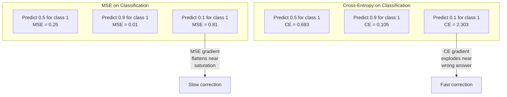
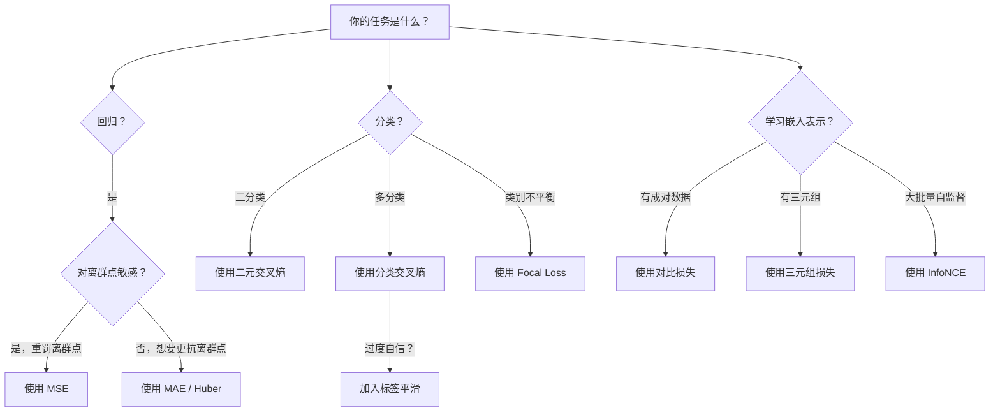
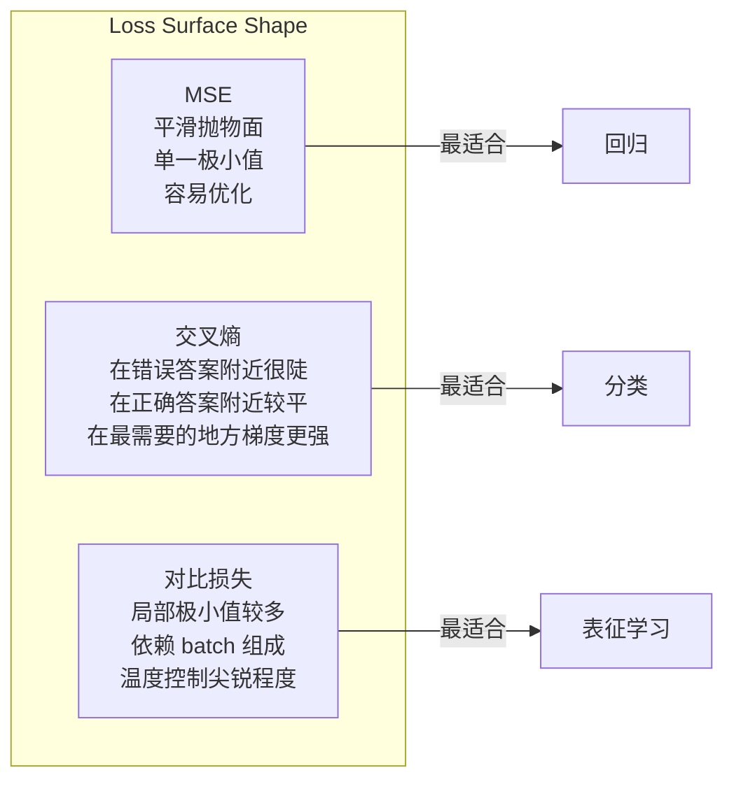

# 损失函数

> 你的网络做出了预测，真实答案却不一样。到底错了多少？这个量就是损失。损失函数选错了，模型就会朝着完全错误的方向优化。

**类型:** 构建
**语言:** Python
**先修:** 第 03.04 课（激活函数）
**时长:** ~75 分钟

## 学习目标

- 从零实现 MSE、二元交叉熵、分类交叉熵和对比损失（InfoNCE），并推导它们的梯度
- 通过“对所有输入都预测 0.5”的失败模式，解释为什么 MSE 不适合分类
- 对交叉熵应用标签平滑，并说明它如何防止模型过度自信
- 为回归、二元分类、多类分类和嵌入学习任务选对损失函数

## 问题是什么

如果一个分类模型最小化的是 MSE，它会很自信地对所有样本都预测 0.5。损失确实在下降，但模型完全没用。

损失函数才是模型真正优化的东西。不是准确率，不是 F1，也不是你汇报给经理的任何指标。优化器只会根据损失函数的梯度调整权重，让这个数变小。如果损失函数没有准确反映你关心的目标，模型就会寻找数学上最便宜的办法来满足它，而那个办法几乎从来都不是你真正想要的。

举个具体例子。你做的是一个二元分类任务，两个类别各占 50%。你把 MSE 当作损失。模型对每个输入都预测 0.5。平均 MSE 是 0.25，这恰好是在完全没学到任何东西时能达到的最低值。模型没有任何判别能力，但它确实“优化”了你的损失函数。把损失换成交叉熵后，同一个模型就必须把预测推向 0 或 1，因为 `-log(0.5) = 0.693` 是很差的损失，而 `-log(0.99) = 0.01` 会奖励自信且正确的预测。损失函数选得对不对，决定了模型是在学习，还是在钻指标空子。

更糟的是，在自监督学习里你甚至没有标签。对比损失完全定义了学习信号：什么算相似，什么算不同，以及模型应该把它们拉开到什么程度。如果对比损失设错了，嵌入就会坍缩到一个点，也就是所有输入都映射成同一个向量。形式上可能是零损失，但实际上毫无价值。

## 核心概念

### 均方误差（MSE）

这是回归任务的默认损失。它计算预测值与目标值之间的平方差，并对所有样本求平均。

```text
MSE = (1/n) * sum((y_pred - y_true)^2)
```

平方的作用很重要：它会对大误差施加二次惩罚。误差 2 的代价是误差 1 的 4 倍；误差 10 的代价是 100 倍。这让 MSE 对离群点非常敏感，单个离谱预测就可能主导整个损失。

具体来说，如果模型在大多数房子上只差 1 万美元，但在一栋豪宅上差了 20 万美元，MSE 会拼命修那栋豪宅，结果可能反而影响其他 99 栋房子的表现。

MSE 对预测值的梯度是：

```text
dMSE/dy_pred = (2/n) * (y_pred - y_true)
```

它和误差成线性关系。误差越大，梯度越大。这对回归是优点，因为大误差需要大修正；但对分类就是缺点，因为你希望对“自信但错误”的答案施加指数级惩罚，而不是线性惩罚。

### 交叉熵损失

这是分类任务的损失函数。它根植于信息论，用于衡量预测概率分布和真实分布之间的差异。

**二元交叉熵（BCE）：**

```text
BCE = -(y * log(p) + (1 - y) * log(1 - p))
```

其中 `y` 是真实标签（0 或 1），`p` 是预测概率。

为什么 `-log(p)` 有效：当真实标签是 1，而你预测 `p = 0.99` 时，损失是 `-log(0.99) = 0.01`。当你预测 `p = 0.01` 时，损失是 `-log(0.01) = 4.6`。460 倍的差距，就是交叉熵真正起作用的原因。它会狠狠惩罚自信但错误的预测，而几乎不惩罚自信且正确的预测。

梯度也讲同样的故事：

```text
dBCE/dp = -(y/p) + (1-y)/(1-p)
```

当 `y = 1` 且 `p` 接近 0 时，梯度是 `-1/p`，会趋向负无穷。模型会收到巨大的修正信号。当 `p` 接近 1 时，梯度非常小，说明模型已经对了，不需要大改。

**分类交叉熵：**

用于 one-hot 编码标签的多类分类。

```text
CCE = -sum(y_i * log(p_i))
```

只有真实类别会贡献损失，因为其他 `y_i` 都是 0。如果有 10 个类别，正确类别的概率是 0.1（随机猜），损失就是 `-log(0.1) = 2.3`。如果正确类别概率是 0.9，损失就是 `-log(0.9) = 0.105`。模型会学会把概率集中到正确答案上。

### 为什么 MSE 不适合分类



当预测接近 0 或 1 时，MSE 的梯度会变平，这是因为 sigmoid 饱和。交叉熵的梯度会补上这个问题：`-log` 抵消了 sigmoid 的平坦区域，在最需要梯度的地方提供更强的信号。

### 标签平滑

标准 one-hot 标签会说：“这个样本就是 100% 的第 3 类，其他类别都是 0%。”这是很强的断言。标签平滑会把它软化：

```text
smooth_label = (1 - alpha) * one_hot + alpha / num_classes
```

当 `alpha = 0.1`、类别数是 10 时，目标不再是 `[0, 0, 1, 0, ...]`，而是 `[0.01, 0.01, 0.91, 0.01, ...]`。模型的目标变成 0.91，而不是 1.0。

它之所以有效，是因为一个想通过 softmax 输出精确 1.0 的模型，必须把 logits 推到无穷大。这会导致过度自信、泛化变差，也会让模型对分布漂移更脆弱。标签平滑把目标上限压到 0.9（`alpha=0.1` 时），让 logits 保持在更合理的范围。GPT 和大多数现代模型都会使用标签平滑或等价做法。

### 对比损失

没有标签，没有类别。只有一对输入，以及一个问题：它们相似还是不同？

**SimCLR 风格的对比损失（NT-Xent / InfoNCE）：**

取一张图像，生成两个增强视图（裁剪、旋转、颜色扰动）。它们构成“正对”，应该有相似的嵌入。批次里的其他图像构成“负对”，应该有不同的嵌入。

```text
L = -log(exp(sim(z_i, z_j) / tau) / sum(exp(sim(z_i, z_k) / tau)))
```

其中 `sim()` 是余弦相似度，`z_i` 和 `z_j` 是正对，求和范围包含所有负样本，`tau`（温度）控制分布有多尖锐。温度越低，负样本越“硬”，分离越激进。

实际数值：batch size 为 256 时，每个正对对应 255 个负样本。温度 `tau = 0.07` 是 SimCLR 的默认值。这个损失看起来就像一个关于相似度的 softmax，它希望正对在 256 个候选里相似度最高。

**三元组损失：**

输入三个样本：锚点、正样本（同类）、负样本（不同类）。

```text
L = max(0, d(anchor, positive) - d(anchor, negative) + margin)
```

margin 通常在 0.2 到 1.0 之间，它要求正样本和负样本之间至少拉开这么多距离。如果负样本已经足够远，损失就是 0，也就没有梯度、不做更新。这让训练很高效，但也要求认真做 triplet mining，也就是挑选那些离锚点足够近的 hard negative。

### Focal Loss

用于类别极不平衡的数据集。标准交叉熵会把所有正确分类的样本一视同仁。Focal loss 会降低简单样本的权重：

```text
FL = -alpha * (1 - p_t)^gamma * log(p_t)
```

其中 `p_t` 是真实类别的预测概率，`gamma` 控制聚焦程度。当 `gamma = 0` 时，它就是标准交叉熵。默认 `gamma = 2` 时：

- 简单样本（`p_t = 0.9`）：权重是 `(0.1)^2 = 0.01`，几乎被忽略。
- 困难样本（`p_t = 0.1`）：权重是 `(0.9)^2 = 0.81`，会拿到完整梯度信号。

Focal loss 最初由 Lin 等人提出，用于目标检测，因为候选区域里 99% 都是背景，也就是简单负样本。如果没有 focal loss，模型会被这些简单背景样本淹没，学不到真正的目标；有了它，模型就会把容量集中到那些更难、更模糊但更重要的样本上。

### 损失函数决策树



### 损失曲面



```figure
cross-entropy-loss
```

## 动手实现

### 第 1 步：MSE 及其梯度

```python
def mse(predictions, targets):
    n = len(predictions)
    total = 0.0
    for p, t in zip(predictions, targets):
        total += (p - t) ** 2
    return total / n

def mse_gradient(predictions, targets):
    n = len(predictions)
    grads = []
    for p, t in zip(predictions, targets):
        grads.append(2.0 * (p - t) / n)
    return grads
```

### 第 2 步：二元交叉熵

`log(0)` 的问题是真实存在的。如果模型对一个正样本预测精确 0，`log(0)` 就是负无穷。裁剪可以避免这个问题。

```python
import math

def binary_cross_entropy(predictions, targets, eps=1e-15):
    n = len(predictions)
    total = 0.0
    for p, t in zip(predictions, targets):
        p_clipped = max(eps, min(1 - eps, p))
        total += -(t * math.log(p_clipped) + (1 - t) * math.log(1 - p_clipped))
    return total / n

def bce_gradient(predictions, targets, eps=1e-15):
    grads = []
    for p, t in zip(predictions, targets):
        p_clipped = max(eps, min(1 - eps, p))
        grads.append(-(t / p_clipped) + (1 - t) / (1 - p_clipped))
    return grads
```

### 第 3 步：带 softmax 的分类交叉熵

Softmax 会把原始 logits 转成概率，然后我们再和 one-hot 标签做交叉熵。

```python
def softmax(logits):
    max_val = max(logits)
    exps = [math.exp(x - max_val) for x in logits]
    total = sum(exps)
    return [e / total for e in exps]

def categorical_cross_entropy(logits, target_index, eps=1e-15):
    probs = softmax(logits)
    p = max(eps, probs[target_index])
    return -math.log(p)

def cce_gradient(logits, target_index):
    probs = softmax(logits)
    grads = list(probs)
    grads[target_index] -= 1.0
    return grads
```

softmax + cross-entropy 的梯度可以非常漂亮地化简：真实类别的梯度是“预测概率 - 1”，其他类别的梯度就是“预测概率”。这个简化并不是巧合，而正是 softmax 和交叉熵经常一起使用的原因。

### 第 4 步：标签平滑

```python
def label_smoothed_cce(logits, target_index, num_classes, alpha=0.1, eps=1e-15):
    probs = softmax(logits)
    loss = 0.0
    for i in range(num_classes):
        if i == target_index:
            smooth_target = 1.0 - alpha + alpha / num_classes
        else:
            smooth_target = alpha / num_classes
        p = max(eps, probs[i])
        loss += -smooth_target * math.log(p)
    return loss
```

### 第 5 步：对比损失（简化版 InfoNCE）

```python
def cosine_similarity(a, b):
    dot = sum(x * y for x, y in zip(a, b))
    norm_a = math.sqrt(sum(x * x for x in a))
    norm_b = math.sqrt(sum(x * x for x in b))
    if norm_a < 1e-10 or norm_b < 1e-10:
        return 0.0
    return dot / (norm_a * norm_b)

def contrastive_loss(anchor, positive, negatives, temperature=0.07):
    sim_pos = cosine_similarity(anchor, positive) / temperature
    sim_negs = [cosine_similarity(anchor, neg) / temperature for neg in negatives]

    max_sim = max(sim_pos, max(sim_negs)) if sim_negs else sim_pos
    exp_pos = math.exp(sim_pos - max_sim)
    exp_negs = [math.exp(s - max_sim) for s in sim_negs]
    total_exp = exp_pos + sum(exp_negs)

    return -math.log(max(1e-15, exp_pos / total_exp))
```

### 第 6 步：分类场景里的 MSE 对比交叉熵

用同一张第 04 课的圆环数据，分别用两种损失训练同一个网络。你会看到交叉熵收敛更快。

```python
import random

def sigmoid(x):
    x = max(-500, min(500, x))
    return 1.0 / (1.0 + math.exp(-x))

def make_circle_data(n=200, seed=42):
    random.seed(seed)
    data = []
    for _ in range(n):
        x = random.uniform(-2, 2)
        y = random.uniform(-2, 2)
        label = 1.0 if x * x + y * y < 1.5 else 0.0
        data.append(([x, y], label))
    return data


class LossComparisonNetwork:
    def __init__(self, loss_type="bce", hidden_size=8, lr=0.1):
        random.seed(0)
        self.loss_type = loss_type
        self.lr = lr
        self.hidden_size = hidden_size

        self.w1 = [[random.gauss(0, 0.5) for _ in range(2)] for _ in range(hidden_size)]
        self.b1 = [0.0] * hidden_size
        self.w2 = [random.gauss(0, 0.5) for _ in range(hidden_size)]
        self.b2 = 0.0

    def forward(self, x):
        self.x = x
        self.z1 = []
        self.h = []
        for i in range(self.hidden_size):
            z = self.w1[i][0] * x[0] + self.w1[i][1] * x[1] + self.b1[i]
            self.z1.append(z)
            self.h.append(max(0.0, z))

        self.z2 = sum(self.w2[i] * self.h[i] for i in range(self.hidden_size)) + self.b2
        self.out = sigmoid(self.z2)
        return self.out

    def backward(self, target):
        if self.loss_type == "mse":
            d_loss = 2.0 * (self.out - target)
        else:
            eps = 1e-15
            p = max(eps, min(1 - eps, self.out))
            d_loss = -(target / p) + (1 - target) / (1 - p)

        d_sigmoid = self.out * (1 - self.out)
        d_out = d_loss * d_sigmoid

        for i in range(self.hidden_size):
            d_relu = 1.0 if self.z1[i] > 0 else 0.0
            d_h = d_out * self.w2[i] * d_relu
            self.w2[i] -= self.lr * d_out * self.h[i]
            for j in range(2):
                self.w1[i][j] -= self.lr * d_h * self.x[j]
            self.b1[i] -= self.lr * d_h
        self.b2 -= self.lr * d_out

    def compute_loss(self, pred, target):
        if self.loss_type == "mse":
            return (pred - target) ** 2
        else:
            eps = 1e-15
            p = max(eps, min(1 - eps, pred))
            return -(target * math.log(p) + (1 - target) * math.log(1 - p))

    def train(self, data, epochs=200):
        losses = []
        for epoch in range(epochs):
            total_loss = 0.0
            correct = 0
            for x, y in data:
                pred = self.forward(x)
                self.backward(y)
                total_loss += self.compute_loss(pred, y)
                if (pred >= 0.5) == (y >= 0.5):
                    correct += 1
            avg_loss = total_loss / len(data)
            accuracy = correct / len(data) * 100
            losses.append((avg_loss, accuracy))
            if epoch % 50 == 0 or epoch == epochs - 1:
                print(f"    Epoch {epoch:3d}: loss={avg_loss:.4f}, accuracy={accuracy:.1f}%")
        return losses
```

## 用起来

PyTorch 已经把所有标准损失函数都提供好了，而且内置了数值稳定性：

```python
import torch
import torch.nn as nn
import torch.nn.functional as F

predictions = torch.tensor([0.9, 0.1, 0.7], requires_grad=True)
targets = torch.tensor([1.0, 0.0, 1.0])

mse_loss = F.mse_loss(predictions, targets)
bce_loss = F.binary_cross_entropy(predictions, targets)

logits = torch.randn(4, 10)
labels = torch.tensor([3, 7, 1, 9])
ce_loss = F.cross_entropy(logits, labels)
ce_smooth = F.cross_entropy(logits, labels, label_smoothing=0.1)
```

应该使用 `F.cross_entropy`，而不是手动做 softmax 再接 `F.nll_loss`。它把 log-softmax 和负对数似然放在一次数值稳定的操作里。先单独做 softmax 再取 log，稳定性更差，因为会在大指数的减法里丢精度。

对比学习场景里，大多数团队会用自定义实现，或者使用 `lightly`、`pytorch-metric-learning` 这样的库。核心循环始终一样：计算成对相似度，对正负样本做 softmax，再反向传播。

## 上线交付

本课产出：
- `outputs/prompt-loss-function-selector.md` - 一个用于选择正确损失函数的可复用 prompt
- `outputs/prompt-loss-debugger.md` - 一个用于排查“损失曲线看起来不对”时的诊断 prompt

## 练习

1. 实现 Huber loss（平滑 L1 损失）：小误差时像 MSE，大误差时像 MAE。训练一个回归网络预测 `y = sin(x)`，并在 5% 训练目标加入随机噪声（离群点）时，对比 MSE 和 Huber 的测试误差。

2. 给二元分类训练循环加入 focal loss。构造一个类别极不平衡的数据集（90% 是类 0，10% 是类 1）。训练 200 个 epoch 后，对比标准 BCE 和 focal loss（`gamma=2`）在少数类召回率上的差异。

3. 实现带半难负样本挖掘的 triplet loss。生成 5 个类别的二维嵌入数据。对每个 anchor，找出“仍比正样本更远”的最难负样本（semi-hard）。对比它与随机 triplet 选择的收敛情况。

4. 重跑 MSE 和交叉熵的对比实验，但在训练过程中记录每一层的梯度大小。画出每个 epoch 的平均梯度范数，验证在模型最不确定的前期，交叉熵能产生更大的梯度。

5. 实现 KL 散度损失，并验证当真实分布是 one-hot 时，最小化 `KL(true || predicted)` 得到的梯度与交叉熵相同。然后再试试软目标，比如知识蒸馏里教师模型 softmax 输出形成的“真实”分布。

## 关键术语

| Term | What people say | What it actually means |
|------|----------------|----------------------|
| Loss function | "How wrong the model is" | 一个可微函数，把预测和目标映射成一个标量，供优化器最小化 |
| MSE | "Average squared error" | 预测值与目标值差的平方平均；会对大误差施加二次惩罚 |
| Cross-entropy | "The classification loss" | 用 `-log(p)` 衡量预测概率分布与真实分布之间的差异 |
| Binary cross-entropy | "BCE" | 两分类交叉熵：`-(y*log(p) + (1-y)*log(1-p))` |
| Label smoothing | "Softening the targets" | 用更软的值替代硬 0/1 目标（如 0.1/0.9），以防止过度自信并提升泛化 |
| Contrastive loss | "Pull together, push apart" | 通过让相似样本靠近、不同样本远离来学习表示的损失 |
| InfoNCE | "The CLIP/SimCLR loss" | 对相似度分数做带温度缩放的归一化交叉熵，把对比学习视为分类 |
| Focal loss | "The imbalanced data fix" | 用 `(1-p_t)^gamma` 给交叉熵加权，压低简单样本的权重，聚焦困难样本 |
| Triplet loss | "Anchor-positive-negative" | 要求 anchor 与 positive 的距离至少比 negative 小一个 margin |
| Temperature | "Sharpness knob" | logits / 相似度的缩放因子，控制输出分布有多尖锐；越小越尖锐 |

## 延伸阅读

- Lin et al., "Focal Loss for Dense Object Detection" (2017) - 提出了 focal loss，用于处理目标检测中的极端类别不平衡（RetinaNet）
- Chen et al., "A Simple Framework for Contrastive Learning of Visual Representations" (SimCLR, 2020) - 用 NT-Xent loss 定义了现代对比学习流程
- Szegedy et al., "Rethinking the Inception Architecture" (2016) - 引入标签平滑，如今已成为大多数大模型的标准做法
- Hinton et al., "Distilling the Knowledge in a Neural Network" (2015) - 用软目标和 KL 散度做知识蒸馏，是模型压缩的基础
