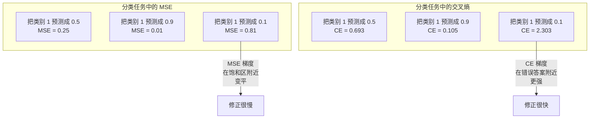
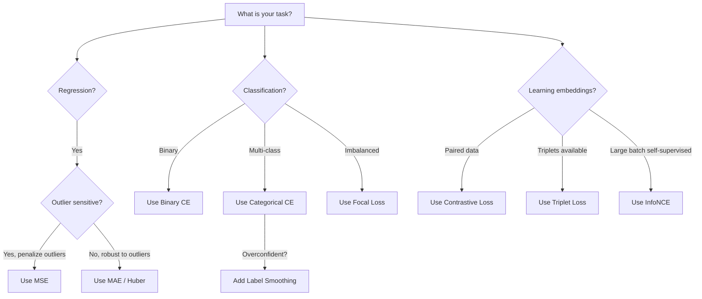
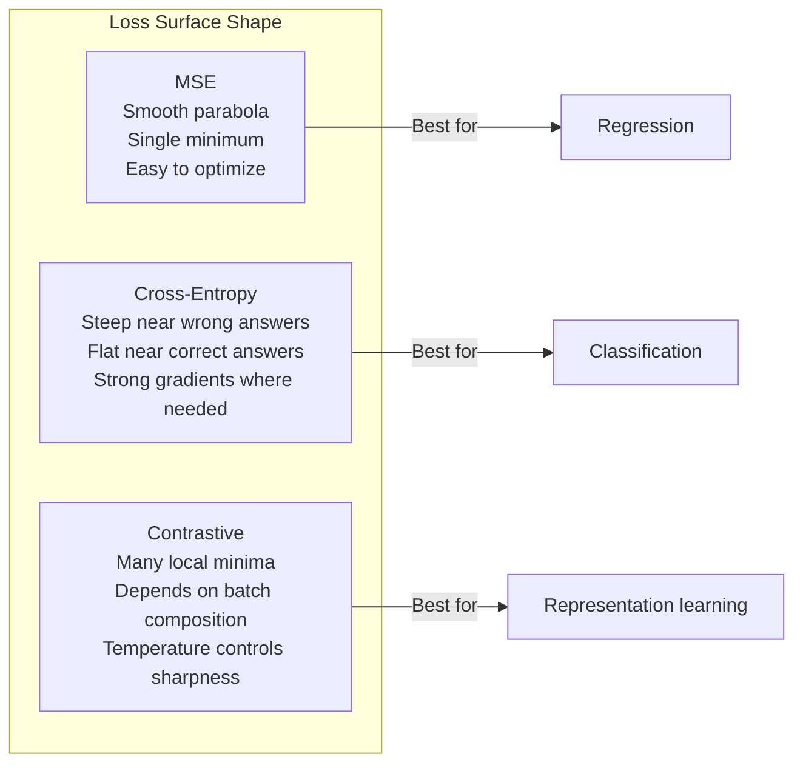

# 损失函数

> 您的网络做出预测。事实并非如此。到底有多错呢？这个数字就是损失。选择错误的损失函数，你的模型就会完全针对错误的事情进行优化。

**类型：** 构建
**语言：** Python
**先决条件：** 第 03.04 课（激活函数）
**时间：** ~75 分钟

## 学习目标

- 使用梯度从头开始实现 MSE、二元交叉熵、分类交叉熵和对比损失 (InfoNCE)
- 通过演示“对所有内容预测 0.5”故障模式，解释 MSE 分类失败的原因
- 将标签平滑应用于交叉熵并描述它如何防止过度自信的预测
- 为回归、二元分类、多类分类和嵌入学习任务选择正确的损失函数

## 问题

在分类问题上最小化 MSE 的模型将自信地预测所有事情的结果都是 0.5。就是把损失降到最低。也是没用的。

损失函数是模型实际优化的唯一内容。不是准确性。不是F1成绩。不是您向经理报告的任何指标。优化器采用损失函数的梯度并调整权重以使该数字更小。如果损失函数没有捕获您关心的内容，模型将找到数学上最便宜的方式来满足它，而这种方式几乎永远不是您想要的。

这是一个具体的例子。您有一个二元分类任务。两个班级，50/50 分开。你用 MSE 作为你的损失。该模型对每个输入的预测值为 0.5。平均 MSE 为 0.25，这是在没有实际学习任何东西的情况下可能的最小值。该模型的判别能力为零，但它在技术上最小化了损失函数。切换到交叉熵，相同的模型被迫将预测推向 0 或 1，因为 -log(0.5) = 0.693 是一个可怕的损失，而 -log(0.99) = 0.01 奖励有信心的正确预测。损失函数的选择是学习模型和玩弄度量的模型之间的区别。情况变得更糟。在自我监督学习中，你甚至没有标签。对比损失完全定义了学习信号：什么算相似，什么算不同，以及模型应该在多大程度上将它们分开。如果对比损失错误，你的嵌入就会崩溃到一个点——每个输入都映射到同一个向量。技术上零损失。完全没有价值。

## 概念

### 均方误差 (MSE)

回归的默认值。计算预测与目标之间的平方差，以及所有样本的平均值。

```
MSE = (1/n) * sum((y_pred - y_true)^2)
```

为什么平方很重要：它对大误差进行二次惩罚。 2 个错误的成本是 1 个错误的 4 倍。10 个错误的成本是 100 倍。这使得 MSE 对异常值很敏感——一个严重错误的预测主导了损失。

实数：如果您的模型预测房价，大多数房屋的价格下跌了 10,000 美元，但一栋豪宅的价格下跌了 200,000 美元，MSE 将积极尝试修复该豪宅，这可能会损害其他 99 栋房屋的表现。

MSE 相对于预测的梯度为：

```
dMSE/dy_pred = (2/n) * (y_pred - y_true)
```

误差呈线性。误差越大，梯度越大。这是回归的一个功能（大的错误需要大量的修正）和分类的一个错误（你想以指数方式而不是线性地惩罚自信的错误答案）。

### 交叉熵损失

用于分类的损失函数。植根于信息论——它测量预测概率分布与真实分布之间的差异。

**二元交叉熵 (BCE)：**

```
BCE = -(y * log(p) + (1 - y) * log(1 - p))
```

其中 y 是真实标签（0 或 1），p 是预测概率。

为什么 -log(p) 有效：当真实标签为 1 并且您预测 p = 0.99 时，损失为 -log(0.99) = 0.01。当您预测 p = 0.01 时，损失为 -log(0.01) = 4.6。 460 倍的差异就是交叉熵起作用的原因。它残酷地惩罚自信的错误预测，而几乎不惩罚自信的正确预测。

渐变讲述了同样的故事：

```
dBCE/dp = -(y/p) + (1-y)/(1-p)
```

当 y = 1 且 p 接近于零时，梯度为 -1/p，接近负无穷大。该模型收到了一个巨大的信号来纠正其错误。当p接近1时，梯度很小。已经正确了，没有什么可修复的。

**分类交叉熵：**

用于具有one-hot编码目标的多类分类。

```
CCE = -sum(y_i * log(p_i))
```

只有真正的类别才会造成损失（因为所有其他 y_i 均为零）。如果有 10 个类别，并且正确类别的概率为 0.1（随机猜测），则损失为 -log(0.1) = 2.3。如果正确类别的概率为 0.9，则损失为 -log(0.9) = 0.105。该模型学会将概率质量集中在正确答案上。

### 为什么 MSE 分类失败



当预测接近 0 或 1 时，MSE 梯度变平（由于 sigmoid 饱和）。交叉熵梯度对此进行了补偿——-log 取消了 sigmoid 的平坦区域，在最需要的地方提供了强梯度。

### 标签平滑

标准的 one-hot 标签上写着“这是 100% 3 级，其他都是 0%”。这是一个强有力的主张。标签平滑可以软化它：

```
smooth_label = (1 - alpha) * one_hot + alpha / num_classes
```

当 alpha = 0.1 和 10 个类别时：目标不再是 [0, 0, 1, 0, ...]，而是 [0.01, 0.01, 0.91, 0.01, ...]。该模型的目标是 0.91，而不是 1.0。

为什么这样有效：试图通过 softmax 精确输出 1.0 的模型需要将 logits 推至无穷大。这会导致过度自信，损害泛化能力，并使模型容易发生分布变化。标签平滑将目标上限限制为 0.9（alpha=0.1），将 logits 保持在合理的范围内。 GPT 和大多数现代模型使用标签平滑或其等效项。

### 对比损失

没有标签。没有课。只是成对的输入和问题：这些是相似还是不同？

**SimCLR 式对比损失（NT-Xent / InfoNCE）：**

拍摄一张图像。创建它的两个增强视图（裁剪、旋转、颜色抖动）。这些是“正对”——它们应该具有相似的嵌入。批次中的所有其他图像形成一个“负对”——它们应该具有不同的嵌入。

```
L = -log(exp(sim(z_i, z_j) / tau) / sum(exp(sim(z_i, z_k) / tau)))
```

其中 sim() 是余弦相似度，z_i 和 z_j 是正对，总和是所有负数的总和，tau（温度）控制分布的尖锐程度。较低的温度 = 较硬的底片 = 更积极的分离。

实数：批量大小 256 意味着每个正对有 255 个负数。温度 tau = 0.07（SimCLR 默认值）。损失看起来像一个关于相似度的 Softmax——它希望正对的相似度在所有 256 个选项中最高。

**三重态损失：**

接受三个输入：锚点、正值（同一类）、负值（不同类）。

```
L = max(0, d(anchor, positive) - d(anchor, negative) + margin)
```

边距（通常为 0.2-1.0）强制规定正距离和负距离之间的最小间隙。如果负数已经足够远，则损失为零——没有梯度，没有更新。这使得训练变得高效，但需要仔细的三元组挖掘（选择接近锚点的硬负例）。

### 焦点损失

对于不平衡的数据集。标准交叉熵平等对待所有正确分类的示例。焦点损失减轻体重的简单例子：

```
FL = -alpha * (1 - p_t)^gamma * log(p_t)
```

其中 p_t 是真实类别的预测概率，gamma 控制聚焦。当 gamma = 0 时，这是标准交叉熵。当 gamma = 2（默认值）时：

- 简单示例 (p_t = 0.9)：权重 = (0.1)^2 = 0.01。有效地被忽略了。
- 困难的例子（p_t = 0.1）：权重 = (0.9)^2 = 0.81。全梯度信号。

Lin 等人引入了焦点损失。对于目标检测，其中 99% 的候选区域是背景（简单负片）。如果没有焦点损失，模型就会淹没在简单的背景示例中，永远无法学会检测物体。有了它，该模型将其能力集中在重要的困难、模糊的案例上。

### 损失函数决策树



### 损失景观



```figure
cross-entropy-loss
```

## 构建它

### 步骤 1：MSE 及其梯度

```python
def mse(predictions, targets):
    n = len(predictions)
    total = 0.0
    for p, t in zip(predictions, targets):
        total += (p - t) ** 2
    return total / n

def mse_gradient(predictions, targets):
    n = len(predictions)
    grads = []
    for p, t in zip(predictions, targets):
        grads.append(2.0 * (p - t) / n)
    return grads
```

### 步骤 2：二元交叉熵

log(0) 问题是真实存在的。如果模型准确预测正例为 0，则 log(0) = 负无穷大。剪裁可以防止这种情况发生。

```python
import math

def binary_cross_entropy(predictions, targets, eps=1e-15):
    n = len(predictions)
    total = 0.0
    for p, t in zip(predictions, targets):
        p_clipped = max(eps, min(1 - eps, p))
        total += -(t * math.log(p_clipped) + (1 - t) * math.log(1 - p_clipped))
    return total / n

def bce_gradient(predictions, targets, eps=1e-15):
    grads = []
    for p, t in zip(predictions, targets):
        p_clipped = max(eps, min(1 - eps, p))
        grads.append(-(t / p_clipped) + (1 - t) / (1 - p_clipped))
    return grads
```

### 步骤 3：使用 Softmax 进行分类交叉熵Softmax 将原始逻辑转换为概率。然后我们计算针对 one-hot 目标的交叉熵。

```python
def softmax(logits):
    max_val = max(logits)
    exps = [math.exp(x - max_val) for x in logits]
    total = sum(exps)
    return [e / total for e in exps]

def categorical_cross_entropy(logits, target_index, eps=1e-15):
    probs = softmax(logits)
    p = max(eps, probs[target_index])
    return -math.log(p)

def cce_gradient(logits, target_index):
    probs = softmax(logits)
    grads = list(probs)
    grads[target_index] -= 1.0
    return grads
```

softmax + 交叉熵的梯度完美地简化了：它只是真实类的（预测概率 - 1），以及所有其他类的（预测概率）。这种优雅的简化并不是巧合——这就是为什么 softmax 和交叉熵配对的原因。

### 步骤 4：标签平滑

```python
def label_smoothed_cce(logits, target_index, num_classes, alpha=0.1, eps=1e-15):
    probs = softmax(logits)
    loss = 0.0
    for i in range(num_classes):
        if i == target_index:
            smooth_target = 1.0 - alpha + alpha / num_classes
        else:
            smooth_target = alpha / num_classes
        p = max(eps, probs[i])
        loss += -smooth_target * math.log(p)
    return loss
```

### 步骤 5：对比损失（简化 InfoNCE）

```python
def cosine_similarity(a, b):
    dot = sum(x * y for x, y in zip(a, b))
    norm_a = math.sqrt(sum(x * x for x in a))
    norm_b = math.sqrt(sum(x * x for x in b))
    if norm_a < 1e-10 or norm_b < 1e-10:
        return 0.0
    return dot / (norm_a * norm_b)

def contrastive_loss(anchor, positive, negatives, temperature=0.07):
    sim_pos = cosine_similarity(anchor, positive) / temperature
    sim_negs = [cosine_similarity(anchor, neg) / temperature for neg in negatives]

    max_sim = max(sim_pos, max(sim_negs)) if sim_negs else sim_pos
    exp_pos = math.exp(sim_pos - max_sim)
    exp_negs = [math.exp(s - max_sim) for s in sim_negs]
    total_exp = exp_pos + sum(exp_negs)

    return -math.log(max(1e-15, exp_pos / total_exp))
```

### 步骤 6：分类中的 MSE 与交叉熵

使用两个损失函数训练第 04 课（圆形数据集）中的相同网络。观察交叉熵收敛得更快。

```python
import random

def sigmoid(x):
    x = max(-500, min(500, x))
    return 1.0 / (1.0 + math.exp(-x))

def make_circle_data(n=200, seed=42):
    random.seed(seed)
    data = []
    for _ in range(n):
        x = random.uniform(-2, 2)
        y = random.uniform(-2, 2)
        label = 1.0 if x * x + y * y < 1.5 else 0.0
        data.append(([x, y], label))
    return data


class LossComparisonNetwork:
    def __init__(self, loss_type="bce", hidden_size=8, lr=0.1):
        random.seed(0)
        self.loss_type = loss_type
        self.lr = lr
        self.hidden_size = hidden_size

        self.w1 = [[random.gauss(0, 0.5) for _ in range(2)] for _ in range(hidden_size)]
        self.b1 = [0.0] * hidden_size
        self.w2 = [random.gauss(0, 0.5) for _ in range(hidden_size)]
        self.b2 = 0.0

    def forward(self, x):
        self.x = x
        self.z1 = []
        self.h = []
        for i in range(self.hidden_size):
            z = self.w1[i][0] * x[0] + self.w1[i][1] * x[1] + self.b1[i]
            self.z1.append(z)
            self.h.append(max(0.0, z))

        self.z2 = sum(self.w2[i] * self.h[i] for i in range(self.hidden_size)) + self.b2
        self.out = sigmoid(self.z2)
        return self.out

    def backward(self, target):
        if self.loss_type == "mse":
            d_loss = 2.0 * (self.out - target)
        else:
            eps = 1e-15
            p = max(eps, min(1 - eps, self.out))
            d_loss = -(target / p) + (1 - target) / (1 - p)

        d_sigmoid = self.out * (1 - self.out)
        d_out = d_loss * d_sigmoid

        for i in range(self.hidden_size):
            d_relu = 1.0 if self.z1[i] > 0 else 0.0
            d_h = d_out * self.w2[i] * d_relu
            self.w2[i] -= self.lr * d_out * self.h[i]
            for j in range(2):
                self.w1[i][j] -= self.lr * d_h * self.x[j]
            self.b1[i] -= self.lr * d_h
        self.b2 -= self.lr * d_out

    def compute_loss(self, pred, target):
        if self.loss_type == "mse":
            return (pred - target) ** 2
        else:
            eps = 1e-15
            p = max(eps, min(1 - eps, pred))
            return -(target * math.log(p) + (1 - target) * math.log(1 - p))

    def train(self, data, epochs=200):
        losses = []
        for epoch in range(epochs):
            total_loss = 0.0
            correct = 0
            for x, y in data:
                pred = self.forward(x)
                self.backward(y)
                total_loss += self.compute_loss(pred, y)
                if (pred >= 0.5) == (y >= 0.5):
                    correct += 1
            avg_loss = total_loss / len(data)
            accuracy = correct / len(data) * 100
            losses.append((avg_loss, accuracy))
            if epoch % 50 == 0 or epoch == epochs - 1:
                print(f"    Epoch {epoch:3d}: loss={avg_loss:.4f}, accuracy={accuracy:.1f}%")
        return losses
```

## 使用它

PyTorch 提供所有标准损失函数，并内置数值稳定性：

```python
import torch
import torch.nn as nn
import torch.nn.functional as F

predictions = torch.tensor([0.9, 0.1, 0.7], requires_grad=True)
targets = torch.tensor([1.0, 0.0, 1.0])

mse_loss = F.mse_loss(predictions, targets)
bce_loss = F.binary_cross_entropy(predictions, targets)

logits = torch.randn(4, 10)
labels = torch.tensor([3, 7, 1, 9])
ce_loss = F.cross_entropy(logits, labels)
ce_smooth = F.cross_entropy(logits, labels, label_smoothing=0.1)
```

使用 `F.cross_entropy` （不是 `F.nll_loss` 加手动 softmax）。它将 log-softmax 和负对数似然结合在一个数值稳定的操作中。单独应用 softmax 然后取对数不太稳定——在大指数的减法中你会失去精度。

对于对比学习，大多数团队使用自定义实现或库，例如 `lightly` 或 `pytorch-metric-learning`。核心循环始终是相同的：计算成对相似性，创建正负数的 softmax，反向传播。

## 发货

本课产生：
- `outputs/prompt-loss-function-selector.md` -- 用于选择正确损失函数的可重用提示
- `outputs/prompt-loss-debugger.md` -- 当您的损失曲线看起来错误时的诊断提示

## 练习

1.实现Huber损失（平滑L1损失），对于小错误是MSE，对于大错误是MAE。当 5% 的训练目标添加了随机噪声（异常值）时，使用 MSE 与 Huber 训练预测 y = sin(x) 的回归网络。比较最终测试误差。

2. 将焦点损失添加到二元分类训练循环中。创建不平衡数据集（90% 0 类，10% 1 类）。比较标准 BCE 与焦点损失 (gamma=2) 在 200 个 epoch 后的少数类召回率。3.通过半硬负挖掘实现三元组损失。生成 5 个类的 2D 嵌入数据。对于每个锚点，找到仍比正值更远的最难的负值（半困难）。将收敛性与随机三元组选择进行比较。

4. 运行 MSE 与交叉熵比较，但在训练期间跟踪每层的梯度大小。绘制每个时期的平均梯度范数。验证交叉熵在模型最不确定的早期时期是否会产生更大的梯度。

5. 实现 KL 散度损失，并验证当真实分布是独热时，最小化 KL(true||predicted) 会给出与交叉熵相同的梯度。然后尝试软目标（如知识蒸馏），其中“真实”分布来自教师模型的 softmax 输出。

## 关键术语

|术语 |人们怎么说|它实际上意味着什么 |
|------|----------------|----------------------|
|损失函数| “这个模型有多么错误”|可微函数将预测和目标映射到优化器最小化的标量 |
|硕士 | “平均平方误差”|预测与目标之间的均方差；对大错误进行二次惩罚 |
|交叉熵 | “分类损失”|使用 -log(p) | 测量预测概率分布与真实分布之间的差异
|二元交叉熵 | “公元前” |两个类的交叉熵：-(y*log(p) + (1-y)*log(1-p)) |
|标签平滑 | “软化目标”|用软值（例如 0.1/0.9）替换硬 0/1 目标，以防止过度自信并提高泛化能力 |
|对比损失| “拉在一起，推开”|通过在嵌入空间中使相似对靠近、使不同对远离来学习表示的损失 |
|信息NCE | “CLIP/SimCLR 损失”|相似性分数的归一化温度尺度交叉熵；将对比学习视为分类 |
|焦点丧失 | “修复不平衡数据”|由 (1-p_t)^gamma 加权的交叉熵，以降低简单示例的权重并专注于困难示例 |
|三重态损失| “锚定-正-负”|在嵌入空间中将锚点推向正值而不是负值至少有一定的余量 ||温度| “清晰度旋钮”|对数/相似度的标量除数，控制结果分布的峰值程度；更低=更锐利|

## 进一步阅读

- Lin 等人，“密集对象检测的焦点损失”(2017) -- 引入焦点损失来处理对象检测中的极端类别不平衡 (RetinaNet)
- Chen 等人，“视觉表示对比学习的简单框架”（SimCLR，2020）——定义了具有 NT-Xent 损失的现代对比学习流程
- Szegedy 等人，“重新思考 Inception 架构”（2016 年）——引入了标签平滑作为正则化技术，现已成为大多数大型模型的标准配置
- Hinton 等人，“在神经网络中蒸馏知识”（2015 年）——使用软目标和 KL 散度进行知识蒸馏，这是模型压缩的基础
