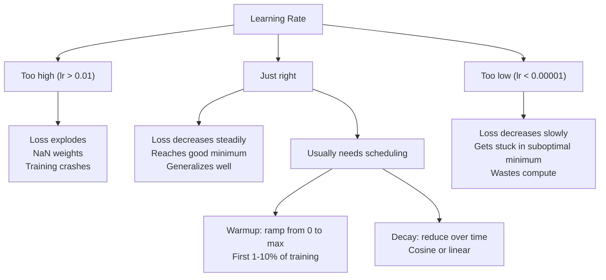
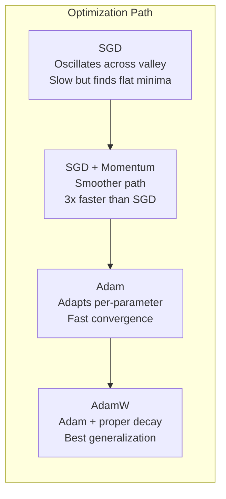
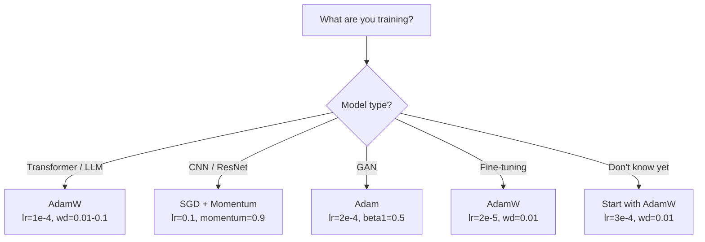

# 优化器

> 梯度下降告诉您移动的方向。它没有说明多远或多快。 SGD 是一个指南针。 Adam 是带有交通数据的 GPS。

**类型：** 构建
**语言：** Python
**先决条件：** 第 03.05 课（损失函数）
**时间：** ~75 分钟

## 学习目标

- 在 Python 中从头开始实现 SGD、带有动量的 SGD、Adam 和 AdamW 优化器
- 解释 Adam 的偏差校正如何补偿早期训练步骤中的零初始化矩估计
- 演示为什么 AdamW 在相同任务上比具有 L2 正则化的 Adam 产生更好的泛化能力
- 为 Transformer、CNN、GAN 和微调选择适当的优化器和默认超参数

## 问题

您计算了梯度。您知道权重 #4,721 应减少 0.003 以减少损失。但 0.003 的单位是什么？按什么缩放？您是否应该在步骤 1 中移动与步骤 1,000 相同的量？

普通梯度下降法对每一步的每个参数应用相同的学习率：w = w - lr * 梯度。这产生了三个问题，使训练神经网络在实践中变得痛苦。

第一，振荡。损失景观很少呈光滑的碗状。它更像是一条狭长的山谷。梯度指向整个山谷（陡峭的方向），而不是沿着山谷（浅的方向​​）。梯度下降在狭窄的维度上来回反弹，同时沿着有用的维度取得微小的进展。您已经看到了这一点：损失快速下降然后趋于稳定，不是因为模型收敛，而是因为它正在振荡。

其次，所有参数的一个学习率都是错误的。有些权重需要大量更新（它们处于早期、欠拟合阶段）。其他人需要微小的更新（它们接近最佳值）。对前者有效的学习率会破坏后者，反之亦然。

第三，鞍点。在高维度中，损失景观具有巨大的平坦区域，梯度接近于零。 Vanilla SGD 以梯度速度爬过这些区域，而梯度速度实际上为零。模型看起来卡住了。它没有被卡住——它位于一个平坦的区域，另一侧有有用的下降。但SGD没有机制可以推动。亚当解决了这三个问题。它为每个参数维护两个运行平均值——平均梯度（动量，处理振荡）和均方梯度（自适应速率，处理不同的尺度）。结合前几个步骤的偏差校正，它为您提供了一个优化器，可以解决 80% 使用默认超参数的问题。本课程从头开始构建它，以便您准确了解它在其他 20% 上失败的时间和原因。

## 概念

### 随机梯度下降 (SGD)

最简单的优化器。计算小批量的梯度并朝相反方向迈进。

```
w = w - lr * gradient
```

“随机”意味着您使用数据的随机子集（小批量）来估计梯度，而不是完整的数据集。这种噪声实际上很有用——它有助于逃避尖锐的局部最小值。但噪声也会引起振荡。

学习率是唯一的旋钮。太高：损失出现偏差。太低：训练需要很长时间。最佳值取决于架构、数据、批量大小和当前的训练阶段。对于现代网络上的普通 SGD，典型值范围为 0.01 到 0.1。但即使在一次训练中，理想的学习率也会发生变化。

### 势头

球滚下坡的比喻虽然被过度使用，但却很准确。您不是单独按照梯度步进，而是保持累积过去梯度的速度。

```
m_t = beta * m_{t-1} + gradient
w = w - lr * m_t
```

Beta（通常为 0.9）控制要保留的历史记录量。当 beta = 0.9 时，动量大致是最后 10 个梯度的平均值 (1 / (1 - 0.9) = 10)。

为什么这可以修复振荡：指向同一方向的梯度会累积。翻转方向的渐变相互抵消。在那个狭窄的山谷中，“跨”组件每一步都会翻转符号并受到抑制。 “沿着”部分保持一致并得到放大。结果是在有用方向上平滑加速。

实数：在条件恶劣的损失情况下，仅 SGD 就可能需要 10,000 步。对于同一问题，动量 SGD（beta=0.9）通常需要 3,000-5,000 步。加速并不是边际的。

### RMSProp第一个真正有效的每参数自适应学习率方法。由 Hinton 在 Coursera 讲座中提出（从未正式发表）。

```
s_t = beta * s_{t-1} + (1 - beta) * gradient^2
w = w - lr * gradient / (sqrt(s_t) + epsilon)
```

s_t 跟踪平方梯度的运行平均值。具有一致大梯度的参数被除以一个大数（较小的有效学习率）。梯度较小的参数除以较小的数字（较大的有效学习率）。

这解决了“所有参数的一个学习率”问题。已经得到大幅更新的权重可能已经接近其目标——放慢速度。一直进行微小更新的重量可能训练不足——加快速度。

当参数尚未更新时，Epsilon（通常为 1e-8）可防止被零除。

### Adam：动量 + RMSProp

亚当结合了这两种想法。它为每个参数维护两个指数移动平均值：

```
m_t = beta1 * m_{t-1} + (1 - beta1) * gradient        (first moment: mean)
v_t = beta2 * v_{t-1} + (1 - beta2) * gradient^2       (second moment: variance)
```

**偏差校正**是大多数解释都会跳过的关键细节。在步骤 1 中，m_1 = (1 - beta1) * 梯度。当 beta1 = 0.9 时，即 0.1 * 梯度——小十倍。移动平均线尚未升温。偏差校正补偿：

```
m_hat = m_t / (1 - beta1^t)
v_hat = v_t / (1 - beta2^t)
```

在第 1 步，beta1 = 0.9：m_hat = m_1 / (1 - 0.9) = m_1 / 0.1 = 实际梯度。在步骤 100：(1 - 0.9^100) 大约为 1.0，因此校正消失。偏差校正对于前约 10 个步骤很重要，而在约 50 个步骤之后则无关紧要。

更新：

```
w = w - lr * m_hat / (sqrt(v_hat) + epsilon)
```

Adam 默认：lr = 0.001，beta1 = 0.9，beta2 = 0.999，epsilon = 1e-8。这些默认值适用于 80% 的问题。如果没有，请先更改 lr。然后是测试版2。几乎从不改变 beta1 或 epsilon。

### AdamW：体重衰减做得正确

L2 正则化将 lambda * w^2 添加到损失中。在普通 SGD 中，这相当于权重衰减（从每一步的权重中减去 lambda * w）。在亚当身上，这种等价性被打破了。Loshchilov 和 Hutter 的见解：当您将 L2 添加到损失中，然后 Adam 处理梯度时，自适应学习率也会缩放正则化项。梯度方差大的参数得到的正则化程度较低。方差小的参数会得到更多。这不是你想要的——无论梯度统计如何，你都想要统一的正则化。

AdamW 在 Adam 更新后通过直接对权重应用权重衰减来修复此问题：

```
w = w - lr * m_hat / (sqrt(v_hat) + epsilon) - lr * lambda * w
```

权重衰减项 (lr * lambda * w) 不按 Adam 自适应因子进行缩放。每个参数都有相同的比例收缩。

这似乎是一个小细节。它不是。 AdamW 在几乎所有任务上都能收敛到比 Adam + L2 正则化更好的解决方案。它是 PyTorch 中用于训练 Transformer、扩散模型和大多数现代架构的默认优化器。 BERT、GPT、LLaMA、Stable Diffusion——全部由 AdamW 训练。

### 学习率：最重要的超参数



如果调整一个超参数，请调整学习率。学习率 10 倍的变化比您做出的任何架构决策都更重要。常见默认值：

- 新元：lr = 0.01 至 0.1
- Adam/AdamW：lr = 1e-4 至 3e-4
- 微调预训练模型：lr = 1e-5 至 5e-5
- 学习率预热：前 1-10% 的步骤呈线性斜坡

### 优化器比较



### 当每个优化器获胜时



```figure
optimizer-trajectory
```

## 构建它

### 第 1 步：普通新元

```python
class SGD:
    def __init__(self, lr=0.01):
        self.lr = lr

    def step(self, params, grads):
        for i in range(len(params)):
            params[i] -= self.lr * grads[i]
```

### 第 2 步：带有 Momentum 的 SGD

```python
class SGDMomentum:
    def __init__(self, lr=0.01, beta=0.9):
        self.lr = lr
        self.beta = beta
        self.velocities = None

    def step(self, params, grads):
        if self.velocities is None:
            self.velocities = [0.0] * len(params)
        for i in range(len(params)):
            self.velocities[i] = self.beta * self.velocities[i] + grads[i]
            params[i] -= self.lr * self.velocities[i]
```

### 第三步：亚当

```python
import math

class Adam:
    def __init__(self, lr=0.001, beta1=0.9, beta2=0.999, epsilon=1e-8):
        self.lr = lr
        self.beta1 = beta1
        self.beta2 = beta2
        self.epsilon = epsilon
        self.m = None
        self.v = None
        self.t = 0

    def step(self, params, grads):
        if self.m is None:
            self.m = [0.0] * len(params)
            self.v = [0.0] * len(params)

        self.t += 1

        for i in range(len(params)):
            self.m[i] = self.beta1 * self.m[i] + (1 - self.beta1) * grads[i]
            self.v[i] = self.beta2 * self.v[i] + (1 - self.beta2) * grads[i] ** 2

            m_hat = self.m[i] / (1 - self.beta1 ** self.t)
            v_hat = self.v[i] / (1 - self.beta2 ** self.t)

            params[i] -= self.lr * m_hat / (math.sqrt(v_hat) + self.epsilon)
```

### 步骤 4：AdamW

```python
class AdamW:
    def __init__(self, lr=0.001, beta1=0.9, beta2=0.999, epsilon=1e-8, weight_decay=0.01):
        self.lr = lr
        self.beta1 = beta1
        self.beta2 = beta2
        self.epsilon = epsilon
        self.weight_decay = weight_decay
        self.m = None
        self.v = None
        self.t = 0

    def step(self, params, grads):
        if self.m is None:
            self.m = [0.0] * len(params)
            self.v = [0.0] * len(params)

        self.t += 1

        for i in range(len(params)):
            self.m[i] = self.beta1 * self.m[i] + (1 - self.beta1) * grads[i]
            self.v[i] = self.beta2 * self.v[i] + (1 - self.beta2) * grads[i] ** 2

            m_hat = self.m[i] / (1 - self.beta1 ** self.t)
            v_hat = self.v[i] / (1 - self.beta2 ** self.t)

            params[i] -= self.lr * m_hat / (math.sqrt(v_hat) + self.epsilon)
            params[i] -= self.lr * self.weight_decay * params[i]
```

### 步骤 5：训练比较

使用所有四个优化器在第 05 课的圆数据集上训练相同的两层网络。比较收敛性。

```python
import random

def sigmoid(x):
    x = max(-500, min(500, x))
    return 1.0 / (1.0 + math.exp(-x))

def make_circle_data(n=200, seed=42):
    random.seed(seed)
    data = []
    for _ in range(n):
        x = random.uniform(-2, 2)
        y = random.uniform(-2, 2)
        label = 1.0 if x * x + y * y < 1.5 else 0.0
        data.append(([x, y], label))
    return data


class OptimizerTestNetwork:
    def __init__(self, optimizer, hidden_size=8):
        random.seed(0)
        self.hidden_size = hidden_size
        self.optimizer = optimizer

        self.w1 = [[random.gauss(0, 0.5) for _ in range(2)] for _ in range(hidden_size)]
        self.b1 = [0.0] * hidden_size
        self.w2 = [random.gauss(0, 0.5) for _ in range(hidden_size)]
        self.b2 = 0.0

    def get_params(self):
        params = []
        for row in self.w1:
            params.extend(row)
        params.extend(self.b1)
        params.extend(self.w2)
        params.append(self.b2)
        return params

    def set_params(self, params):
        idx = 0
        for i in range(self.hidden_size):
            for j in range(2):
                self.w1[i][j] = params[idx]
                idx += 1
        for i in range(self.hidden_size):
            self.b1[i] = params[idx]
            idx += 1
        for i in range(self.hidden_size):
            self.w2[i] = params[idx]
            idx += 1
        self.b2 = params[idx]

    def forward(self, x):
        self.x = x
        self.z1 = []
        self.h = []
        for i in range(self.hidden_size):
            z = self.w1[i][0] * x[0] + self.w1[i][1] * x[1] + self.b1[i]
            self.z1.append(z)
            self.h.append(max(0.0, z))

        self.z2 = sum(self.w2[i] * self.h[i] for i in range(self.hidden_size)) + self.b2
        self.out = sigmoid(self.z2)
        return self.out

    def compute_grads(self, target):
        eps = 1e-15
        p = max(eps, min(1 - eps, self.out))
        d_loss = -(target / p) + (1 - target) / (1 - p)
        d_sigmoid = self.out * (1 - self.out)
        d_out = d_loss * d_sigmoid

        grads = [0.0] * (self.hidden_size * 2 + self.hidden_size + self.hidden_size + 1)
        idx = 0
        for i in range(self.hidden_size):
            d_relu = 1.0 if self.z1[i] > 0 else 0.0
            d_h = d_out * self.w2[i] * d_relu
            grads[idx] = d_h * self.x[0]
            grads[idx + 1] = d_h * self.x[1]
            idx += 2

        for i in range(self.hidden_size):
            d_relu = 1.0 if self.z1[i] > 0 else 0.0
            grads[idx] = d_out * self.w2[i] * d_relu
            idx += 1

        for i in range(self.hidden_size):
            grads[idx] = d_out * self.h[i]
            idx += 1

        grads[idx] = d_out
        return grads

    def train(self, data, epochs=300):
        losses = []
        for epoch in range(epochs):
            total_loss = 0.0
            correct = 0
            for x, y in data:
                pred = self.forward(x)
                grads = self.compute_grads(y)
                params = self.get_params()
                self.optimizer.step(params, grads)
                self.set_params(params)

                eps = 1e-15
                p = max(eps, min(1 - eps, pred))
                total_loss += -(y * math.log(p) + (1 - y) * math.log(1 - p))
                if (pred >= 0.5) == (y >= 0.5):
                    correct += 1
            avg_loss = total_loss / len(data)
            accuracy = correct / len(data) * 100
            losses.append((avg_loss, accuracy))
            if epoch % 75 == 0 or epoch == epochs - 1:
                print(f"    Epoch {epoch:3d}: loss={avg_loss:.4f}, accuracy={accuracy:.1f}%")
        return losses
```

## 使用它

PyTorch 优化器处理参数组、梯度裁剪和学习率调度：

```python
import torch
import torch.optim as optim

model = torch.nn.Sequential(
    torch.nn.Linear(784, 256),
    torch.nn.ReLU(),
    torch.nn.Linear(256, 10),
)

optimizer = optim.AdamW(model.parameters(), lr=3e-4, weight_decay=0.01)

scheduler = optim.lr_scheduler.CosineAnnealingLR(optimizer, T_max=100)

for epoch in range(100):
    optimizer.zero_grad()
    output = model(torch.randn(32, 784))
    loss = torch.nn.functional.cross_entropy(output, torch.randint(0, 10, (32,)))
    loss.backward()
    torch.nn.utils.clip_grad_norm_(model.parameters(), max_norm=1.0)
    optimizer.step()
    scheduler.step()
```

模式始终是：zero_grad、向前、损失、向后、（剪辑）、步骤、（时间表）。记住这个顺序。出错（例如，在optimizer.step()之前调用scheduler.step()）是微妙错误的常见来源。对于 CNN，许多从业者仍然更喜欢采用步长或余弦时间表的 SGD + 动量（lr=0.1，动量=0.9，weight_decay=1e-4）。 SGD 发现更平坦的最小值，通常具有更好的泛化能力。对于 Transformer 和 LLM，带有预热 + 余弦衰减的 AdamW 是通用默认值。没有经过深思熟虑的理由，不要违背共识。

## 发货

本课产生：
- `outputs/prompt-optimizer-selector.md` -- 为任何架构选择正确的优化器和学习率的决策提示

## 练习

1. 实现 Nesterov 动量，在“前瞻”位置 (w - lr * beta * v) 而不是当前位置计算梯度。将收敛性与圆数据集上的标准动量进行比较。

2. 实施学习率预热计划：在前 10% 的训练步骤中从 0 线性斜坡到 max_lr，然后余弦衰减到 0。使用 Adam + 预热与 Adam 不使用预热进行训练。测量在圆形数据集上达到 90% 准确度需要多少个 epoch。

3. 跟踪 Adam 训练期间每个参数的有效学习率。有效率为lr * m_hat / (sqrt(v_hat) + eps)。绘制 10、50 和 200 步后有效率的分布图。所有参数都以相同的速度更新吗？

4. 实现梯度裁剪（按全局范数进行裁剪）。将最大梯度范数设置为 1.0。使用高学习率（对于 Adam，lr=0.01）进行有裁剪和无裁剪的训练。计算有和没有剪裁超过 10 个随机种子的情况下有多少次运行发散（损失变为 NaN）。

5. 在具有大权重的网络上比较 Adam 和 AdamW。将所有权重初始化为 [-5, 5] 中的随机值（比正常值大得多）。训练 200 个 epoch，weight_decay=0.1。绘制两个优化器训练过程中权重的 L2 范数。 AdamW 应该表现出更快的重量收缩。

## 关键术语

|术语 |人们怎么说|它实际上意味着什么 |
|------|----------------|----------------------|
|学习率| “步长” |梯度更新的标量乘数；训练中最有影响力的超参数 |
|新元 | “基本梯度下降” |随机梯度下降：通过减去 lr * 梯度来更新权重，在小批量上计算 ||势头| “滚球类比”|过去梯度的指数移动平均值；抑制振荡并加速一致方向 |
| RMSProp| “自适应学习率”|将每个参数的梯度除以其最近梯度的运行 RMS；均衡学习率 |
|亚当| “默认优化器” |将动量（一阶矩）和 RMSProp（二阶矩）与初始步骤的偏差校正相结合 |
|亚当W | “亚当做对了” | Adam 具有解耦权重衰减；将正则化直接应用于权重，而不是通过梯度 |
|偏差校正 | “跑步平均值的热身”|除以 (1 - beta^t) 以补偿 Adam 矩估计的零初始化 |
|体重衰减| “减轻体重”|每一步减去重量值的一小部分；惩罚大权重的正则化器 |
|学习率表| “随着时间的推移改变lr”|训练时调整学习率的功能；热身 + 余弦衰减是现代默认设置 |
|渐变裁剪| “限制梯度范数”|当梯度向量的范数超过阈值时按比例缩小梯度向量；防止梯度更新爆炸 |

## 进一步阅读

- Kingma & Ba，“Adam：随机优化方法”（2014）——原始 Adam 论文，包含收敛分析和偏差校正推导
- Loshchilov & Hutter，“解耦权重衰减正则化”（2017）——证明了 L2 正则化和权重衰减在 Adam 中并不等价，并提出了 AdamW
- Smith，“训练神经网络的循环学习率”（2017）——引入了 LR 范围测试和循环调度，无需调整固定学习率
- Ruder，“梯度下降优化算法概述”（2016）——对所有优化器变体的最佳单一调查，具有清晰的比较和直觉