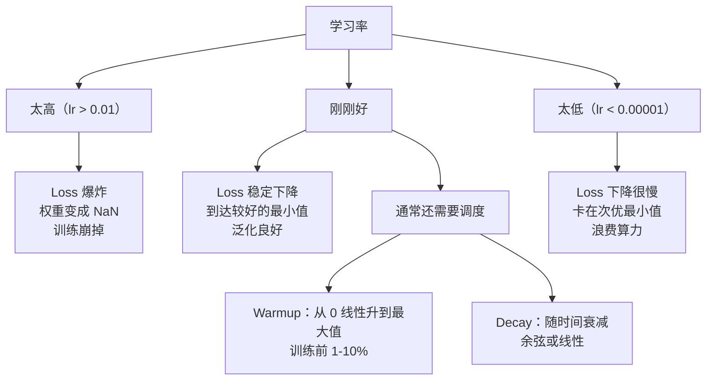
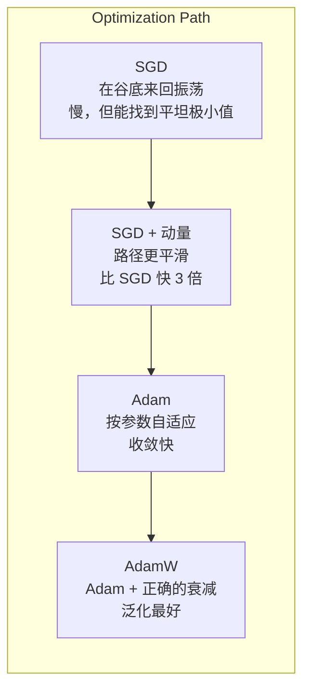
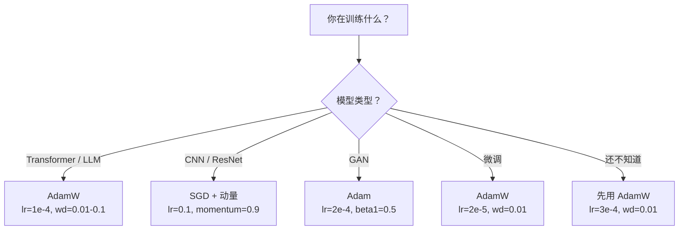

# 优化器

> 梯度下降告诉你往哪个方向走，但没告诉你该走多远、走多快。SGD 像指南针，Adam 像带交通信息的 GPS。

**类型：** 构建
**语言：** Python
**先修：** 第 03.05 课（损失函数）
**时长：** ~75 分钟

## 学习目标

- 从零实现 SGD、带动量的 SGD、Adam 和 AdamW 优化器
- 解释 Adam 的偏差校正如何补偿训练早期零初始化的动量估计
- 说明为什么 AdamW 在同一任务上通常比带 L2 正则的 Adam 有更好的泛化能力
- 为 Transformer、CNN、GAN 和微调选择合适的优化器和默认超参数

## 问题

你已经算出了梯度。你知道第 4,721 个权重要减小 0.003 才能降低损失。但 0.003 的单位是什么？按什么尺度？第 1 步和第 1,000 步应该移动一样多吗？

普通梯度下降在每一步都对每个参数使用同一个学习率：`w = w - lr * gradient`。这在训练神经网络时会带来三个实际问题。

第一，振荡。损失地形很少是一个平滑的碗，更像一条又长又窄的山谷。梯度指向山谷的横向（陡峭方向），而不是沿山谷前进的纵向（平缓方向）。梯度下降会在窄方向上来回弹跳，同时在有用方向上只前进一点点。你见过这种情况：loss 先掉得很快，然后停滞不前，不是因为收敛了，而是因为一直在振荡。

第二，所有参数用一个学习率是不对的。有些权重需要大步更新，它们还处于欠拟合阶段；有些权重只需要很小的更新，因为已经接近最优。适合前者的学习率会毁掉后者，反过来也一样。

第三，鞍点。在高维空间里，损失地形有大片梯度接近 0 的平坦区域。普通 SGD 只能按当前梯度的速度慢慢爬过去，而这个速度几乎就是 0。模型看起来像卡住了。其实它只是处在一个平坦区域，另一边还有可下降的方向。但 SGD 没有办法主动穿过去。

Adam 把这三个问题都解决了。它为每个参数维护两个滑动平均 - 梯度均值（动量，解决振荡）和梯度平方均值（自适应步长，处理尺度差异）。再加上前几步的偏差校正，它给你一个默认就能解决 80% 问题的优化器。本课会从零实现它，这样你就能清楚知道它在哪些地方会失败，也就是剩下 20% 的问题。

## 概念

### 随机梯度下降（SGD）

最简单的优化器。计算一个 mini-batch 的梯度，然后往反方向走一步。

```text
w = w - lr * gradient
```

“随机”指的是你用随机子集（mini-batch）来估计梯度，而不是全量数据。这个噪声其实有用，它能帮助跳出尖锐的局部最小值。但噪声也会带来振荡。

学习率是唯一需要调的旋钮。太高，loss 会发散；太低，训练会慢得离谱。最佳值取决于网络结构、数据、batch size 和训练阶段。对现代网络上的普通 SGD 来说，常见范围是 0.01 到 0.1。但即使在同一次训练中，理想学习率也会变化。

### 动量

“球滚下坡”的比喻虽然老套，但确实准确。不是只看当前梯度，而是维护一个会累积历史梯度的速度项。

```text
m_t = beta * m_{t-1} + gradient
w = w - lr * m_t
```

`beta` 通常取 0.9，控制要保留多少历史。`beta=0.9` 时，动量大致相当于最近 10 个梯度的平均（`1 / (1 - 0.9) = 10`）。

它为什么能修复振荡：同方向的梯度会累积，反方向的梯度会互相抵消。在那条窄山谷里，“横向”分量每一步都会换符号，于是被压制；“纵向”分量保持一致，于是被放大。结果就是朝有用方向更平滑地加速。

具体点说：在条件很差的损失地形上，普通 SGD 可能要 10,000 步。加上动量（`beta=0.9`）后，通常只需要 3,000 到 5,000 步。这个加速不是一点点。

### RMSProp

第一个真正有效的“按参数自适应学习率”方法。Hinton 在 Coursera 课程里提出过，但从未正式发表。

```text
s_t = beta * s_{t-1} + (1 - beta) * gradient^2
w = w - lr * gradient / (sqrt(s_t) + epsilon)
```

`s_t` 跟踪平方梯度的滑动平均。持续出现大梯度的参数会除以较大的数，有效学习率变小；梯度一直很小的参数会除以较小的数，有效学习率变大。

这解决了“所有参数一个学习率”的问题。那些已经被频繁大步更新的权重，大概率接近目标了，应该放慢；那些更新一直很小的权重，可能还没学好，应该加快。

`epsilon` 通常取 `1e-8`，用于避免参数还没更新时除以零。

### Adam：动量 + RMSProp

Adam 把这两种思路合在一起。它为每个参数维护两个指数滑动平均：

```text
m_t = beta1 * m_{t-1} + (1 - beta1) * gradient        (first moment: mean)
v_t = beta2 * v_{t-1} + (1 - beta2) * gradient^2       (second moment: variance)
```

**偏差校正**是大多数解释都会跳过的关键细节。在第 1 步，`m_1 = (1 - beta1) * gradient`。如果 `beta1 = 0.9`，那就是 `0.1 * gradient`，小了 10 倍。滑动平均还没“热起来”。偏差校正就是为这个问题补偿：

```text
m_hat = m_t / (1 - beta1^t)
v_hat = v_t / (1 - beta2^t)
```

在第 1 步，`beta1 = 0.9` 时，`m_hat = m_1 / (1 - 0.9) = m_1 / 0.1`，就恢复成真实梯度。到了第 100 步，`1 - 0.9^100` 已经接近 1.0，校正基本消失。偏差校正对前 10 步左右很重要，50 步之后基本无关紧要。

更新公式是：

```text
w = w - lr * m_hat / (sqrt(v_hat) + epsilon)
```

Adam 的默认超参是：`lr = 0.001`、`beta1 = 0.9`、`beta2 = 0.999`、`epsilon = 1e-8`。这些默认值能解决 80% 的问题。遇到不收敛时，先改 lr，再改 beta2，几乎不要动 beta1 或 epsilon。

### AdamW：把权重衰减做对

L2 正则化会在 loss 里加上 `lambda * w^2`。在普通 SGD 中，这等价于 weight decay，也就是每一步从权重里减去一部分 `lambda * w`。但在 Adam 中，这个等价关系被打破了。

Loshchilov 和 Hutter 的关键发现是：当你把 L2 加进 loss 里再让 Adam 处理梯度时，自适应学习率也会缩放正则项。梯度方差大的参数受到的正则化更少，方差小的参数受到的正则化更多。这不是你想要的。你想要的是不管梯度统计如何，都施加同样的正则化。

AdamW 的做法是：在 Adam 更新之后，直接对权重做 weight decay。

```text
w = w - lr * m_hat / (sqrt(v_hat) + epsilon) - lr * lambda * w
```

`lr * lambda * w` 这一项不会被 Adam 的自适应因子缩放。每个参数都得到相同比例的收缩。

这看起来只是一个小细节，但它非常重要。AdamW 在几乎所有任务上的收敛效果都比 Adam + L2 正则更好。它是 PyTorch 里训练 Transformer、扩散模型和大多数现代架构的默认优化器。BERT、GPT、LLaMA、Stable Diffusion，都是用 AdamW 训练出来的。

### 学习率：最重要的超参数



如果只能调一个超参数，就调学习率。学习率变化 10 倍，比你做出的任何架构决定都更重要。常见默认值：

- SGD：`lr = 0.01` 到 `0.1`
- Adam/AdamW：`lr = 1e-4` 到 `3e-4`
- 微调预训练模型：`lr = 1e-5` 到 `5e-5`
- 学习率 warmup：前 1-10% 的 step 线性升高

### 优化器比较



### 什么时候哪个优化器更好



```figure
optimizer-trajectory
```

## 动手实现

### 第 1 步：基础 SGD

```python
class SGD:
    def __init__(self, lr=0.01):
        self.lr = lr

    def step(self, params, grads):
        for i in range(len(params)):
            params[i] -= self.lr * grads[i]
```

### 第 2 步：带动量的 SGD

```python
class SGDMomentum:
    def __init__(self, lr=0.01, beta=0.9):
        self.lr = lr
        self.beta = beta
        self.velocities = None

    def step(self, params, grads):
        if self.velocities is None:
            self.velocities = [0.0] * len(params)
        for i in range(len(params)):
            self.velocities[i] = self.beta * self.velocities[i] + grads[i]
            params[i] -= self.lr * self.velocities[i]
```

### 第 3 步：Adam

```python
import math

class Adam:
    def __init__(self, lr=0.001, beta1=0.9, beta2=0.999, epsilon=1e-8):
        self.lr = lr
        self.beta1 = beta1
        self.beta2 = beta2
        self.epsilon = epsilon
        self.m = None
        self.v = None
        self.t = 0

    def step(self, params, grads):
        if self.m is None:
            self.m = [0.0] * len(params)
            self.v = [0.0] * len(params)

        self.t += 1

        for i in range(len(params)):
            self.m[i] = self.beta1 * self.m[i] + (1 - self.beta1) * grads[i]
            self.v[i] = self.beta2 * self.v[i] + (1 - self.beta2) * grads[i] ** 2

            m_hat = self.m[i] / (1 - self.beta1 ** self.t)
            v_hat = self.v[i] / (1 - self.beta2 ** self.t)

            params[i] -= self.lr * m_hat / (math.sqrt(v_hat) + self.epsilon)
```

### 第 4 步：AdamW

```python
class AdamW:
    def __init__(self, lr=0.001, beta1=0.9, beta2=0.999, epsilon=1e-8, weight_decay=0.01):
        self.lr = lr
        self.beta1 = beta1
        self.beta2 = beta2
        self.epsilon = epsilon
        self.weight_decay = weight_decay
        self.m = None
        self.v = None
        self.t = 0

    def step(self, params, grads):
        if self.m is None:
            self.m = [0.0] * len(params)
            self.v = [0.0] * len(params)

        self.t += 1

        for i in range(len(params)):
            self.m[i] = self.beta1 * self.m[i] + (1 - self.beta1) * grads[i]
            self.v[i] = self.beta2 * self.v[i] + (1 - self.beta2) * grads[i] ** 2

            m_hat = self.m[i] / (1 - self.beta1 ** self.t)
            v_hat = self.v[i] / (1 - self.beta2 ** self.t)

            params[i] -= self.lr * m_hat / (math.sqrt(v_hat) + self.epsilon)
            params[i] -= self.lr * self.weight_decay * params[i]
```

### 第 5 步：训练对比

用第 05 课的圆形数据集，在同一个两层网络上比较四种优化器的收敛。

```python
import random

def sigmoid(x):
    x = max(-500, min(500, x))
    return 1.0 / (1.0 + math.exp(-x))

def make_circle_data(n=200, seed=42):
    random.seed(seed)
    data = []
    for _ in range(n):
        x = random.uniform(-2, 2)
        y = random.uniform(-2, 2)
        label = 1.0 if x * x + y * y < 1.5 else 0.0
        data.append(([x, y], label))
    return data


class OptimizerTestNetwork:
    def __init__(self, optimizer, hidden_size=8):
        random.seed(0)
        self.hidden_size = hidden_size
        self.optimizer = optimizer

        self.w1 = [[random.gauss(0, 0.5) for _ in range(2)] for _ in range(hidden_size)]
        self.b1 = [0.0] * hidden_size
        self.w2 = [random.gauss(0, 0.5) for _ in range(hidden_size)]
        self.b2 = 0.0

    def get_params(self):
        params = []
        for row in self.w1:
            params.extend(row)
        params.extend(self.b1)
        params.extend(self.w2)
        params.append(self.b2)
        return params

    def set_params(self, params):
        idx = 0
        for i in range(self.hidden_size):
            for j in range(2):
                self.w1[i][j] = params[idx]
                idx += 1
        for i in range(self.hidden_size):
            self.b1[i] = params[idx]
            idx += 1
        for i in range(self.hidden_size):
            self.w2[i] = params[idx]
            idx += 1
        self.b2 = params[idx]

    def forward(self, x):
        self.x = x
        self.z1 = []
        self.h = []
        for i in range(self.hidden_size):
            z = self.w1[i][0] * x[0] + self.w1[i][1] * x[1] + self.b1[i]
            self.z1.append(z)
            self.h.append(max(0.0, z))

        self.z2 = sum(self.w2[i] * self.h[i] for i in range(self.hidden_size)) + self.b2
        self.out = sigmoid(self.z2)
        return self.out

    def compute_grads(self, target):
        eps = 1e-15
        p = max(eps, min(1 - eps, self.out))
        d_loss = -(target / p) + (1 - target) / (1 - p)
        d_sigmoid = self.out * (1 - self.out)
        d_out = d_loss * d_sigmoid

        grads = [0.0] * (self.hidden_size * 2 + self.hidden_size + self.hidden_size + 1)
        idx = 0
        for i in range(self.hidden_size):
            d_relu = 1.0 if self.z1[i] > 0 else 0.0
            d_h = d_out * self.w2[i] * d_relu
            grads[idx] = d_h * self.x[0]
            grads[idx + 1] = d_h * self.x[1]
            idx += 2

        for i in range(self.hidden_size):
            d_relu = 1.0 if self.z1[i] > 0 else 0.0
            grads[idx] = d_out * self.w2[i] * d_relu
            idx += 1

        for i in range(self.hidden_size):
            grads[idx] = d_out * self.h[i]
            idx += 1

        grads[idx] = d_out
        return grads

    def train(self, data, epochs=300):
        losses = []
        for epoch in range(epochs):
            total_loss = 0.0
            correct = 0
            for x, y in data:
                pred = self.forward(x)
                grads = self.compute_grads(y)
                params = self.get_params()
                self.optimizer.step(params, grads)
                self.set_params(params)

                eps = 1e-15
                p = max(eps, min(1 - eps, pred))
                total_loss += -(y * math.log(p) + (1 - y) * math.log(1 - p))
                if (pred >= 0.5) == (y >= 0.5):
                    correct += 1
            avg_loss = total_loss / len(data)
            accuracy = correct / len(data) * 100
            losses.append((avg_loss, accuracy))
            if epoch % 75 == 0 or epoch == epochs - 1:
                print(f"    第 {epoch:3d} 轮：损失={avg_loss:.4f}，准确率={accuracy:.1f}%")
        return losses
```

## 使用它

PyTorch 优化器支持参数组、梯度裁剪和学习率调度：

```python
import torch
import torch.optim as optim

model = torch.nn.Sequential(
    torch.nn.Linear(784, 256),
    torch.nn.ReLU(),
    torch.nn.Linear(256, 10),
)

optimizer = optim.AdamW(model.parameters(), lr=3e-4, weight_decay=0.01)

scheduler = optim.lr_scheduler.CosineAnnealingLR(optimizer, T_max=100)

for epoch in range(100):
    optimizer.zero_grad()
    output = model(torch.randn(32, 784))
    loss = torch.nn.functional.cross_entropy(output, torch.randint(0, 10, (32,)))
    loss.backward()
    torch.nn.utils.clip_grad_norm_(model.parameters(), max_norm=1.0)
    optimizer.step()
    scheduler.step()
```

模式永远是：`zero_grad`、前向、loss、反向、（裁剪）、step、（调度）。把这个顺序记住。顺序搞错，比如在 `optimizer.step()` 之前调用 `scheduler.step()`，很容易引入细微 bug。对于 CNN，很多从业者仍然更喜欢 SGD + momentum（`lr=0.1`、`momentum=0.9`、`weight_decay=1e-4`）配合 step 或 cosine 调度。SGD 往往能找到更平坦的最小值，通常泛化更好。对于 Transformer 和 LLM，带 warmup + cosine decay 的 AdamW 是事实上的默认选择。没有经过测量的理由，不要轻易违背这个共识。

## 交付物

本课会产出：
- `outputs/prompt-optimizer-selector.md` - 一个用于为任意架构选择合适优化器和学习率的决策提示

## 练习

1. 实现 Nesterov 动量，也就是在“前瞻”位置 `w - lr * beta * v` 计算梯度，而不是在当前位置。把它和圆形数据集上的标准动量做收敛对比。

2. 实现学习率 warmup：在训练前 10% 的 step 里，把 lr 从 0 线性升到 max_lr，然后再余弦衰减到 0。比较 Adam + warmup 和不带 warmup 的 Adam 在圆形数据集上达到 90% 准确率需要多少个 epoch。

3. 跟踪 Adam 训练期间每个参数的有效学习率。有效学习率定义为 `lr * m_hat / (sqrt(v_hat) + eps)`。画出 10、50 和 200 步后有效学习率的分布。所有参数的更新速度一样吗？

4. 实现梯度裁剪（按全局范数裁剪）。把最大梯度范数设为 1.0。用较大学习率（Adam 的 `lr=0.01`）分别训练有裁剪和无裁剪的模型。统计 10 个随机种子下，有裁剪和无裁剪时分别有多少次训练发散（loss 变成 NaN）。

5. 在一个初始权重很大的网络上比较 Adam 和 AdamW。把所有权重初始化为 [-5, 5] 之间的随机值（比正常初始化大得多），训练 200 个 epoch，`weight_decay=0.1`。画出两种优化器训练过程中权重 L2 范数的变化。AdamW 应该会更快地收缩权重。

## 术语表

| 术语 | 常见说法 | 实际含义 |
|------|----------|---------|
| 学习率 | “步长” | 梯度更新的标量乘数，是训练中影响最大的超参数 |
| SGD | “基础梯度下降” | 随机梯度下降：在 mini-batch 上估计梯度，然后减去 `lr * gradient` 来更新权重 |
| 动量 | “滚动的小球” | 历史梯度的指数滑动平均；抑制振荡，并沿一致方向加速 |
| RMSProp | “自适应学习率” | 用最近梯度的运行 RMS 去除每个参数的梯度；让学习率更均衡 |
| Adam | “默认优化器” | 把动量（一阶矩）和 RMSProp（二阶矩）结合起来，并对初始步骤做偏差校正 |
| AdamW | “做对了的 Adam” | 解耦权重衰减的 Adam；直接对权重做正则化，而不是通过梯度间接实现 |
| 偏差校正 | “滑动平均的热身修正” | 通过除以 `(1 - beta^t)` 补偿 Adam 矩估计的零初始化 |
| 权重衰减 | “让权重变小” | 每一步从权重值里减去一小部分；一种惩罚大权重的正则化 |
| 学习率调度 | “随时间调整 lr” | 训练过程中动态调整学习率的函数；warmup + cosine decay 是现代默认方案 |
| 梯度裁剪 | “限制梯度范数” | 当梯度向量的范数超过阈值时，按比例缩小它；防止梯度更新爆炸 |

## 延伸阅读

- Kingma & Ba, “Adam: A Method for Stochastic Optimization” (2014) - 原始 Adam 论文，包含收敛分析和偏差校正推导
- Loshchilov & Hutter, “Decoupled Weight Decay Regularization” (2017) - 证明 L2 正则化和 weight decay 在 Adam 中并不等价，并提出 AdamW
- Smith, “Cyclical Learning Rates for Training Neural Networks” (2017) - 提出了 LR range test 和循环调度，减少了固定学习率的调参需求
- Ruder, “An Overview of Gradient Descent Optimization Algorithms” (2016) - 对所有优化器变体最清晰的一篇综述，比较和直觉都很完整
