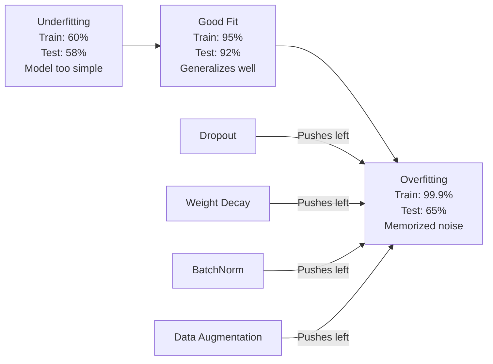
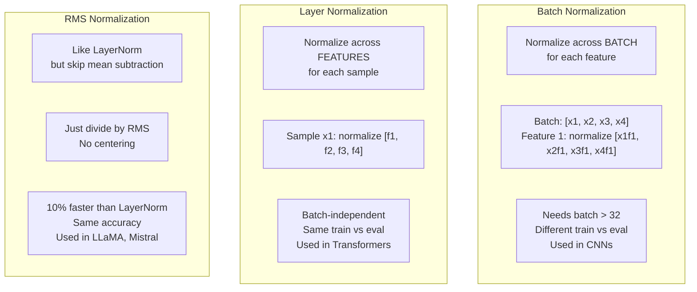
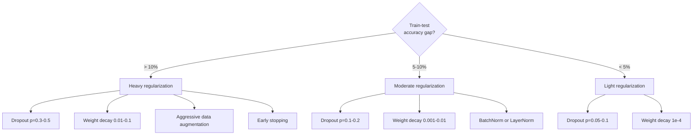

# 正则化

> 您的模型在训练数据上的准确率达到 99%，在测试数据上的准确率达到 60%。它是记忆而不是学习。正则化是对复杂性施加的税收，以强制泛化。

**类型：** 构建
**语言：** Python
**先决条件：** 第 03.06 课（优化器）
**时间：** ~75 分钟

## 学习目标

- 从头开始通过反向缩放、L2 权重衰减、批量归一化、层归一化和 RMSNorm 实现 dropout
- 使用正则化实验测量训练-测试准确性差距并诊断过度拟合
- 解释为什么 Transformer 使用 LayerNorm 而不是 BatchNorm，以及为什么现代法学硕士更喜欢 RMSNorm
- 根据过度拟合的严重程度应用正则化技术的正确组合

## 问题

具有足够参数的神经网络可以记住任何数据集。这不是一个假设——Zhang 等人。 (2017) 通过使用随机标签在 ImageNet 上训练标准网络证明了这一点。该网络在完全随机的标签分配上达到了接近零的训练损失。他们记住了一百万个随机输入输出对，没有任何模式可供学习。训练损失是完美的。测试准确度为零。

这就是过度拟合问题，并且随着模型变大，情况会变得更糟。 GPT-3 有 1750 亿个参数。训练集大约有5000亿个token。有了这么多参数，模型就有足够的能力逐字记忆大量训练数据。如果没有正则化，它只会重复训练示例，而不是学习可概括的模式。训练性能和测试性能之间的差距就是过拟合差距。本课中的每项技术都从不同的角度解决了这个问题。 Dropout 迫使网络不依赖任何单个神经元。权重衰减可防止任何单个权重变得太大。批量归一化可以平滑损失情况，因此优化器可以找到更平坦、更通用的最小值。层归一化执行相同的操作，但适用于批量归一化失败的情况（小批量、可变长度序列）。 RMSNorm 通过放弃均值计算，速度提高了 10%。每种技术都很简单。它们共同构成了记忆模型和泛化模型之间的区别。

## 概念

### 过度拟合谱

每个模型都处于从欠拟合（太简单而无法捕获模式）到过度拟合（太复杂以至于捕获噪声）的范围内。最佳点位于两者之间，正则化将模型从过度拟合的一侧推向最佳点。



### 辍学

最简单的正则化技术，最优雅的解释。在训练期间，以概率 p 随机将每个神经元的输出设置为零。

```
output = activation(z) * mask    where mask[i] ~ Bernoulli(1 - p)
```

当 p = 0.5 时，一半神经元在每次前向传递时都归零。网络必须学习冗余表示，因为它无法预测哪些神经元可用。这阻止了共同适应——神经元学习依赖存在的特定其他神经元。

集成解释：具有 N 个神经元和 dropout 的网络创建 2^N 个可能的子网络（神经元打开或关闭的每种组合）。使用 dropout 进行训练大约会同时训练所有 2^N 个子网络，每个子网络都在不同的小批量上。在测试时，您使用所有神经元（无丢失）并将输出缩放 (1 - p) 以匹配训练期间的预期值。这相当于对 2^N 个子网络的预测进行平均——来自单个模型的大规模集合。

实际上，缩放是在训练期间而不是测试期间应用的（反向 dropout）：

```
During training:  output = activation(z) * mask / (1 - p)
During testing:   output = activation(z)   (no change needed)
```

这更干净，因为测试代码根本不需要了解 dropout。默认率：变压器 p = 0.1，MLP p = 0.5，CNN p = 0.2-0.3。更高的 dropout = 更强的正则化 = 更大的欠拟合风险。

### 权重衰减（L2 正则化）

将所有权重的平方大小添加到损失中：

```
total_loss = task_loss + (lambda / 2) * sum(w_i^2)
```

正则化项的梯度为 lambda * w。这意味着在每一步中，每个权重都会按与其大小成比例的分数向零收缩。大重量会受到更多惩罚。该模型被推向没有单一权重占主导地位的解决方案。

为什么这有助于泛化：过度拟合模型往往具有较大的权重，会放大训练数据中的噪声。权重衰减使权重保持较小，这限制了模型的有效容量，并迫使其依赖于稳健的、可概括的特征，而不是记忆中的怪癖。

lambda 超参数控制强度。典型值：

- 变形金刚上的 AdamW 为 0.01
- CNN 上的 SGD 为 1e-4
- 0.1 对于严重过度拟合的模型

正如第 06 课中所讨论的：权重衰减和 L2 正则化在 SGD 中是等效的，但在 Adam 中则不然。使用 Adam 进行训练时，始终使用 AdamW（解耦权重衰减）。

### 批量归一化

在将小批量中每一层的输出传递到下一层之前对其进行标准化。

对于某个层的小批量激活：

```
mu = (1/B) * sum(x_i)           (batch mean)
sigma^2 = (1/B) * sum((x_i - mu)^2)   (batch variance)
x_hat = (x_i - mu) / sqrt(sigma^2 + eps)   (normalize)
y = gamma * x_hat + beta        (scale and shift)
```

Gamma 和 beta 是可学习的参数，可以让网络在最佳情况下撤消归一化。如果没有它们，您将强制每一层的输出为零均值单位方差，这可能不是网络想要的。

**训练与推理分割：** 在训练期间，mu 和 sigma 来自当前的小批量。在推理过程中，您使用训练期间积累的运行平均值（动量 = 0.1 的指数移动平均值，意味着 90% 旧 + 10% 新）。BatchNorm 为何有效仍存在争议。原始论文声称它减少了“内部协变量偏移”（层输入的分布随着早期层的更新而变化）。桑图尔卡等人。 （2018）表明这种解释是错误的。真正的原因：BatchNorm 使损失情况更加平滑。梯度更具预测性，Lipschitz 常数更小，优化器可以安全地采取更大的步骤。这就是为什么 BatchNorm 可以让您使用更高的学习率并更快地收敛。

BatchNorm 有一个基本限制：它依赖于批量统计数据。当批量大小为 1 时，均值和方差毫无意义。对于小批量（< 32），统计数据充满噪音并损害性能。这对于对象检测（内存限制批量大小）和语言建模（序列长度变化）等任务很重要。

### 层标准化

跨特征而不是跨批次标准化。对于单个样本：

```
mu = (1/D) * sum(x_j)           (feature mean)
sigma^2 = (1/D) * sum((x_j - mu)^2)   (feature variance)
x_hat = (x_j - mu) / sqrt(sigma^2 + eps)
y = gamma * x_hat + beta
```

D 是特征维度。每个样本都独立标准化——不依赖于批量大小。这就是变压器使用 LayerNorm 而不是 BatchNorm 的原因。序列的长度可变，批量大小通常很小（或在生成期间为 1），并且训练和推理之间的计算是相同的。

Transformer 中的 LayerNorm 应用在每个自注意力块和每个前馈块之后（Post-LN），或者在它们之前（Pre-LN，对于训练来说更稳定）。

### RMSNorm

没有均值减法的 LayerNorm。由Zhang & Sennrich (2019) 提出。

```
rms = sqrt((1/D) * sum(x_j^2))
y = gamma * x / rms
```

就是这样。没有平均计算，没有 beta 参数。观察结果：LayerNorm 中的重新居中（均值减法）对模型性能的贡献很小，但会增加计算成本。删除它可以提供相同的精度，但开销会减少约 10%。

LLaMA、LLaMA 2、LLaMA 3、Mistral 和大多数现代 LLM 使用 RMSNorm 而不是 LayerNorm。对于数十亿个参数和数万亿个代币的规模来说，这 10% 的节省是非常可观的。

### 标准化比较



### 数据增强作为正则化

不是模型修改，而是数据修改。转换训练输入，同时保留标签：- 图像：随机裁剪、翻转、旋转、颜色抖动、剪切
- 文本：同义词替换、回译、随机删除
- 音频：时间拉伸、音高变换、噪声添加

其效果与正则化相同：它增加了训练集的有效大小，使模型更难记住特定的示例。每个图像的原始形式只看过一次的模型就可以记住它。看到每张图像 50 个增强版本的模型被迫学习不变结构。

### 提前停止

最简单的正则化器：当验证损失开始增加时停止训练。此时模型尚未过度拟合。在实践中，您可以跟踪每个 epoch 的验证损失，保存最佳模型，并继续训练“耐心”窗口（通常为 5-20 epoch）。如果验证损失在耐心窗口内没有改善，您将停止并加载保存的最佳模型。

### 何时应用什么



```figure
l2-regularization
```

## 构建它

### 第 1 步：Dropout（训练和评估模式）

```python
import random
import math


class Dropout:
    def __init__(self, p=0.5):
        self.p = p
        self.training = True
        self.mask = None

    def forward(self, x):
        if not self.training:
            return list(x)
        self.mask = []
        output = []
        for val in x:
            if random.random() < self.p:
                self.mask.append(0)
                output.append(0.0)
            else:
                self.mask.append(1)
                output.append(val / (1 - self.p))
        return output

    def backward(self, grad_output):
        grads = []
        for g, m in zip(grad_output, self.mask):
            if m == 0:
                grads.append(0.0)
            else:
                grads.append(g / (1 - self.p))
        return grads
```

### 步骤 2：L2 权重衰减

```python
def l2_regularization(weights, lambda_reg):
    penalty = 0.0
    for w in weights:
        penalty += w * w
    return lambda_reg * 0.5 * penalty

def l2_gradient(weights, lambda_reg):
    return [lambda_reg * w for w in weights]
```

### 步骤 3：批量归一化

```python
class BatchNorm:
    def __init__(self, num_features, momentum=0.1, eps=1e-5):
        self.gamma = [1.0] * num_features
        self.beta = [0.0] * num_features
        self.eps = eps
        self.momentum = momentum
        self.running_mean = [0.0] * num_features
        self.running_var = [1.0] * num_features
        self.training = True
        self.num_features = num_features

    def forward(self, batch):
        batch_size = len(batch)
        if self.training:
            mean = [0.0] * self.num_features
            for sample in batch:
                for j in range(self.num_features):
                    mean[j] += sample[j]
            mean = [m / batch_size for m in mean]

            var = [0.0] * self.num_features
            for sample in batch:
                for j in range(self.num_features):
                    var[j] += (sample[j] - mean[j]) ** 2
            var = [v / batch_size for v in var]

            for j in range(self.num_features):
                self.running_mean[j] = (1 - self.momentum) * self.running_mean[j] + self.momentum * mean[j]
                self.running_var[j] = (1 - self.momentum) * self.running_var[j] + self.momentum * var[j]
        else:
            mean = list(self.running_mean)
            var = list(self.running_var)

        self.x_hat = []
        output = []
        for sample in batch:
            normalized = []
            out_sample = []
            for j in range(self.num_features):
                x_h = (sample[j] - mean[j]) / math.sqrt(var[j] + self.eps)
                normalized.append(x_h)
                out_sample.append(self.gamma[j] * x_h + self.beta[j])
            self.x_hat.append(normalized)
            output.append(out_sample)
        return output
```

### 步骤 4：层标准化

```python
class LayerNorm:
    def __init__(self, num_features, eps=1e-5):
        self.gamma = [1.0] * num_features
        self.beta = [0.0] * num_features
        self.eps = eps
        self.num_features = num_features

    def forward(self, x):
        mean = sum(x) / len(x)
        var = sum((xi - mean) ** 2 for xi in x) / len(x)

        self.x_hat = []
        output = []
        for j in range(self.num_features):
            x_h = (x[j] - mean) / math.sqrt(var + self.eps)
            self.x_hat.append(x_h)
            output.append(self.gamma[j] * x_h + self.beta[j])
        return output
```

### 步骤 5：RMSNorm

```python
class RMSNorm:
    def __init__(self, num_features, eps=1e-6):
        self.gamma = [1.0] * num_features
        self.eps = eps
        self.num_features = num_features

    def forward(self, x):
        rms = math.sqrt(sum(xi * xi for xi in x) / len(x) + self.eps)
        output = []
        for j in range(self.num_features):
            output.append(self.gamma[j] * x[j] / rms)
        return output
```

### 步骤 6：使用和不使用正则化的训练

```python
def sigmoid(x):
    x = max(-500, min(500, x))
    return 1.0 / (1.0 + math.exp(-x))


def make_circle_data(n=200, seed=42):
    random.seed(seed)
    data = []
    for _ in range(n):
        x = random.uniform(-2, 2)
        y = random.uniform(-2, 2)
        label = 1.0 if x * x + y * y < 1.5 else 0.0
        data.append(([x, y], label))
    return data


class RegularizedNetwork:
    def __init__(self, hidden_size=16, lr=0.05, dropout_p=0.0, weight_decay=0.0):
        random.seed(0)
        self.hidden_size = hidden_size
        self.lr = lr
        self.dropout_p = dropout_p
        self.weight_decay = weight_decay
        self.dropout = Dropout(p=dropout_p) if dropout_p > 0 else None

        self.w1 = [[random.gauss(0, 0.5) for _ in range(2)] for _ in range(hidden_size)]
        self.b1 = [0.0] * hidden_size
        self.w2 = [random.gauss(0, 0.5) for _ in range(hidden_size)]
        self.b2 = 0.0

    def forward(self, x, training=True):
        self.x = x
        self.z1 = []
        self.h = []
        for i in range(self.hidden_size):
            z = self.w1[i][0] * x[0] + self.w1[i][1] * x[1] + self.b1[i]
            self.z1.append(z)
            self.h.append(max(0.0, z))

        if self.dropout and training:
            self.dropout.training = True
            self.h = self.dropout.forward(self.h)
        elif self.dropout:
            self.dropout.training = False
            self.h = self.dropout.forward(self.h)

        self.z2 = sum(self.w2[i] * self.h[i] for i in range(self.hidden_size)) + self.b2
        self.out = sigmoid(self.z2)
        return self.out

    def backward(self, target):
        eps = 1e-15
        p = max(eps, min(1 - eps, self.out))
        d_loss = -(target / p) + (1 - target) / (1 - p)
        d_sigmoid = self.out * (1 - self.out)
        d_out = d_loss * d_sigmoid

        for i in range(self.hidden_size):
            d_relu = 1.0 if self.z1[i] > 0 else 0.0
            d_h = d_out * self.w2[i] * d_relu
            self.w2[i] -= self.lr * (d_out * self.h[i] + self.weight_decay * self.w2[i])
            for j in range(2):
                self.w1[i][j] -= self.lr * (d_h * self.x[j] + self.weight_decay * self.w1[i][j])
            self.b1[i] -= self.lr * d_h
        self.b2 -= self.lr * d_out

    def evaluate(self, data):
        correct = 0
        total_loss = 0.0
        for x, y in data:
            pred = self.forward(x, training=False)
            eps = 1e-15
            p = max(eps, min(1 - eps, pred))
            total_loss += -(y * math.log(p) + (1 - y) * math.log(1 - p))
            if (pred >= 0.5) == (y >= 0.5):
                correct += 1
        return total_loss / len(data), correct / len(data) * 100

    def train_model(self, train_data, test_data, epochs=300):
        history = []
        for epoch in range(epochs):
            total_loss = 0.0
            correct = 0
            for x, y in train_data:
                pred = self.forward(x, training=True)
                self.backward(y)
                eps = 1e-15
                p = max(eps, min(1 - eps, pred))
                total_loss += -(y * math.log(p) + (1 - y) * math.log(1 - p))
                if (pred >= 0.5) == (y >= 0.5):
                    correct += 1
            train_loss = total_loss / len(train_data)
            train_acc = correct / len(train_data) * 100
            test_loss, test_acc = self.evaluate(test_data)
            history.append((train_loss, train_acc, test_loss, test_acc))
            if epoch % 75 == 0 or epoch == epochs - 1:
                gap = train_acc - test_acc
                print(f"    Epoch {epoch:3d}: train_acc={train_acc:.1f}%, test_acc={test_acc:.1f}%, gap={gap:.1f}%")
        return history
```

## 使用它

PyTorch 以模块的形式提供所有标准化和正则化：

```python
import torch
import torch.nn as nn

model = nn.Sequential(
    nn.Linear(784, 256),
    nn.BatchNorm1d(256),
    nn.ReLU(),
    nn.Dropout(0.3),
    nn.Linear(256, 128),
    nn.BatchNorm1d(128),
    nn.ReLU(),
    nn.Dropout(0.3),
    nn.Linear(128, 10),
)

model.train()
out_train = model(torch.randn(32, 784))

model.eval()
out_test = model(torch.randn(1, 784))
```

`model.train()` / `model.eval()` 切换至关重要。它打开/关闭 dropout 并告诉 BatchNorm 使用批量统计数据与运行统计数据。在推理之前忘记 `model.eval()` 是深度学习中最常见的错误之一。您的测试准确性将随机波动，因为 dropout 仍然处于活动状态并且 BatchNorm 正在使用小批量统计数据。

对于变压器来说，模式是不同的：

```python
class TransformerBlock(nn.Module):
    def __init__(self, d_model=512, nhead=8, dropout=0.1):
        super().__init__()
        self.attention = nn.MultiheadAttention(d_model, nhead, dropout=dropout)
        self.norm1 = nn.LayerNorm(d_model)
        self.ff = nn.Sequential(
            nn.Linear(d_model, d_model * 4),
            nn.GELU(),
            nn.Linear(d_model * 4, d_model),
            nn.Dropout(dropout),
        )
        self.norm2 = nn.LayerNorm(d_model)
        self.dropout = nn.Dropout(dropout)

    def forward(self, x):
        attended, _ = self.attention(x, x, x)
        x = self.norm1(x + self.dropout(attended))
        x = self.norm2(x + self.ff(x))
        return x
```

LayerNorm，而不是 BatchNorm。辍学率 p=0.1，而不是 p=0.5。这些是变压器默认值。

## 发货

本课产生：
- `outputs/prompt-regularization-advisor.md` -- 诊断过度拟合并推荐正确的正则化策略的提示

## 练习1. 对 2D 数据实现空间 dropout：不是丢弃单个神经元，而是丢弃整个特征通道。通过将连续特征组视为通道并丢弃整个组来模拟这一点。将训练-测试差距与隐藏大小=32 的圆数据集上的标准 dropout 进行比较。

2. 结合本课的 dropout 实施第 05 课中的标签平滑。使用四种配置进行训练：两者都不是、仅 dropout、仅标签平滑、两者。测量每个结果的最终训练测试精度差距。哪种组合给出的间隙最小？

3. 在圆形数据集网络的隐藏层和激活层之间添加 BatchNorm 层。使用或不使用 BatchNorm 以学习率 0.01、0.05 和 0.1 进行训练。 BatchNorm 应该允许在普通网络发散的情况下以更高的学习率进行稳定的训练。

4. 实施早期停止：跟踪每个 epoch 的测试损失，保存最佳权重，如果测试损失在 20 个 epoch 内没有改善，则停止。运行正则化网络 1000 个时期。报告哪个 epoch 具有最佳的测试准确性以及您节省了多少个 epoch 的计算。

5. 在 4 层网络（不仅仅是 2 层）上比较 LayerNorm 与 RMSNorm。使用相同的权重初始化两者。训练 200 个 epoch，并比较第一层的最终精度、训练速度（每个 epoch 的时间）和梯度大小。验证 RMSNorm 在相同精度下速度更快。

## 关键术语

|术语 |人们怎么说|它实际上意味着什么 |
|------|----------------|----------------------|
|过度拟合 | “模型记住了数据” |当模型的训练性能显着超过其测试性能时，表明它学习到了噪声而不是信号 |
|正则化| “防止过度拟合” |任何限制模型复杂性以提高泛化能力的技术：dropout、权重衰减、归一化、增强 |
|辍学| “随机神经元删除” |在训练过程中以概率 p 将随机神经元归零，强制冗余表示；相当于训练一个集成 |
|体重衰减| “L2 惩罚” |通过在每一步减去 lambda * w 将所有权重缩小到零；通过权重大小来惩罚复杂性 ||批量归一化 | “每批次归一化” |在训练期间使用批量统计数据在批量维度上标准化层输出，在推理期间使用运行平均值 |
|层归一化 | “对每个样本进行归一化”|对每个样本内的特征进行标准化；与批次无关，用于批次大小不同的变压器 |
| RMS 范数 | “没有平均值的 LayerNorm”|均方根归一化；降低 LayerNorm 的平均减法，以同等精度实现 10% 的加速 |
|早停| “在过度拟合之前停止” |当验证损失停止改善时停止训练；最简单的正则化器，经常与其他正则化器一起使用 |
|数据增强| “用更少的数据获取更多的数据”|转换训练输入（翻转、裁剪、噪声）以增加有效数据集大小并强制不变性学习 |
|泛化差距| “训练-测试分割” |训练和测试表现的差异；正规化旨在最大限度地减少这种差距|

## 进一步阅读

- Srivastava 等人，“Dropout：防止神经网络过度拟合的简单方法”（2014 年）——原始的 Dropout 论文，包含集成解释和广泛的实验
- Ioffe 和 Szegedy，“批量归一化：通过减少内部协变量偏移加速深度网络训练”(2015)——介绍了 BatchNorm 及其训练过程，这是引用次数最多的深度学习论文之一
-Zhang 和 Sennrich，“均方根层归一化”(2019)——表明 RMSNorm 与 LayerNorm 精度相匹配，但计算量减少；被 LLaMA 和 Mistral 采用
- 张等人，“理解深度学习需要重新思考泛化”（2017）——具有里程碑意义的论文表明神经网络可以记忆随机标签，挑战传统的泛化观点