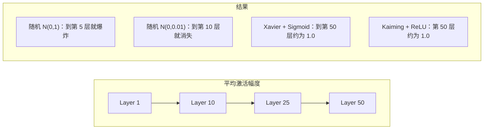
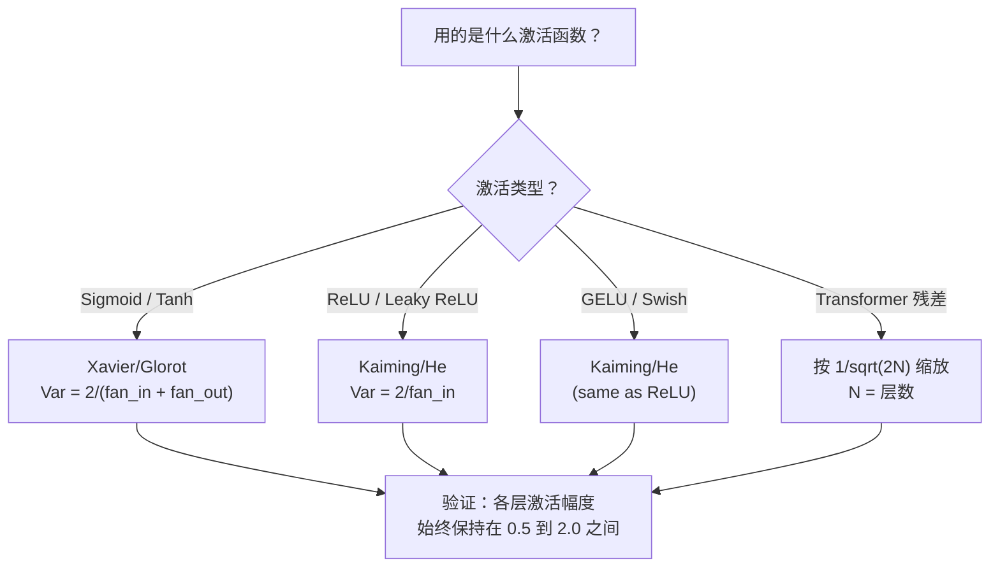

# 权重初始化和训练稳定性

> 初始化错误，训练永远不会开始。初始化右边，50层训练和3层一样顺利。

**类型：** 构建
**语言：** Python
**先决条件：** 第 03.04 课（激活函数）、第 03.07 课（正则化）
**时间：** ~90 分钟

## 学习目标

- 实施零、随机、Xavier/Glorot 和 Kaiming/He 初始化策略，并通过 50 层测量它们对激活幅度的影响
- 推导为什么 Xavier init 使用 Var(w) = 2/(fan_in + fan_out) 而 Kaiming 使用 Var(w) = 2/fan_in
- 演示零初始化的对称问题并解释为什么仅随机尺度是不够的
- 将正确的初始化策略与激活函数相匹配：Xavier 用于 sigmoid/tanh，Kaiming 用于 ReLU/GELU

## 问题

将所有权重初始化为零。什么都学不到。每个神经元计算相同的函数，接收相同的梯度，并进行相同的更新。 10,000 个 epoch 后，您的 512 个神经元隐藏层仍然是同一神经元的 512 个副本。您支付了 512 个参数并获得了 1 个。

初始化它们太大。网络上的激活呈爆炸式增长。到第 10 层，值达到 1e15。到了第 20 层，它们溢出到无穷大。梯度遵循相反的相同轨迹。

从标准正态分布中随机初始化它们。适用于 3 层。在 50 层时，信号会崩溃到零或爆炸到无穷大，具体取决于随机尺度是稍微太小还是稍微太大。 “作品”和“破损”之间的界限非常狭窄。

权重初始化是深度学习中最被低估的决策。建筑学获得论文。优化者获得博客文章。初始化有一个脚注。但如果出错了，其他的都不重要了——你的网络在训练开始之前就已经死掉了。

## 概念

### 对称性问题

层中的每个神经元都具有相同的结构：将输入乘以权重，添加偏差，应用激活。如果所有权重都以相同的值开始（极端情况为零），则每个神经元都会计算相同的输出。在反向传播期间，每个神经元接收相同的梯度。在更新步骤中，每个神经元都会发生相同的变化。你被困住了。该网络有数百个参数，但它们都是同步移动的。这称为对称性，随机初始化是打破它的强力方法。每个神经元都从权重空间中的不同点开始，因此每个神经元都会学习不同的特征。

但“随机”还不够。随机性的“规模”决定了网络是否可以训练。

### 层间方差传播

考虑具有 fan_in 输入的单层：

```
z = w1*x1 + w2*x2 + ... + w_n*x_n
```

如果每个权重 wi 是从方差为 Var(w) 的分布中得出的，并且每个输入 xi 都有方差 Var(x)，则输出方差为：

```
Var(z) = fan_in * Var(w) * Var(x)
```

如果 Var(w) = 1 且 fan_in = 512，则输出方差是输入方差的 512 倍。 10层后：512^10 = 1.2e27。你的信号爆炸了。

如果 Var(w) = 0.001，则每层输出方差缩小 0.001 * 512 = 0.512。 10层后：0.512^10 = 0.00013。你的信号消失了。

目标：选择 Var(w) 使得 Var(z) = Var(x)。信号幅度在各层之间保持恒定。

### Xavier/Glorot 初始化

Glorot 和 Bengio (2010) 导出了 sigmoid 和 tanh 激活的解决方案。为了在前向和后向传递中保持方差恒定：

```
Var(w) = 2 / (fan_in + fan_out)
```

在实践中，权重来自：

```
w ~ Uniform(-limit, limit)  where limit = sqrt(6 / (fan_in + fan_out))
```

或：

```
w ~ Normal(0, sqrt(2 / (fan_in + fan_out)))
```

这是有效的，因为 sigmoid 和 tanh 在零附近大致呈线性，其中正确初始化的激活有效。方差在数十层中保持稳定。

### Kaiming/He 初始化

ReLU 杀死了一半的输出（所有负数都变为零）。有效 fan_in 减半，因为平均一半输入归零。 Xavier init 没有考虑到这一点——它低估了所需的方差。

他等人。 (2015)调整了公式：

```
Var(w) = 2 / fan_in
```

权重取自：

```
w ~ Normal(0, sqrt(2 / fan_in))
```

因子 2 补偿了 ReLU 将一半激活归零。如果没有它，每层信号会缩小约 0.5 倍。 50 层：0.5^50 = 8.8e-16。 Kaiming init 可以防止这种情况发生。

### 变压器初始化

GPT-2 引入了不同的模式。残差连接将每个子层的输出添加到其输入：

```
x = x + sublayer(x)
```

每次添加都会增加方差。对于 N 个残差层，方差与 N 成比例增长。GPT-2 按 1/sqrt(2N) 缩放残差层的权重，其中 N 是层数。这使累积的信号幅度保持稳定。

Llama 3（405B 参数，126 层）使用类似的方案。如果没有这种扩展，残余流将通过 126 层注意力和前馈块无限增长。

```mermaid
flowchart TD
    subgraph "零初始化"
        Z1["第 1 层<br/>所有权重都为 0"] --> Z2["第 2 层<br/>所有神经元都一样"]
        Z2 --> Z3["第 3 层<br/>仍然一样"]
        Z3 --> ZR["结果：只有 1 个有效神经元<br/>与宽度无关"]
    end

    subgraph "Xavier 初始化"
        X1["第 1 层<br/>Var = 2/(fan_in+fan_out)"] --> X2["第 2 层<br/>信号稳定"]
        X2 --> X3["第 50 层<br/>信号稳定"]
        X3 --> XR["结果：可用<br/>sigmoid/tanh 训练"]
    end

    subgraph "Kaiming 初始化"
        K1["第 1 层<br/>Var = 2/fan_in"] --> K2["第 2 层<br/>信号稳定"]
        K2 --> K3["第 50 层<br/>信号稳定"]
        K3 --> KR["结果：可用<br/>ReLU/GELU 训练"]
    end
```



### 50 层激活幅度



### 选择正确的初始化



```figure
weight-init-variance
```

## 构建它

### 第 1 步：初始化策略

初始化权重矩阵的四种方法。每个返回一个列表的列表（二维矩阵），其中包含 fan_in 列和 fan_out 行。

```python
import math
import random


def zero_init(fan_in, fan_out):
    return [[0.0 for _ in range(fan_in)] for _ in range(fan_out)]


def random_init(fan_in, fan_out, scale=1.0):
    return [[random.gauss(0, scale) for _ in range(fan_in)] for _ in range(fan_out)]


def xavier_init(fan_in, fan_out):
    std = math.sqrt(2.0 / (fan_in + fan_out))
    return [[random.gauss(0, std) for _ in range(fan_in)] for _ in range(fan_out)]


def kaiming_init(fan_in, fan_out):
    std = math.sqrt(2.0 / fan_in)
    return [[random.gauss(0, std) for _ in range(fan_in)] for _ in range(fan_out)]
```

### 第 2 步：激活函数

我们需要 sigmoid、tanh 和 ReLU 来测试每个初始化策略及其预期激活。

```python
def sigmoid(x):
    x = max(-500, min(500, x))
    return 1.0 / (1.0 + math.exp(-x))


def tanh_act(x):
    return math.tanh(x)


def relu(x):
    return max(0.0, x)
```

### 步骤 3：前向传递 50 层

通过深度网络传递随机数据并测量每一层的平均激活幅度。

```python
def forward_deep(init_fn, activation_fn, n_layers=50, width=64, n_samples=100):
    random.seed(42)
    layer_magnitudes = []

    inputs = [[random.gauss(0, 1) for _ in range(width)] for _ in range(n_samples)]

    for layer_idx in range(n_layers):
        weights = init_fn(width, width)
        biases = [0.0] * width

        new_inputs = []
        for sample in inputs:
            output = []
            for neuron_idx in range(width):
                z = sum(weights[neuron_idx][j] * sample[j] for j in range(width)) + biases[neuron_idx]
                output.append(activation_fn(z))
            new_inputs.append(output)
        inputs = new_inputs

        magnitudes = []
        for sample in inputs:
            magnitudes.append(sum(abs(v) for v in sample) / width)
        mean_mag = sum(magnitudes) / len(magnitudes)
        layer_magnitudes.append(mean_mag)

    return layer_magnitudes
```

### 步骤 4：实验

运行所有组合：零初始化、随机 N(0,1)、随机 N(0,0.01)、Xavier 与 sigmoid、Xavier 与 tanh、Kaiming 与 ReLU。打印关键层的幅度。

```python
def run_experiment():
    configs = [
        ("Zero init + Sigmoid", lambda fi, fo: zero_init(fi, fo), sigmoid),
        ("Random N(0,1) + ReLU", lambda fi, fo: random_init(fi, fo, 1.0), relu),
        ("Random N(0,0.01) + ReLU", lambda fi, fo: random_init(fi, fo, 0.01), relu),
        ("Xavier + Sigmoid", xavier_init, sigmoid),
        ("Xavier + Tanh", xavier_init, tanh_act),
        ("Kaiming + ReLU", kaiming_init, relu),
    ]

    print(f"{'Strategy':<30} {'L1':>10} {'L5':>10} {'L10':>10} {'L25':>10} {'L50':>10}")
    print("-" * 80)

    for name, init_fn, act_fn in configs:
        mags = forward_deep(init_fn, act_fn)
        row = f"{name:<30}"
        for idx in [0, 4, 9, 24, 49]:
            val = mags[idx]
            if val > 1e6:
                row += f" {'EXPLODED':>10}"
            elif val < 1e-6:
                row += f" {'VANISHED':>10}"
            else:
                row += f" {val:>10.4f}"
        print(row)
```

### 步骤 5：对称性演示

表明零初始化产生相同的神经元。

```python
def symmetry_demo():
    random.seed(42)
    weights = zero_init(2, 4)
    biases = [0.0] * 4

    inputs = [0.5, -0.3]
    outputs = []
    for neuron_idx in range(4):
        z = sum(weights[neuron_idx][j] * inputs[j] for j in range(2)) + biases[neuron_idx]
        outputs.append(sigmoid(z))

    print("\nSymmetry Demo (4 neurons, zero init):")
    for i, out in enumerate(outputs):
        print(f"  Neuron {i}: output = {out:.6f}")
    all_same = all(abs(outputs[i] - outputs[0]) < 1e-10 for i in range(len(outputs)))
    print(f"  All identical: {all_same}")
    print(f"  Effective parameters: 1 (not {len(weights) * len(weights[0])})")
```

### 步骤 6：逐层震级报告

打印 50 层激活强度的可视化条形图。

```python
def magnitude_report(name, magnitudes):
    print(f"\n{name}:")
    for i, mag in enumerate(magnitudes):
        if i % 5 == 0 or i == len(magnitudes) - 1:
            if mag > 1e6:
                bar = "X" * 50 + " EXPLODED"
            elif mag < 1e-6:
                bar = "." + " VANISHED"
            else:
                bar_len = min(50, max(1, int(mag * 10)))
                bar = "#" * bar_len
            print(f"  Layer {i+1:3d}: {bar} ({mag:.6f})")
```

## 使用它

PyTorch 将这些作为内置函数提供：

```python
import torch
import torch.nn as nn

layer = nn.Linear(512, 256)

nn.init.xavier_uniform_(layer.weight)
nn.init.xavier_normal_(layer.weight)

nn.init.kaiming_uniform_(layer.weight, nonlinearity='relu')
nn.init.kaiming_normal_(layer.weight, nonlinearity='relu')

nn.init.zeros_(layer.bias)
```

当调用 `nn.Linear(512, 256)` 时，PyTorch 默认采用 Kaiming 统一初始化。这就是为什么大多数简单的网络“都能工作”——PyTorch 已经做出了正确的选择。但是，当您构建自定义架构或深入超过 20 层时，您需要了解正在发生的情况并可能覆盖默认值。对于 Transformer，HuggingFace 模型通常在其 `_init_weights` 方法中处理初始化。 GPT-2 的实现将残差投影缩放为 1/sqrt(N)。如果您从头开始构建变压器，则需要自己添加它。

## 发货

本课产生：
- `outputs/prompt-init-strategy.md` -- 诊断权重初始化问题并推荐正确策略的提示

## 练习

1.添加LeCun初始化（Var = 1/fan_in，专为SELU激活而设计）。使用 LeCun init + tanh 运行 50 层实验，并与 Xavier + tanh 进行比较。

2. 实现GPT-2残差缩放：将每层的输出乘以1/sqrt(2*N)，然后添加到残差流。在缩放和不缩放的情况下运行 50 个层，测量残差幅度增长的速度。

3. 创建一个“init health check”函数，该函数获取网络的层尺寸和激活类型，然后建议正确的初始化，并警告当前 init 是否会导致问题。

4. 使用 fan_in = 16 与 fan_in = 1024 运行实验。Xavier 和 Kaiming 适应 fan_in，但 random init 不适应。展示“有效”和“破坏”之间的差距如何随着层数的增加而扩大。

5. 实现正交初始化（生成随机矩阵，计算其 SVD，使用正交矩阵 U）。与 Kaiming 的 50 层 ReLU 网络进行比较。

## 关键术语

|术语 |人们怎么说|它实际上意味着什么 |
|------|----------------|----------------------|
|权重初始化 | “随机设置起始权重” |选择初始权重值的策略决定网络是否可以训练 |
|对称性破缺| “让神经元变得不同”|使用随机初始化来确保神经元学习不同的特征而不是计算相同的函数 |
|扇入| “神经元的输入数量” |传入连接的数量，决定了输入方差如何在加权和中累积 |
|扇出| “神经元的输出数量” |传出连接的数量，与反向传播期间保持梯度方差相关|泽维尔/格洛罗初始化| “sigmoid 初始化” | Var(w) = 2/(fan_in + fan_out)，旨在通过 sigmoid 和 tanh 激活保留方差 |
|凯明/何初始化 | “ReLU 初始化” | Var(w) = 2/fan_in，说明 ReLU 将一半激活归零 |
|方差传播| “信号如何通过层增长或收缩”|基于权重尺度激活方差如何逐层变化的数学分析 |
|残留结垢| “GPT-2 的初始化技巧”|将剩余连接权重缩放 1/sqrt(2N) 以防止通过 N 个转换器层的方差增长 |
|死网| “没有火车”|初始化不当导致所有梯度为零或所有激活饱和的网络 |
|爆炸式激活| “价值趋于无穷大” |当权重方差太高时，导致激活幅度在各层中呈指数增长 |

## 进一步阅读

- Glorot 和 Bengio，“理解训练深度前馈神经网络的难度”（2010 年）——带有方差分析的原始 Xavier 初始化论文
- He 等人，“深入研究整流器”(2015)——介绍了 ReLU 网络的 Kaiming 初始化
- Radford 等人，“语言模型是无监督多任务学习者”（2019）——具有残差缩放初始化的 GPT-2 论文
- Mishkin & Matas，“All You Need is a Good Init”（2016）——层序单位方差初始化，分析公式的经验替代
