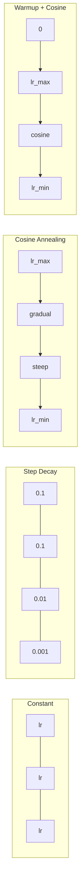
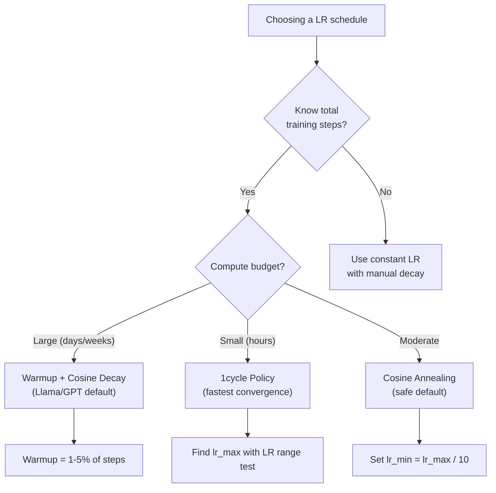
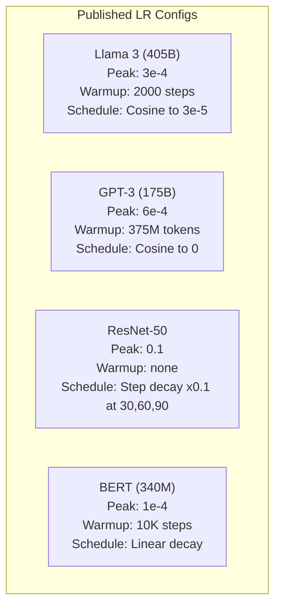

# 学习率计划和热身

> 学习率是最重要的一个超参数。不是架构。不是数据集大小。不是激活函数。学习率。如果你什么都不调整，就调整这个。

**类型：** 构建
**语言：** Python
**先决条件：** 第 03.06 课（优化器）、第 03.08 课（权重初始化）
**时间：** ~90 分钟

## 学习目标

- 从头开始实施常数、步进衰减、余弦退火、预热+余弦和 1cycle 学习率计划
- 演示学习率选择的三种失败模式：发散（太高）、失速（太低）和振荡（无衰减）
- 解释为什么预热对于基于 Adam 的优化器是必要的，以及它如何稳定早期训练
- 比较同一任务的所有五个计划的收敛速度，并针对给定的培训预算选择合适的计划

## 问题

将学习率设置为 0.1。训练发散——损失分三步跃升至无穷大。将其设置为 0.0001。训练爬行——100 个 epoch 后，模型几乎没有脱离随机状态。将其设置为 0.01。训练进行 50 个 epoch，然后损失在它永远无法达到的最小值附近振荡，因为步长太大。

最佳学习率不是一个常数。它在训练过程中发生变化。早期，你希望迈出大步以快速覆盖地面；在训练后期，你希望小步让模型更稳地收敛。90% 准确率模型和 95% 准确率模型之间的区别通常只是时间表。

过去三年发布的每个主要模型都使用学习率表。 Llama 3 使用峰值 lr=3e-4 和 2000 个预热步骤，余弦衰减到 3e-5。 GPT-3 使用 lr=6e-4，预热超过 3.75 亿个代币。这些都不是任意的选择。它们是花费数百万美元进行广泛的超参数扫描的结果。您需要了解时间表，因为默认设置无法解决您的问题。当您微调预训练模型时，正确的时间表与从头开始训练不同。当您增加批量大小时，预热时间需要更改。当训练在第 10,000 步中断时，您需要知道这是日程安排问题还是其他原因。

## 概念

### 恒定学习率

最简单的方法。选择一个数字，将其用于每一步。

```
lr(t) = lr_0
```

很少是最佳的。它要么对于训练结束时太高（在最小值附近振荡），要么对于开始时太低（在小步骤上浪费计算）。适用于小型模型和调试。对于训练时间超过一个小时的任何事情来说，这是一个糟糕的选择。

### 步骤衰减

ResNet 时代的老派方法。在固定时期将学习率降低一个因子（通常是 10 倍）。

```
lr(t) = lr_0 * gamma^(floor(epoch / step_size))
```

其中 gamma = 0.1 且 step_size = 30 意味着：lr 每 30 个 epoch 下降 10 倍。 ResNet-50 使用了这个——lr=0.1，在第 30、60 和 90 轮下降了 10 倍。

问题：最佳衰减点取决于数据集和架构。转向不同的问题，你需要重新调整何时放弃。这种转变是突然的——当利率突然变化时，损失可能会激增。

### 余弦退火

遵循余弦曲线，从最大学习率平滑衰减到最小学习率：

```
lr(t) = lr_min + 0.5 * (lr_max - lr_min) * (1 + cos(pi * t / T))
```

其中 t 是当前步骤，T 是总步骤数。

在 t=0 时，余弦项为 1，因此 lr = lr_max。在 t=T 时，余弦项为 -1，因此 lr = lr_min。衰减一开始是温和的，在中间加速，并在接近结束时再次变得温和。

这是大多数现代训练运行的默认设置。除了 lr_max 和 lr_min 之外，没有可调整的超参数。余弦形状与大多数学习发生在训练中间的经验观察相匹配——在那个关键时期你需要合理的步长。

### 热身：为什么从小处开始Adam 和其他自适应优化器维持梯度均值和方差的运行估计。在步骤 0，这些估计值被初始化为零。前几次梯度更新是基于垃圾统计的。如果在此期间你的学习率很大，则模型会采取巨大的、方向性不佳的步骤。

热身可以解决这个问题。从一个很小的学习率开始（通常是 lr_max / Warmup_steps 甚至零），然后在前 N 个步骤中线性上升到 lr_max。当您达到完全学习率时，Adam 的统计数据已稳定下来。

```
lr(t) = lr_max * (t / warmup_steps)     for t < warmup_steps
```

典型的热身：总训练步骤的 1-5%。 Llama 3 训练了约 1.8 万亿个代币，并热身了 2000 步。 GPT-3 预热了超过 3.75 亿个代币。

### 线性预热 + 余弦衰减

现代的默认设置。线性上升，然后用余弦衰减：

```
if t < warmup_steps:
    lr(t) = lr_max * (t / warmup_steps)
else:
    progress = (t - warmup_steps) / (total_steps - warmup_steps)
    lr(t) = lr_min + 0.5 * (lr_max - lr_min) * (1 + cos(pi * progress))
```

这就是 Llama、GPT、PaLM 和大多数现代 Transformer 所使用的。预热可防止早期不稳定。余弦衰减使模型达到良好的最小值。

### 1周期政策

Leslie Smith 的发现（2018）：在训练的前半部分将学习率从低值提高到高值，然后在后半部分将其回落。违反直觉——为什么你要在中途“增加”学习率？

理论：高学习率通过向优化轨迹添加噪声来起到正则化的作用。该模型在上升阶段探索更多的损失景观，寻找更好的盆地。然后，斜坡下降阶段在找到的最佳盆地内进行细化。

```
Phase 1 (0 to T/2):    lr ramps from lr_max/25 to lr_max
Phase 2 (T/2 to T):    lr ramps from lr_max to lr_max/10000
```

对于固定的计算预算，1cycle 的训练速度通常比余弦退火更快。权衡：您必须提前知道总步数。

### 安排形状



### 决策流程图



### 来自已发布模型的实数



```figure
lr-schedule
```

## 构建它

### 第 1 步：安排功能

每个函数都采用当前步骤并返回该步骤的学习率。

```python
import math


def constant_schedule(step, lr=0.01, **kwargs):
    return lr


def step_decay_schedule(step, lr=0.1, step_size=100, gamma=0.1, **kwargs):
    return lr * (gamma ** (step // step_size))


def cosine_schedule(step, lr=0.01, total_steps=1000, lr_min=1e-5, **kwargs):
    if step >= total_steps:
        return lr_min
    return lr_min + 0.5 * (lr - lr_min) * (1 + math.cos(math.pi * step / total_steps))


def warmup_cosine_schedule(step, lr=0.01, total_steps=1000, warmup_steps=100, lr_min=1e-5, **kwargs):
    if total_steps <= warmup_steps:
        return lr * (step / max(warmup_steps, 1))
    if step < warmup_steps:
        return lr * step / warmup_steps
    progress = (step - warmup_steps) / (total_steps - warmup_steps)
    return lr_min + 0.5 * (lr - lr_min) * (1 + math.cos(math.pi * progress))


def one_cycle_schedule(step, lr=0.01, total_steps=1000, **kwargs):
    mid = max(total_steps // 2, 1)
    if step < mid:
        return (lr / 25) + (lr - lr / 25) * step / mid
    else:
        progress = (step - mid) / max(total_steps - mid, 1)
        return lr * (1 - progress) + (lr / 10000) * progress
```

### 第 2 步：可视化所有时间表

打印基于文本的图表，显示每个计划在训练过程中如何演变。

```python
def visualize_schedule(name, schedule_fn, total_steps=500, **kwargs):
    steps = list(range(0, total_steps, total_steps // 20))
    if total_steps - 1 not in steps:
        steps.append(total_steps - 1)

    lrs = [schedule_fn(s, total_steps=total_steps, **kwargs) for s in steps]
    max_lr = max(lrs) if max(lrs) > 0 else 1.0

    print(f"\n{name}:")
    for s, lr_val in zip(steps, lrs):
        bar_len = int(lr_val / max_lr * 40)
        bar = "#" * bar_len
        print(f"  Step {s:4d}: lr={lr_val:.6f} {bar}")
```

### 步骤 3：训练网络圆数据集上的简单两层网络，与之前的课程相同，但现在我们改变时间表。

```python
import random


def sigmoid(x):
    x = max(-500, min(500, x))
    return 1.0 / (1.0 + math.exp(-x))


def relu(x):
    return max(0.0, x)


def relu_deriv(x):
    return 1.0 if x > 0 else 0.0


def make_circle_data(n=200, seed=42):
    random.seed(seed)
    data = []
    for _ in range(n):
        x = random.uniform(-2, 2)
        y = random.uniform(-2, 2)
        label = 1.0 if x * x + y * y < 1.5 else 0.0
        data.append(([x, y], label))
    return data


def train_with_schedule(schedule_fn, schedule_name, data, epochs=300, base_lr=0.05, **kwargs):
    random.seed(0)
    hidden_size = 8
    total_steps = epochs * len(data)

    std = math.sqrt(2.0 / 2)
    w1 = [[random.gauss(0, std) for _ in range(2)] for _ in range(hidden_size)]
    b1 = [0.0] * hidden_size
    w2 = [random.gauss(0, std) for _ in range(hidden_size)]
    b2 = 0.0

    step = 0
    epoch_losses = []

    for epoch in range(epochs):
        total_loss = 0
        correct = 0

        for x, target in data:
            lr = schedule_fn(step, lr=base_lr, total_steps=total_steps, **kwargs)

            z1 = []
            h = []
            for i in range(hidden_size):
                z = w1[i][0] * x[0] + w1[i][1] * x[1] + b1[i]
                z1.append(z)
                h.append(relu(z))

            z2 = sum(w2[i] * h[i] for i in range(hidden_size)) + b2
            out = sigmoid(z2)

            error = out - target
            d_out = error * out * (1 - out)

            for i in range(hidden_size):
                d_h = d_out * w2[i] * relu_deriv(z1[i])
                w2[i] -= lr * d_out * h[i]
                for j in range(2):
                    w1[i][j] -= lr * d_h * x[j]
                b1[i] -= lr * d_h
            b2 -= lr * d_out

            total_loss += (out - target) ** 2
            if (out >= 0.5) == (target >= 0.5):
                correct += 1
            step += 1

        avg_loss = total_loss / len(data)
        accuracy = correct / len(data) * 100
        epoch_losses.append(avg_loss)

    return epoch_losses
```

### 第 4 步：比较所有时间表

使用每个时间表训练相同的网络并比较最终的损失和收敛行为。

```python
def compare_schedules(data):
    configs = [
        ("Constant", constant_schedule, {}),
        ("Step Decay", step_decay_schedule, {"step_size": 15000, "gamma": 0.1}),
        ("Cosine", cosine_schedule, {"lr_min": 1e-5}),
        ("Warmup+Cosine", warmup_cosine_schedule, {"warmup_steps": 3000, "lr_min": 1e-5}),
        ("1cycle", one_cycle_schedule, {}),
    ]

    print(f"\n{'Schedule':<20} {'Start Loss':>12} {'Mid Loss':>12} {'End Loss':>12} {'Best Loss':>12}")
    print("-" * 70)

    for name, schedule_fn, extra_kwargs in configs:
        losses = train_with_schedule(schedule_fn, name, data, epochs=300, base_lr=0.05, **extra_kwargs)
        mid_idx = len(losses) // 2
        best = min(losses)
        print(f"{name:<20} {losses[0]:>12.6f} {losses[mid_idx]:>12.6f} {losses[-1]:>12.6f} {best:>12.6f}")
```

### 步骤 5：LR 太高与太低

演示三种故障模式：太高（发散）、太低（爬行）和恰到好处。

```python
def lr_sensitivity(data):
    learning_rates = [1.0, 0.1, 0.01, 0.001, 0.0001]

    print("\nLR Sensitivity (constant schedule, 100 epochs):")
    print(f"  {'LR':>10} {'Start Loss':>12} {'End Loss':>12} {'Status':>15}")
    print("  " + "-" * 52)

    for lr in learning_rates:
        losses = train_with_schedule(constant_schedule, f"lr={lr}", data, epochs=100, base_lr=lr)
        start = losses[0]
        end = losses[-1]

        if end > start or math.isnan(end) or end > 1.0:
            status = "DIVERGED"
        elif end > start * 0.9:
            status = "BARELY MOVED"
        elif end < 0.15:
            status = "CONVERGED"
        else:
            status = "LEARNING"

        end_str = f"{end:.6f}" if not math.isnan(end) else "NaN"
        print(f"  {lr:>10.4f} {start:>12.6f} {end_str:>12} {status:>15}")
```

## 使用它

PyTorch 在 `torch.optim.lr_scheduler` 中提供调度程序：

```python
import torch
import torch.optim as optim
from torch.optim.lr_scheduler import CosineAnnealingLR, OneCycleLR, StepLR

model = nn.Sequential(nn.Linear(10, 64), nn.ReLU(), nn.Linear(64, 1))
optimizer = optim.Adam(model.parameters(), lr=3e-4)

scheduler = CosineAnnealingLR(optimizer, T_max=1000, eta_min=1e-5)

for step in range(1000):
    loss = train_step(model, optimizer)
    scheduler.step()
```

对于预热 + 余弦，请使用 lambda 调度程序或 HuggingFace 中的 `get_cosine_schedule_with_warmup` ：

```python
from transformers import get_cosine_schedule_with_warmup

scheduler = get_cosine_schedule_with_warmup(
    optimizer,
    num_warmup_steps=2000,
    num_training_steps=100000,
)
```

HuggingFace 函数是大多数 Llama 和 GPT 微调脚本使用的函数。如有疑问，请使用预热 + 余弦，其中预热 = 总步数的 3-5%。它几乎适用于所有事情。

## 发货

本课产生：
- `outputs/prompt-lr-schedule-advisor.md` -- 为您的训练设置推荐正确的学习率计划和超参数的提示

## 练习

1. 实现指数衰减：lr(t) = lr_0 * gamma^t，其中 gamma = 0.999。与圆数据集上的余弦退火进行比较。

2. 实施学习率范围测试 (Leslie Smith)：训练几百步，同时将 LR 从 1e-7 指数级增加到 1。绘制损失与 LR 的关系图。最佳最大 LR 就在损失开始增加之前。

3. 使用热身 + 余弦进行训练，但改变热身长度：总步数的 0%、1%、5%、10%、20%。找到训练最稳定的最佳点。

4. 实现带热重启的余弦退火（SGDR）：每T步将学习率重置为lr_max并再次衰减。与较长训练运行的标准余弦进行比较。

5. 建立一个“调度外科医生”来监控训练损失，并在损失稳定时自动从热身切换到余弦，并在损失稳定时间过长时降低 lr。

## 关键术语

|术语 |人们怎么说|它实际上意味着什么 |
|------|----------------|----------------------|
|学习率| “模型学习的速度有多快”|乘以梯度以确定参数更新大小的标量 ||日程 | “随着时间的推移改变LR”|将训练步骤映射到学习率的函数，旨在优化收敛 |
|热身| 《从小LR开始》|在前 N 个步骤中将 LR 从接近零线性增加到目标值，以稳定优化器统计数据 |
|余弦退火 | “平滑 LR 衰减”|通过训练将余弦曲线上的 LR 从 lr_max 降低到 lr_min |
|阶跃衰减 | “在里程碑时放弃 LR”|以固定的纪元间隔将 LR 乘以一个因子（通常为 0.1）|
| 1周期政策 | “先上后下”| Leslie Smith 的方法是在一个周期内先升高然后降低 LR 以加快收敛速度​​ |
| LR范围测试| “找到最佳学习率” |在增加 LR 的同时进行简短训练，以找到损失开始发散的值 |
|余弦热重启 | “重置并重复” |定期将 LR 重置为 lr_max 并再次衰减 (SGDR) |
|预计最小值 | 《LR的地板》|调度衰减到的最小学习率 |
|峰值学习率 | “最大LR”|训练期间（通常是热身后）达到的最高 LR |

## 进一步阅读

- Loshchilov & Hutter，“SGDR：带有热重启的随机梯度下降”（2017）——引入了余弦退火和热重启
- Smith，“超级收敛：使用大学习率对神经网络进行非常快速的训练”（2018 年）——1cycle 政策论文
- Touvron 等人，“Llama 2：开放基础和微调聊天模型”（2023 年）——记录了大规模使用的预热 + 余弦时间表
- Goyal 等人，“Accurate, Large Minibatch SGD: Training ImageNet in 1 Hour”（2017）——线性缩放规则和大批量训练的预热
