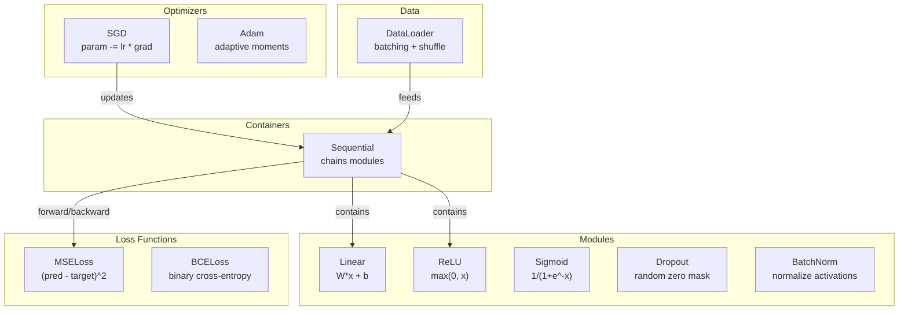
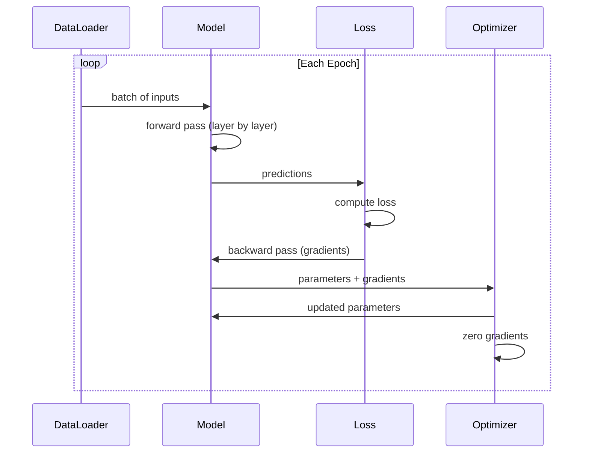
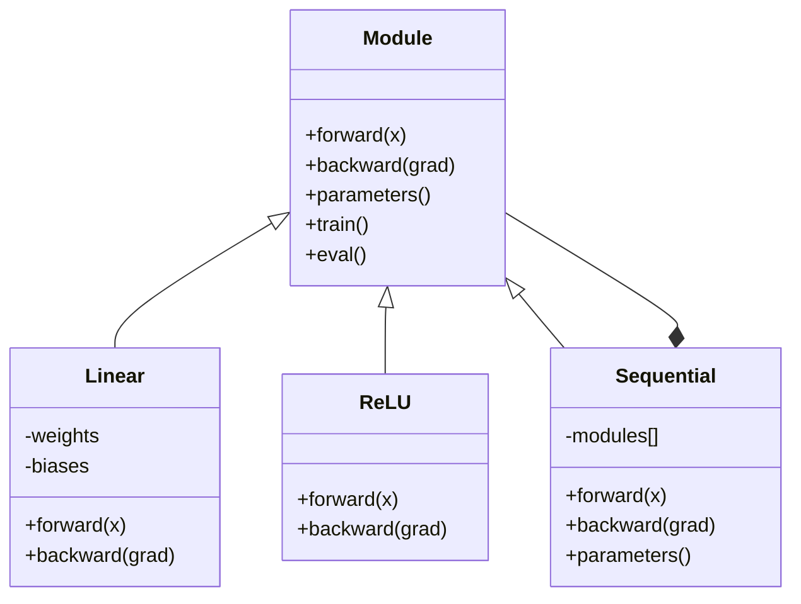

# 构建你自己的小型框架

> 你已经分别实现过神经元、层、网络、反向传播、激活函数、损失函数、优化器、正则化、参数初始化和学习率调度。现在把这些零部件拼起来，形成一个完整框架。不是 PyTorch，不是 TensorFlow，是你自己的。

**类型:** 构建
**语言:** Python
**先修条件:** 第三阶段全部课（01-09）
**时长:** ~120 分钟

## 学习目标

- 构建一个完整的小型深度学习框架（约 500 行），包含 Module、Linear、ReLU、Sigmoid、Dropout、BatchNorm、Sequential、损失函数、优化器和 DataLoader
- 说明 Module 抽象（forward、backward、parameters）以及为什么需要显式切换训练/评估模式
- 将全部组件接入可运行的训练循环，在圆形分类任务上训练 4 层网络
- 对照 PyTorch 映射你框架中的组件（nn.Module、nn.Sequential、optim.Adam、DataLoader）

## 问题

你有十节课里零散的构建块：某处有 `Value` 类，某处有训练循环，某处有参数初始化，某处有学习率计划。要训练一个网络时，你要在多节课之间手工拷贝拼接。

这正是框架要解决的痛点。PyTorch 提供了 `nn.Module`、`nn.Sequential`、`optim.Adam`、`DataLoader`，并给出了统一的训练流程；TensorFlow 提供了 `keras.Layer`、`keras.Sequential`、`keras.optimizers.Adam`。它们不是魔法，而是组织范式：让你不用每次都手写整条管道就能定义、训练、评估网络。

在这里你会用约 500 行 Python 从零实现同样的能力：不依赖 numpy，不依赖第三方深度学习库。这个框架可以定义任意前馈网络，用 SGD 或 Adam 训练，支持批处理、dropout、batch norm、任意激活函数，并支持学习率调度。

完成后，你会非常清楚 `model = nn.Sequential(...)` 在 PyTorch 里到底做了什么，为什么有 `model.train()`/`model.eval()`，为什么要单独调用 `optimizer.zero_grad()`。因为这些行为是你亲手搭出来的。

## 核心概念

### Module 抽象

PyTorch 里的每个层都继承自 `nn.Module`。一个 Module 承担三件事：

1. **forward()** —— 根据输入计算输出
2. **parameters()** —— 返回所有可训练参数
3. **backward()** —— 计算梯度（PyTorch 由 autograd 接管，这里我们显式实现）

Linear 层是一个 Module，ReLU 激活是一个 Module，dropout 也是一个 Module，batch normalization 也是一个 Module。它们共享同一套接口。

### 顺序容器（Sequential）

`nn.Sequential` 用“串联”方式连接多个 Module。前向是依次执行 Module1→Module2→Module3；反向则按相反顺序回传。这种容器本身也是一个 Module，拥有 forward()/parameters()/backward()。这就是组合模式：一组 Module 本身也是一个 Module。

### 训练模式与评估模式

Dropout 在训练时随机屏蔽神经元，评估时则完整透传；BatchNorm 在训练时使用当前批次统计量，评估时使用滑动均值和方差。`train()` 与 `eval()` 控制这种行为；每个 Module 都有 `training` 标记位。

### 优化器

优化器用参数梯度更新参数。SGD 是 `param -= lr * grad`，Adam 则维护一阶/二阶动量估计后再更新。优化器并不关心网络结构，只看到“参数扁平列表 + 梯度”。

### DataLoader

批处理有两个作用：第一，大规模数据通常放不进内存；第二，小批量梯度下降注入一定噪声，有助于跳出局部最优。DataLoader 负责按批切分并按 epoch 可选洗牌。

### 框架架构



### 训练循环



### 模块层级



```figure
gradient-clipping
```

## 动手做

### 步骤 1：模块基类

所有层共同实现的抽象接口。

```python
class Module:
    def __init__(self):
        self.training = True

    def forward(self, x):
        raise NotImplementedError

    def backward(self, grad):
        raise NotImplementedError

    def parameters(self):
        return []

    def train(self):
        self.training = True

    def eval(self):
        self.training = False
```

### 步骤 2：线性层

这是核心构件：保存权重和偏置，前向实现 `Wx + b`，反向返回权重与输入梯度。

```python
import math
import random


class Linear(Module):
    def __init__(self, fan_in, fan_out):
        super().__init__()
        std = math.sqrt(2.0 / fan_in)
        self.weights = [[random.gauss(0, std) for _ in range(fan_in)] for _ in range(fan_out)]
        self.biases = [0.0] * fan_out
        self.weight_grads = [[0.0] * fan_in for _ in range(fan_out)]
        self.bias_grads = [0.0] * fan_out
        self.fan_in = fan_in
        self.fan_out = fan_out
        self.input = None

    def forward(self, x):
        self.input = x
        output = []
        for i in range(self.fan_out):
            val = self.biases[i]
            for j in range(self.fan_in):
                val += self.weights[i][j] * x[j]
            output.append(val)
        return output

    def backward(self, grad):
        input_grad = [0.0] * self.fan_in
        for i in range(self.fan_out):
            self.bias_grads[i] += grad[i]
            for j in range(self.fan_in):
                self.weight_grads[i][j] += grad[i] * self.input[j]
                input_grad[j] += grad[i] * self.weights[i][j]
        return input_grad

    def parameters(self):
        params = []
        for i in range(self.fan_out):
            for j in range(self.fan_in):
                params.append((self.weights, i, j, self.weight_grads))
            params.append((self.biases, i, None, self.bias_grads))
        return params
```

### 步骤 3：激活模块

ReLU、Sigmoid、Tanh 都作为 Module，并缓存反传所需状态。

```python
class ReLU(Module):
    def __init__(self):
        super().__init__()
        self.mask = None

    def forward(self, x):
        self.mask = [1.0 if v > 0 else 0.0 for v in x]
        return [max(0.0, v) for v in x]

    def backward(self, grad):
        return [g * m for g, m in zip(grad, self.mask)]


class Sigmoid(Module):
    def __init__(self):
        super().__init__()
        self.output = None

    def forward(self, x):
        self.output = []
        for v in x:
            v = max(-500, min(500, v))
            self.output.append(1.0 / (1.0 + math.exp(-v)))
        return self.output

    def backward(self, grad):
        return [g * o * (1 - o) for g, o in zip(grad, self.output)]


class Tanh(Module):
    def __init__(self):
        super().__init__()
        self.output = None

    def forward(self, x):
        self.output = [math.tanh(v) for v in x]
        return self.output

    def backward(self, grad):
        return [g * (1 - o * o) for g, o in zip(grad, self.output)]
```

### 步骤 4：Dropout 模块

训练时随机让一部分神经元置零。其余元素乘以 `1/(1-p)`，以保持期望值不变；评估时不做任何改动。

```python
class Dropout(Module):
    def __init__(self, p=0.5):
        super().__init__()
        self.p = p
        self.mask = None

    def forward(self, x):
        if not self.training:
            return x
        self.mask = [0.0 if random.random() < self.p else 1.0 / (1 - self.p) for _ in x]
        return [v * m for v, m in zip(x, self.mask)]

    def backward(self, grad):
        if self.mask is None:
            return grad
        return [g * m for g, m in zip(grad, self.mask)]
```

### 步骤 5：BatchNorm 模块

在一个批次维度上按特征做零均值、单位方差归一化；评估时使用移动均值/方差。

```python
class BatchNorm(Module):
    def __init__(self, size, momentum=0.1, eps=1e-5):
        super().__init__()
        self.size = size
        self.gamma = [1.0] * size
        self.beta = [0.0] * size
        self.gamma_grads = [0.0] * size
        self.beta_grads = [0.0] * size
        self.running_mean = [0.0] * size
        self.running_var = [1.0] * size
        self.momentum = momentum
        self.eps = eps
        self.x_norm = None
        self.std_inv = None
        self.batch_input = None

    def forward_batch(self, batch):
        batch_size = len(batch)
        output_batch = []

        if self.training:
            mean = [0.0] * self.size
            for sample in batch:
                for j in range(self.size):
                    mean[j] += sample[j]
            mean = [m / batch_size for m in mean]

            var = [0.0] * self.size
            for sample in batch:
                for j in range(self.size):
                    var[j] += (sample[j] - mean[j]) ** 2
            var = [v / batch_size for v in var]

            self.std_inv = [1.0 / math.sqrt(v + self.eps) for v in var]

            self.x_norm = []
            self.batch_input = batch
            for sample in batch:
                normed = [(sample[j] - mean[j]) * self.std_inv[j] for j in range(self.size)]
                self.x_norm.append(normed)
                output = [self.gamma[j] * normed[j] + self.beta[j] for j in range(self.size)]
                output_batch.append(output)

            for j in range(self.size):
                self.running_mean[j] = (1 - self.momentum) * self.running_mean[j] + self.momentum * mean[j]
                self.running_var[j] = (1 - self.momentum) * self.running_var[j] + self.momentum * var[j]
        else:
            std_inv = [1.0 / math.sqrt(v + self.eps) for v in self.running_var]
            for sample in batch:
                normed = [(sample[j] - self.running_mean[j]) * std_inv[j] for j in range(self.size)]
                output = [self.gamma[j] * normed[j] + self.beta[j] for j in range(self.size)]
                output_batch.append(output)

        return output_batch

    def forward(self, x):
        result = self.forward_batch([x])
        return result[0]

    def backward(self, grad):
        if self.x_norm is None:
            return grad
        for j in range(self.size):
            self.gamma_grads[j] += self.x_norm[0][j] * grad[j]
            self.beta_grads[j] += grad[j]
        return [grad[j] * self.gamma[j] * self.std_inv[j] for j in range(self.size)]

    def parameters(self):
        params = []
        for j in range(self.size):
            params.append((self.gamma, j, None, self.gamma_grads))
            params.append((self.beta, j, None, self.beta_grads))
        return params
```

### 步骤 6：顺序容器

模块从左到右前向，反向从右到左。

```python
class Sequential(Module):
    def __init__(self, *modules):
        super().__init__()
        self.modules = list(modules)

    def forward(self, x):
        for module in self.modules:
            x = module.forward(x)
        return x

    def backward(self, grad):
        for module in reversed(self.modules):
            grad = module.backward(grad)
        return grad

    def parameters(self):
        params = []
        for module in self.modules:
            params.extend(module.parameters())
        return params

    def train(self):
        self.training = True
        for module in self.modules:
            module.train()

    def eval(self):
        self.training = False
        for module in self.modules:
            module.eval()
```

### 步骤 7：损失函数

MSE 和二分类交叉熵都返回一个标量损失，并提供 backward() 返回损失对输出的梯度。

```python
class MSELoss:
    def __call__(self, predicted, target):
        self.predicted = predicted
        self.target = target
        n = len(predicted)
        self.loss = sum((p - t) ** 2 for p, t in zip(predicted, target)) / n
        return self.loss

    def backward(self):
        n = len(self.predicted)
        return [2 * (p - t) / n for p, t in zip(self.predicted, self.target)]


class BCELoss:
    def __call__(self, predicted, target):
        self.predicted = predicted
        self.target = target
        eps = 1e-7
        n = len(predicted)
        self.loss = 0
        for p, t in zip(predicted, target):
            p = max(eps, min(1 - eps, p))
            self.loss += -(t * math.log(p) + (1 - t) * math.log(1 - p))
        self.loss /= n
        return self.loss

    def backward(self):
        eps = 1e-7
        n = len(self.predicted)
        grads = []
        for p, t in zip(self.predicted, self.target):
            p = max(eps, min(1 - eps, p))
            grads.append((-t / p + (1 - t) / (1 - p)) / n)
        return grads
```

### 步骤 8：SGD 与 Adam 优化器

两者都接收参数列表，并用梯度更新权重。

```python
class SGD:
    def __init__(self, parameters, lr=0.01):
        self.params = parameters
        self.lr = lr

    def step(self):
        for container, i, j, grad_container in self.params:
            if j is not None:
                container[i][j] -= self.lr * grad_container[i][j]
            else:
                container[i] -= self.lr * grad_container[i]

    def zero_grad(self):
        for container, i, j, grad_container in self.params:
            if j is not None:
                grad_container[i][j] = 0.0
            else:
                grad_container[i] = 0.0


class Adam:
    def __init__(self, parameters, lr=0.001, beta1=0.9, beta2=0.999, eps=1e-8):
        self.params = parameters
        self.lr = lr
        self.beta1 = beta1
        self.beta2 = beta2
        self.eps = eps
        self.t = 0
        self.m = [0.0] * len(parameters)
        self.v = [0.0] * len(parameters)

    def step(self):
        self.t += 1
        for idx, (container, i, j, grad_container) in enumerate(self.params):
            if j is not None:
                g = grad_container[i][j]
            else:
                g = grad_container[i]

            self.m[idx] = self.beta1 * self.m[idx] + (1 - self.beta1) * g
            self.v[idx] = self.beta2 * self.v[idx] + (1 - self.beta2) * g * g

            m_hat = self.m[idx] / (1 - self.beta1 ** self.t)
            v_hat = self.v[idx] / (1 - self.beta2 ** self.t)

            update = self.lr * m_hat / (math.sqrt(v_hat) + self.eps)

            if j is not None:
                container[i][j] -= update
            else:
                container[i] -= update

    def zero_grad(self):
        for container, i, j, grad_container in self.params:
            if j is not None:
                grad_container[i][j] = 0.0
            else:
                grad_container[i] = 0.0
```

### 步骤 9：DataLoader

按批次切分数据，每个 epoch 可选洗牌。

```python
class DataLoader:
    def __init__(self, data, batch_size=32, shuffle=True):
        self.data = data
        self.batch_size = batch_size
        self.shuffle = shuffle

    def __iter__(self):
        indices = list(range(len(self.data)))
        if self.shuffle:
            random.shuffle(indices)
        for start in range(0, len(indices), self.batch_size):
            batch_indices = indices[start:start + self.batch_size]
            batch = [self.data[i] for i in batch_indices]
            inputs = [item[0] for item in batch]
            targets = [item[1] for item in batch]
            yield inputs, targets

    def __len__(self):
        return (len(self.data) + self.batch_size - 1) // self.batch_size
```

### 步骤 10：训练一个 4 层网络做圆形分类

把所有部件串起来，定义模型、损失与优化器并跑训练循环。

```python
def make_circle_data(n=500, seed=42):
    random.seed(seed)
    data = []
    for _ in range(n):
        x = random.uniform(-2, 2)
        y = random.uniform(-2, 2)
        label = 1.0 if x * x + y * y < 1.5 else 0.0
        data.append(([x, y], [label]))
    return data


def train():
    random.seed(42)

    model = Sequential(
        Linear(2, 16),
        ReLU(),
        Linear(16, 16),
        ReLU(),
        Linear(16, 8),
        ReLU(),
        Linear(8, 1),
        Sigmoid(),
    )

    criterion = BCELoss()
    optimizer = Adam(model.parameters(), lr=0.01)

    data = make_circle_data(500)
    split = int(len(data) * 0.8)
    train_data = data[:split]
    test_data = data[split:]

    loader = DataLoader(train_data, batch_size=16, shuffle=True)

    model.train()

    for epoch in range(100):
        total_loss = 0
        total_correct = 0
        total_samples = 0

        for batch_inputs, batch_targets in loader:
            batch_loss = 0
            for x, t in zip(batch_inputs, batch_targets):
                pred = model.forward(x)
                loss = criterion(pred, t)
                batch_loss += loss

                optimizer.zero_grad()
                grad = criterion.backward()
                model.backward(grad)
                optimizer.step()

                predicted_class = 1.0 if pred[0] >= 0.5 else 0.0
                if predicted_class == t[0]:
                    total_correct += 1
                total_samples += 1

            total_loss += batch_loss

        avg_loss = total_loss / total_samples
        accuracy = total_correct / total_samples * 100

        if epoch % 10 == 0 or epoch == 99:
            print(f"Epoch {epoch:3d} | Loss: {avg_loss:.6f} | Train Accuracy: {accuracy:.1f}%")

    model.eval()
    correct = 0
    for x, t in test_data:
        pred = model.forward(x)
        predicted_class = 1.0 if pred[0] >= 0.5 else 0.0
        if predicted_class == t[0]:
            correct += 1
    test_accuracy = correct / len(test_data) * 100
    print(f"\nTest Accuracy: {test_accuracy:.1f}% ({correct}/{len(test_data)})")

    return model, test_accuracy
```

## 使用

这是你刚写完的 PyTorch 等价实现：

```python
import torch
import torch.nn as nn
from torch.utils.data import DataLoader, TensorDataset

model = nn.Sequential(
    nn.Linear(2, 16),
    nn.ReLU(),
    nn.Linear(16, 16),
    nn.ReLU(),
    nn.Linear(16, 8),
    nn.ReLU(),
    nn.Linear(8, 1),
    nn.Sigmoid(),
)

criterion = nn.BCELoss()
optimizer = torch.optim.Adam(model.parameters(), lr=0.01)

for epoch in range(100):
    model.train()
    for inputs, targets in dataloader:
        optimizer.zero_grad()
        predictions = model(inputs)
        loss = criterion(predictions, targets)
        loss.backward()
        optimizer.step()

    model.eval()
    with torch.no_grad():
        test_predictions = model(test_inputs)
```

结构是完全对应的。`Sequential`、`Linear`、`ReLU`、`Sigmoid`、`BCELoss`、`Adam`、`zero_grad`、`backward`、`step`、`train`、`eval` 的概念一一对应。差别在于，PyTorch 自动处理 autograd（你不需要在每个模块里手写 backward()），并支持 GPU 以及多年优化。骨架是同样的。

当你再次读到 PyTorch 代码时，你会知道每一行在做什么，这也是本课的目标。

## 产出

本课生成：
- `outputs/prompt-framework-architect.md` -- 一个用于用框架抽象设计神经网络结构的 prompt

## 练习

1. 增加 `SoftmaxCrossEntropyLoss`，支持多类分类。包含 Softmax、交叉熵计算和反向传播结合实现，并在 3 类螺旋数据集上验证。
2. 在优化器里加上 `set_lr()`，接入第 09 课的余弦学习率调度。用 warmup + cosine 训练圆形分类器，并和恒定学习率对比。
3. 为 `Sequential` 增加 `save()` 与 `load()`，将全部权重序列化为 JSON 文件并恢复。验证加载后的模型与原模型预测一致。
4. 在 Adam 中实现权重衰减（L2 正则化）。新增 `weight_decay` 参数，让每步更新时权重向 0 收缩。比较 `decay=0` 与 `decay=0.01` 的训练结果。
5. 用 mini-batch 累积梯度替换“逐样本更新”：先累积一个 batch 内全部样本的梯度，再除以 batch size 做一次 step。观察收敛速度是否变化。

## 关键术语

| 术语 | 常见表述 | 实际含义 |
|------|---------|---------|
| Module | "一层" | 框架的基础抽象，具备 forward()、backward()、parameters() 能力 |
| Sequential | "按顺序堆叠层" | 容器化的模块链，前向按顺序、反向按逆序执行 |
| 前向传播 | "把网络跑一遍" | 按模块顺序将输入转成输出 |
| 反向传播 | "算梯度" | 按模块逆序把损失梯度传回，得到参数梯度 |
| Parameters | "可训练权重" | 优化器可更新的所有参数，通常是权重和偏置 |
| Optimizer | "更新参数的人" | 根据梯度执行参数更新的算法，常见有 SGD、Adam |
| DataLoader | "喂数据的人" | 按 epoch 切批并可选洗牌的数据迭代器 |
| Training mode | "model.train()" | 打开 dropout、batchnorm 的 batch 统计行为 |
| Evaluation mode | "model.eval()" | 关闭 dropout，并使用移动统计量进行 batchnorm |
| Zero grad | "清空梯度" | 在下一次计算前将参数梯度重置为 0 |

## 延伸阅读

- Paszke 等人，"PyTorch: An Imperative Style, High-Performance Deep Learning Library"（2019）-- 讲解 PyTorch 的设计决策
- Chollet，"Deep Learning with Python, Second Edition"（2021）-- 第 3 章讲 Keras 内部与同样的模块/层抽象
- Johnson，"Tiny-DNN"（https://github.com/tiny-dnn/tiny-dnn）-- 一个头文件实现的 C++ 小型框架，适合学习框架内部结构
