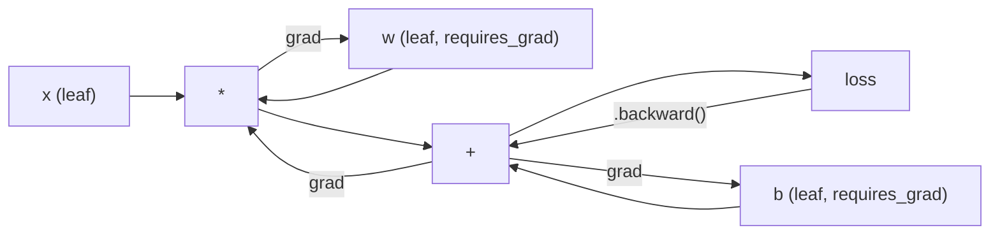
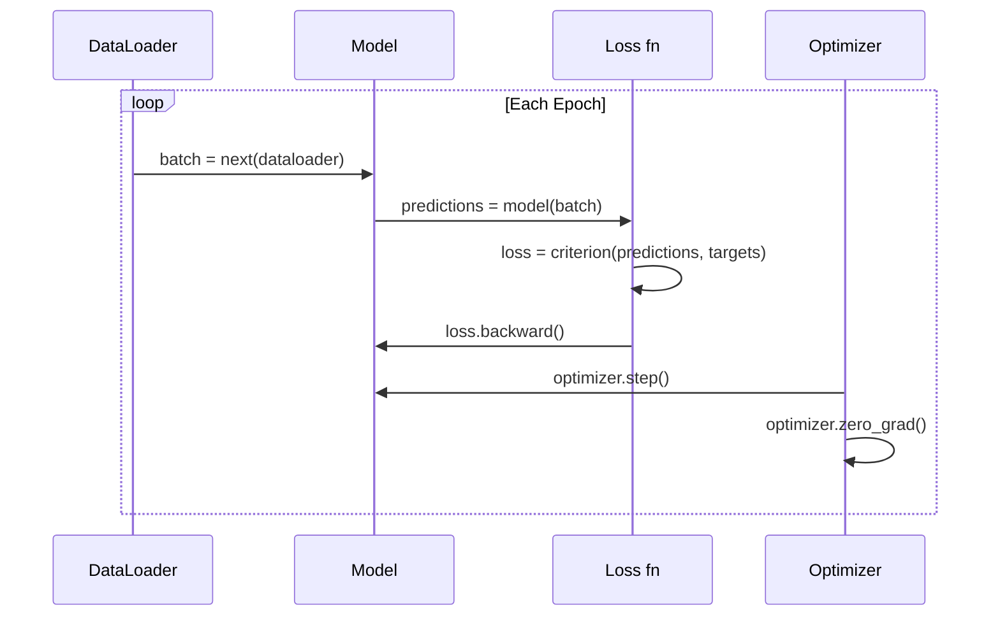

# PyTorch 入门

> 你已经把引擎从活塞和曲轴开始造出来了。现在来学真正大多数人实际在用的那套。

**类型:** 构建
**语言:** Python
**先修:** 第 03.10 课（构建你自己的迷你框架）
**时长:** ~75 分钟

## 学习目标
- 使用 PyTorch 的 `nn.Module`、`nn.Sequential` 和 autograd 来构建并训练神经网络
- 使用 PyTorch 张量、GPU 加速以及标准训练循环（`zero_grad`、`forward`、`loss`、`backward`、`step`）
- 将你从零实现的迷你框架组件转换成对应的 PyTorch 实现
- 在同一任务上对比纯 Python 框架与 PyTorch 的训练速度

## 问题

你已经有一个能跑的迷你框架。线性层、ReLU、dropout、batch norm、Adam、DataLoader、训练循环，它都有。它还能用纯 Python 训练一个 4 层网络做圆形分类。

但它在同一个问题上比 PyTorch 慢 500 倍。

你的迷你框架是一个样本一个样本地跑，里面套着 Python 循环。PyTorch 会把同样的操作分发给优化过的 C++/CUDA kernel，并且在 GPU 上运行。在单张 NVIDIA A100 上，PyTorch 训练 ResNet-50（2500 万参数）在 ImageNet（128 万张图）上大约需要 6 小时。你的框架在同样任务上大概需要 3000 小时 - 如果它没先把内存跑爆。

差距不只是速度。你的框架没有 GPU 支持，没有自动微分 - 你给每个模块都手写了 `backward()`。没有序列化。没有分布式训练。没有混合精度。也没有除了 `print` 之外的任何梯度调试手段。

PyTorch 把这些坑都填上了，而且它保留了你已经熟悉的心智模型：`Module`、`forward()`、`parameters()`、`backward()`、`optimizer.step()`。概念一一对应，语法也几乎一致。不同之处在于，PyTorch 在同一个接口背后，封装了十年的系统工程。

## 概念

### 为什么 PyTorch 赢了

2015 年，TensorFlow 要求你先定义静态计算图，再运行它。你先搭图、编译，然后把数据喂进去。调试意味着盯着图结构看。改架构意味着推倒重建整张图。

PyTorch 在 2017 年带着另一种思路登场：即时执行（eager execution）。你写 Python，代码立即执行。`y = model(x)` 真的就是现在立刻算出 y，而不是“往图里加一个节点，稍后再算 y”。这意味着标准 Python 调试工具都能直接用。`print()` 能用，`pdb` 能用，`forward` 里的 `if/else` 也能用。

到 2020 年，市场已经给出答案。PyTorch 在机器学习论文里的占比从 2017 年的 7% 上升到 2022 年的 75% 以上。Meta、Google DeepMind、OpenAI、Anthropic、Hugging Face 都把 PyTorch 当主框架。TensorFlow 2.x 也转向了 eager execution - 这其实就是承认 PyTorch 的设计是对的。

结论很简单：开发者体验会复利增长。一个性能慢 10%，但调试快 50% 的框架，通常会赢。

### 张量

张量是带有三个关键属性的多维数组：`shape`、`dtype` 和 `device`。

```python
import torch

x = torch.zeros(3, 4)           # shape: (3, 4), dtype: float32, device: cpu
x = torch.randn(2, 3, 224, 224) # batch of 2 RGB images, 224x224
x = torch.tensor([1, 2, 3])     # from a Python list
```

**shape** 是维度。标量的形状是 `()`，向量是 `(n,)`，矩阵是 `(m, n)`，一批图像则是 `(batch, channels, height, width)`。

**dtype** 决定精度和内存。

| dtype | Bits | Range | Use case |
|-------|------|-------|----------|
| float32 | 32 | ~7 decimal digits | Default training |
| float16 | 16 | ~3.3 decimal digits | Mixed precision |
| bfloat16 | 16 | Same range as float32, less precision | LLM training |
| int8 | 8 | -128 to 127 | Quantized inference |

**device** 决定计算发生在哪里。

```python
device = torch.device("cuda" if torch.cuda.is_available() else "cpu")
x = torch.randn(3, 4, device=device)
x = x.to("cuda")
x = x.cpu()
```

所有操作都要求张量在同一设备上。这是初学者最常遇到的 PyTorch 报错：`RuntimeError: Expected all tensors to be on the same device`。解决办法很简单：计算前先把所有东西移到同一设备上。

**reshape** 是常数时间操作 - 它改变的是元数据，不是数据本身。

```python
x = torch.randn(2, 3, 4)
x.view(2, 12)      # reshape to (2, 12) -- must be contiguous
x.reshape(6, 4)    # reshape to (6, 4) -- works always
x.permute(2, 0, 1) # reorder dimensions
x.unsqueeze(0)     # add dimension: (1, 2, 3, 4)
x.squeeze()        # remove size-1 dimensions
```

### Autograd

你的迷你框架要求你给每个模块手写 `backward()`。PyTorch 不需要。它会在张量上记录每一个操作，形成一张有向无环图（计算图），然后沿着这张图反向遍历，自动算出梯度。



和你的框架最大的区别是：PyTorch 用的是基于 tape 的自动微分。前向传播时，每个操作都会被追加到一条“录音带”上。调用 `.backward()` 时，会把这条带子倒放一遍。

```python
x = torch.randn(3, requires_grad=True)
y = x ** 2 + 3 * x
z = y.sum()
z.backward()
print(x.grad)  # dz/dx = 2x + 3
```

autograd 的三条规则：

1. 只有 `requires_grad=True` 的叶子张量会累积梯度
2. 梯度默认会累积 - 每次反向传播前要调用 `optimizer.zero_grad()`
3. `torch.no_grad()` 会关闭梯度跟踪（评估时使用）

### `nn.Module`

`nn.Module` 是 PyTorch 里每个神经网络组件的基类。你在第 10 课里已经自己实现过这个抽象。PyTorch 的版本额外提供了参数自动注册、递归查找子模块、设备管理和 `state_dict` 序列化。

```python
import torch.nn as nn

class MLP(nn.Module):
    def __init__(self, input_dim, hidden_dim, output_dim):
        super().__init__()
        self.layer1 = nn.Linear(input_dim, hidden_dim)
        self.relu = nn.ReLU()
        self.layer2 = nn.Linear(hidden_dim, output_dim)

    def forward(self, x):
        x = self.layer1(x)
        x = self.relu(x)
        x = self.layer2(x)
        return x
```

当你在 `__init__` 里把 `nn.Module` 或 `nn.Parameter` 赋给一个属性时，PyTorch 会自动注册它。`model.parameters()` 会递归收集所有已注册参数。这就是你不需要像迷你框架里那样手工收集权重的原因。

常见模块：

| Module | What it does | Parameters |
|--------|-------------|------------|
| nn.Linear(in, out) | Wx + b | in*out + out |
| nn.Conv2d(in_ch, out_ch, k) | 2D convolution | in_ch*out_ch*k*k + out_ch |
| nn.BatchNorm1d(features) | Normalize activations | 2 * features |
| nn.Dropout(p) | Random zeroing | 0 |
| nn.ReLU() | max(0, x) | 0 |
| nn.GELU() | Gaussian error linear | 0 |
| nn.Embedding(vocab, dim) | Lookup table | vocab * dim |
| nn.LayerNorm(dim) | Per-sample normalization | 2 * dim |

### 损失函数与优化器

PyTorch 直接提供了你已经构建过的一切生产级版本。

**损失函数**（来自 `torch.nn`）：

| Loss | Task | Input |
|------|------|-------|
| nn.MSELoss() | Regression | Any shape |
| nn.CrossEntropyLoss() | Multi-class classification | Logits (not softmax) |
| nn.BCEWithLogitsLoss() | Binary classification | Logits (not sigmoid) |
| nn.L1Loss() | Regression (robust) | Any shape |
| nn.CTCLoss() | Sequence alignment | Log probabilities |

注意：`CrossEntropyLoss` 内部已经组合了 `LogSoftmax` + `NLLLoss`。传原始 logits，不要先做 softmax。这是一个很常见的错误，而且不会明显报错，只会悄悄给你错误梯度。

**优化器**（来自 `torch.optim`）：

| Optimizer | When to use | Typical LR |
|-----------|-------------|-----------|
| SGD(params, lr, momentum) | CNNs, well-tuned pipelines | 0.01--0.1 |
| Adam(params, lr) | Default starting point | 1e-3 |
| AdamW(params, lr, weight_decay) | Transformers, fine-tuning | 1e-4--1e-3 |
| LBFGS(params) | Small-scale, second-order | 1.0 |

### 训练循环

每个 PyTorch 训练循环都遵循同样的 5 步模式。你在第 10 课里已经见过了。



标准模式是：

```python
for epoch in range(num_epochs):
    model.train()
    for inputs, targets in train_loader:
        inputs, targets = inputs.to(device), targets.to(device)
        optimizer.zero_grad()
        outputs = model(inputs)
        loss = criterion(outputs, targets)
        loss.backward()
        optimizer.step()
```

批次循环里的这五行训练了 GPT-4、Stable Diffusion 和 LLaMA。架构会变，数据会变，这五行不变。

### `Dataset` 和 `DataLoader`

PyTorch 的 `Dataset` 是一个抽象类，只有两个方法：`__len__` 和 `__getitem__`。`DataLoader` 会在它外面包一层，负责 batching、shuffling 和多进程加载数据。

```python
from torch.utils.data import Dataset, DataLoader

class MNISTDataset(Dataset):
    def __init__(self, images, labels):
        self.images = images
        self.labels = labels

    def __len__(self):
        return len(self.labels)

    def __getitem__(self, idx):
        return self.images[idx], self.labels[idx]

loader = DataLoader(dataset, batch_size=64, shuffle=True, num_workers=4)
```

`num_workers=4` 会开 4 个进程并行加载数据，而 GPU 继续训练当前 batch。对于磁盘 IO 成为瓶颈的任务（大图像、音频），这一个设置就可能把训练速度翻倍。

### GPU 训练

把模型搬到 GPU：

```python
device = torch.device("cuda" if torch.cuda.is_available() else "cpu")
model = model.to(device)
```

这会递归地把所有参数和 buffer 移到 GPU。训练时再把每个 batch 也移过去：

```python
inputs, targets = inputs.to(device), targets.to(device)
```

**混合精度**可以把显存占用减半、吞吐翻倍。现代 GPU（A100、H100、RTX 4090）上，前向/反向用 float16 跑，同时把主权重保留在 float32 里：

```python
from torch.amp import autocast, GradScaler

scaler = GradScaler()
for inputs, targets in loader:
    with autocast(device_type="cuda"):
        outputs = model(inputs)
        loss = criterion(outputs, targets)
    scaler.scale(loss).backward()
    scaler.step(optimizer)
    scaler.update()
    optimizer.zero_grad()
```

### 对比：迷你框架、PyTorch、JAX

| Feature | Mini Framework (L10) | PyTorch | JAX |
|---------|---------------------|---------|-----|
| Autodiff | Manual backward() | Tape-based autograd | Functional transforms |
| Execution | Eager (Python loops) | Eager (C++ kernels) | Traced + JIT compiled |
| GPU support | No | Yes (CUDA, ROCm, MPS) | Yes (CUDA, TPU) |
| Speed (MNIST MLP) | ~300s/epoch | ~0.5s/epoch | ~0.3s/epoch |
| Module system | Custom Module class | nn.Module | Stateless functions (Flax/Equinox) |
| Debugging | print() | print(), pdb, breakpoint() | Harder (JIT tracing breaks print) |
| Ecosystem | None | Hugging Face, Lightning, timm | Flax, Optax, Orbax |
| Learning curve | You built it | Moderate | Steep (functional paradigm) |
| Production use | Toy problems | Meta, OpenAI, Anthropic, HF | Google DeepMind, Midjourney |

```figure
dropout-mask
```

## 实现

用纯 PyTorch primitives 训练一个 3 层 MLP 跑 MNIST。不用高层封装，不用 `torchvision.datasets`。我们自己下载并解析原始数据。

### 步骤 1：从原始文件加载 MNIST

MNIST 由 4 个 gzip 文件提供：训练图像（60,000 x 28 x 28）、训练标签、测试图像（10,000 x 28 x 28）、测试标签。我们把它们下载下来，自己解析二进制格式。

```python
import torch
import torch.nn as nn
import struct
import gzip
import urllib.request
import os

def download_mnist(path="./mnist_data"):
    base_url = "https://storage.googleapis.com/cvdf-datasets/mnist/"
    files = [
        "train-images-idx3-ubyte.gz",
        "train-labels-idx1-ubyte.gz",
        "t10k-images-idx3-ubyte.gz",
        "t10k-labels-idx1-ubyte.gz",
    ]
    os.makedirs(path, exist_ok=True)
    for f in files:
        filepath = os.path.join(path, f)
        if not os.path.exists(filepath):
            urllib.request.urlretrieve(base_url + f, filepath)

def load_images(filepath):
    with gzip.open(filepath, "rb") as f:
        magic, num, rows, cols = struct.unpack(">IIII", f.read(16))
        data = f.read()
        images = torch.frombuffer(bytearray(data), dtype=torch.uint8)
        images = images.reshape(num, rows * cols).float() / 255.0
    return images

def load_labels(filepath):
    with gzip.open(filepath, "rb") as f:
        magic, num = struct.unpack(">II", f.read(8))
        data = f.read()
        labels = torch.frombuffer(bytearray(data), dtype=torch.uint8).long()
    return labels
```

### 步骤 2：定义模型

3 层 MLP：784 -> 256 -> 128 -> 10。中间用 ReLU 激活，Dropout 做正则化。不加 batch norm，保持简单。

```python
class MNISTModel(nn.Module):
    def __init__(self):
        super().__init__()
        self.net = nn.Sequential(
            nn.Linear(784, 256),
            nn.ReLU(),
            nn.Dropout(0.2),
            nn.Linear(256, 128),
            nn.ReLU(),
            nn.Dropout(0.2),
            nn.Linear(128, 10),
        )

    def forward(self, x):
        return self.net(x)
```

输出层产生 10 个原始 logits（每个数字一个）。不需要 softmax - `CrossEntropyLoss` 会在内部处理它。

参数总数是 `784*256 + 256 + 256*128 + 128 + 128*10 + 10 = 235,146`。按现代标准很小。GPT-2 small 有 1.24 亿参数。这个模型可以在几秒内训练完。

### 步骤 3：训练循环

标准的前向 - 损失 - 反向 - 更新模式。

```python
def train_one_epoch(model, loader, criterion, optimizer, device):
    model.train()
    total_loss = 0
    correct = 0
    total = 0
    for images, labels in loader:
        images, labels = images.to(device), labels.to(device)
        optimizer.zero_grad()
        outputs = model(images)
        loss = criterion(outputs, labels)
        loss.backward()
        optimizer.step()
        total_loss += loss.item() * images.size(0)
        _, predicted = outputs.max(1)
        correct += predicted.eq(labels).sum().item()
        total += labels.size(0)
    return total_loss / total, correct / total


def evaluate(model, loader, criterion, device):
    model.eval()
    total_loss = 0
    correct = 0
    total = 0
    with torch.no_grad():
        for images, labels in loader:
            images, labels = images.to(device), labels.to(device)
            outputs = model(images)
            loss = criterion(outputs, labels)
            total_loss += loss.item() * images.size(0)
            _, predicted = outputs.max(1)
            correct += predicted.eq(labels).sum().item()
            total += labels.size(0)
    return total_loss / total, correct / total
```

注意评估时要用 `torch.no_grad()`。它会关闭 autograd，减少内存占用并加快推理。不加它，PyTorch 会为你根本不会用到的图去构建计算图。

### 步骤 4：把所有东西串起来

```python
def main():
    device = torch.device("cuda" if torch.cuda.is_available() else "cpu")

    download_mnist()
    train_images = load_images("./mnist_data/train-images-idx3-ubyte.gz")
    train_labels = load_labels("./mnist_data/train-labels-idx1-ubyte.gz")
    test_images = load_images("./mnist_data/t10k-images-idx3-ubyte.gz")
    test_labels = load_labels("./mnist_data/t10k-labels-idx1-ubyte.gz")

    train_dataset = torch.utils.data.TensorDataset(train_images, train_labels)
    test_dataset = torch.utils.data.TensorDataset(test_images, test_labels)
    train_loader = torch.utils.data.DataLoader(
        train_dataset, batch_size=64, shuffle=True
    )
    test_loader = torch.utils.data.DataLoader(
        test_dataset, batch_size=256, shuffle=False
    )

    model = MNISTModel().to(device)
    criterion = nn.CrossEntropyLoss()
    optimizer = torch.optim.Adam(model.parameters(), lr=1e-3)

    num_params = sum(p.numel() for p in model.parameters())
    print(f"Device: {device}")
    print(f"Parameters: {num_params:,}")
    print(f"Train samples: {len(train_dataset):,}")
    print(f"Test samples: {len(test_dataset):,}")
    print()

    for epoch in range(10):
        train_loss, train_acc = train_one_epoch(
            model, train_loader, criterion, optimizer, device
        )
        test_loss, test_acc = evaluate(
            model, test_loader, criterion, device
        )
        print(
            f"Epoch {epoch+1:2d} | "
            f"Train Loss: {train_loss:.4f} | Train Acc: {train_acc:.4f} | "
            f"Test Loss: {test_loss:.4f} | Test Acc: {test_acc:.4f}"
        )

    torch.save(model.state_dict(), "mnist_mlp.pt")
    print(f"\nModel saved to mnist_mlp.pt")
    print(f"Final test accuracy: {test_acc:.4f}")
```

10 个 epoch 后，测试准确率大约能到 97.8%。CPU 训练时间约 30 秒。GPU 上约 5 秒。用你自己的迷你框架跑同样的结构，大概需要 45 分钟。

## 使用方式

### 快速对比：迷你框架 vs PyTorch

| Mini Framework (Lesson 10) | PyTorch |
|---------------------------|---------|
| `model = Sequential(Linear(784, 256), ReLU(), ...)` | `model = nn.Sequential(nn.Linear(784, 256), nn.ReLU(), ...)` |
| `pred = model.forward(x)` | `pred = model(x)` |
| `optimizer.zero_grad()` | `optimizer.zero_grad()` |
| `grad = criterion.backward()` then `model.backward(grad)` | `loss.backward()` |
| `optimizer.step()` | `optimizer.step()` |
| No GPU | `model.to("cuda")` |
| Manual backward for every module | Autograd handles everything |

接口几乎一样，底层完全不同。

### 保存和加载模型

```python
torch.save(model.state_dict(), "model.pt")

model = MNISTModel()
model.load_state_dict(torch.load("model.pt", weights_only=True))
model.eval()
```

一定保存 `state_dict()`（参数字典），不要保存模型对象。保存模型对象会依赖 pickle，代码一重构就容易坏。`state_dict` 才是可移植的。

### 学习率调度

```python
scheduler = torch.optim.lr_scheduler.CosineAnnealingLR(
    optimizer, T_max=10
)
for epoch in range(10):
    train_one_epoch(model, train_loader, criterion, optimizer, device)
    scheduler.step()
```

PyTorch 自带 15 种以上调度器：`StepLR`、`ExponentialLR`、`CosineAnnealingLR`、`OneCycleLR`、`ReduceLROnPlateau`。它们都能直接接到同一个优化器接口上。

## 产出

本课会产出两个成果：

- `outputs/prompt-pytorch-debugger.md` - 一个用于诊断常见 PyTorch 训练失败的提示词
- `outputs/skill-pytorch-patterns.md` - 一个 PyTorch 训练模式参考技能

## 练习

1. **加 batch normalization。** 在每个线性层后、激活前插入 `nn.BatchNorm1d`。对比只用 dropout 的版本，在测试准确率和训练速度上的表现。Batch norm 应该能在更少 epoch 内达到 98% 以上。

2. **实现学习率查找器。** 用指数增长的学习率训练一个 epoch（从 1e-7 到 1.0）。画出 loss 对 LR 的曲线。最优学习率通常出现在 loss 开始上升之前。用这个结果为 MNIST 模型挑一个更合适的 LR。

3. **迁移到 GPU 并使用混合精度。** 在训练循环里加上 `torch.amp.autocast` 和 `GradScaler`。比较在 GPU 上使用和不使用混合精度时的吞吐量（samples/second）。在 A100 上通常能看到约 2 倍提升。

4. **构建自定义 Dataset。** 下载 Fashion-MNIST（格式和 MNIST 一样，只是内容换成服饰）。实现一个带 `__getitem__` 和 `__len__` 的 `FashionMNISTDataset(Dataset)` 类。训练同样的 MLP，并比较准确率。Fashion-MNIST 更难，通常约 88%，而 MNIST 约 98%。

5. **把 Adam 换成 SGD + momentum。** 用 `SGD(params, lr=0.01, momentum=0.9)` 训练，比较收敛曲线。然后再加一个 `CosineAnnealingLR` 调度器，看 SGD 能否在第 10 个 epoch 追上 Adam。

## 关键术语

| 术语 | 大家常说 | 实际含义 |
|------|----------------|----------------------|
| 张量 | “多维数组” | 带类型、感知设备位置、并且每个操作都内置自动微分支持的数组 |
| Autograd | “自动反向传播” | 一种 tape-based 系统，记录前向传播中的操作，再反向回放来计算精确梯度 |
| `nn.Module` | “一个层” | 任何可微计算块的基类 - 负责注册参数、支持嵌套、管理 train/eval 模式 |
| `state_dict` | “模型权重” | 一个把参数名映射到张量的有序字典 - 训练后模型的可移植、可序列化表示 |
| `.backward()` | “计算梯度” | 反向遍历计算图，为每个 `requires_grad=True` 的叶子张量计算并累积梯度 |
| `.to(device)` | “搬到 GPU” | 递归地把所有参数和 buffer 转移到指定设备（CPU、CUDA、MPS） |
| `DataLoader` | “数据管道” | 一个迭代器，负责从 `Dataset` 批量化、打乱并可选并行加载数据 |
| Mixed precision | “用 float16” | 前向/反向用 float16 提速，同时保留 float32 的主权重以保证数值稳定性 |
| Eager execution | “现在就跑” | 操作一调用就立即执行，而不是延迟到后续编译步骤 - 这是 PyTorch 和 TF 1.x 的核心区别 |
| `zero_grad` | “重置梯度” | 在下一次反向传播前把所有参数梯度清零，因为 PyTorch 默认会累积梯度 |

## 延伸阅读

- Paszke et al., "PyTorch: An Imperative Style, High-Performance Deep Learning Library" (2019) - 解释 PyTorch 设计取舍的原始论文
- PyTorch Tutorials: "Learning PyTorch with Examples" (https://pytorch.org/tutorials/beginner/pytorch_with_examples.html) - 从张量到 `nn.Module` 的官方入门路径
- PyTorch Performance Tuning Guide (https://pytorch.org/tutorials/recipes/recipes/tuning_guide.html) - 混合精度、DataLoader workers、pinned memory 等生产优化
- Horace He, "Making Deep Learning Go Brrrr" (https://horace.io/brrr_intro.html) - 为什么 GPU 训练这么快，以及 PyTorch 相关的优化策略
