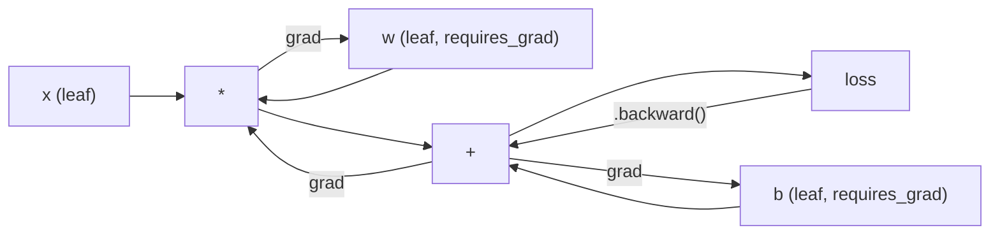
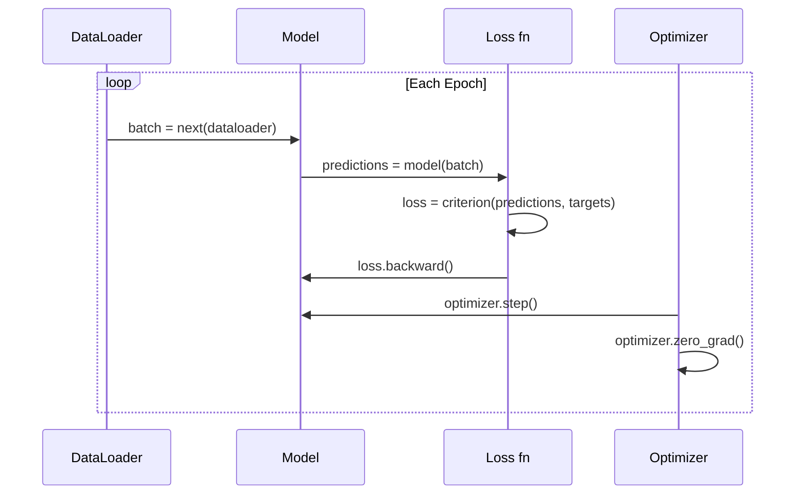

# PyTorch 简介

> 您用活塞和曲轴制造了发动机。现在来了解一下每个人实际驾驶的那一款。

**类型：** 构建
**语言：** Python
**先决条件：** 第 03.10 课（构建您自己的迷你框架）
**时间：** ~75 分钟

## 学习目标

- 使用 PyTorch 的 nn.Module、nn.Sequential 和 autograd 构建和训练神经网络
- 使用 PyTorch 张量、GPU 加速和标准训练循环（zero_grad、forward、loss、backward、step）
- 将您从头开始的迷你框架组件转换为 PyTorch 等效组件
- 分析并比较纯 Python 框架和 PyTorch 在同一任务上的训练速度

## 问题

你有一个可以工作的迷你框架。线性层、ReLU、dropout、batchnorm、Adam、DataLoader、训练循环。它在纯 Python 中针对圆形分类问题训练 4 层网络。

在同样的问题上，它也比 PyTorch 慢 500 倍。

您的迷你框架使用嵌套的 Python 循环一次处理一个样本。 PyTorch 将相同的操作分派给在 GPU 上运行的优化 C++/CUDA 内核。在单个 NVIDIA A100 上，PyTorch 在 ImageNet（128 万张图像）上训练 ResNet-50（2560 万个参数）大约需要 6 小时。如果不是先耗尽内存，您的框架将花费大约 3,000 小时来完成同一任务。

速度并不是唯一的差距。您的框架不支持 GPU。没有自动微分——你为每个模块手工编写backward()。没有序列化。没有分布式训练。无混合精度。如果没有 print 语句，就无法调试梯度流。

PyTorch 填补了所有这些空白。它这样做的同时保持与您已经构建的完全相同的心理模型：Module、forward()、parameters()、backward()、optimizer.step()。概念一对一地转移。语法几乎相同。不同之处在于，PyTorch 在您从头开始设计的同一界面背后包含了十年的系统工程。

## 概念

### 为什么 PyTorch 获胜2015 年，TensorFlow 要求您在运行任何内容之前定义一个静态计算图。您构建了图表，对其进行了编译，然后通过它提供了数据。调试意味着盯着图形可视化。改变架构意味着从头开始重建图表。

PyTorch 于 2017 年推出，具有不同的理念：急于执行。你写Python。它立即运行。 `y = model(x)` 实际上现在计算 y，而不是“将一个节点添加到稍后将计算 y 的图中”。这意味着标准的 Python 调试工具可以工作。 print() 有效。 pdb 工作了。 if/else 在你的前向传播中有效。

到了2020年，市场已经说话了。 PyTorch 在 ML 研究论文中的份额从 7% (2017 年) 上升到 75% 以上 (2022 年)。 Meta、Google DeepMind、OpenAI、Anthropic 和 Hugging Face 都使用 PyTorch 作为其主要框架。作为回应，TensorFlow 2.x 采用了 eagerexecution——默认 PyTorch 的设计是正确的。

教训：开发人员的经验是复合的。速度慢 10% 但调试速度快 50% 的框架每次都会获胜。

### 张量

张量是具有三个关键属性的多维数组：形状、数据类型和设备。

```python
import torch

x = torch.zeros(3, 4)           # shape: (3, 4), dtype: float32, device: cpu
x = torch.randn(2, 3, 224, 224) # batch of 2 RGB images, 224x224
x = torch.tensor([1, 2, 3])     # from a Python list
```

**形状**是维度。标量是形状（），向量是（n，），矩阵是（m，n），一批图像是（批次，通道，高度，宽度）。

**Dtype** 控制精度和内存。

|数据类型 |比特|范围 |使用案例 |
|--------|------|--------|----------|
|浮动32 | 32 | 32 ~7 位小数 |默认培训|
|浮动16 | 16 | 16 ~3.3 位小数 |混合精度 |
| bfloat16 | 16 | 16与 float32 范围相同，精度较低 |法学硕士培训|
| int8 | 8 | -128 至 127 |量化推理 |

**设备**决定计算发生的位置。

```python
device = torch.device("cuda" if torch.cuda.is_available() else "cpu")
x = torch.randn(3, 4, device=device)
x = x.to("cuda")
x = x.cpu()
```

每个操作都需要同一设备上的所有张量。这是初学者遇到的第一个 PyTorch 错误：`RuntimeError: Expected all tensors to be on the same device`。通过在计算之前将所有内容移动到同一设备来修复它。

**重塑**是恒定时间的——它改变元数据，而不是数据。

```python
x = torch.randn(2, 3, 4)
x.view(2, 12)      # reshape to (2, 12) -- must be contiguous
x.reshape(6, 4)    # reshape to (6, 4) -- works always
x.permute(2, 0, 1) # reorder dimensions
x.unsqueeze(0)     # add dimension: (1, 2, 3, 4)
x.squeeze()        # remove size-1 dimensions
```

### 自动毕业你的迷你框架要求你为每个模块实现backward()。 PyTorch 没有。它将张量上的每个操作记录到有向无环图（计算图）中，然后反向遍历该图以自动计算梯度。



与您的框架的主要区别：PyTorch 使用基于磁带的自动差异。在前向传递过程中，每个操作都会附加到一个“磁带”。调用 `.backward()` 会反向重播磁带。

```python
x = torch.randn(3, requires_grad=True)
y = x ** 2 + 3 * x
z = y.sum()
z.backward()
print(x.grad)  # dz/dx = 2x + 3
```

autograd 的三个规则：

1. 只有具有 `requires_grad=True` 的叶子张量才会累积梯度
2.默认情况下梯度累积——在每次向后传递之前调用`optimizer.zero_grad()`
3. `torch.no_grad()` 禁用梯度跟踪（评估期间使用）

### nn.模块

`nn.Module` 是 PyTorch 中每个神经网络组件的基类。您已经在第 10 课中构建了这个抽象。PyTorch 的版本添加了自动参数注册、递归模块发现、设备管理和状态字典序列化。

```python
import torch.nn as nn

class MLP(nn.Module):
    def __init__(self, input_dim, hidden_dim, output_dim):
        super().__init__()
        self.layer1 = nn.Linear(input_dim, hidden_dim)
        self.relu = nn.ReLU()
        self.layer2 = nn.Linear(hidden_dim, output_dim)

    def forward(self, x):
        x = self.layer1(x)
        x = self.relu(x)
        x = self.layer2(x)
        return x
```

当您将 `nn.Module` 或 `nn.Parameter` 分配为 `__init__` 中的属性时，PyTorch 会自动注册它。 `model.parameters()` 递归地收集每个注册的参数。这就是为什么您不必像在迷你框架中那样手动收集权重。

关键构建模块：

|模块|它有什么作用 |参数|
|--------|-------------|------------|
| nn.Linear（输入，输出）| Wx + b |输入*输出+输出|
| nn.Conv2d(in_ch, out_ch, k) | nn.Conv2d(in_ch, out_ch, k) | 2D 卷积 |输入通道 * 输出通道 * k * k + 输出通道 |
| nn.BatchNorm1d（特征）|标准化激活 | 2 * 特点 |
| nn.Dropout(p) | nn.Dropout(p) |随机归零| 0 |
| ReLU() | nn.ReLU() |最大（0，x）| 0 |
| nn.GELU() |高斯误差线性| 0 |
| nn.Embedding（词汇，暗淡）|查找表|词汇 * 暗淡 |
| nn.LayerNorm(dim) | nn.LayerNorm(dim) |每个样本归一化 | 2 * 暗淡 |

### 损失函数和优化器

PyTorch 提供您构建的所有内容的生产就绪版本。

**损失函数**（来自 `torch.nn`）：

|损失|任务|输入 |
|------|------|--------|
| MSELoss() | nn.MSELoss() |回归 |任何形状 || nn.CrossEntropyLoss() |多类分类| Logits（不是 softmax）|
| nn.BCEWithLogitsLoss() |二元分类| Logits（非 sigmoid）|
| L1Loss() | nn.L1Loss() |回归（稳健）|任何形状 |
| nn.CTCLoss() |序列比对 |对数概率 |

注意：`CrossEntropyLoss` 在内部组合了 `LogSoftmax` + `NLLLoss`。传递原始 logits，而不是 softmax 输出。这是一个常见的错误，会默默地产生错误的梯度。

**优化器**（来自 `torch.optim`）：

|优化器|何时使用 |典型LR |
|------------|-------------|------------|
| SGD（参数，lr，动量）| CNN、精心调整的管道 | 0.01--0.1 |
|亚当（参数，lr）|默认起点| 1e-3 |
| AdamW（参数，lr，weight_decay）|变压器，微调| 1e-4--1e-3 | 1e-4--1e-3 |
| LBFGS(参数) |小规模、二阶| 1.0 |

### 训练循环

每个 PyTorch 训练循环都遵循相同的 5 步模式。你已经从第 10 课中知道了这一点。



规范模式：

```python
for epoch in range(num_epochs):
    model.train()
    for inputs, targets in train_loader:
        inputs, targets = inputs.to(device), targets.to(device)
        optimizer.zero_grad()
        outputs = model(inputs)
        loss = criterion(outputs, targets)
        loss.backward()
        optimizer.step()
```

批处理循环内有五行。训练 GPT-4、Stable Diffusion 和 LLaMA 的 5 条线。架构发生变化。数据发生变化。这五行没有。

### 数据集和数据加载器

PyTorch 的 `Dataset` 是一个抽象类，具有两个方法：`__len__` 和 `__getitem__`。 `DataLoader` 通过批处理、混洗和多进程数据加载来包装它。

```python
from torch.utils.data import Dataset, DataLoader

class MNISTDataset(Dataset):
    def __init__(self, images, labels):
        self.images = images
        self.labels = labels

    def __len__(self):
        return len(self.labels)

    def __getitem__(self, idx):
        return self.images[idx], self.labels[idx]

loader = DataLoader(dataset, batch_size=64, shuffle=True, num_workers=4)
```

`num_workers=4` 生成 4 个进程来并行加载数据，同时 GPU 在当前批次上进行训练。对于磁盘密集型工作负载（大图像、音频），仅此一项就可以使训练速度加倍。

### GPU 训练

将模型移至 GPU：

```python
device = torch.device("cuda" if torch.cuda.is_available() else "cpu")
model = model.to(device)
```

这会递归地将每个参数和缓冲区移动到 GPU。然后在训练期间移动每批：

```python
inputs, targets = inputs.to(device), targets.to(device)
```

**混合精度**通过在 float16 中向前/向后运行，同时将主权重保持在 float32 中，将现代 GPU（A100、H100、RTX 4090）上的内存使用量减半并使吞吐量加倍：

```python
from torch.amp import autocast, GradScaler

scaler = GradScaler()
for inputs, targets in loader:
    with autocast(device_type="cuda"):
        outputs = model(inputs)
        loss = criterion(outputs, targets)
    scaler.scale(loss).backward()
    scaler.step(optimizer)
    scaler.update()
    optimizer.zero_grad()
```

### 比较：Mini Framework、PyTorch、JAX

|特色 |迷你框架（L10）| PyTorch |贾克斯|
|--------|---------------------|---------|-----||自动差分 |手动向后() |基于磁带的 autograd |功能转变|
|执行 | Eager（Python 循环）| Eager（C++ 内核）|追踪 + JIT 编译 |
| GPU 支持 |没有 |是（CUDA、ROCm、MPS）|是（CUDA、TPU）|
|速度（MNIST MLP）| ~300 秒/纪元 | ~0.5 秒/纪元 | ~0.3 秒/纪元 |
|模块系统|自定义模块类 | nn.模块|无状态函数（Flax/Equinox）|
|调试|打印() |打印（），pdb，断点（）|更难（JIT 跟踪中断打印）|
|生态系统|无 |拥抱脸，闪电，蒂姆|亚麻、Optax、Orbax |
|学习曲线|你建造了它 |中等| Steep（函数范式）|
|生产用途|玩具问题 | Meta、OpenAI、Anthropic、HF |谷歌 DeepMind，中途 |

```figure
dropout-mask
```

## 构建它

仅使用 PyTorch 原语在 MNIST 上训练的 3 层 MLP。没有高级包装器。没有 `torchvision.datasets`。我们自己下载并解析原始数据。

### 第 1 步：从原始文件加载 MNIST

MNIST 以 4 个 gzip 压缩文件形式提供：训练图像 (60,000 x 28 x 28)、训练标签、测试图像 (10,000 x 28 x 28)、测试标签。我们下载它们并解析二进制格式。

```python
import torch
import torch.nn as nn
import struct
import gzip
import urllib.request
import os

def download_mnist(path="./mnist_data"):
    base_url = "https://storage.googleapis.com/cvdf-datasets/mnist/"
    files = [
        "train-images-idx3-ubyte.gz",
        "train-labels-idx1-ubyte.gz",
        "t10k-images-idx3-ubyte.gz",
        "t10k-labels-idx1-ubyte.gz",
    ]
    os.makedirs(path, exist_ok=True)
    for f in files:
        filepath = os.path.join(path, f)
        if not os.path.exists(filepath):
            urllib.request.urlretrieve(base_url + f, filepath)

def load_images(filepath):
    with gzip.open(filepath, "rb") as f:
        magic, num, rows, cols = struct.unpack(">IIII", f.read(16))
        data = f.read()
        images = torch.frombuffer(bytearray(data), dtype=torch.uint8)
        images = images.reshape(num, rows * cols).float() / 255.0
    return images

def load_labels(filepath):
    with gzip.open(filepath, "rb") as f:
        magic, num = struct.unpack(">II", f.read(8))
        data = f.read()
        labels = torch.frombuffer(bytearray(data), dtype=torch.uint8).long()
    return labels
```

### 第 2 步：定义模型

3 层 MLP：784 -> 256 -> 128 -> 10。ReLU 激活。用于正则化的 Dropout。没有批量标准化以保持简单。

```python
class MNISTModel(nn.Module):
    def __init__(self):
        super().__init__()
        self.net = nn.Sequential(
            nn.Linear(784, 256),
            nn.ReLU(),
            nn.Dropout(0.2),
            nn.Linear(256, 128),
            nn.ReLU(),
            nn.Dropout(0.2),
            nn.Linear(128, 10),
        )

    def forward(self, x):
        return self.net(x)
```

输出层生成 10 个原始 logits（每个数字一个）。没有 softmax —— `CrossEntropyLoss` 在内部处理这个问题。

参数数量：784*256 + 256 + 256*128 + 128 + 128*10 + 10 = 235,146。以现代标准来看很小。 GPT-2小号有124M。这只需几秒钟即可完成训练。

### 步骤 3：训练循环

典型的前向损失后向步模式。

```python
def train_one_epoch(model, loader, criterion, optimizer, device):
    model.train()
    total_loss = 0
    correct = 0
    total = 0
    for images, labels in loader:
        images, labels = images.to(device), labels.to(device)
        optimizer.zero_grad()
        outputs = model(images)
        loss = criterion(outputs, labels)
        loss.backward()
        optimizer.step()
        total_loss += loss.item() * images.size(0)
        _, predicted = outputs.max(1)
        correct += predicted.eq(labels).sum().item()
        total += labels.size(0)
    return total_loss / total, correct / total


def evaluate(model, loader, criterion, device):
    model.eval()
    total_loss = 0
    correct = 0
    total = 0
    with torch.no_grad():
        for images, labels in loader:
            images, labels = images.to(device), labels.to(device)
            outputs = model(images)
            loss = criterion(outputs, labels)
            total_loss += loss.item() * images.size(0)
            _, predicted = outputs.max(1)
            correct += predicted.eq(labels).sum().item()
            total += labels.size(0)
    return total_loss / total, correct / total
```

评估期间请注意 `torch.no_grad()`。这会禁用自动分级，减少内存使用并加快推理速度。没有它，PyTorch 会构建一个您永远不会使用的计算图。

### 第 4 步：将所有内容连接在一起

```python
def main():
    device = torch.device("cuda" if torch.cuda.is_available() else "cpu")

    download_mnist()
    train_images = load_images("./mnist_data/train-images-idx3-ubyte.gz")
    train_labels = load_labels("./mnist_data/train-labels-idx1-ubyte.gz")
    test_images = load_images("./mnist_data/t10k-images-idx3-ubyte.gz")
    test_labels = load_labels("./mnist_data/t10k-labels-idx1-ubyte.gz")

    train_dataset = torch.utils.data.TensorDataset(train_images, train_labels)
    test_dataset = torch.utils.data.TensorDataset(test_images, test_labels)
    train_loader = torch.utils.data.DataLoader(
        train_dataset, batch_size=64, shuffle=True
    )
    test_loader = torch.utils.data.DataLoader(
        test_dataset, batch_size=256, shuffle=False
    )

    model = MNISTModel().to(device)
    criterion = nn.CrossEntropyLoss()
    optimizer = torch.optim.Adam(model.parameters(), lr=1e-3)

    num_params = sum(p.numel() for p in model.parameters())
    print(f"Device: {device}")
    print(f"Parameters: {num_params:,}")
    print(f"Train samples: {len(train_dataset):,}")
    print(f"Test samples: {len(test_dataset):,}")
    print()

    for epoch in range(10):
        train_loss, train_acc = train_one_epoch(
            model, train_loader, criterion, optimizer, device
        )
        test_loss, test_acc = evaluate(
            model, test_loader, criterion, device
        )
        print(
            f"Epoch {epoch+1:2d} | "
            f"Train Loss: {train_loss:.4f} | Train Acc: {train_acc:.4f} | "
            f"Test Loss: {test_loss:.4f} | Test Acc: {test_acc:.4f}"
        )

    torch.save(model.state_dict(), "mnist_mlp.pt")
    print(f"\nModel saved to mnist_mlp.pt")
    print(f"Final test accuracy: {test_acc:.4f}")
```

10 个 epoch 后的预期输出：~97.8% 测试准确率。 CPU 训练时间：约 30 秒。在 GPU 上：约 5 秒。在具有相同架构的迷你框架上：约 45 分钟。

## 使用它

### 快速比较：Mini Framework 与 PyTorch|迷你框架（第 10 课）| PyTorch |
|----------------------------|---------|
| `model = Sequential(Linear(784, 256), ReLU(), ...)` | `model = nn.Sequential(nn.Linear(784, 256), nn.ReLU(), ...)` |
| `pred = model.forward(x)` | `pred = model(x)` |
| `optimizer.zero_grad()` | `optimizer.zero_grad()` `grad = criterion.backward()` |
| `model.backward(grad)` 然后 `loss.backward()` | `optimizer.step()` |
| `optimizer.step()` | `model.to("cuda")` |
|没有 GPU | `state_dict()` |
|每个模块手动向后 | Autograd 处理一切 |

界面几乎相同。区别在于幕后的一切。

### 保存和加载模型

```python
torch.save(model.state_dict(), "model.pt")

model = MNISTModel()
model.load_state_dict(torch.load("model.pt", weights_only=True))
model.eval()
```

始终保存 `outputs/prompt-pytorch-debugger.md` （参数字典），而不是模型对象。保存模型对象使用 pickle，当您重构代码时，它会中断。国家命令是可移植的。

### 学习率调度

```python
scheduler = torch.optim.lr_scheduler.CosineAnnealingLR(
    optimizer, T_max=10
)
for epoch in range(10):
    train_one_epoch(model, train_loader, criterion, optimizer, device)
    scheduler.step()
```

PyTorch 提供 15 多个调度程序：StepLR、ExponentialLR、CosineAnnealingLR、OneCycleLR、ReduceLROnPlateau。全部插入相同的优化器接口。

## 发货

本课程产生两个工件：

- `outputs/skill-pytorch-patterns.md` -- 诊断常见 PyTorch 训练失败的提示
- `nn.BatchNorm1d` -- PyTorch 训练模式的技能参考

## 练习

1. **添加批量归一化。** 在每个线性层之后（激活之前）插入 `torch.amp.autocast` 。将测试准确性和训练速度与仅 dropout 版本进行比较。 Batchnorm 应在更少的 epoch 内达到 98%+。

2. **实现学习率查找器。** 以指数级增加的学习率（从 1e-7 到 1.0）训练一个 epoch。绘制损失与 LR 的关系。最佳 LR 就在损失开始攀升之前。使用它为 MNIST 模型选择更好的 LR。

3. **以混合精度移植到 GPU。** 将 `GradScaler` 和 `FashionMNISTDataset(Dataset)` 添加到训练循环中。在 GPU 上测量具有或不具有混合精度的吞吐量（样本/秒）。在 A100 上，预计可实现约 2 倍的加速。

4. **构建自定义数据集。** 下载 Fashion-MNIST（与 MNIST 格式相同，但包含服装）。使用 `__getitem__` 和 `__len__` 实现 `SGD(params, lr=0.01, momentum=0.9)` 类。训练相同的 MLP 并比较准确性。 Fashion-MNIST 更难——预计约为 88% vs 约为 98%。5. **将 Adam 替换为 SGD + 动量。** 使用 `CosineAnnealingLR` 进行训练。比较收敛曲线。然后添加一个 CosineAnnealingLR 调度程序，看看 SGD 是否在第 10 纪元赶上 Adam。

## 关键术语

|术语 |人们怎么说|它实际上意味着什么 |
|------|----------------|----------------------|
|张量 | “多维数组”|类型化、设备感知的阵列，具有自动微分支持，融入到每个操作中 |
|自动毕业 | “自动反向传播” |基于磁带的系统，可记录正向传播过程中的操作，然后反向重播它们以计算精确的梯度 |
| nn.模块| “一层”|任何可微分计算块的基类——注册参数、支持嵌套、处理训练/评估模式 |
|状态字典 | “模型权重” | OrderedDict 将参数名称映射到张量——训练模型的可移植、可序列化表示 |
| .backward() | “计算梯度” |反向遍历计算图，计算并累加每个叶张量的梯度（requires_grad=True | |）
| .to（设备）| “转向 GPU” |递归地将所有参数和缓冲区传输到指定设备（CPU、CUDA、MPS） |
|数据加载器| “数据管道” |一个迭代器，用于批处理、洗牌和可选地并行化从数据集加载数据 |
|混合精度 | “使用 float16”|使用 float16 向前/向后训练以提高速度，同时保持 float32 主重量以保持数值稳定性 |
|急切的执行力| “立即运行” |操作在调用时立即执行，而不是推迟到以后的编译步骤——这是 PyTorch 与 TF 1.x 的核心设计选择 |
|零梯度 | “重置渐变”|在下一次向后传递之前将所有参数梯度设置为零，因为 PyTorch 默认情况下会累积梯度 |

## 进一步阅读

- Paszke 等人，“PyTorch：一种命令式的高性能深度学习库”（2019 年）——解释 PyTorch 设计权衡的原始论文
- PyTorch 教程：“通过示例学习 PyTorch”(https://pytorch.org/tutorials/beginner/pytorch_with_examples.html)——从张量到 nn.Module 的官方路径- PyTorch 性能调优指南 (https://pytorch.org/tutorials/recipes/recipes/tuning_guide.html) -- 混合精度、DataLoader 工作线程、固定内存和其他生产优化
- Horace He，“让深度学习变得Brrrrr”(https://horace.io/brrr_intro.html) - 为什么 GPU 训练速度很快，并且具有 PyTorch 特定的优化策略
