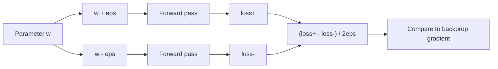
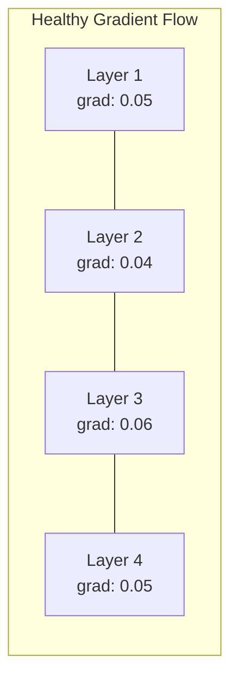
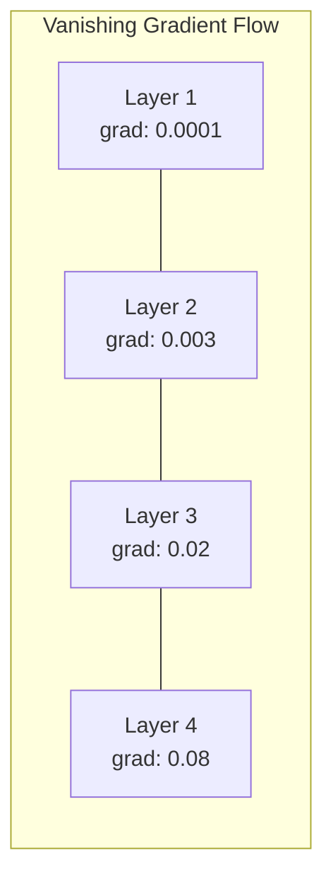
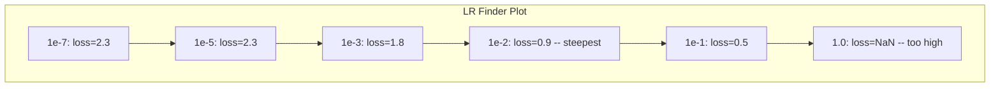

# 调试��网络

> 你的网络已�编译了。它跑起�了，也输出了一个数字。数字是错的，但没有崩溃。欢��到最难的那�调试, 没有错误消�的调试�
**类��* �建
**语言�* Python�PyTorch
**先决�件�* �03 阶段�01-10 课（尤其是��传播��失函数�优化器�
**时间�* ~90 分钟

## 学习目标

- 使用系统调试策略诊断常�的��网络故障（NaN �失�平��失曲线�过度拟��振�）
- 应用“一批过拟��技术�验�你的模���和训练循�是�正�- 检查梯度大��激活分布和��范数，以识别梯度消失/爆炸问题
- �建涵盖数�管��模�����失函数�优化器和学习�问题的调试清�

## 问题

传统软件一旦��就会崩溃。空指针会引�异常。类��匹�在编译时失败。相差一错误会产生�显错误的输出�

��网络�会给你那么奢侈的东西�

��的��网络�行至完�，打��失值并输出预测。�失�能会�少。这些预测看起��能是��的。但这个模�其�是错误的——学习�径�记�噪音，或者收敛到无用的局部最�值。谷歌研究人员估计，60-70% �ML 调试时间都花在“无声�错误上，这些错误�会产生错误，但会��模�质��

工作模�和��模�之间的区别通常是一�错�的线：缺少 `zero_grad()`�转置维度�学习��� 10 �。规范的“训练��网络的秘诀�（2019）是这样开头的：“最常�的��网络错误是�会崩溃的错误。�

本课教你找到这些错误�
## 概念

### 调试心�

忘记打�并祈祷调试。��网络调试需�系统化的方法，因为�馈循�很慢（�次训练�行几分钟到几�时）并且症状��确（严�的�失�能�味� 20 ���的情况）。黄金法则：**�简�开始，一次一点地�加��性，并独立验��一部分�*

```mermaid
flowchart TD
    A["�失�下�] --> B{"检查学习�"}
    B -->|"太高"| C["�失振�或爆�]
    B -->|"太�"| D["�失几��动"]
    B -->|"��"| E{"检查梯�}
    E -->|"全为 0"| F["ReLU 死亡或梯度消�]
    E -->|"NaN/Inf"| G["梯度爆炸"]
    E -->|"正常"| H{"检查数�管�}
    H -->|"标签被打�| I["�机猜测级准确�"]
    H -->|"预处�有 bug"| J["模�学到的是噪声"]
    H -->|"数�没问�| K{"检查模�结�}
    K -->|"太�"| L["欠拟�]
    K -->|"太深"| M["优化困难"]
```

### 症状 1：�失�下�

这是最常�的问题。训练循�在跑，epoch 一轮轮过�，�失�一直平�走，或者剧烈振��
**学习�错误�* 太高会让�失振�，甚至直�跳�NaN；太�则会让�失下�得很慢，看起��没�化。Adam 通常�1e-3 开始，SGD 通常�1e-1 �1e-2 开始。在下结论之�，最好先�3 个相�10 �的学习�，例如 1e-2�e-3�e-4�
**死亡 ReLU�* 如� ReLU ��元收到很大的负输入，它就�会输出 0，而且梯度也是 0，之��也激活�起�。如�死�的��元太多，网络就学�动了。检查方法：打��个 ReLU 层��好�0 的激活比例。如�超�50%，就�� LeakyReLU，或者先把学习�调��
**梯度消失�* 在带�sigmoid �tanh 激活的深层网络里，梯度在��传播时会指数级缩�。等它传到第一层时，几�已�是 0 了，第一层也就学�动了。修�方法：改用 ReLU/GELU，加入残差��，或者使用批�归一化�
**梯度爆炸�*相�的问题——梯度呈指数�长。常�� RNN 和�常深的网络中。�失跳�NaN。修�：梯度�剪 (`torch.nn.utils.clip_grad_norm_`)���学习�或添加归一化�

###症状2：�失�少但模�很糟�

�失下�了。训练准确�达到99%。但测试准确�为55%。或者模�对真�数�产生无�义的输出�

**过度拟��* 这�模�记�了训练数�，�没有学到规律。训练�失和验��失之间的差�会��时间越拉越大。修�方法：更多数��dropout���衰�����止�数��强�
**数�泄露�* 测试数�混进了训练过程，结�准确�高得�疑。常��因包括：在拆分�洗牌�预处�时用了整份数�集的统计����数�划分之间有��样本。修�方法是先拆分，�预处�，�时检查��项�*标签错误�* 大多数真�数�集中有 5-10% 的标签是错的（Northcutt 等人�021 - “测试集中普�存在的标签错误�）。模�学到的其�是噪声。修�：用置信学习找出并修正标错的样本，或者用�失截断忽略高�失样本�
### 症状 3：�失中 NaN �Inf

�失值��`nan` �`inf`。训练已�死了�

**学习�太高�* 梯度更新过冲，导致��爆炸。修�：�少 10 ��

**log(0) �log(��* 交�熵�失计�`log(p)`。如�您的模�输出�好为 0 或负概�，则日志会爆炸。修�：将预测�制为 `[eps, 1-eps]`，其�`eps=1e-7`�

**除以零�* 批�归一化除以标准差。具有常�值的批次�std=0。修�：�epsilon 添加到分�（PyTorch 默认情况下会执行此�作，但自定义���能�会）�

**数字溢出�* 大�激活输�`exp()` 产生 Inf�Softmax 尤其容易�生。修�：在求幂之���最大值（log-sum-exp 技巧）�

### 技�1：梯度检�

把解�梯度（�自��传播）和数值梯度（�自有�差分）对比一下。如�两者�一致，那就说���传播有问题�
�数 `w` 的数值梯度：

```
grad_numerical = (loss(w + eps) - loss(w - eps)) / (2 * eps)
```

一致性指标（相对差异）：

```
rel_diff = |grad_analytical - grad_numerical| / max(|grad_analytical|, |grad_numerical|, 1e-8)
```

如� `rel_diff < 1e-5`：正确。如�`rel_diff > 1e-3`：几��以肯定是一个错误�



### 技�2：激活统�

在训练期间监��层之�激活的平�值和标准�差。�康的网络��激活的平�值��0，标准差�近 1（标准化�）或至少有界�

|�康指标|平� |标准|诊断 |
|----------------|------|-----|------------|
|�康 | � | � |网络学习正常 |
|饱和| >>0 �<<0 | � |激活值�留在��|
|死了| 0 | 0 |��元已死亡（全为零）|
|爆炸| >>10 | >>10 |活跃度无��长|

### 技�3：梯度��视化绘制�层的平�梯度幅值。在�康的网络中，�层的梯度大�应该大致相似。如�早期层的梯度比��层� 1000 �，则梯度消失�





### 技�4：过拟�批�测试

深度学习中最��的调试技术�

�一�批�-32 个样本）。对它训�100 多次。�失应该�近�零，训练准确�应该达�100%。如�没有，说�你的模�或训练循�里有根本性错误，先别跑完整训练�
该测试��：
- �失函数被破�
- ��传�被破�
- ��太�，无法表示数�
- 优化器未��到模���
- 数�和标签未对�

这需�30 秒的时间��行，并节�了调试完整训练�行的时间�

### 技�5：学习�查找�

Leslie Smith�017）�出在一个时期内将学习���常��e-7）扫到�常大�0），�时记录�失。绘制�失�学习�的关系图。最佳学习速�大约比�失开始下�最快的速��10 ��



本例中的最�LR：~1e-3（比最陡点高一个数�级）�

### 常��PyTorch 错误

这些�PyTorch 社区中浪费最多时间的错误�

|错误 |症状|修� |
|-----|---------|-----|
|忘记 `optimizer.zero_grad()` |梯度跨批次累积，�失振� |�`optimizer.zero_grad()` 之�添加 `loss.backward()` |
|在测试时忘记 `model.eval()` | Dropout 和批�归一化的行为��，测试精度在�行之间有所�� |添加 `model.eval()` �`torch.no_grad()` |
|错误的张�形�|无声广播产生错误结�，没有错�|调试期间�次�作�打�形�|
| CPU/GPU �匹�| `RuntimeError: expected CUDA tensor` | `.to(device)` |在模�和数�上使�`.detach()` |
|�分离张�|计算图永远�长，OOM |使用 `with torch.no_grad()` �`RuntimeError: modified by in-place operation` ||就地�作打破 autograd | `x += 1` | `x = x + 1`�`Long` 替��`Float` |
|数�未标准化 |�失�留在�机机会水平|将输入标准化为mean=0，std=1 |
|标签为错误的数�类� |交�熵期�`labels.long()`，得�`.requires_grad` |演员标签：`torch.no_grad()` |

### 主调试表

|症状|�能的��|首先��试的事情 |
|--------|-------------|--------------------|
|�失�留�-log(1/num_classes) |模�预测�匀分布 |检查数�管�，验�标签�输入匹�|
|几步之��失 NaN |学习�太�|�LR �� 10 �|
|立��失 NaN | log(0) 或除以零 |�epsilon 添加到日�除法�作 |
|��大幅波动| LR 太高或批�太�|�少 LR，�加批�大�|
|�失�少然�趋�稳定| LR 太高，无法进行微调阶�|添加 LR 时间表（余弦或步进衰�）|
|训练 acc 高，测试 acc �|过度拟� |添加 dropout���衰��更多数�|
|训练 acc = 测试 acc = 机会 |模�没有学到任何东西|�行过拟�一批测�|
|训练 acc = 测试 acc 但�较� |欠拟�|更大的模��更多的层数�更多的功能 |
|梯度全为�| Dead ReLU 或分离计算图 |切��LeakyReLU，检�`outputs/prompt-nn-debugger.md` |
|训练期间内存�足 |批次太大或图表未释放 |�少批�大�，使�`outputs/skill-debug-checklist.md` 进行评估 |

```figure
learning-curves
```

## �建�

这是一个用�监�激活�梯度和�失曲线的诊断工具包。你会故�把网络弄�，�用这个工具包�个�查问题�
### �1 步：NetworkDebugger �

���PyTorch 模�以记录�层的激活和梯度统计数��

```python
import torch
import torch.nn as nn
import math


class NetworkDebugger:
    def __init__(self, model):
        self.model = model
        self.activation_stats = {}
        self.gradient_stats = {}
        self.loss_history = []
        self.lr_losses = []
        self.hooks = []
        self._register_hooks()

    def _register_hooks(self):
        for name, module in self.model.named_modules():
            if isinstance(module, (nn.Linear, nn.Conv2d, nn.ReLU, nn.LeakyReLU)):
                hook = module.register_forward_hook(self._make_activation_hook(name))
                self.hooks.append(hook)
                hook = module.register_full_backward_hook(self._make_gradient_hook(name))
                self.hooks.append(hook)

    def _make_activation_hook(self, name):
        def hook(module, input, output):
            with torch.no_grad():
                out = output.detach().float()
                self.activation_stats[name] = {
                    "mean": out.mean().item(),
                    "std": out.std().item(),
                    "fraction_zero": (out == 0).float().mean().item(),
                    "min": out.min().item(),
                    "max": out.max().item(),
                }
        return hook

    def _make_gradient_hook(self, name):
        def hook(module, grad_input, grad_output):
            if grad_output[0] is not None:
                with torch.no_grad():
                    grad = grad_output[0].detach().float()
                    self.gradient_stats[name] = {
                        "mean": grad.mean().item(),
                        "std": grad.std().item(),
                        "abs_mean": grad.abs().mean().item(),
                        "max": grad.abs().max().item(),
                    }
        return hook

    def record_loss(self, loss_value):
        self.loss_history.append(loss_value)

    def check_loss_health(self):
        if len(self.loss_history) < 2:
            return "NOT_ENOUGH_DATA"
        recent = self.loss_history[-10:]
        if any(math.isnan(v) or math.isinf(v) for v in recent):
            return "NAN_OR_INF"
        if len(self.loss_history) >= 20:
            first_half = sum(self.loss_history[:10]) / 10
            second_half = sum(self.loss_history[-10:]) / 10
            if second_half >= first_half * 0.99:
                return "NOT_DECREASING"
        if len(recent) >= 5:
            diffs = [recent[i+1] - recent[i] for i in range(len(recent)-1)]
            if max(diffs) - min(diffs) > 2 * abs(sum(diffs) / len(diffs)):
                return "OSCILLATING"
        return "HEALTHY"

    def check_activations(self):
        issues = []
        for name, stats in self.activation_stats.items():
            if stats["fraction_zero"] > 0.5:
                issues.append(f"DEAD_NEURONS: {name} has {stats['fraction_zero']:.0%} zero activations")
            if abs(stats["mean"]) > 10:
                issues.append(f"EXPLODING_ACTIVATIONS: {name} mean={stats['mean']:.2f}")
            if stats["std"] < 1e-6:
                issues.append(f"COLLAPSED_ACTIVATIONS: {name} std={stats['std']:.2e}")
        return issues if issues else ["HEALTHY"]

    def check_gradients(self):
        issues = []
        grad_magnitudes = []
        for name, stats in self.gradient_stats.items():
            grad_magnitudes.append((name, stats["abs_mean"]))
            if stats["abs_mean"] < 1e-7:
                issues.append(f"VANISHING_GRADIENT: {name} abs_mean={stats['abs_mean']:.2e}")
            if stats["abs_mean"] > 100:
                issues.append(f"EXPLODING_GRADIENT: {name} abs_mean={stats['abs_mean']:.2e}")
        if len(grad_magnitudes) >= 2:
            first_mag = grad_magnitudes[0][1]
            last_mag = grad_magnitudes[-1][1]
            if last_mag > 0 and first_mag / last_mag > 100:
                issues.append(f"GRADIENT_RATIO: first/last = {first_mag/last_mag:.0f}x (vanishing)")
        return issues if issues else ["HEALTHY"]

    def print_report(self):
        print("\n=== NETWORK DEBUGGER REPORT ===")
        print(f"\nLoss health: {self.check_loss_health()}")
        if self.loss_history:
            print(f"  Last 5 losses: {[f'{v:.4f}' for v in self.loss_history[-5:]]}")
        print("\nActivation diagnostics:")
        for item in self.check_activations():
            print(f"  {item}")
        print("\nGradient diagnostics:")
        for item in self.check_gradients():
            print(f"  {item}")
        print("\nPer-layer activation stats:")
        for name, stats in self.activation_stats.items():
            print(f"  {name}: mean={stats['mean']:.4f} std={stats['std']:.4f} zero={stats['fraction_zero']:.1%}")
        print("\nPer-layer gradient stats:")
        for name, stats in self.gradient_stats.items():
            print(f"  {name}: abs_mean={stats['abs_mean']:.2e} max={stats['max']:.2e}")

    def remove_hooks(self):
        for hook in self.hooks:
            hook.remove()
        self.hooks.clear()
```

### 步骤 2：过拟�批�测试

```python
def overfit_one_batch(model, x_batch, y_batch, criterion, lr=0.01, steps=200):
    optimizer = torch.optim.Adam(model.parameters(), lr=lr)
    model.train()
    print("\n=== ¹ıÄâºÏµ¥Åú´Î²âÊÔ ===")
    print(f"Åú´óĞ¡£º{x_batch.shape[0]}£¬²½Êı£º{steps}")

    for step in range(steps):
        optimizer.zero_grad()
        output = model(x_batch)
        loss = criterion(output, y_batch)
        loss.backward()
        optimizer.step()

        if step % 50 == 0 or step == steps - 1:
            with torch.no_grad():
                preds = (output > 0).float() if output.shape[-1] == 1 else output.argmax(dim=1)
                targets = y_batch if y_batch.dim() == 1 else y_batch.squeeze()
                acc = (preds.squeeze() == targets).float().mean().item()
            print(f"  ²½Öè {step:3d} | Ëğʧ£º{loss.item():.6f} | ׼ȷÂÊ£º{acc:.1%}")

    final_loss = loss.item()
    if final_loss > 0.1:
        print(f"\n  ʧ°Ü£ºËğʧûÓĞÊÕÁ²£¨{final_loss:.4f}£©¡£Ä£ĞÍ»òѵÁ·Ñ­»·ÓĞÎÊÌâ¡£")
        return False
    print(f"\n  ͨ¹ı£ºËğʧÒÑÊÕÁ²µ½ {final_loss:.6f}")
    return True
```

### �3 步：学习�查找器

```python
def find_learning_rate(model, x_data, y_data, criterion, start_lr=1e-7, end_lr=10, steps=100):
    import copy
    original_state = copy.deepcopy(model.state_dict())
    optimizer = torch.optim.SGD(model.parameters(), lr=start_lr)
    lr_mult = (end_lr / start_lr) ** (1 / steps)

    model.train()
    results = []
    best_loss = float("inf")
    current_lr = start_lr

    print("\n=== ѧϰÂʲéÕÒÆ÷ ===")

    for step in range(steps):
        optimizer.zero_grad()
        output = model(x_data)
        loss = criterion(output, y_data)

        if math.isnan(loss.item()) or loss.item() > best_loss * 10:
            break

        best_loss = min(best_loss, loss.item())
        results.append((current_lr, loss.item()))

        loss.backward()
        optimizer.step()

        current_lr *= lr_mult
        for param_group in optimizer.param_groups:
            param_group["lr"] = current_lr

    model.load_state_dict(original_state)

    if len(results) < 10:
        print("  ÎŞ·¨Íê³É LR ɨÃè -- Ëğʧ·¢É¢µÃÌ«¿ì")
        return results

    min_loss_idx = min(range(len(results)), key=lambda i: results[i][1])
    suggested_lr = results[max(0, min_loss_idx - 10)][0]

    print(f"  ɨÃèÁË {len(results)} ²½£¬·¶Î§´Ó {start_lr:.0e} µ½ {results[-1][0]:.0e}")
    print(f"  ×îĞ¡Ëğʧ {results[min_loss_idx][1]:.4f}£¬¶ÔÓ¦ lr={results[min_loss_idx][0]:.2e}")
    print(f"  ½¨ÒéѧϰÂÊ£º{suggested_lr:.2e}")

    return results
```

### 步骤 4：梯度检查器

```python
def _flat_to_multi_index(flat_idx, shape):
    multi_idx = []
    remaining = flat_idx
    for dim in reversed(shape):
        multi_idx.insert(0, remaining % dim)
        remaining //= dim
    return tuple(multi_idx)


def gradient_check(model, x, y, criterion, eps=1e-4):
    model.train()
    x_double = x.double()
    y_double = y.double()
    model_double = model.double()

    print("\n=== GRADIENT CHECK ===")
    overall_max_diff = 0
    checked = 0

    for name, param in model_double.named_parameters():
        if not param.requires_grad:
            continue

        layer_max_diff = 0

        model_double.zero_grad()
        output = model_double(x_double)
        loss = criterion(output, y_double)
        loss.backward()
        analytical_grad = param.grad.clone()

        num_checks = min(5, param.numel())
        for i in range(num_checks):
            idx = _flat_to_multi_index(i, param.shape)
            original = param.data[idx].item()

            param.data[idx] = original + eps
            with torch.no_grad():
                loss_plus = criterion(model_double(x_double), y_double).item()

            param.data[idx] = original - eps
            with torch.no_grad():
                loss_minus = criterion(model_double(x_double), y_double).item()

            param.data[idx] = original

            numerical = (loss_plus - loss_minus) / (2 * eps)
            analytical = analytical_grad[idx].item()

            denom = max(abs(numerical), abs(analytical), 1e-8)
            rel_diff = abs(numerical - analytical) / denom

            layer_max_diff = max(layer_max_diff, rel_diff)
            checked += 1

        overall_max_diff = max(overall_max_diff, layer_max_diff)
        status = "OK" if layer_max_diff < 1e-5 else "MISMATCH"
        print(f"  {name}: max_rel_diff={layer_max_diff:.2e} [{status}]")

    model.float()

    print(f"\n  Checked {checked} parameters")
    if overall_max_diff < 1e-5:
        print("  PASS: Gradients match (rel_diff < 1e-5)")
    elif overall_max_diff < 1e-3:
        print("  WARN: Small differences (1e-5 < rel_diff < 1e-3)")
    else:
        print("  FAIL: Gradient mismatch detected (rel_diff > 1e-3)")
    return overall_max_diff
```

### 步骤 5：故�破�网�

�在将该工具包应用���的网络并诊断�个网络�

```python
def demo_broken_networks():
    torch.manual_seed(42)
    x = torch.randn(64, 10)
    y = (x[:, 0] > 0).long()

    print("\n" + "=" * 60)
    print("BUG 1£ºÑ§Ï°Âʹı¸ß£¨lr=10£©")
    print("=" * 60)
    model1 = nn.Sequential(nn.Linear(10, 32), nn.ReLU(), nn.Linear(32, 2))
    debugger1 = NetworkDebugger(model1)
    optimizer1 = torch.optim.SGD(model1.parameters(), lr=10.0)
    criterion = nn.CrossEntropyLoss()
    for step in range(20):
        optimizer1.zero_grad()
        out = model1(x)
        loss = criterion(out, y)
        debugger1.record_loss(loss.item())
        loss.backward()
        optimizer1.step()
    debugger1.print_report()
    debugger1.remove_hooks()

    print("\n" + "=" * 60)
    print("BUG 2£º´íÎó³õʼ»¯µ¼Ö ReLU ËÀÍö")
    print("=" * 60)
    model2 = nn.Sequential(nn.Linear(10, 32), nn.ReLU(), nn.Linear(32, 32), nn.ReLU(), nn.Linear(32, 2))
    with torch.no_grad():
        for m in model2.modules():
            if isinstance(m, nn.Linear):
                m.weight.fill_(-1.0)
                m.bias.fill_(-5.0)
    debugger2 = NetworkDebugger(model2)
    optimizer2 = torch.optim.Adam(model2.parameters(), lr=1e-3)
    for step in range(50):
        optimizer2.zero_grad()
        out = model2(x)
        loss = criterion(out, y)
        debugger2.record_loss(loss.item())
        loss.backward()
        optimizer2.step()
    debugger2.print_report()
    debugger2.remove_hooks()

    print("\n" + "=" * 60)
    print("BUG 3£ºÈ±ÉÙ zero_grad£¨ÌݶÈÀÛ»ı£©")
    print("=" * 60)
    model3 = nn.Sequential(nn.Linear(10, 32), nn.ReLU(), nn.Linear(32, 2))
    debugger3 = NetworkDebugger(model3)
    optimizer3 = torch.optim.SGD(model3.parameters(), lr=0.01)
    for step in range(50):
        out = model3(x)
        loss = criterion(out, y)
        debugger3.record_loss(loss.item())
        loss.backward()
        optimizer3.step()
    debugger3.print_report()
    debugger3.remove_hooks()

    print("\n" + "=" * 60)
    print("½¡¿µÍøÂ磺ÓÃÓڶԱȵÄÕıÈ·ÅäÖÃ")
    print("=" * 60)
    model_good = nn.Sequential(nn.Linear(10, 32), nn.ReLU(), nn.Linear(32, 2))
    debugger_good = NetworkDebugger(model_good)
    optimizer_good = torch.optim.Adam(model_good.parameters(), lr=1e-3)
    for step in range(50):
        optimizer_good.zero_grad()
        out = model_good(x)
        loss = criterion(out, y)
        debugger_good.record_loss(loss.item())
        loss.backward()
        optimizer_good.step()
    debugger_good.print_report()
    debugger_good.remove_hooks()

    print("\n" + "=" * 60)
    print("¹ıÄâºÏµ¥Åú´Î²âÊÔ£¨½¡¿µÄ£ĞÍ£©")
    print("=" * 60)
    model_test = nn.Sequential(nn.Linear(10, 32), nn.ReLU(), nn.Linear(32, 2))
    overfit_one_batch(model_test, x[:8], y[:8], criterion)

    print("\n" + "=" * 60)
    print("ѧϰÂʲéÕÒÆ÷")
    print("=" * 60)
    model_lr = nn.Sequential(nn.Linear(10, 32), nn.ReLU(), nn.Linear(32, 2))
    find_learning_rate(model_lr, x, y, criterion)

    print("\n" + "=" * 60)
    print("Ìݶȼì²é")
    print("=" * 60)
    model_grad = nn.Sequential(nn.Linear(10, 8), nn.ReLU(), nn.Linear(8, 2))
    gradient_check(model_grad, x[:4], y[:4], criterion)
```

## 使用�## PyTorch 内置工具

```python
import torch
import torch.nn as nn

model = nn.Sequential(
    nn.Linear(768, 256),
    nn.ReLU(),
    nn.Linear(256, 10),
)

with torch.autograd.detect_anomaly():
    output = model(input_tensor)
    loss = criterion(output, target)
    loss.backward()

for name, param in model.named_parameters():
    if param.grad is not None:
        print(f"{name}: grad_mean={param.grad.abs().mean():.2e}")
```

### ��和�差整�

```python
import wandb

wandb.init(project="debug-training")

for epoch in range(100):
    loss = train_one_epoch()
    wandb.log({
        "loss": loss,
        "lr": optimizer.param_groups[0]["lr"],
        "grad_norm": torch.nn.utils.clip_grad_norm_(model.parameters(), float("inf")),
    })

    for name, param in model.named_parameters():
        if param.grad is not None:
            wandb.log({f"grad/{name}": wandb.Histogram(param.grad.cpu().numpy())})
```

### 张��

```python
from torch.utils.tensorboard import SummaryWriter

writer = SummaryWriter("runs/debug_experiment")

for epoch in range(100):
    loss = train_one_epoch()
    writer.add_scalar("Loss/train", loss, epoch)

    for name, param in model.named_parameters():
        writer.add_histogram(f"weights/{name}", param, epoch)
        if param.grad is not None:
            writer.add_histogram(f"gradients/{name}", param.grad, epoch)
```

### 调试清�（全�训练之�）

1. 进行一批过拟�测试。如�失败，就�止�
2. 打�模�摘�——验��数计数是����
3. 使用�机数��行一次��传递——检查输出形状�
4. 训练 5 �epoch——验��失�少�
5. 检查激活统计数�——没有死层，没有爆炸�
6. 检查梯度�——�消失��爆炸�
7. 验�数�管�——打�5 个带有标签的�机样本�

## �货

本课产生�
- `NetworkDebugger` -- 诊断��网络训练失败的��
- `find_learning_rate` -- 用�调试训练问题的决策树清�

调试的关键部署模�：
- 将监�挂钩添加到生产训练脚本�
- �N 步将激活和梯度统计数�记录�W&B �TensorBoard
- �NaN 丢失�死亡��元�80% 零）或梯度爆炸�施自动警�
- 在更改��或数�管�时始终�行过拟�一批测�

## 练习

1. **添加爆炸梯度检测器�* 修改 `torch.autograd.detect_anomaly` 以检测梯度何时超过阈值并自动建议梯度�剪值。在没有标准化的 20 层网络上进行测试�

2. **�建一个死亡��元�活器�* 编写一个函数�识别死亡 ReLU ��元（始终输出 0）并通过 Kaiming �始化�新�始化它们的传入��。表�这�以��超过 70% 的��元死亡的网络�

3. **通过绘图��学习�查找器�* 扩展 `torch.autograd.set_detect_anomaly` 将结��存为 CSV，并编写一个�独的脚本�读�CSV 并使�matplotlib 显示 LR ��失曲线。确�CIFAR-10 �ResNet-18 的最�LR�

4. **创建数�管�验�器�* 编写一个函数�检查：训练/测试拆分中的��样本�标签分布�平衡�10:1 比�）�输入归一化（�值��0�std �近 1）以�数�中�NaN/Inf 值。在故���的数�集上�行它�. **调试真正的失败�* 采用�10 课中的迷你框�，引入一个微妙的错误（例如，��转置��矩阵），并使用梯度检查�准确定�哪个�数具有�正确的梯度。记录调试过程�

## 关键术语

|术语 |人们�么说|它�际上�味�什�|
|------|----------------|----------------------|
|沉默的虫�| “它�以�行，但结�很糟糕�|一个�会产生错误但会��模�质�的错误——机器学习中的主�故障模�|
|死亡 ReLU | “��元死亡�|一�ReLU ��元，其输入始终为负，因此它输�0 并永久��0 梯度 |
|梯度消失| “早期层�止学习�|梯度在层中呈指数级收缩，使得早期层中的��有效地冻结 |
|梯度爆炸| “�失为 NaN�|梯度通过层呈指数级�长，导致��更新过大以至�溢�|
|梯度检�| “验���传播是�正确�|比较��传播的解�梯度和有�差分的数值梯�|
|过拟�一�| “最��的调试测试�|对�个�批�进行训练以验�模��以学�- 如��能，则�些东西�根本上被破�了 |
| LR �景�| “扫一扫找到�适的学习��|在一个时期内以指数方��加学习�，并在�失�散之�选择学习�|
|数�泄露| “测试数�泄露到训练中�|当测试集中的信�污染训练时，人为地产生高精度 |
|激活统计| “监�图层�康状况�|跟踪�层输出的平�值�标准差和零分数，以检测死亡�饱和或爆炸的��元 |
|���剪| “�制梯度大��|当梯度范数超过阈值时缩�梯度，防止梯度更新爆�|

## 进一步阅�

- Smith，“Cyclical Learning Rates for Training Neural Networks�（2017）——介�学习�范围测试（LR finder）的论文- Northcutt 等人，“测试集中普�存在的标签错误破�机器学习基准的稳定性�（2021 年）——��ImageNet�CIFAR-10 和其他主�基准中�3-6% 的标签是错误�
- 张等人，“�解深度学习需��新�考泛化�（2017 年）——该论文表���网络�以记忆�机标签，这就是过拟�批�测试有效的�因
- 有关内置 NaN/Inf 检测的 torch.autograd.detect_anomaly �torch.autograd.set_detect_anomaly �PyTorch 文档

