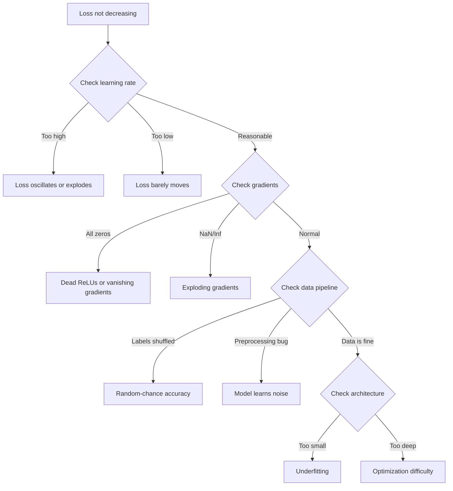
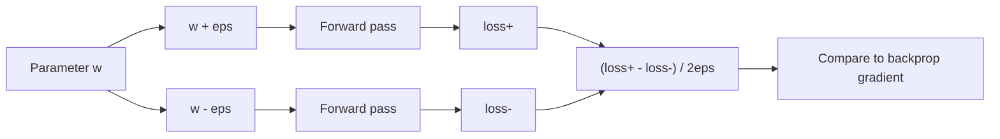
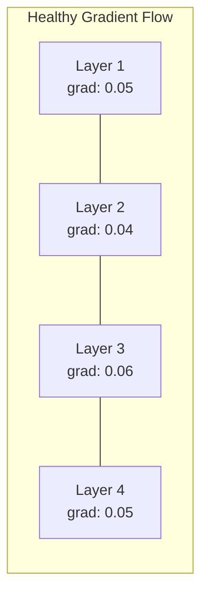
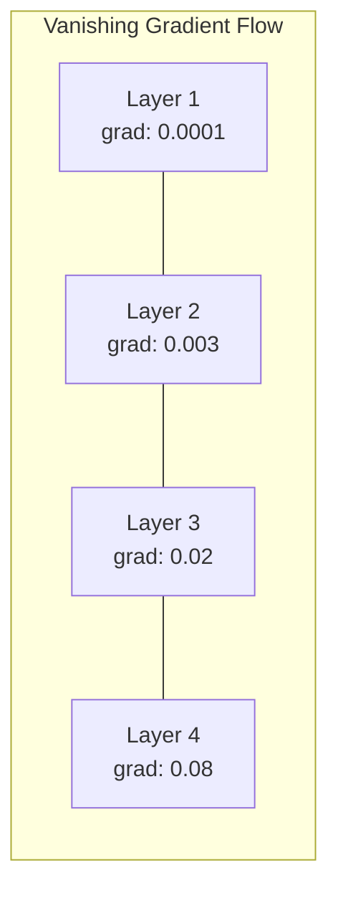
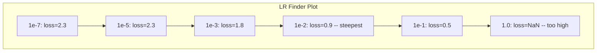

# 调试神经网络

> 您的网络已编译。它跑了。它产生了一个数字。号码错误，没有崩溃。欢迎来到最困难的调试——没有错误消息的调试。

**类型：** 构建
**语言：** Python、PyTorch
**先决条件：** 第 03 阶段第 01-10 课（尤其是反向传播、损失函数、优化器）
**时间：** ~90 分钟

## 学习目标

- 使用系统调试策略诊断常见的神经网络故障（NaN 损失、平坦损失曲线、过度拟合、振荡）
- 应用“一批过拟合”技术来验证您的模型架构和训练循环是否正确
- 检查梯度大小、激活分布和权重范数，以识别梯度消失/爆炸问题
- 构建涵盖数据管道、模型架构、损失函数、优化器和学习率问题的调试清单

## 问题

传统软件一旦损坏就会崩溃。空指针会引发异常。类型不匹配在编译时失败。相差一错误会产生明显错误的输出。

神经网络不会给你那么奢侈的东西。

损坏的神经网络运行至完成，打印损失值并输出预测。损失可能会减少。这些预测看起来可能是合理的。但这个模型其实是错误的——学习捷径、记住噪音，或者收敛到无用的局部最小值。谷歌研究人员估计，60-70% 的 ML 调试时间都花在“无声”错误上，这些错误不会产生错误，但会降低模型质量。

工作模型和损坏模型之间的区别通常是一条错位的线：缺少 `zero_grad()`、转置维度、学习率降低 10 倍。规范的“训练神经网络的秘诀”（2019）是这样开头的：“最常见的神经网络错误是不会崩溃的错误。”

本课教您找到这些错误。

## 概念

### 调试心态

忘记打印并祈祷调试。神经网络调试需要系统化的方法，因为反馈循环很慢（每次训练运行几分钟到几小时）并且症状不明确（严重的损失可能意味着 20 种不同的情况）。黄金法则：**从简单开始，一次一点地增加复杂性，并独立验证每一部分。**



###症状1：损失不减少

这是最常见的抱怨。训练循环运行，纪元流逝，损失保持平坦或剧烈振荡。

**学习率错误。**太高：损失振荡或跳至 NaN。太低：损失减少得非常缓慢，看起来很平稳。对于 Adam，从 1e-3 开始。对于 SGD，从 1e-1 或 1e-2 开始。在得出其他错误的结论之前，请始终尝试 3 个学习率，每个学习率跨越 10 倍（例如 1e-2、1e-3、1e-4）。

**死亡 ReLU。** 如果 ReLU 神经元接收到较大的负输入，它会输出 0 并且其梯度为 0。它永远不会再次激活。如果有足够多的神经元死亡，网络就无法学习。检查：打印每个 ReLU 层之后恰好为 0 的激活分数。如果超过 50% 死亡，则改用 LeakyReLU 或降低学习率。

**梯度消失。**在具有 sigmoid 或 tanh 激活的深层网络中，梯度在向后传播时呈指数收缩。当它们到达第一层时，它们的值约为 0。第一层停止学习。修复：使用ReLU/GELU，添加残差连接，或使用批量归一化。

**梯度爆炸。**相反的问题——梯度呈指数增长。常见于 RNN 和非常深的网络中。损失跳至 NaN。修复：梯度裁剪 (`torch.nn.utils.clip_grad_norm_`)、降低学习率或添加归一化。

###症状2：损失减少但模型很糟糕

损失下降了。训练准确率达到99%。但测试准确率为55%。或者模型对真实数据产生无意义的输出。

**过度拟合。** 该模型会记住训练数据而不是学习模式。训练和验证损失之间的差距随着时间的推移而扩大。修复：更多数据、丢失、权重衰减、提前停止、数据增强。

**数据泄露。** 测试数据泄露到训练中。准确率高得令人怀疑。常见原因：分割前进行洗牌、使用完整数据集的统计数据进行预处理、跨分割重复样本。修复：首先拆分，其次预处理，检查重复项。**标签错误。** 大多数真实数据集中 5-10% 的标签是错误的（Northcutt 等人，2021 - “测试集中普遍存在的标签错误”）。模型学习噪声。修复：使用置信学习来查找并修复错误标记的示例，或使用损失截断来忽略高损失样本。

### 症状 3：损失中 NaN 或 Inf

损失值变为 `nan` 或 `inf`。训练已经死了。

**学习率太高。** 梯度更新过冲，导致权重爆炸。修复：减少 10 倍。

**log(0) 或 log(负)。** 交叉熵损失计算 `log(p)`。如果您的模型输出恰好为 0 或负概率，则日志会爆炸。修复：将预测限制为 `[eps, 1-eps]`，其中 `eps=1e-7`。

**除以零。** 批量归一化除以标准差。具有常量值的批次的 std=0。修复：将 epsilon 添加到分母（PyTorch 默认情况下会执行此操作，但自定义实现可能不会）。

**数字溢出。** 大量激活输入 `exp()` 产生 Inf。 Softmax 尤其容易发生。修复：在求幂之前减去最大值（log-sum-exp 技巧）。

### 技术 1：梯度检查

将分析梯度（来自反向传播）与数值梯度（来自有限差分）进行比较。如果他们不同意，那么你的向后传递就有错误。

参数 `w` 的数值梯度：

```
grad_numerical = (loss(w + eps) - loss(w - eps)) / (2 * eps)
```

一致性指标（相对差异）：

```
rel_diff = |grad_analytical - grad_numerical| / max(|grad_analytical|, |grad_numerical|, 1e-8)
```

如果 `rel_diff < 1e-5`：正确。如果 `rel_diff > 1e-3`：几乎可以肯定是一个错误。



### 技术 2：激活统计

在训练期间监控每层之后激活的平均值和标准偏差。健康的网络保持激活的平均值接近 0，标准差接近 1（标准化后）或至少有界。

|健康指标|平均 |标准|诊断 |
|----------------|------|-----|------------|
|健康 | 〜0 | 〜1 |网络学习正常 |
|饱和| >>0 或 <<0 | 〜0 |激活值停留在极值 |
|死了| 0 | 0 |神经元已死亡（全为零）|
|爆炸| >>10 | >>10 |活跃度无限增长|

### 技术 3：梯度流可视化绘制每层的平均梯度幅值。在健康的网络中，各层的梯度大小应该大致相似。如果早期层的梯度比后面层小 1000 倍，则梯度消失。





### 技术 4：过拟合批量测试

深度学习中最重要的调试技术。

取一小批（8-32 个样品）。对其进行 100 多次迭代训练。损失应该接近于零，并且训练准确率应该达到 100%。如果没有，您的模型或训练循环有一个根本性的错误——不要进行完整的训练。

该测试捕获：
- 损失函数被破坏
- 向后传球被破坏
- 架构太小，无法表示数据
- 优化器未连接到模型参数
- 数据和标签未对齐

这需要 30 秒的时间来运行，并节省了调试完整训练运行的时间。

### 技巧 5：学习率查找器

Leslie Smith（2017）提出在一个时期内将学习率从非常小（1e-7）扫到非常大（10），同时记录损失。绘制损失与学习率的关系图。最佳学习速率大约比损失开始下降最快的速率小 10 倍。



本例中的最佳 LR：~1e-3（比最陡点高一个数量级）。

### 常见的 PyTorch 错误

这些是 PyTorch 社区中浪费最多时间的错误：

|错误 |症状|修复 |
|-----|---------|-----|
|忘记 `optimizer.zero_grad()` |梯度跨批次累积，损失振荡 |在 `optimizer.zero_grad()` 之前添加 `loss.backward()` |
|在测试时忘记 `model.eval()` | Dropout 和批量归一化的行为不同，测试精度在运行之间有所不同 |添加 `model.eval()` 和 `torch.no_grad()` |
|错误的张量形状 |无声广播产生错误结果，没有错误 |调试期间每次操作后打印形状 |
| CPU/GPU 不匹配 | `RuntimeError: expected CUDA tensor` | `.to(device)` |在模型和数据上使用 `.detach()` |
|不分离张量 |计算图永远增长，OOM |使用 `with torch.no_grad()` 或 `RuntimeError: modified by in-place operation` ||就地操作打破 autograd | `x += 1` | `x = x + 1`将 `Long` 替换为 `Float` |
|数据未标准化 |损失停留在随机机会水平|将输入标准化为mean=0，std=1 |
|标签为错误的数据类型 |交叉熵期望 `labels.long()`，得到 `.requires_grad` |演员标签：`torch.no_grad()` |

### 主调试表

|症状|可能的原因 |首先要尝试的事情 |
|--------|-------------|--------------------|
|损失停留在 -log(1/num_classes) |模型预测均匀分布 |检查数据管道，验证标签与输入匹配 |
|几步之后损失 NaN |学习率太高 |将 LR 降低 10 倍 |
|立即损失 NaN | log(0) 或除以零 |将 epsilon 添加到日志/除法操作 |
|亏损大幅波动| LR 太高或批量太小 |减少 LR，增加批量大小 |
|损失减少然后趋于稳定| LR 太高，无法进行微调阶段 |添加 LR 时间表（余弦或步进衰减）|
|训练 acc 高，测试 acc 低 |过度拟合 |添加 dropout、权重衰减、更多数据 |
|训练 acc = 测试 acc = 机会 |模型没有学到任何东西|运行过拟合一批测试 |
|训练 acc = 测试 acc 但均较低 |欠拟合|更大的模型、更多的层数、更多的功能 |
|梯度全为零 | Dead ReLU 或分离计算图 |切换到 LeakyReLU，检查 `outputs/prompt-nn-debugger.md` |
|训练期间内存不足 |批次太大或图表未释放 |减少批量大小，使用 `outputs/skill-debug-checklist.md` 进行评估 |

```figure
learning-curves
```

## 构建它

监控激活、梯度和损失曲线的诊断工具包。您将故意破坏网络并使用工具包来诊断每个问题。

### 第 1 步：NetworkDebugger 类

连接到 PyTorch 模型以记录每层的激活和梯度统计数据。

```python
import torch
import torch.nn as nn
import math


class NetworkDebugger:
    def __init__(self, model):
        self.model = model
        self.activation_stats = {}
        self.gradient_stats = {}
        self.loss_history = []
        self.lr_losses = []
        self.hooks = []
        self._register_hooks()

    def _register_hooks(self):
        for name, module in self.model.named_modules():
            if isinstance(module, (nn.Linear, nn.Conv2d, nn.ReLU, nn.LeakyReLU)):
                hook = module.register_forward_hook(self._make_activation_hook(name))
                self.hooks.append(hook)
                hook = module.register_full_backward_hook(self._make_gradient_hook(name))
                self.hooks.append(hook)

    def _make_activation_hook(self, name):
        def hook(module, input, output):
            with torch.no_grad():
                out = output.detach().float()
                self.activation_stats[name] = {
                    "mean": out.mean().item(),
                    "std": out.std().item(),
                    "fraction_zero": (out == 0).float().mean().item(),
                    "min": out.min().item(),
                    "max": out.max().item(),
                }
        return hook

    def _make_gradient_hook(self, name):
        def hook(module, grad_input, grad_output):
            if grad_output[0] is not None:
                with torch.no_grad():
                    grad = grad_output[0].detach().float()
                    self.gradient_stats[name] = {
                        "mean": grad.mean().item(),
                        "std": grad.std().item(),
                        "abs_mean": grad.abs().mean().item(),
                        "max": grad.abs().max().item(),
                    }
        return hook

    def record_loss(self, loss_value):
        self.loss_history.append(loss_value)

    def check_loss_health(self):
        if len(self.loss_history) < 2:
            return "NOT_ENOUGH_DATA"
        recent = self.loss_history[-10:]
        if any(math.isnan(v) or math.isinf(v) for v in recent):
            return "NAN_OR_INF"
        if len(self.loss_history) >= 20:
            first_half = sum(self.loss_history[:10]) / 10
            second_half = sum(self.loss_history[-10:]) / 10
            if second_half >= first_half * 0.99:
                return "NOT_DECREASING"
        if len(recent) >= 5:
            diffs = [recent[i+1] - recent[i] for i in range(len(recent)-1)]
            if max(diffs) - min(diffs) > 2 * abs(sum(diffs) / len(diffs)):
                return "OSCILLATING"
        return "HEALTHY"

    def check_activations(self):
        issues = []
        for name, stats in self.activation_stats.items():
            if stats["fraction_zero"] > 0.5:
                issues.append(f"DEAD_NEURONS: {name} has {stats['fraction_zero']:.0%} zero activations")
            if abs(stats["mean"]) > 10:
                issues.append(f"EXPLODING_ACTIVATIONS: {name} mean={stats['mean']:.2f}")
            if stats["std"] < 1e-6:
                issues.append(f"COLLAPSED_ACTIVATIONS: {name} std={stats['std']:.2e}")
        return issues if issues else ["HEALTHY"]

    def check_gradients(self):
        issues = []
        grad_magnitudes = []
        for name, stats in self.gradient_stats.items():
            grad_magnitudes.append((name, stats["abs_mean"]))
            if stats["abs_mean"] < 1e-7:
                issues.append(f"VANISHING_GRADIENT: {name} abs_mean={stats['abs_mean']:.2e}")
            if stats["abs_mean"] > 100:
                issues.append(f"EXPLODING_GRADIENT: {name} abs_mean={stats['abs_mean']:.2e}")
        if len(grad_magnitudes) >= 2:
            first_mag = grad_magnitudes[0][1]
            last_mag = grad_magnitudes[-1][1]
            if last_mag > 0 and first_mag / last_mag > 100:
                issues.append(f"GRADIENT_RATIO: first/last = {first_mag/last_mag:.0f}x (vanishing)")
        return issues if issues else ["HEALTHY"]

    def print_report(self):
        print("\n=== NETWORK DEBUGGER REPORT ===")
        print(f"\nLoss health: {self.check_loss_health()}")
        if self.loss_history:
            print(f"  Last 5 losses: {[f'{v:.4f}' for v in self.loss_history[-5:]]}")
        print("\nActivation diagnostics:")
        for item in self.check_activations():
            print(f"  {item}")
        print("\nGradient diagnostics:")
        for item in self.check_gradients():
            print(f"  {item}")
        print("\nPer-layer activation stats:")
        for name, stats in self.activation_stats.items():
            print(f"  {name}: mean={stats['mean']:.4f} std={stats['std']:.4f} zero={stats['fraction_zero']:.1%}")
        print("\nPer-layer gradient stats:")
        for name, stats in self.gradient_stats.items():
            print(f"  {name}: abs_mean={stats['abs_mean']:.2e} max={stats['max']:.2e}")

    def remove_hooks(self):
        for hook in self.hooks:
            hook.remove()
        self.hooks.clear()
```

### 步骤 2：过拟合批量测试

```python
def overfit_one_batch(model, x_batch, y_batch, criterion, lr=0.01, steps=200):
    optimizer = torch.optim.Adam(model.parameters(), lr=lr)
    model.train()
    print("\n=== OVERFIT ONE BATCH TEST ===")
    print(f"Batch size: {x_batch.shape[0]}, Steps: {steps}")

    for step in range(steps):
        optimizer.zero_grad()
        output = model(x_batch)
        loss = criterion(output, y_batch)
        loss.backward()
        optimizer.step()

        if step % 50 == 0 or step == steps - 1:
            with torch.no_grad():
                preds = (output > 0).float() if output.shape[-1] == 1 else output.argmax(dim=1)
                targets = y_batch if y_batch.dim() == 1 else y_batch.squeeze()
                acc = (preds.squeeze() == targets).float().mean().item()
            print(f"  Step {step:3d} | Loss: {loss.item():.6f} | Accuracy: {acc:.1%}")

    final_loss = loss.item()
    if final_loss > 0.1:
        print(f"\n  FAIL: Loss did not converge ({final_loss:.4f}). Model or training loop is broken.")
        return False
    print(f"\n  PASS: Loss converged to {final_loss:.6f}")
    return True
```

### 第 3 步：学习率查找器

```python
def find_learning_rate(model, x_data, y_data, criterion, start_lr=1e-7, end_lr=10, steps=100):
    import copy
    original_state = copy.deepcopy(model.state_dict())
    optimizer = torch.optim.SGD(model.parameters(), lr=start_lr)
    lr_mult = (end_lr / start_lr) ** (1 / steps)

    model.train()
    results = []
    best_loss = float("inf")
    current_lr = start_lr

    print("\n=== LEARNING RATE FINDER ===")

    for step in range(steps):
        optimizer.zero_grad()
        output = model(x_data)
        loss = criterion(output, y_data)

        if math.isnan(loss.item()) or loss.item() > best_loss * 10:
            break

        best_loss = min(best_loss, loss.item())
        results.append((current_lr, loss.item()))

        loss.backward()
        optimizer.step()

        current_lr *= lr_mult
        for param_group in optimizer.param_groups:
            param_group["lr"] = current_lr

    model.load_state_dict(original_state)

    if len(results) < 10:
        print("  Could not complete LR sweep -- loss diverged too quickly")
        return results

    min_loss_idx = min(range(len(results)), key=lambda i: results[i][1])
    suggested_lr = results[max(0, min_loss_idx - 10)][0]

    print(f"  Swept {len(results)} steps from {start_lr:.0e} to {results[-1][0]:.0e}")
    print(f"  Minimum loss {results[min_loss_idx][1]:.4f} at lr={results[min_loss_idx][0]:.2e}")
    print(f"  Suggested learning rate: {suggested_lr:.2e}")

    return results
```

### 步骤 4：梯度检查器

```python
def _flat_to_multi_index(flat_idx, shape):
    multi_idx = []
    remaining = flat_idx
    for dim in reversed(shape):
        multi_idx.insert(0, remaining % dim)
        remaining //= dim
    return tuple(multi_idx)


def gradient_check(model, x, y, criterion, eps=1e-4):
    model.train()
    x_double = x.double()
    y_double = y.double()
    model_double = model.double()

    print("\n=== GRADIENT CHECK ===")
    overall_max_diff = 0
    checked = 0

    for name, param in model_double.named_parameters():
        if not param.requires_grad:
            continue

        layer_max_diff = 0

        model_double.zero_grad()
        output = model_double(x_double)
        loss = criterion(output, y_double)
        loss.backward()
        analytical_grad = param.grad.clone()

        num_checks = min(5, param.numel())
        for i in range(num_checks):
            idx = _flat_to_multi_index(i, param.shape)
            original = param.data[idx].item()

            param.data[idx] = original + eps
            with torch.no_grad():
                loss_plus = criterion(model_double(x_double), y_double).item()

            param.data[idx] = original - eps
            with torch.no_grad():
                loss_minus = criterion(model_double(x_double), y_double).item()

            param.data[idx] = original

            numerical = (loss_plus - loss_minus) / (2 * eps)
            analytical = analytical_grad[idx].item()

            denom = max(abs(numerical), abs(analytical), 1e-8)
            rel_diff = abs(numerical - analytical) / denom

            layer_max_diff = max(layer_max_diff, rel_diff)
            checked += 1

        overall_max_diff = max(overall_max_diff, layer_max_diff)
        status = "OK" if layer_max_diff < 1e-5 else "MISMATCH"
        print(f"  {name}: max_rel_diff={layer_max_diff:.2e} [{status}]")

    model.float()

    print(f"\n  Checked {checked} parameters")
    if overall_max_diff < 1e-5:
        print("  PASS: Gradients match (rel_diff < 1e-5)")
    elif overall_max_diff < 1e-3:
        print("  WARN: Small differences (1e-5 < rel_diff < 1e-3)")
    else:
        print("  FAIL: Gradient mismatch detected (rel_diff > 1e-3)")
    return overall_max_diff
```

### 步骤 5：故意破坏网络

现在将该工具包应用于损坏的网络并诊断每个网络。

```python
def demo_broken_networks():
    torch.manual_seed(42)
    x = torch.randn(64, 10)
    y = (x[:, 0] > 0).long()

    print("\n" + "=" * 60)
    print("BUG 1: Learning rate too high (lr=10)")
    print("=" * 60)
    model1 = nn.Sequential(nn.Linear(10, 32), nn.ReLU(), nn.Linear(32, 2))
    debugger1 = NetworkDebugger(model1)
    optimizer1 = torch.optim.SGD(model1.parameters(), lr=10.0)
    criterion = nn.CrossEntropyLoss()
    for step in range(20):
        optimizer1.zero_grad()
        out = model1(x)
        loss = criterion(out, y)
        debugger1.record_loss(loss.item())
        loss.backward()
        optimizer1.step()
    debugger1.print_report()
    debugger1.remove_hooks()

    print("\n" + "=" * 60)
    print("BUG 2: Dead ReLUs from bad initialization")
    print("=" * 60)
    model2 = nn.Sequential(nn.Linear(10, 32), nn.ReLU(), nn.Linear(32, 32), nn.ReLU(), nn.Linear(32, 2))
    with torch.no_grad():
        for m in model2.modules():
            if isinstance(m, nn.Linear):
                m.weight.fill_(-1.0)
                m.bias.fill_(-5.0)
    debugger2 = NetworkDebugger(model2)
    optimizer2 = torch.optim.Adam(model2.parameters(), lr=1e-3)
    for step in range(50):
        optimizer2.zero_grad()
        out = model2(x)
        loss = criterion(out, y)
        debugger2.record_loss(loss.item())
        loss.backward()
        optimizer2.step()
    debugger2.print_report()
    debugger2.remove_hooks()

    print("\n" + "=" * 60)
    print("BUG 3: Missing zero_grad (gradients accumulate)")
    print("=" * 60)
    model3 = nn.Sequential(nn.Linear(10, 32), nn.ReLU(), nn.Linear(32, 2))
    debugger3 = NetworkDebugger(model3)
    optimizer3 = torch.optim.SGD(model3.parameters(), lr=0.01)
    for step in range(50):
        out = model3(x)
        loss = criterion(out, y)
        debugger3.record_loss(loss.item())
        loss.backward()
        optimizer3.step()
    debugger3.print_report()
    debugger3.remove_hooks()

    print("\n" + "=" * 60)
    print("HEALTHY NETWORK: Correct setup for comparison")
    print("=" * 60)
    model_good = nn.Sequential(nn.Linear(10, 32), nn.ReLU(), nn.Linear(32, 2))
    debugger_good = NetworkDebugger(model_good)
    optimizer_good = torch.optim.Adam(model_good.parameters(), lr=1e-3)
    for step in range(50):
        optimizer_good.zero_grad()
        out = model_good(x)
        loss = criterion(out, y)
        debugger_good.record_loss(loss.item())
        loss.backward()
        optimizer_good.step()
    debugger_good.print_report()
    debugger_good.remove_hooks()

    print("\n" + "=" * 60)
    print("OVERFIT-ONE-BATCH TEST (healthy model)")
    print("=" * 60)
    model_test = nn.Sequential(nn.Linear(10, 32), nn.ReLU(), nn.Linear(32, 2))
    overfit_one_batch(model_test, x[:8], y[:8], criterion)

    print("\n" + "=" * 60)
    print("LEARNING RATE FINDER")
    print("=" * 60)
    model_lr = nn.Sequential(nn.Linear(10, 32), nn.ReLU(), nn.Linear(32, 2))
    find_learning_rate(model_lr, x, y, criterion)

    print("\n" + "=" * 60)
    print("GRADIENT CHECK")
    print("=" * 60)
    model_grad = nn.Sequential(nn.Linear(10, 8), nn.ReLU(), nn.Linear(8, 2))
    gradient_check(model_grad, x[:4], y[:4], criterion)
```

## 使用它### PyTorch 内置工具

```python
import torch
import torch.nn as nn

model = nn.Sequential(
    nn.Linear(768, 256),
    nn.ReLU(),
    nn.Linear(256, 10),
)

with torch.autograd.detect_anomaly():
    output = model(input_tensor)
    loss = criterion(output, target)
    loss.backward()

for name, param in model.named_parameters():
    if param.grad is not None:
        print(f"{name}: grad_mean={param.grad.abs().mean():.2e}")
```

### 权重和偏差整合

```python
import wandb

wandb.init(project="debug-training")

for epoch in range(100):
    loss = train_one_epoch()
    wandb.log({
        "loss": loss,
        "lr": optimizer.param_groups[0]["lr"],
        "grad_norm": torch.nn.utils.clip_grad_norm_(model.parameters(), float("inf")),
    })

    for name, param in model.named_parameters():
        if param.grad is not None:
            wandb.log({f"grad/{name}": wandb.Histogram(param.grad.cpu().numpy())})
```

### 张量板

```python
from torch.utils.tensorboard import SummaryWriter

writer = SummaryWriter("runs/debug_experiment")

for epoch in range(100):
    loss = train_one_epoch()
    writer.add_scalar("Loss/train", loss, epoch)

    for name, param in model.named_parameters():
        writer.add_histogram(f"weights/{name}", param, epoch)
        if param.grad is not None:
            writer.add_histogram(f"gradients/{name}", param.grad, epoch)
```

### 调试清单（全面训练之前）

1. 进行一批过拟合测试。如果失败，就停止。
2. 打印模型摘要——验证参数计数是否合理。
3. 使用随机数据运行一次前向传递——检查输出形状。
4. 训练 5 个 epoch——验证损失减少。
5. 检查激活统计数据——没有死层，没有爆炸。
6. 检查梯度流——不消失、不爆炸。
7. 验证数据管道——打印 5 个带有标签的随机样本。

## 发货

本课产生：
- `NetworkDebugger` -- 诊断神经网络训练失败的提示
- `find_learning_rate` -- 用于调试训练问题的决策树清单

调试的关键部署模式：
- 将监控挂钩添加到生产训练脚本中
- 每 N 步将激活和梯度统计数据记录到 W&B 或 TensorBoard
- 对 NaN 丢失、死亡神经元（>80% 零）或梯度爆炸实施自动警报
- 在更改架构或数据管道时始终运行过拟合一批测试

## 练习

1. **添加爆炸梯度检测器。** 修改 `torch.autograd.detect_anomaly` 以检测梯度何时超过阈值并自动建议梯度裁剪值。在没有标准化的 20 层网络上进行测试。

2. **构建一个死亡神经元复活器。** 编写一个函数来识别死亡 ReLU 神经元（始终输出 0）并通过 Kaiming 初始化重新初始化它们的传入权重。表明这可以恢复超过 70% 的神经元死亡的网络。

3. **通过绘图实现学习率查找器。** 扩展 `torch.autograd.set_detect_anomaly` 将结果保存为 CSV，并编写一个单独的脚本来读取 CSV 并使用 matplotlib 显示 LR 与损失曲线。确定 CIFAR-10 上 ResNet-18 的最佳 LR。

4. **创建数据管道验证器。** 编写一个函数来检查：训练/测试拆分中的重复样本、标签分布不平衡（>10:1 比率）、输入归一化（均值接近 0、std 接近 1）以及数据中的 NaN/Inf 值。在故意损坏的数据集上运行它。5. **调试真正的失败。** 采用第 10 课中的迷你框架，引入一个微妙的错误（例如，向后转置权重矩阵），并使用梯度检查来准确定位哪个参数具有不正确的梯度。记录调试过程。

## 关键术语

|术语 |人们怎么说|它实际上意味着什么 |
|------|----------------|----------------------|
|沉默的虫子 | “它可以运行，但结果很糟糕” |一个不会产生错误但会降低模型质量的错误——机器学习中的主要故障模式 |
|死亡 ReLU | “神经元死亡”|一个 ReLU 神经元，其输入始终为负，因此它输出 0 并永久接收 0 梯度 |
|梯度消失| “早期层停止学习”|梯度在层中呈指数级收缩，使得早期层中的权重有效地冻结 |
|梯度爆炸| “损失为 NaN” |梯度通过层呈指数级增长，导致权重更新过大以至于溢出 |
|梯度检查 | “验证反向传播是否正确” |比较反向传播的解析梯度和有限差分的数值梯度 |
|过拟合一批 | “最重要的调试测试”|对单个小批量进行训练以验证模型可以学习 - 如果不能，则某些东西从根本上被破坏了 |
| LR 取景器 | “扫一扫找到合适的学习率” |在一个时期内以指数方式增加学习率，并在损失发散之前选择学习率 |
|数据泄露| “测试数据泄露到训练中”|当测试集中的信息污染训练时，人为地产生高精度 |
|激活统计| “监控图层健康状况” |跟踪每层输出的平均值、标准差和零分数，以检测死亡、饱和或爆炸的神经元 |
|渐变裁剪| “限制梯度大小” |当梯度范数超过阈值时缩小梯度，防止梯度更新爆炸 |

## 进一步阅读

- Smith，“Cyclical Learning Rates for Training Neural Networks”（2017）——介绍学习率范围测试（LR finder）的论文- Northcutt 等人，“测试集中普遍存在的标签错误破坏机器学习基准的稳定性”（2021 年）——证明 ImageNet、CIFAR-10 和其他主要基准中有 3-6% 的标签是错误的
- 张等人，“理解深度学习需要重新思考泛化”（2017 年）——该论文表明神经网络可以记忆随机标签，这就是过拟合批量测试有效的原因
- 有关内置 NaN/Inf 检测的 torch.autograd.detect_anomaly 和 torch.autograd.set_detect_anomaly 的 PyTorch 文档
