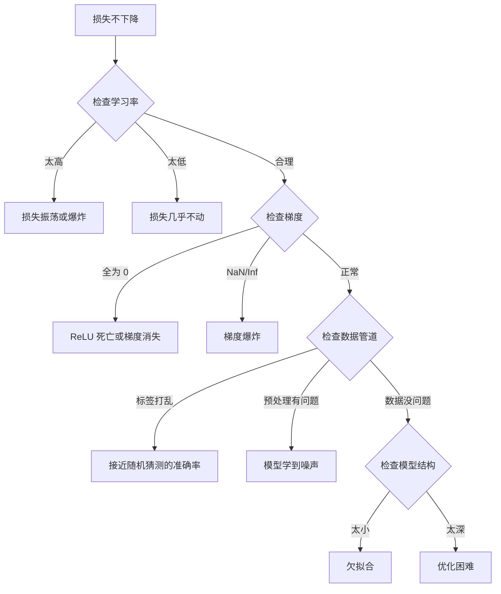
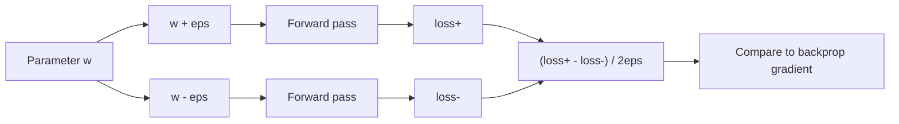
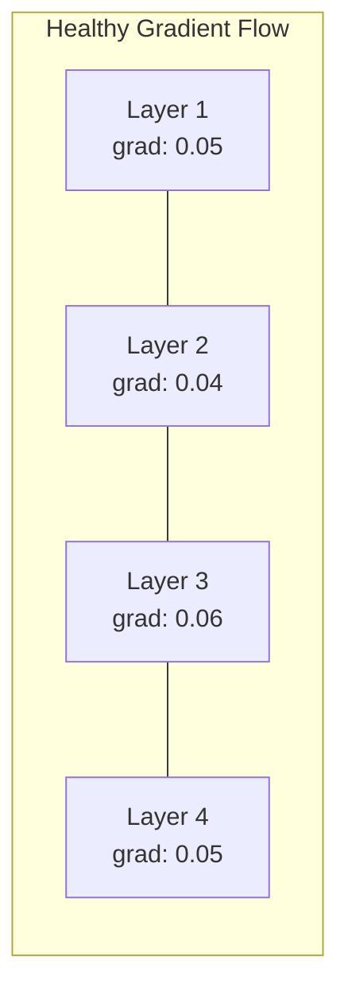
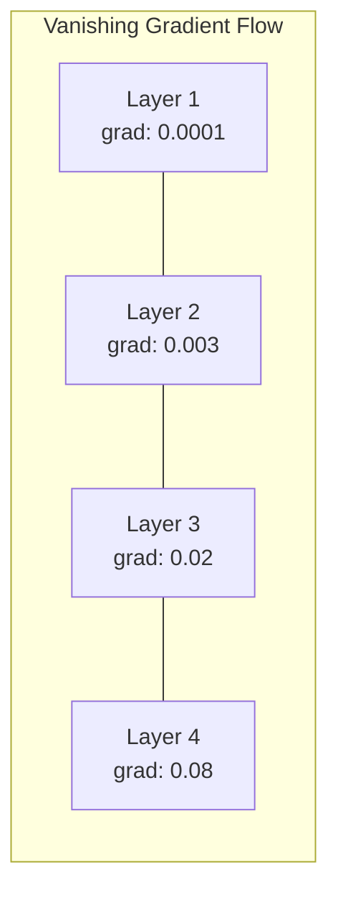
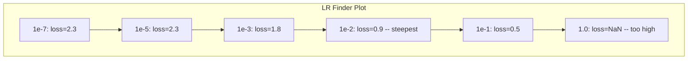

# 调试神经网络

> 你的网络已经编译通过，能跑，也会吐出一个数字。问题是这个数字是错的，但程序没有崩溃。欢迎来到最难的一类调试：没有错误信息的调试。

**类型:** 构建
**语言:** Python、PyTorch
**先修课程:** 第 03 阶段第 01-10 课（尤其是反向传播、损失函数、优化器）
**时长:** ~90 分钟

## 学习目标

- 用系统化的调试方法排查常见神经网络故障，包括 NaN 损失、损失曲线平坦、过拟合和振荡
- 使用“一批过拟合”技术验证模型结构和训练循环是否正确
- 观察梯度大小、激活分布和权重范数，定位梯度消失和梯度爆炸问题
- 建立覆盖数据管道、模型结构、损失函数、优化器和学习率问题的调试清单

## 问题

传统软件坏了通常会直接崩。空指针会抛异常，类型不匹配会在编译期失败，越界错误也会给出明显的错误结果。

神经网络没有这种奢侈。

一个坏掉的神经网络依然能跑完训练，打印损失值，输出预测结果。损失可能还会下降，预测看起来甚至挺像那么回事。但模型其实已经悄悄学歪了：走了捷径、记住了噪声，或者收敛到了毫无用处的局部最小值。Google 研究人员估计，机器学习调试时间里有 60-70% 都花在这类“无声”错误上，它们不会报错，但会悄悄拖垮模型质量。

一个能用的模型和一个坏掉的模型之间，常常只差一行代码：少了 `zero_grad()`、维度转置错了、学习率差了 10 倍。经典的《Training Neural Networks》经验总结（2019）开篇就点明了这一点：最常见的神经网络错误，都是不会让程序崩溃的错误。

本课就是教你找出这些错误。

## 核心概念

### 调试心态

别靠“多打印点日志然后祈祷”来调试。神经网络调试必须系统化，因为反馈很慢，一次训练往往要几分钟到几小时，而且症状很模糊，损失高可能对应二十种不同原因。

黄金法则是：**从最简单的部分开始，一次只增加一点复杂度，并且逐个独立验证。**



### 症状 1：损失不下降

这是最常见的问题。训练循环在跑，epoch 一轮轮过去，损失却始终不动，或者剧烈振荡。

**学习率不对。** 太高会让损失震荡，甚至直接跳到 NaN；太低则会让损失下降得像没变化。Adam 通常从 `1e-3` 开始，SGD 通常从 `1e-1` 或 `1e-2` 开始。下结论前，最好先试 3 个相差 10 倍的学习率，比如 `1e-2`、`1e-3`、`1e-4`。

**死亡 ReLU。** 如果 ReLU 神经元收到很大的负输入，它只会输出 0，梯度也会变成 0，之后再也激活不起来。死掉的神经元太多，网络就学不动了。检查方法：打印每个 ReLU 层后恰好为 0 的激活比例。如果超过 50%，就换成 LeakyReLU，或者把学习率调低。

**梯度消失。** 在带 sigmoid 或 tanh 的深层网络里，梯度在反向传播时会指数级变小。等它传到第一层，几乎已经是 0 了，第一层也就学不动了。修复方式：改用 ReLU/GELU，加残差连接，或者用 batch normalization。

**梯度爆炸。** 这是相反的问题，梯度会指数级增长。它常见于 RNN 和非常深的网络中。结果往往是损失直接变成 NaN。修复方式：梯度裁剪（`torch.nn.utils.clip_grad_norm_`）、降低学习率，或者增加归一化。

### 症状 2：损失下降了，但模型很差

损失在下降，训练准确率甚至达到 99%，但测试准确率只有 55%。或者模型对真实数据输出一堆毫无意义的结果。

**过拟合。** 模型记住了训练数据，却没有学到规律。训练损失和验证损失的差距会随着时间越来越大。修复方式：更多数据、dropout、权重衰减、提前停止、数据增强。

**数据泄漏。** 测试数据混进了训练过程，导致准确率可疑地高。常见原因包括：在拆分前就洗牌、预处理时用了全量数据的统计量、不同划分之间有重复样本。修复方式：先拆分，再预处理，同时检查重复项。

**标签错误。** 大多数真实数据集里都有 5-10% 的标签是错的（Northcutt 等人，2021，“测试集中普遍存在的标签错误”）。模型学到的其实是噪声。修复方式：用 confident learning 找出并修正错标样本，或者用损失截断忽略高损失样本。

### 症状 3：损失里出现 NaN 或 Inf

损失值变成 `nan` 或 `inf`，训练基本已经死了。

**学习率太高。** 梯度更新过冲，导致权重爆炸。修复：缩小 10 倍。

**log(0) 或 log(负数)。** 交叉熵里会计算 `log(p)`。如果模型输出恰好是 0，或者出现负概率，数值就会炸。修复：把预测限制在 `[eps, 1-eps]`，其中 `eps=1e-7`。

**除以零。** BatchNorm 要除以标准差。如果一个 batch 的值全是常数，`std=0`。修复：在分母里加 epsilon。PyTorch 默认会这样做，但自定义实现不一定会。

**数值溢出。** 很大的激活值输入 `exp()` 会直接变成 Inf。Softmax 特别容易中招。修复：先减去最大值再求指数，也就是 log-sum-exp 技巧。

### 技术 1：梯度检查

把解析梯度（反向传播算出来的）和数值梯度（有限差分算出来的）对比一下。如果不一致，说明反向传播有 bug。

参数 `w` 的数值梯度：

```text
grad_numerical = (loss(w + eps) - loss(w - eps)) / (2 * eps)
```

相对差异：

```text
rel_diff = |grad_analytical - grad_numerical| / max(|grad_analytical|, |grad_numerical|, 1e-8)
```

如果 `rel_diff < 1e-5`，基本正确。如果 `rel_diff > 1e-3`，大概率有错误。



### 技术 2：激活统计

训练时监控每层激活的均值和标准差。健康的网络通常会让激活值的均值接近 0，标准差接近 1（归一化后），或者至少保持在可控范围。

| 健康状态 | 均值 | 标准差 | 判断 |
|---|---|---|---|
| 健康 | ~0 | ~1 | 网络在正常学习 |
| 饱和 | >>0 或 <<0 | ~0 | 激活卡在极端值 |
| 死亡 | 0 | 0 | 神经元全是 0 |
| 爆炸 | >>10 | >>10 | 激活值失控增长 |

### 技术 3：梯度流可视化

画出每层的平均梯度幅值。健康网络里，各层梯度幅值通常大致相近。如果早期层的梯度比后面层小 1000 倍，就是梯度消失。





### 技术 4：一批过拟合测试

这是深度学习里最重要的调试技术之一。

拿一小批样本，通常 8 到 32 个。对这批样本训练 100 次以上。损失应该接近 0，训练准确率应该接近 100%。如果做不到，说明模型或训练循环里有根本性错误，先别继续完整训练。

这个测试能抓出：
- 损失函数坏了
- 反向传播坏了
- 模型结构太小，表示不了数据
- 优化器没有连到模型参数
- 数据和标签没对齐

这个测试通常只要 30 秒，却能省下几个小时的完整训练排查时间。

### 技术 5：学习率查找器

Leslie Smith（2017）提出，在一个 epoch 里把学习率从很小的值（`1e-7`）逐步扫到很大的值（`10`），同时记录损失。然后画出损失与学习率的关系图。最佳学习率通常比损失开始快速下降的位置小一个数量级。



这个例子里，最合适的学习率大约是 `1e-3`，也就是最陡点之前一个数量级。

### 常见 PyTorch Bug

下面这些 bug 在 PyTorch 社区里最浪费时间：

| Bug | 症状 | 修复 |
|---|---|---|
| 忘记 `optimizer.zero_grad()` | 梯度在不同 batch 之间累积，损失开始振荡 | 在 `loss.backward()` 前加 `optimizer.zero_grad()` |
| 测试时忘记 `model.eval()` | Dropout 和 batch norm 行为不同，测试准确率每次都不一样 | 加上 `model.eval()` 和 `torch.no_grad()` |
| 张量形状错了 | 无声广播导致结果错误，但不报错 | 调试时每一步都打印 shape |
| CPU/GPU 不一致 | `RuntimeError: expected CUDA tensor` | 模型和数据都用 `.to(device)` |
| 张量没有 detach | 计算图无限增长，最后 OOM | 用 `.detach()` 或 `with torch.no_grad()` |
| 原地操作破坏 autograd | `RuntimeError: modified by in-place operation` | 把 `x += 1` 改成 `x = x + 1` |
| 数据没有归一化 | 损失卡在随机猜测水平 | 把输入归一化到均值 0、标准差 1 |
| 标签 dtype 错了 | 交叉熵需要 `Long`，却传了 `Float` | 用 `labels.long()` |

### 总表

| 症状 | 可能原因 | 首先尝试 |
|---|---|---|
| 损失卡在 `-log(1/num_classes)` | 模型在输出均匀分布 | 检查数据管道，确认标签和输入匹配 |
| 几步后损失变 NaN | 学习率太高 | 把 LR 降 10 倍 |
| 一开始就 NaN | `log(0)` 或除以零 | 给 log/除法加 epsilon |
| 损失剧烈振荡 | LR 太高或 batch 太小 | 降低 LR，增大 batch |
| 损失下降后停住 | 微调阶段 LR 仍然太高 | 加学习率调度（余弦或阶梯衰减） |
| 训练集准确率高，测试集低 | 过拟合 | 加 dropout、权重衰减，或者更多数据 |
| 训练集和测试集都接近随机 | 模型什么都没学到 | 跑一批过拟合测试 |
| 训练集和测试集都低但相近 | 欠拟合 | 增大模型、加层、加特征 |
| 梯度全为 0 | 死 ReLU 或计算图断开 | 换成 LeakyReLU，检查 `.requires_grad` |
| 训练时 OOM | batch 太大或图没释放 | 减小 batch，评估时用 `torch.no_grad()` |

```figure
learning-curves
```

## 动手做

这里有一个诊断工具包，用来监控激活、梯度和损失曲线。你会故意把网络弄坏，再用这个工具包逐个排查问题。

### 步骤 1：NetworkDebugger 类

把 hook 挂到 PyTorch 模型上，记录每层的激活和梯度统计信息。

```python
import torch
import torch.nn as nn
import math


class NetworkDebugger:
    def __init__(self, model):
        self.model = model
        self.activation_stats = {}
        self.gradient_stats = {}
        self.loss_history = []
        self.lr_losses = []
        self.hooks = []
        self._register_hooks()

    def _register_hooks(self):
        for name, module in self.model.named_modules():
            if isinstance(module, (nn.Linear, nn.Conv2d, nn.ReLU, nn.LeakyReLU)):
                hook = module.register_forward_hook(self._make_activation_hook(name))
                self.hooks.append(hook)
                hook = module.register_full_backward_hook(self._make_gradient_hook(name))
                self.hooks.append(hook)

    def _make_activation_hook(self, name):
        def hook(module, input, output):
            with torch.no_grad():
                out = output.detach().float()
                self.activation_stats[name] = {
                    "mean": out.mean().item(),
                    "std": out.std().item(),
                    "fraction_zero": (out == 0).float().mean().item(),
                    "min": out.min().item(),
                    "max": out.max().item(),
                }
        return hook

    def _make_gradient_hook(self, name):
        def hook(module, grad_input, grad_output):
            with torch.no_grad():
                if grad_output and grad_output[0] is not None:
                    grad = grad_output[0].detach().float()
                    self.gradient_stats[name] = {
                        "mean_abs": grad.abs().mean().item(),
                        "max_abs": grad.abs().max().item(),
                        "std": grad.std().item(),
                    }
        return hook

    def report(self):
        print("\n=== Activation Statistics ===")
        for name, stats in self.activation_stats.items():
            print(f"{name}: mean={stats['mean']:.4f}, std={stats['std']:.4f}, zero={stats['fraction_zero']:.2%}")

        print("\n=== Gradient Statistics ===")
        for name, stats in self.gradient_stats.items():
            print(f"{name}: mean|g|={stats['mean_abs']:.6f}, max|g|={stats['max_abs']:.6f}")

    def clear(self):
        self.activation_stats.clear()
        self.gradient_stats.clear()
        self.loss_history.clear()
        self.lr_losses.clear()

    def remove_hooks(self):
        for hook in self.hooks:
            hook.remove()
        self.hooks.clear()
``` 

### 步骤 2：一批过拟合测试

```python
def overfit_one_batch(model, optimizer, criterion, x_batch, y_batch, steps=100):
    print("\n=== Overfit One Batch Test ===")
    print(f"Batch size: {x_batch.shape[0]}, steps: {steps}")
    model.train()
    losses = []
    for step in range(steps):
        optimizer.zero_grad()
        outputs = model(x_batch)
        loss = criterion(outputs, y_batch)
        loss.backward()
        optimizer.step()
        losses.append(loss.item())
        if step % 10 == 0 or step == steps - 1:
            pred = outputs.argmax(dim=1)
            acc = (pred == y_batch).float().mean().item()
            print(f"  Step {step:3d} | loss={loss.item():.6f} | acc={acc:.1%}")
    final_loss = losses[-1]
    if final_loss > 0.01:
        print(f"\n  FAILED: loss did not get low enough ({final_loss:.4f}); the model or training loop likely has a bug.")
    else:
        print(f"\n  PASSED: final loss {final_loss:.6f}")
    return losses
```

### 步骤 3：学习率查找器

```python
def find_learning_rate(model, optimizer, criterion, dataloader, start_lr=1e-7, end_lr=10, num_iter=100):
    print("\n=== Learning Rate Finder ===")
    model.train()
    results = []
    lr_multiplier = (end_lr / start_lr) ** (1 / num_iter)
    lr = start_lr
    for param_group in optimizer.param_groups:
        param_group["lr"] = lr
    iterator = iter(dataloader)
    for i in range(num_iter):
        try:
            x_batch, y_batch = next(iterator)
        except StopIteration:
            iterator = iter(dataloader)
            x_batch, y_batch = next(iterator)

        optimizer.zero_grad()
        outputs = model(x_batch)
        loss = criterion(outputs, y_batch)
        loss.backward()
        optimizer.step()

        results.append((lr, loss.item()))
        if i % 10 == 0:
            print(f"  lr={lr:.2e} | loss={loss.item():.6f}")
        lr *= lr_multiplier
        for param_group in optimizer.param_groups:
            param_group["lr"] = lr

    min_loss_idx = min(range(len(results)), key=lambda i: results[i][1])
    suggested_lr = results[min_loss_idx][0] / 10

    print(f"\n  Scanned {len(results)} learning rates from {start_lr:.0e} to {results[-1][0]:.0e}")
    print(f"  Min loss {results[min_loss_idx][1]:.4f} at lr={results[min_loss_idx][0]:.2e}")
    print(f"  Suggested learning rate: {suggested_lr:.2e}")
    return results, suggested_lr
```

### 步骤 4：故意破坏网络

```python
def create_broken_model():
    return nn.Sequential(
        nn.Linear(2, 16),
        nn.ReLU(),
        nn.Linear(16, 16),
        nn.ReLU(),
        nn.Linear(16, 2),
    )


def break_model_weight(model, layer_idx, scale=10.0):
    layers = [m for m in model.modules() if isinstance(m, nn.Linear)]
    if layer_idx < len(layers):
        with torch.no_grad():
            layers[layer_idx].weight.mul_(scale)
        print(f"Broke layer {layer_idx} by scaling weights by {scale}")
```

### 步骤 5：对坏模型做诊断

```python

def diagnose_model(model, x_batch, y_batch):
    print("\n=== Diagnosing Broken Model ===")
    criterion = nn.CrossEntropyLoss()
    debugger = NetworkDebugger(model)

    overfit_one_batch(model, torch.optim.Adam(model.parameters(), lr=1e-3), criterion, x_batch, y_batch, steps=20)
    debugger.report()
    debugger.remove_hooks()
```

## 实战应用

### 使用内置工具

PyTorch 已经自带一些工具：

```python
import torch.autograd

# 检测 NaN / Inf 和异常梯度
with torch.autograd.detect_anomaly():
    loss.backward()
```

### 权重与偏置统计

```python
for name, param in model.named_parameters():
    print(f"{name}: mean={param.data.mean():.4f}, std={param.data.std():.4f}, norm={param.data.norm():.4f}")
```

### 张量检查

在编辑器里给行号栏打断点，用 Variables 面板查看张量属性。调试控制台可以在运行时执行任意 Python 表达式。这对于数据预处理流水线这种“每一步都要看清楚”的场景特别有用。

## 实战流程

这是最常见的 AI bug 调试流程：

1. **训练前**：先用一个小 batch 跑一次 `breakpoint()`，确认输入输出维度符合预期
2. **前 10 步**：在 loss、outputs、gradients 上使用 `outputs/prompt-debug-ai-code.md`，确认没有 NaN，且数值范围合理
3. **训练中**：记录 loss、学习率、梯度范数，并用 TensorBoard 可视化
4. **出现异常**：在失败点加上 `debug_tools.py`，交互式检查张量
5. **性能问题**：对比数据加载、前向和反向耗时。如果接近 OOM，再进一步做内存分析

## 上线交付

运行这课的调试工具脚本：

```bash
python phases/00-setup-and-tooling/12-debugging-and-profiling/code/debug_tools.py
```

你也可以参考 `cProfile` 相关的提示词，用来定位 AI 特有的 bug。

## 练习

1. 运行 `tracemalloc`，逐段阅读输出。修改示例模型，故意引入 NaN（提示：在前向里除以 0），观察检测器如何捕获它。
2. 用 `breakpoint()` 分析一个训练循环，找出最慢的函数。
3. 用 `tracemalloc` 找出数据加载流水线中哪一行分配了最多内存。
4. 给一个简单训练任务配置 TensorBoard，并判断模型是否过拟合。
5. 在训练循环里练习使用 `breakpoint()`，从调试提示中查看张量形状、设备和梯度值。

## 关键术语

| 术语 | 人们怎么说 | 它实际上意味着什么 |
|------|----------------|----------------------|
| 沉默的 bug | “它能跑，但结果很差” | 一个不会报错、却会降低模型质量的错误，是机器学习中的主要故障模式 |
| 死亡 ReLU | “神经元死了” | 一个 ReLU 神经元的输入始终为负，因此输出永远是 0，梯度也永远为 0 |
| 梯度消失 | “早期层停止学习” | 梯度在各层间指数级缩小，导致早期层的权重几乎冻结 |
| 梯度爆炸 | “损失变成 NaN” | 梯度在各层间指数级增长，导致权重更新大到溢出 |
| 梯度检查 | “验证反向传播是否正确” | 比较反向传播的解析梯度和有限差分的数值梯度 |
| 一批过拟合 | “最重要的调试测试” | 对单个小批量训练，验证模型是否真的能学到东西；如果不能，说明基础环节坏了 |
| 学习率查找器 | “扫一遍找合适的学习率” | 在一个 epoch 内指数式增加学习率，并在损失发散前选出合适范围 |
| 数据泄漏 | “测试数据泄漏到训练中” | 测试集信息污染了训练过程，人为抬高了准确率 |
| 激活统计 | “监控层的健康状态” | 跟踪每层输出的均值、标准差和零值比例，检测死亡、饱和或爆炸的神经元 |
| 梯度裁剪 | “限制梯度大小” | 当梯度范数超过阈值时缩小梯度，防止更新过大 |

## 延伸阅读

- Smith, “Cyclical Learning Rates for Training Neural Networks”（2017）——介绍学习率范围测试（LR finder）的论文
- Northcutt 等人，“Pervasive Label Errors in Test Sets Destabilize Machine Learning Benchmarks”（2021）——证明 ImageNet、CIFAR-10 等主要基准里有 3-6% 的标签是错误的
- Zhang 等人，“Understanding Deep Learning Requires Rethinking Generalization”（2017）——说明神经网络可以记住随机标签，也是“一批过拟合”测试有效的原因
- PyTorch 文档里关于 `torch.autograd.detect_anomaly` 和 `torch.autograd.set_detect_anomaly` 的说明
