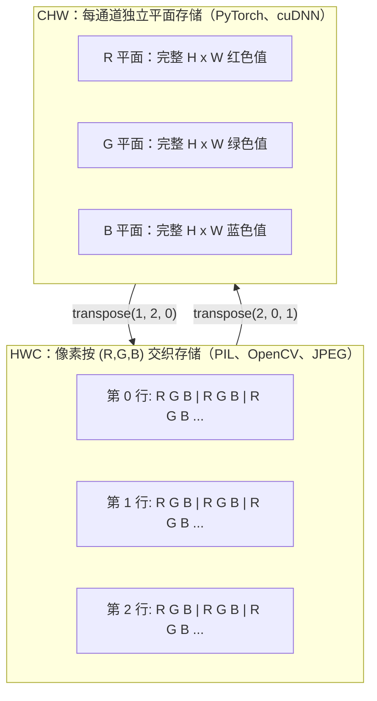

# 图像基础：像素、通道与色彩空间

> 图像本质上是光信号样本组成的张量。你将来用到的每个视觉模型，都源于这个事实。

**Type:** Build
**Languages:** Python
**Prerequisites:** 第一阶段 第12课（张量运算）、第三阶段 第11课（PyTorch 入门）
**Time:** ~45 分钟

## 学习目标

- 解释连续场景如何离散化为像素，以及采样和量化决策为何决定了下游模型性能上限
- 把图像作为 NumPy 数组读取、切片和检查，并熟练在 HWC 与 CHW 两种布局间切换
- 在 RGB、灰度、HSV 与 YCbCr 之间进行转换，并说明每种色彩空间存在的原因
- 按 torchvision 的预期准确执行像素级预处理（标准化、归一化、缩放、通道优先）

## 问题

你阅读的每篇论文、下载的每个预训练权重、调用的每个视觉 API，都默认输入采用特定编码方式。若把 `uint8` 图像直接喂给期望 `float32` 的模型，它仍会运行，但只会“悄悄地”给出垃圾结果。把 BGR 输入到基于 RGB 训练的网络，准确率会下降 10 个点。给一个要求 channels-first 的模型喂 channels-last，第一层卷积会把高度当成通道轴。上述错误通常不会抛异常，却会把指标全毁掉，让你花一周时间去追查“是文件读取那一步坏掉了”。

卷积本身并不复杂，复杂的是“图像”在不同组件里含义不同：相机、JPEG 解码器、PIL、OpenCV、torchvision、CUDA 内核都把图像理解为不同概念。每个栈都有自己的轴顺序、取值范围和通道约定。不能分清这点的视觉工程师，最终会交付坏掉的流水线。

本课先把基础打牢，让本阶段其余课程都能站在同一套输入约定上。到最后，你将知道像素是什么、为何每个像素通常是 3 个数而非 1 个、`Normalize with ImageNet stats` 到底在做什么，以及如何在课程里反复出现的两三种布局之间切换。

## 核心概念

### 快速看完整预处理流程

每个生产环境中的视觉系统都由一组可逆变换组成。只要任一环节出错，模型看到的输入就会和训练时不同。

```mermaid
flowchart LR
    A["图像文件<br/>(JPEG/PNG)"] --> B["解码<br/>uint8 HWC"]
    B --> C["色彩空间转换<br/>(RGB/BGR/YCbCr)"]
    C --> D["调整短边长度<br/>Resize"]
    D --> E["中心裁剪<br/>模型尺寸"]
    E --> F["除以255<br/>float32 [0,1]"]
    F --> G["减去均值<br/>除以标准差"]
    G --> H["转置<br/>HWC -> CHW"]
    H --> I["批量化<br/>CHW -> NCHW"]
    I --> J["模型"]

    style A fill:#fef3c7,stroke:#d97706
    style J fill:#ddd6fe,stroke:#7c3aed
    style G fill:#fecaca,stroke:#dc2626
    style H fill:#bfdbfe,stroke:#2563eb
```



红色和蓝色区域是 80% 静默失败的重灾区：标准化缺失和布局错误。

### 像素是样本，不是方格

相机传感器会统计落在小型感光单元网格上的光子。每个感光单元在极短时间内积分光强，输出电压与光子数近似成正比。传感器随后把电压离散化为整数，一个感光元就对应一个像素。

```
连续场景                    传感器网格                     数字图像
(无限细节)                 (H x W 检测元)                 (H x W 整数)

    ~~~~~                 +--+--+--+--+--+                   210 198 180 155 120
   ~   ~   ~              |  |  |  |  |  |                   205 195 178 152 118
  ~ 光源 ~      ---->      +--+--+--+--+--+       ---->       200 190 175 150 115
   ~~~~~                 |  |  |  |  |  |                   195 185 170 148 112
                         +--+--+--+--+--+                   188 180 165 145 108
```

这一步主要有两个决定，且会直接影响后续上限：

- **空间采样** 决定每个场景单位对应多少检测元。太少会出现锯齿（混叠），太多则显著增加存储与计算开销。
- **强度量化** 决定电压分桶粒度。8bit 等于 256 级，这是显示领域的常见标准；10/12/16bit 有更细梯度，常见于医学影像、HDR 与 RAW 流水线。

像素并不是带面积的色块，而是单次测量值。你缩放或旋转时，实际上是在重采样这一张量网格。

### 为什么有三个通道

一个单通道检测元覆盖全部可见光谱会得到灰度图。为了得到彩色信息，传感器给网格镶嵌红绿蓝滤光片。经过去马赛克后，每个空间位置会拥有三个整数：附近红、绿、蓝滤光元件的响应，这三个整数即 RGB 三元组。

```
内存中的一个像素：

    (R, G, B) = (210, 140, 30)   <- 偏橙红

H x W 的 RGB 图像：

    shape (H, W, 3)    存储为    H 行，每行 W 个像素，每像素 3 个值
                                       每个值取 [0, 255]（uint8）
```

“三”并非魔法数字。深度相机会加入 Z 通道，卫星影像可能增加红外和紫外波段，医学影像常见单通道（X 光、CT）或多通道（高光谱）。通道数就是最后一个轴；卷积核会学习跨通道混合。

### 两套布局约定：HWC 与 CHW

相同张量，两种顺序；每个库各选其一。

```
HWC (高度, 宽度, 通道)               CHW (通道, 高度, 宽度)

   W ->                                     H ->
  +-----+-----+-----+                      +-----+-----+
H |R G B|R G B|R G B|                    C |R R R R R R|
| +-----+-----+-----+                    | +-----+-----+
v |R G B|R G B|R G B|                    v |G G G G G G|
  +-----+-----+-----+                      +-----+-----+
                                            |B B B B B B|
                                            +-----+-----+

   PIL、OpenCV、matplotlib       PyTorch、主流深度学习框架、cuDNN
   以及大多数磁盘文件              等通常沿用
```

CHW 之所以常见于卷积，是因为卷积核沿 H、W 滑动时，通道轴放在前面可让每个核访问每个通道的连续二维平面，便于高效矢量化。磁盘格式常见 HWC，是因为它贴近扫描线输出方式。

你会反复敲的一行是：

```
img_chw = img_hwc.transpose(2, 0, 1)      # NumPy
img_chw = img_hwc.permute(2, 0, 1)        # PyTorch 张量
```

内存布局可视化：



### 字节范围与数据类型

三个常见约定：

| 约定         | dtype   | 取值范围            | 常见来源 |
|--------------|---------|--------------------|----------|
| 原始         | `uint8` | [0, 255]           | 磁盘文件、PIL、OpenCV 输出 |
| 归一化后     | `float32` | [0.0, 1.0]       | `img.astype('float32') / 255` 后 |
| 标准化后     | `float32` | 大致 [-2, +2]     | 减均值后再除以标准差 |

卷积网络通常在标准化输入上训练。ImageNet 的统计量 `mean=[0.485, 0.456, 0.406]` 与 `std=[0.229, 0.224, 0.225]` 是 ImageNet 全量训练集在 `[0,1]` 空间下的每通道均值与标准差。把原始 `uint8` 直接送进期望标准化浮点的模型，是工程里最常见、最隐蔽的输入失败之一。

### 色彩空间为何会存在

RGB 是采集格式，但不总是模型最优输入。

```
 RGB               HSV                        YCbCr / YUV

 R 红色            H 色调（角度 0-360）        Y 亮度（明度）
 G 绿色            S 饱和度（0-1）             Cb 蓝黄通道偏移
 B 蓝色            V 明度（0-1）               Cr 红黄通道偏移

 传感器线性输出        将亮度与色度分离            将亮度与色度分离
 （非 RGB 的更高层表示）  有利于色阈值和界面控制      JPEG/视频编码对色度压缩得更狠，
                                        因为人眼对色度细节不如亮度敏感
```

现代 CNN 里大部分直接喂 RGB；其余常见场景包括：

- **HSV**：传统 CV 算法、基于色彩的分割、白平衡调参
- **YCbCr**：理解 JPEG 内部结构、视频链路、只处理亮度分量的超分辨率模型
- **灰度**：OCR、文档模型，以及颜色只是噪声而非信号的任务

灰度并非三通道平均，而是加权和，因为人眼对绿色更敏感、对蓝色最不敏感：

```
Y = 0.299 R + 0.587 G + 0.114 B       （ITU-R BT.601 的经典权重）
```

### 宽高比、缩放与插值方法

每个模型有固定输入尺寸（多数 ImageNet 分类模型是 224x224，现代检测器常见 384x384 或 512x512），而你拿到的图像通常不一致。三种关键缩放策略：

- **先缩放短边再中心裁剪**：ImageNet 常用套路，保持宽高比，裁掉边缘带
- **缩放后填充**：保持宽高比和全部像素信息，会出现黑边；常见于检测与 OCR
- **直接缩放到目标尺寸**：速度快但会扭曲几何形状，在许多分类任务中可接受

插值决定了新网格与旧网格不对齐时，如何计算中间像素：

```
Nearest neighbour     最快、块状、用于掩码/标签最安全
Bilinear              快速平滑，绝大多数图像缩放默认
Bicubic               更慢，放大时更锐利
Lanczos               最慢，质量最好，常用于最终展示
```

经验规则：训练常用双线性；供人工查看的素材用双三次或 Lanczos；含整数类别 ID 的内容必须用 nearest。

```figure
conv-output-size
```

## 构建

### 第 1 步：加载图像并检查形状

用 Pillow 加载任意 JPEG/PNG，转换为 NumPy，并打印结果。为了可离线复现实验，可用生成随机样本。

```python
import numpy as np
from PIL import Image

def synthetic_rgb(h=128, w=192, seed=0):
    rng = np.random.default_rng(seed)
    yy, xx = np.meshgrid(np.linspace(0, 1, h), np.linspace(0, 1, w), indexing="ij")
    r = (np.sin(xx * 6) * 0.5 + 0.5) * 255
    g = yy * 255
    b = (1 - yy) * xx * 255
    rgb = np.stack([r, g, b], axis=-1) + rng.normal(0, 6, (h, w, 3))
    return np.clip(rgb, 0, 255).astype(np.uint8)

arr = synthetic_rgb()
# 或从磁盘加载：
# arr = np.asarray(Image.open("your_image.jpg").convert("RGB"))

print(f"type:   {type(arr).__name__}")
print(f"dtype:  {arr.dtype}")
print(f"shape:  {arr.shape}     # (H, W, C)")
print(f"min:    {arr.min()}")
print(f"max:    {arr.max()}")
print(f"pixel at (0, 0): {arr[0, 0]}")
```

预期输出：`shape: (H, W, 3)`、`dtype: uint8`、取值区间 `[0, 255]`。无论来自相机、JPEG 解码还是合成器，这都是磁盘侧标准表示。

### 第 2 步：拆通道并重排布局

分别取出 R/G/B，再从 HWC 转到 CHW，供 PyTorch 使用。

```python
R = arr[:, :, 0]
G = arr[:, :, 1]
B = arr[:, :, 2]
print(f"R shape: {R.shape}, mean: {R.mean():.1f}")
print(f"G shape: {G.shape}, mean: {G.mean():.1f}")
print(f"B shape: {B.shape}, mean: {B.mean():.1f}")

arr_chw = arr.transpose(2, 0, 1)
print(f"\nHWC shape: {arr.shape}")
print(f"CHW shape: {arr_chw.shape}")
```

三张灰度平面各自代表一个通道。CHW 只是轴重排；若内存布局允许，通常不需要额外拷贝。

### 第 3 步：灰度与 HSV 转换

先做加权灰度，再手写 RGB 到 HSV。

```python
def rgb_to_grayscale(rgb):
    weights = np.array([0.299, 0.587, 0.114], dtype=np.float32)
    return (rgb.astype(np.float32) @ weights).astype(np.uint8)

def rgb_to_hsv(rgb):
    rgb_f = rgb.astype(np.float32) / 255.0
    r, g, b = rgb_f[..., 0], rgb_f[..., 1], rgb_f[..., 2]
    cmax = np.max(rgb_f, axis=-1)
    cmin = np.min(rgb_f, axis=-1)
    delta = cmax - cmin

    h = np.zeros_like(cmax)
    mask = delta > 0
    rmax = mask & (cmax == r)
    gmax = mask & (cmax == g)
    bmax = mask & (cmax == b)
    h[rmax] = ((g[rmax] - b[rmax]) / delta[rmax]) % 6
    h[gmax] = ((b[gmax] - r[gmax]) / delta[gmax]) + 2
    h[bmax] = ((r[bmax] - g[bmax]) / delta[bmax]) + 4
    h = h * 60.0

    s = np.where(cmax > 0, delta / cmax, 0)
    v = cmax
    return np.stack([h, s, v], axis=-1)

gray = rgb_to_grayscale(arr)
hsv = rgb_to_hsv(arr)
print(f"gray shape: {gray.shape}, range: [{gray.min()}, {gray.max()}]")
print(f"hsv   shape: {hsv.shape}")
print(f"hue range: [{hsv[..., 0].min():.1f}, {hsv[..., 0].max():.1f}] degrees")
print(f"sat range: [{hsv[..., 1].min():.2f}, {hsv[..., 1].max():.2f}]")
print(f"val range: [{hsv[..., 2].min():.2f}, {hsv[..., 2].max():.2f}]")
```

色相输出为度，饱和度和值在 [0,1]。这与 OpenCV 的 `hsv_full` 约定一致。

### 第 4 步：标准化、归一化与反操作

从原始字节到预训练 ImageNet 所需的精确张量，再反推回去。

```python
mean = np.array([0.485, 0.456, 0.406], dtype=np.float32)
std = np.array([0.229, 0.224, 0.225], dtype=np.float32)

def preprocess_imagenet(rgb_uint8):
    x = rgb_uint8.astype(np.float32) / 255.0
    x = (x - mean) / std
    x = x.transpose(2, 0, 1)
    return x

def deprocess_imagenet(chw_float32):
    x = chw_float32.transpose(1, 2, 0)
    x = x * std + mean
    x = np.clip(x * 255.0, 0, 255).astype(np.uint8)
    return x

x = preprocess_imagenet(arr)
print(f"preprocessed shape: {x.shape}     # (C, H, W)")
print(f"preprocessed dtype: {x.dtype}")
print(f"preprocessed mean per channel:  {x.mean(axis=(1, 2)).round(3)}")
print(f"preprocessed std  per channel:  {x.std(axis=(1, 2)).round(3)}")

roundtrip = deprocess_imagenet(x)
max_diff = np.abs(roundtrip.astype(int) - arr.astype(int)).max()
print(f"roundtrip max pixel diff: {max_diff}    # 应为 0 或 1")
```

每通道均值应接近 0，标准差接近 1。`preprocess_imagenet` 与 `deprocess_imagenet` 对应 `torchvision.transforms.Normalize` 在幕后执行的完整逻辑。

### 第 5 步：三种插值方法对比

把 nearest、bilinear、bicubic 在放大场景下做对比，差异更明显。

```python
target = (arr.shape[0] * 3, arr.shape[1] * 3)

nearest = np.asarray(Image.fromarray(arr).resize(target[::-1], Image.NEAREST))
bilinear = np.asarray(Image.fromarray(arr).resize(target[::-1], Image.BILINEAR))
bicubic = np.asarray(Image.fromarray(arr).resize(target[::-1], Image.BICUBIC))

def local_roughness(x):
    gy = np.diff(x.astype(float), axis=0)
    gx = np.diff(x.astype(float), axis=1)
    return float(np.abs(gy).mean() + np.abs(gx).mean())

for name, out in [("nearest", nearest), ("bilinear", bilinear), ("bicubic", bicubic)]:
    print(f"{name:>8}  shape={out.shape}  roughness={local_roughness(out):6.2f}")
```

nearest 在粗糙度上通常最高，因为它保留硬边。bilinear 最平滑；bicubic 常介于二者之间，在主观清晰度上更好，也较少阶梯伪影。

## 使用

`torchvision.transforms` 可以把上面步骤组合成一条完整流水线。下面代码与 `preprocess_imagenet` 同时加入 resize 与 crop。

```python
import torch
from torchvision import transforms
from PIL import Image

img = Image.fromarray(synthetic_rgb(256, 256))

pipeline = transforms.Compose([
    transforms.Resize(256),
    transforms.CenterCrop(224),
    transforms.ToTensor(),
    transforms.Normalize(mean=[0.485, 0.456, 0.406], std=[0.229, 0.224, 0.225]),
])

x = pipeline(img)
print(f"tensor type:  {type(x).__name__}")
print(f"tensor dtype: {x.dtype}")
print(f"tensor shape: {tuple(x.shape)}      # (C, H, W)")
print(f"per-channel mean: {x.mean(dim=(1, 2)).tolist()}")
print(f"per-channel std:  {x.std(dim=(1, 2)).tolist()}")

batch = x.unsqueeze(0)
print(f"\nbatched shape: {tuple(batch.shape)}   # (N, C, H, W), 可直接送模型")
```

四步顺序固定：`Resize(256)` 把短边缩到 256；`CenterCrop(224)` 从中间裁取 224x224；`ToTensor()` 同时除 255 并把 HWC 变 CHW；`Normalize` 再做减均值与除标准差。只要顺序变了，送入模型的数据就悄悄变了。

## 收尾

本课会产出：

- `outputs/prompt-vision-preprocessing-audit.md`：一个可把任意模型卡片或数据集卡片转成审计清单的提示词模板，明确团队必须遵守的预处理不变式
- `outputs/skill-image-tensor-inspector.md`：一个能读取任意图像形状张量/数组并输出 dtype、布局、取值范围，判断其是 raw、normalized 还是 standardized 的小工具

## 练习

1. **（简单）** 用 OpenCV (`cv2.imread`) 与 Pillow 各加载一张 JPEG，打印两者形状和 `(0, 0)` 像素值。解释通道顺序差异，并写一行代码将 OpenCV 数组转成与 Pillow 一致。
2. **（中等）** 编写 `standardize(img, mean, std)` 及其逆函数，在任意 `uint8` 图像上通过 `roundtrip_max_diff <= 1` 测试。函数需同时支持单张 HWC 输入和 NCHW 批次输入（同一接口）。
3. **（困难）** 拿一个 3 通道 ImageNet 标准化张量，过一个学习 RGB 到灰度加权输出的 1x1 卷积层。将权重固定为 `[0.299, 0.587, 0.114]`，并验证输出与手工 `rgb_to_grayscale` 在浮点误差内一致。还有哪些经典色彩空间变换也能写成 1x1 卷积？

## 关键词

| 术语 | 大家说它是什么 | 实际含义 |
|------|----------------|----------|
| 像素 | “一个彩色小方块” | 在一个网格位置上的光强样本：灰度一个值、彩色三个值 |
| 通道 | “颜色” | 图像张量里并行的空间平面；在 HWC 中是最后一轴，在 CHW 中是第一轴 |
| HWC / CHW | “形状” | 常见图像布局约定：磁盘与 PIL 常见 HWC，PyTorch 与 cuDNN 常见 CHW |
| Normalize | “把图像缩放” | 先除 255 让像素到 [0,1]，这只是第一步 |
| Standardize | “去中心化” | 每通道减均值除标准差，让输入分布贴近模型训练分布 |
| 灰度转换 | “把三通道平均” | 用 0.299/0.587/0.114 加权和，更符合人眼亮度感知 |
| 插值 | “缩放像素的选择方法” | 在新旧网格不重合时的取值规则；标签常用 nearest，训练常用 bilinear，展示常用 bicubic |
| 宽高比 | “宽除高” | 区分 resize+pad 与 resize+stretch 的关键指标 |

## 拓展阅读

- [Charles Poynton 的《A Guided Tour of Color Space》](https://poynton.ca/PDFs/Guided_tour.pdf)：最清晰解释为何会出现这么多色彩空间以及各自用途的技术资料
- [PyTorch Vision Transforms 官方文档](https://pytorch.org/vision/stable/transforms.html)：生产里最常见的 transform 组合说明
- [How JPEG Works（Colt McAnlis）](https://www.youtube.com/watch?v=F1kYBnY6mwg)：用可视化方式解释色度子采样、DCT、以及 JPEG 为什么用 YCbCr 的短片
- [ImageNet 预处理约定（torchvision models）](https://pytorch.org/vision/stable/models.html)：`mean=[0.485, 0.456, 0.406]` 来源与每个模型为何统一这一约定
