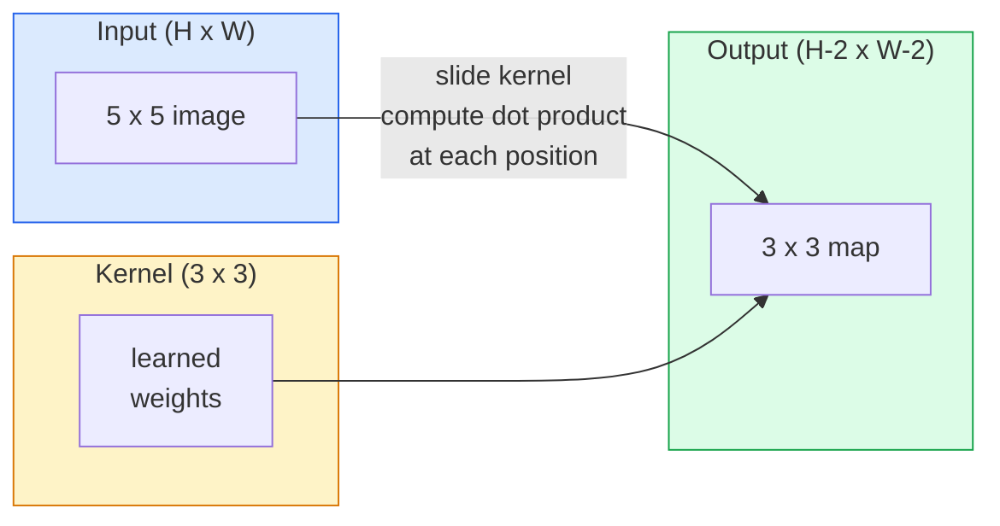
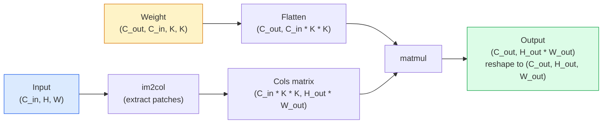

# Convolutions from Scratch

> 卷积是一个很小的可学习权重核，你将它在图像上滑动，并在每个位置共享同一组参数。

**Type:** Build
**Languages:** Python
**Prerequisites:** 阶段3（深度学习核心）、阶段4 第1课（Image Fundamentals）
**Time:** ~75 分钟

## 学习目标

- 仅使用 NumPy 实现二维卷积，包含双重循环版本与向量化的 `im2col` 版本
- 计算任意输入尺寸、卷积核尺寸、填充与步幅组合下的输出空间尺寸，并解释 `(H - K + 2P) / S + 1` 公式
- 手工设计核（边缘、模糊、锐化、Sobel）并说明每个核产生对应激活模式的原因
- 将卷积堆叠为特征提取器，并将层数与感受野大小关联起来

## 问题背景

对一个 224x224 的 RGB 图像使用全连接层时，每个神经元需要 224 * 224 * 3 = 150,528 个输入权重。一层含 1,000 个单元的隐藏层就已有 1.50528 亿参数，且在模型真正学到有用特征前就已经非常庞大。更糟的是，这一层并不知道左上角一只狗和右下角一只狗是同一种形状；它把每个像素位置都当作独立输入。对于图像来说这是错误的：将猫平移 3 个像素时，网络不应再重新学习“猫”这一概念。

图像模型需要的两个性质是**平移等变性**（输入平移时输出也平移）和**参数共享**（同一个特征检测器在所有位置复用）。全连接层都不能提供这两个性质，而卷积天然具备。

卷积并非为深度学习发明。它也用于 JPEG 压缩、Photoshop 的高斯模糊、工业视觉边缘检测，以及所有音频滤波器。2012 到 2020 年 CNN 在 ImageNet 占优，因为卷积是处理“相邻值相关、同一模式可在任意位置出现”这类数据的合适先验。

## 核心概念

### 一个核滑动

二维卷积使用一个小权重矩阵（卷积核或滤波器）在输入上滑动，在每个位置计算逐元素乘积并求和。这个和即该位置的输出像素。



以下是一个具体例子：输入为 5x5、核为 3x3、无填充、步幅为 1：

```
Input X (5 x 5):                Kernel W (3 x 3):

  1  2  0  1  2                   1  0 -1
  0  1  3  1  0                   2  0 -2
  2  1  0  2  1                   1  0 -1
  1  0  2  1  3
  2  1  1  0  1

The kernel slides across every valid 3 x 3 window. Output Y is 3 x 3:

 Y[0,0] = sum( W * X[0:3, 0:3] )
 Y[0,1] = sum( W * X[0:3, 1:4] )
 Y[0,2] = sum( W * X[0:3, 2:5] )
 Y[1,0] = sum( W * X[1:4, 0:3] )
 ... and so on
```

这一公式——**共享权重、局部性、滑动窗口**——就是整件事的核心，剩下都只是账务处理。

### 输出尺寸公式

给定输入空间尺寸 `H`、核尺寸 `K`、填充 `P`、步幅 `S`：

```
H_out = floor( (H - K + 2P) / S ) + 1
```

这个公式要熟记，你会在架构设计中重复使用。

| 场景 | H | K | P | S | H_out |
|----------|---|---|---|---|-------|
| 有效卷积，无填充 | 32 | 3 | 0 | 1 | 30 |
| Same 卷积（保持尺寸） | 32 | 3 | 1 | 1 | 32 |
| 下采样 2 倍 | 32 | 3 | 1 | 2 | 16 |
| 池化 2x2 | 32 | 2 | 0 | 2 | 16 |
| 大感受野 | 32 | 7 | 3 | 2 | 16 |

“Same padding” 表示当 S == 1 时选择 P 使得 H_out == H。对奇数 K，即 P = (K - 1) / 2。这也是 3x3 卷积最常见的原因：它是最小且有中心点的奇数核。

### 填充

没有填充时每次卷积都会缩小特征图。连续堆叠 20 层后，224x224 会变成 184x184，这会浪费边界计算，也会增加残差连接中的形状对齐难度。

```
Zero padding (P = 1) on a 5 x 5 input:

  0  0  0  0  0  0  0
  0  1  2  0  1  2  0
  0  0  1  3  1  0  0
  0  2  1  0  2  1  0       Now the kernel can centre on pixel
  0  1  0  2  1  3  0       (0, 0) and still have three rows and
  0  2  1  1  0  1  0       three columns of values to multiply.
  0  0  0  0  0  0  0
```

工程中常见的模式有 `zero`（最常见）、`reflect`（边界镜像，可减少生成模型中的硬边缘）、`replicate`（复制边缘值）、`circular`（环绕，常用于环面/周期问题）。

### 步幅

步幅是每次滑动的步长，默认是 `stride=1`。`stride=2` 可以将空间尺寸减半，也是 CNN 里常见的下采样方式之一，常用于替代独立的池化层。现代架构（ResNet、ConvNeXt、MobileNet）都会在某处使用带步幅的卷积。

```
Stride 1 on a 5 x 5 input, 3 x 3 kernel:

  starts: (0,0) (0,1) (0,2)        -> output row 0
          (1,0) (1,1) (1,2)        -> output row 1
          (2,0) (2,1) (2,2)        -> output row 2

  Output: 3 x 3

Stride 2 on the same input:

  starts: (0,0) (0,2)              -> output row 0
          (2,0) (2,2)              -> output row 1

  Output: 2 x 2
```

### 多通道输入

真实图像通常有三个通道。对 RGB 的 3x3 卷积，本质上是一个 3x3x3 的体积：每个输入通道对应一个 3x3 切片。在每个空间位置，你会对 3 个切片分别乘权重再求和，并加上偏置得到输出。

```
Input:   (C_in,  H,  W)        3 x 5 x 5
Kernel:  (C_in,  K,  K)        3 x 3 x 3 (one kernel)
Output:  (1,     H', W')       2D map

For a layer that produces C_out output channels, you stack C_out kernels:

Weight:  (C_out, C_in, K, K)   e.g. 64 x 3 x 3 x 3
Output:  (C_out, H', W')       64 x 3 x 3

Parameter count: C_out * C_in * K * K + C_out   (the + C_out is biases)
```

最后一行是你做模型规划时最常算的：3 通道输入、64 通道输出的 3x3 卷积有 `64 * 3 * 3 * 3 + 64 = 1,792` 个参数，开销并不算大。

### im2col 技巧

双重循环容易读懂但速度慢。GPU 更倾向于大规模矩阵乘法。技巧是：把输入里每个感受野窗口展平为大矩阵的一列，把卷积核展平成一行，于是整体卷积变成一次矩阵乘法。



实际工程中，大部分卷积实现都源于同一思想，并配合缓存分块等优化（direct conv、Winograd、FFT conv）。理解 im2col 就理解了快卷积实现的核心。

### 感受野

单个 3x3 卷积覆盖 9 个输入像素；两层 3x3 堆叠后，第二层一个神经元对应 5x5 输入区域；三层 3x3 则是 7x7。一般公式如下：

```
RF after L stacked K x K convs (stride 1) = 1 + L * (K - 1)

With strides:   RF grows multiplicatively with stride along each layer.
```

“始终用 3x3”能在 VGG、ResNet、ConvNeXt 里长期有效，是因为两层 3x3 的覆盖范围等价于一层 5x5，但参数更少，并且中间增加了非线性。

```figure
convolution-kernel
```

## 动手实现

### 步骤 1：填充数组

从最小原语开始：写一个对 HxW 数组进行零填充的函数。

```python
import numpy as np

def pad2d(x, p):
    if p == 0:
        return x
    h, w = x.shape[-2:]
    out = np.zeros(x.shape[:-2] + (h + 2 * p, w + 2 * p), dtype=x.dtype)
    out[..., p:p + h, p:p + w] = x
    return out

x = np.arange(9).reshape(3, 3)
print(x)
print()
print(pad2d(x, 1))
```

`x.shape[:-2]` 的“尾轴技巧”使同一函数可以直接处理 `(H, W)`、`(C, H, W)` 和 `(N, C, H, W)`。

### 步骤 2：双重循环实现二维卷积

这是一种慢但清晰的基准实现，`torch.nn.functional.conv2d` 在原理上也是这个思路。

```python
def conv2d_naive(x, w, b=None, stride=1, padding=0):
    c_in, h, w_in = x.shape
    c_out, c_in_w, kh, kw = w.shape
    assert c_in == c_in_w

    x_pad = pad2d(x, padding)
    h_out = (h + 2 * padding - kh) // stride + 1
    w_out = (w_in + 2 * padding - kw) // stride + 1

    out = np.zeros((c_out, h_out, w_out), dtype=np.float32)
    for oc in range(c_out):
        for i in range(h_out):
            for j in range(w_out):
                hs = i * stride
                ws = j * stride
                patch = x_pad[:, hs:hs + kh, ws:ws + kw]
                out[oc, i, j] = np.sum(patch * w[oc])
        if b is not None:
            out[oc] += b[oc]
    return out
```

四重循环（输出通道、行、列，再加上 C_in、kh、kw 的隐式求和）虽然慢，但它是正确性的基准；后续快速实现都要和它比对。

### 步骤 3：用手工核验核函数

构造一个垂直方向 Sobel 核，在一张合成阶跃图上应用，观察垂直边缘会亮起来。

```python
def synthetic_step_image():
    img = np.zeros((1, 16, 16), dtype=np.float32)
    img[:, :, 8:] = 1.0
    return img

sobel_x = np.array([
    [[-1, 0, 1],
     [-2, 0, 2],
     [-1, 0, 1]]
], dtype=np.float32)[None]

x = synthetic_step_image()
y = conv2d_naive(x, sobel_x, padding=1)
print(y[0].round(1))
```

你会在第 7 列（从左到右亮度上升方向）看到较大正值，其他位置接近 0，这说明数学是对的，能作为 sanity check。

### 步骤 4：im2col

将输入中的每个核大小窗口转为矩阵的一列。对 `C_in=3, K=3` 来说，每列有 27 个值。

```python
def im2col(x, kh, kw, stride=1, padding=0):
    c_in, h, w = x.shape
    x_pad = pad2d(x, padding)
    h_out = (h + 2 * padding - kh) // stride + 1
    w_out = (w + 2 * padding - kw) // stride + 1

    cols = np.zeros((c_in * kh * kw, h_out * w_out), dtype=x.dtype)
    col = 0
    for i in range(h_out):
        for j in range(w_out):
            hs = i * stride
            ws = j * stride
            patch = x_pad[:, hs:hs + kh, ws:ws + kw]
            cols[:, col] = patch.reshape(-1)
            col += 1
    return cols, h_out, w_out
```

它本身仍是 Python 循环，但真正重活交给了单次矢量化矩阵乘法。

### 步骤 5：im2col + matmul 实现快速卷积

把四重循环替换为一次矩阵乘。

```python
def conv2d_im2col(x, w, b=None, stride=1, padding=0):
    c_out, c_in, kh, kw = w.shape
    cols, h_out, w_out = im2col(x, kh, kw, stride, padding)
    w_flat = w.reshape(c_out, -1)
    out = w_flat @ cols
    if b is not None:
        out += b[:, None]
    return out.reshape(c_out, h_out, w_out)
```

正确性检查：运行两个实现并比较结果。

```python
rng = np.random.default_rng(0)
x = rng.normal(0, 1, (3, 16, 16)).astype(np.float32)
w = rng.normal(0, 1, (8, 3, 3, 3)).astype(np.float32)
b = rng.normal(0, 1, (8,)).astype(np.float32)

y_naive = conv2d_naive(x, w, b, padding=1)
y_im2col = conv2d_im2col(x, w, b, padding=1)

print(f"max abs diff: {np.max(np.abs(y_naive - y_im2col)):.2e}")
```

`max abs diff` 应该在 `1e-5` 左右，差异来自浮点累加顺序，不是实现错误。

### 步骤 6：一组手工核

构造五个核，理解单层卷积在训练前能表达的模式。

```python
KERNELS = {
    "identity": np.array([[0, 0, 0], [0, 1, 0], [0, 0, 0]], dtype=np.float32),
    "blur_3x3": np.ones((3, 3), dtype=np.float32) / 9.0,
    "sharpen": np.array([[0, -1, 0], [-1, 5, -1], [0, -1, 0]], dtype=np.float32),
    "sobel_x": np.array([[-1, 0, 1], [-2, 0, 2], [-1, 0, 1]], dtype=np.float32),
    "sobel_y": np.array([[-1, -2, -1], [0, 0, 0], [1, 2, 1]], dtype=np.float32),
}

def apply_kernel(img2d, kernel):
    x = img2d[None].astype(np.float32)
    w = kernel[None, None]
    return conv2d_im2col(x, w, padding=1)[0]
```

应用于任意灰度图时，identity 保持原样，blur_3x3 平滑，sharpen 强化边缘，sobel_x 提亮垂直边缘，sobel_y 提亮水平边缘。AlexNet 与 VGG 的第一层也会自动学到类似边缘与斑块检测，因为几乎所有视觉任务先要这些基元。

## 进一步使用

`nn.Conv2d` 在 PyTorch 中将同一运算封装起来，并增加 autograd、CUDA kernel、cuDNN 优化。形状语义依然一致。

```python
import torch
import torch.nn as nn

conv = nn.Conv2d(in_channels=3, out_channels=64, kernel_size=3, stride=1, padding=1)
print(conv)
print(f"weight shape: {tuple(conv.weight.shape)}   # (C_out, C_in, K, K)")
print(f"bias shape:   {tuple(conv.bias.shape)}")
print(f"param count:  {sum(p.numel() for p in conv.parameters())}")

x = torch.randn(8, 3, 224, 224)
y = conv(x)
print(f"\ninput  shape: {tuple(x.shape)}")
print(f"output shape: {tuple(y.shape)}")
```

把 `padding=1` 改成 `padding=0`，输出会变成 222x222；把 `stride=1` 改成 `stride=2`，输出会变成 112x112。你会再次用到前面的公式。

## 总结

本课会产出：

- `outputs/prompt-cnn-architect.md`：输入尺寸、参数预算与目标感受野后，自动给出每层 `Conv2d` 的 K / S / P 组合
- `outputs/skill-conv-shape-calculator.md`：逐层解析网络规格，输出每个 block 的尺寸、感受野和参数量

## 练习

1. **(Easy)** 给定 128x128 的灰度输入和 `[Conv3x3(s=1,p=1), Conv3x3(s=2,p=1), Conv3x3(s=1,p=1), Conv3x3(s=2,p=1)]`，手算每层输出空间尺寸和感受野，并用虚拟卷积的 `nn.Sequential` 验证。
2. **(Medium)** 将 `conv2d_naive` 和 `conv2d_im2col` 扩展为接受 `groups` 参数，证明 `groups=C_in=C_out` 即 depthwise conv，并且参数量为 `C * K * K` 而非 `C * C * K * K`。
3. **(Hard)** 手写 `conv2d_im2col` 的反向传播：给定输出梯度，计算 `x` 和 `w` 的梯度，再与 `torch.autograd.grad` 在同样输入与权重下比对。关键点是反向 im2col 的梯度是 `col2im`，重叠区域需按覆盖次数累加。

## 关键术语

| 术语 | 常见说法 | 实际含义 |
|------|----------|----------|
| Convolution | “滑动滤波器” | 在每个空间位置用共享权重做可学习的点积；数学上更准确是 cross-correlation，但大家都叫它卷积 |
| Kernel / filter | “特征检测器” | 一个小权重张量 (C_in, K, K)，与一个窗口逐元素运算后产生单个输出像素 |
| Stride | “跳步距离” | 两次核中心位置之间的间隔；stride=2 会使每个空间维度减半 |
| Padding | “边缘补零” | 在输入外围增加数值，使卷积核可以作用到边缘像素；`same` 填充可保持输出尺寸和输入尺寸一致 |
| Receptive field | “神经元可见范围” | 输出某个激活依赖的原始输入区域，随层数和步幅扩大 |
| im2col | “GEMM 技巧” | 将每个感受野窗口重排为列，卷积因此变成一次大矩阵乘法，是高效卷积核的核心 |
| Depthwise conv | “每通道一个卷积核” | 当 `groups == C_in` 时，每个输出通道只依赖同名输入通道；这是 MobileNet 和 ConvNeXt 的关键组件 |
| Translation equivariance | “平移后同幅平移” | 输入向右下平移 k 像素，输出也会在对应方向平移 k 像素 |

## 延伸阅读

- [A guide to convolution arithmetic for deep learning (Dumoulin & Visin, 2016)](https://arxiv.org/abs/1603.07285) — padding、stride、dilation 的标准图解说明
- [CS231n: Convolutional Neural Networks for Visual Recognition](https://cs231n.github.io/convolutional-networks/) — 标准课程讲义，包含原始的 im2col 解释
- [The Annotated ConvNet (fast.ai)](https://nbviewer.org/github/fastai/fastbook/blob/master/13_convolutions.ipynb) — 从手工卷积到训练好的手写数字分类器的学习路径
- [Receptive Field Arithmetic for CNNs (Dang Ha The Hien)](https://distill.pub/2019/computing-receptive-fields/) — 深入解释感受野计算的交互式文档
