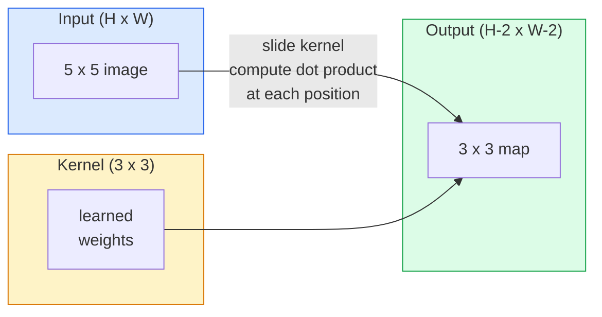
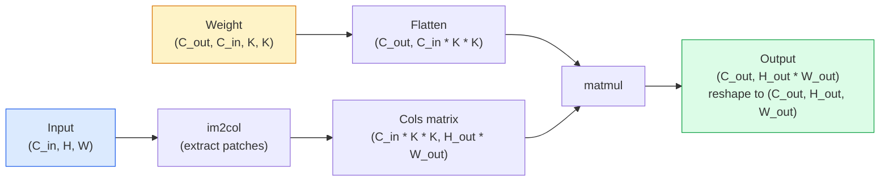

# 从零实现卷积

> 卷积就是一个在图像上滑动的小型全连接层，并且在每个位置共享同一组权重。

**Type:** Build
**Languages:** Python
**Prerequisites:** Phase 3 (Deep Learning Core), Phase 4 Lesson 01 (Image Fundamentals)
**Time:** ~75 minutes

## Learning Objectives

- 使用纯 NumPy 从零实现二维卷积，包括朴素的嵌套循环版本和向量化的 `im2col` 版本
- 计算任意输入尺寸、卷积核尺寸、填充和步幅组合下的输出空间尺寸，并解释 `(H - K + 2P) / S + 1` 公式
- 手工设计边缘、模糊、锐化、Sobel 等卷积核，并说明它们为什么会产生对应的激活模式
- 将多层卷积堆叠成特征提取器，并把堆叠深度和感受野大小联系起来

## 问题是什么

一个作用在 224x224 RGB 图像上的全连接层，每个神经元都需要 224 * 224 * 3 = 150,528 个输入权重。只要隐藏层有 1,000 个单元，参数量就已经达到 1.5 亿 - 还没学到任何有用东西。更糟的是，这一层完全不知道左上角的一只狗和右下角的一只狗其实是同一种模式。它把每个像素位置都当成彼此独立的东西，而这对图像来说正好是错的：一只猫平移了三个像素，不应该迫使网络重新学习“猫”这个概念。

图像模型需要两件事：**平移等变性**（输入平移，输出也随之平移）和**参数共享**（同一个特征检测器在整张图上复用）。全连接层两者都没有。卷积可以同时免费提供这两点。

卷积并不是为深度学习发明的。JPEG 压缩、Photoshop 的高斯模糊、工业视觉里的边缘检测，以及几乎所有音频滤波器，底层用的都是同一种运算。CNN 在 2012 到 2020 年统治 ImageNet，并不是偶然，而是因为卷积正好适合这类数据：相邻值彼此相关，同一种模式又可能出现在任何位置。

## 核心概念

### 一个卷积核，沿着图像滑动

二维卷积会拿一个叫作卷积核（kernel，也叫 filter）的小权重矩阵，沿着输入滑动，并在每个位置计算元素乘积之和。这个和就是一个输出像素。



下面是一个具体的 3x3 示例，输入是 5x5，没有填充，步幅为 1：

```
Input X (5 x 5):                Kernel W (3 x 3):

  1  2  0  1  2                   1  0 -1
  0  1  3  1  0                   2  0 -2
  2  1  0  2  1                   1  0 -1
  1  0  2  1  3
  2  1  1  0  1

卷积核会滑过每一个有效的 3 x 3 窗口。输出 Y 是 3 x 3：

 Y[0,0] = sum( W * X[0:3, 0:3] )
 Y[0,1] = sum( W * X[0:3, 1:4] )
 Y[0,2] = sum( W * X[0:3, 2:5] )
 Y[1,0] = sum( W * X[1:4, 0:3] )
 ... and so on
```

这一个公式 - **共享权重、局部连接、滑动窗口** - 就是卷积的全部要义。其余只是记账。

### 输出尺寸公式

给定输入空间尺寸 `H`、卷积核大小 `K`、填充 `P`、步幅 `S`：

```
H_out = floor( (H - K + 2P) / S ) + 1
```

这个公式要记熟。你在设计网络时会反复用到。

| Scenario | H | K | P | S | H_out |
|----------|---|---|---|---|-------|
| Valid conv, no padding | 32 | 3 | 0 | 1 | 30 |
| Same conv (preserves size) | 32 | 3 | 1 | 1 | 32 |
| Downsample by 2 | 32 | 3 | 1 | 2 | 16 |
| Pool 2x2 | 32 | 2 | 0 | 2 | 16 |
| Large receptive field | 32 | 7 | 3 | 2 | 16 |

“Same padding” 的意思是：当 `S == 1` 时，选择合适的 `P` 让 `H_out == H`。对于奇数 `K`，这就是 `P = (K - 1) / 2`。这也是为什么 3x3 卷积核最常见 - 它是仍然保留中心点的最小奇数卷积核。

### 填充

如果不加填充，每做一次卷积，特征图都会变小。连续堆 20 层之后，224x224 的图像会变成 184x184，边缘信息浪费了计算，也会让需要对齐形状的残差连接变得麻烦。

```
Zero padding (P = 1) on a 5 x 5 input:

  0  0  0  0  0  0  0
  0  1  2  0  1  2  0
  0  0  1  3  1  0  0
  0  2  1  0  2  1  0       Now the kernel can centre on pixel
  0  1  0  2  1  3  0       (0, 0) and still have three rows and
  0  2  1  1  0  1  0       three columns of values to multiply.
  0  0  0  0  0  0  0
```

实际中常见的填充模式有：`zero`（最常见）、`reflect`（镜像边界，能避免生成模型里生硬的边缘）、`replicate`（复制边缘值）、`circular`（循环环绕，常用于环面问题）。

### 步幅

步幅就是滑动时每次跨出的距离。`stride=1` 是默认值。`stride=2` 会让空间尺寸减半，是 CNN 里经典的下采样方式之一，可以不依赖独立的池化层完成下采样 - 现代架构（ResNet、ConvNeXt、MobileNet）都会在某些地方用带步幅的卷积替代 max-pool。

```
Stride 1 on a 5 x 5 input, 3 x 3 kernel:

  starts: (0,0) (0,1) (0,2)        -> output row 0
          (1,0) (1,1) (1,2)        -> output row 1
          (2,0) (2,1) (2,2)        -> output row 2

  Output: 3 x 3

Stride 2 on the same input:

  starts: (0,0) (0,2)              -> output row 0
          (2,0) (2,2)              -> output row 1

  Output: 2 x 2
```

### 多输入通道

真实图像有三个通道。RGB 输入上的 3x3 卷积，其实是一个 3x3x3 的体积：每个输入通道对应一张 3x3 切片。每个空间位置上，你要把三张切片分别乘上对应权重，再把结果相加，然后加偏置。

```
Input:   (C_in,  H,  W)        3 x 5 x 5
Kernel:  (C_in,  K,  K)        3 x 3 x 3 (one kernel)
Output:  (1,     H', W')       2D map

For a layer that produces C_out output channels, you stack C_out kernels:

Weight:  (C_out, C_in, K, K)   e.g. 64 x 3 x 3 x 3
Output:  (C_out, H', W')       64 x 3 x 3

Parameter count: C_out * C_in * K * K + C_out   (the + C_out is biases)
```

这也是你在规划模型时要算的那个数。一个输入为 3 通道、输出为 64 通道的 3x3 卷积层，参数量是 `64 * 3 * 3 * 3 + 64 = 1,792`。很便宜。

### im2col 技巧

嵌套循环易读，但速度慢。GPU 喜欢大矩阵乘法。技巧是：把输入里每一个感受野窗口都展平为大矩阵中的一列，把卷积核展平为一行，整个卷积就变成一次矩阵乘法。



生产级卷积实现本质上都和这个思路有关，只是会再加上缓存分块之类的优化（direct conv、Winograd、针对大卷积核的 FFT conv）。理解了 im2col，就理解了核心。

### 感受野

一个 3x3 卷积只能看见 9 个输入像素。堆两层 3x3 卷积后，第二层的一个神经元实际上能看到 5x5 的输入像素。三层 3x3 卷积就能看到 7x7。一般地：

```
RF after L stacked K x K convs (stride 1) = 1 + L * (K - 1)

With strides:   RF grows multiplicatively with stride along each layer.
```

“3x3 一路堆到底”之所以成立（VGG、ResNet、ConvNeXt），就是因为两层 3x3 卷积看到的输入范围和一层 5x5 卷积一样大，但参数更少，中间还多了一次非线性。

```figure
convolution-kernel
```

## 动手实现

### 第 1 步：给数组加填充

先从最小原语开始：写一个给 HxW 数组四周加零填充的函数。

```python
import numpy as np

def pad2d(x, p):
    if p == 0:
        return x
    h, w = x.shape[-2:]
    out = np.zeros(x.shape[:-2] + (h + 2 * p, w + 2 * p), dtype=x.dtype)
    out[..., p:p + h, p:p + w] = x
    return out

x = np.arange(9).reshape(3, 3)
print(x)
print()
print(pad2d(x, 1))
```

`x.shape[:-2]` 这个尾轴技巧，意味着同一个函数可以直接处理 `(H, W)`、`(C, H, W)` 或 `(N, C, H, W)`，不用改代码。

### 第 2 步：用嵌套循环实现二维卷积

这是参考实现 - 慢，但最清楚。`torch.nn.functional.conv2d` 的原理就是这样。

```python
def conv2d_naive(x, w, b=None, stride=1, padding=0):
    c_in, h, w_in = x.shape
    c_out, c_in_w, kh, kw = w.shape
    assert c_in == c_in_w

    x_pad = pad2d(x, padding)
    h_out = (h + 2 * padding - kh) // stride + 1
    w_out = (w_in + 2 * padding - kw) // stride + 1

    out = np.zeros((c_out, h_out, w_out), dtype=np.float32)
    for oc in range(c_out):
        for i in range(h_out):
            for j in range(w_out):
                hs = i * stride
                ws = j * stride
                patch = x_pad[:, hs:hs + kh, ws:ws + kw]
                out[oc, i, j] = np.sum(patch * w[oc])
        if b is not None:
            out[oc] += b[oc]
    return out
```

四层嵌套循环（输出通道、行、列，再加上 C_in、kh、kw 上的隐式求和）就是 ground truth。后面所有更快的实现，都应该拿它来对照。

### 第 3 步：用手工设计的卷积核验证结果

构造一个垂直 Sobel 卷积核，把它应用到一个合成的阶跃图像上，看看垂直边缘是否被点亮。

```python
def synthetic_step_image():
    img = np.zeros((1, 16, 16), dtype=np.float32)
    img[:, :, 8:] = 1.0
    return img

sobel_x = np.array([
    [[-1, 0, 1],
     [-2, 0, 2],
     [-1, 0, 1]]
], dtype=np.float32)[None]

x = synthetic_step_image()
y = conv2d_naive(x, sobel_x, padding=1)
print(y[0].round(1))
```

预期结果是在第 7 列出现较大的正值（从左到右亮度增加），其他地方接近 0。这个打印输出就是你的数学 sanity check。

### 第 4 步：im2col

把每个卷积窗口转换成矩阵中的一列。对于 `C_in=3, K=3`，每一列会有 27 个数。

```python
def im2col(x, kh, kw, stride=1, padding=0):
    c_in, h, w = x.shape
    x_pad = pad2d(x, padding)
    h_out = (h + 2 * padding - kh) // stride + 1
    w_out = (w + 2 * padding - kw) // stride + 1

    cols = np.zeros((c_in * kh * kw, h_out * w_out), dtype=x.dtype)
    col = 0
    for i in range(h_out):
        for j in range(w_out):
            hs = i * stride
            ws = j * stride
            patch = x_pad[:, hs:hs + kh, ws:ws + kw]
            cols[:, col] = patch.reshape(-1)
            col += 1
    return cols, h_out, w_out
```

它仍然用了 Python 循环，但重活会交给一次向量化矩阵乘法。

### 第 5 步：用 im2col + matmul 加速卷积

把那四重循环替换成一次矩阵乘法。

```python
def conv2d_im2col(x, w, b=None, stride=1, padding=0):
    c_out, c_in, kh, kw = w.shape
    cols, h_out, w_out = im2col(x, kh, kw, stride, padding)
    w_flat = w.reshape(c_out, -1)
    out = w_flat @ cols
    if b is not None:
        out += b[:, None]
    return out.reshape(c_out, h_out, w_out)
```

正确性检查：让两个实现跑同一组输入，然后比较结果。

```python
rng = np.random.default_rng(0)
x = rng.normal(0, 1, (3, 16, 16)).astype(np.float32)
w = rng.normal(0, 1, (8, 3, 3, 3)).astype(np.float32)
b = rng.normal(0, 1, (8,)).astype(np.float32)

y_naive = conv2d_naive(x, w, b, padding=1)
y_im2col = conv2d_im2col(x, w, b, padding=1)

print(f"max abs diff: {np.max(np.abs(y_naive - y_im2col)):.2e}")
```

`max abs diff` 应该在 `1e-5` 左右 - 这是浮点累加顺序不同，不是 bug。

### 第 6 步：一组手工设计的卷积核

下面这五个滤波器展示了单层卷积在训练前就能表达什么。

```python
KERNELS = {
    "identity": np.array([[0, 0, 0], [0, 1, 0], [0, 0, 0]], dtype=np.float32),
    "blur_3x3": np.ones((3, 3), dtype=np.float32) / 9.0,
    "sharpen": np.array([[0, -1, 0], [-1, 5, -1], [0, -1, 0]], dtype=np.float32),
    "sobel_x": np.array([[-1, 0, 1], [-2, 0, 2], [-1, 0, 1]], dtype=np.float32),
    "sobel_y": np.array([[-1, -2, -1], [0, 0, 0], [1, 2, 1]], dtype=np.float32),
}

def apply_kernel(img2d, kernel):
    x = img2d[None].astype(np.float32)
    w = kernel[None, None]
    return conv2d_im2col(x, w, padding=1)[0]
```

把它们用在任意灰度图上：blur_3x3 会让图像更平滑，sharpen 会增强边缘，sobel_x 会突出垂直边缘，sobel_y 会突出水平边缘。AlexNet 和 VGG 的第一个训练后卷积层，最终学到的也正是这种模式，因为一个好的图像模型，不管后续任务是什么，都需要边缘检测器和块状检测器。

## 直接使用

PyTorch 的 `nn.Conv2d` 把同样的运算包装起来了，只是多了 autograd、CUDA 内核和 cuDNN 优化。它的形状语义和我们前面的实现完全一致。

```python
import torch
import torch.nn as nn

conv = nn.Conv2d(in_channels=3, out_channels=64, kernel_size=3, stride=1, padding=1)
print(conv)
print(f"weight shape: {tuple(conv.weight.shape)}   # (C_out, C_in, K, K)")
print(f"bias shape:   {tuple(conv.bias.shape)}")
print(f"param count:  {sum(p.numel() for p in conv.parameters())}")

x = torch.randn(8, 3, 224, 224)
y = conv(x)
print(f"\ninput  shape: {tuple(x.shape)}")
print(f"output shape: {tuple(y.shape)}")
```

把 `padding=1` 改成 `padding=0`，输出就会变成 222x222。把 `stride=1` 改成 `stride=2`，输出就会变成 112x112。还是前面记过的那个公式。

## 交付成果

本课会产出：

- `outputs/prompt-cnn-architect.md` - 一个提示词：给定输入尺寸、参数预算和目标感受野，自动设计一串 `Conv2d` 层，并为每一层选择合适的 K/S/P
- `outputs/skill-conv-shape-calculator.md` - 一个技能：按层遍历网络规格，返回每个 block 的输出尺寸、感受野和参数量

## 练习

1. **(Easy)** 给定一个 128x128 的灰度输入，以及 `[Conv3x3(s=1,p=1), Conv3x3(s=2,p=1), Conv3x3(s=1,p=1), Conv3x3(s=2,p=1)]` 这一串卷积，手工计算每一层的输出空间尺寸和感受野。再用一个由空壳卷积组成的 `nn.Sequential` 验证。
2. **(Medium)** 给 `conv2d_naive` 和 `conv2d_im2col` 增加 `groups` 参数。证明当 `groups=C_in=C_out` 时，就得到了 depthwise convolution，并且它的参数量是 `C * K * K`，而不是 `C * C * K * K`。
3. **(Hard)** 手工实现 `conv2d_im2col` 的反向传播：已知输出梯度，求 `x` 和 `w` 的梯度。再用相同的输入和权重与 `torch.autograd.grad` 对照。关键点：im2col 的梯度对应 `col2im`，它必须把重叠窗口的贡献累加起来。

## 关键术语

| Term | What people say | What it actually means |
|------|----------------|----------------------|
| Convolution | "Sliding a filter" | A learnable dot product applied at every spatial location with shared weights; mathematically a cross-correlation, but everyone calls it convolution |
| Kernel / filter | "The feature detector" | A small weight tensor of shape (C_in, K, K) whose dot product with a window of input produces one output pixel |
| Stride | "How far you jump" | The step size between consecutive kernel placements; stride 2 halves each spatial dimension |
| Padding | "Zeros on the edges" | Extra values added around the input so the kernel can centre on border pixels; `same` padding keeps output size equal to input size |
| Receptive field | "How much the neuron sees" | The patch of original input that a given output activation depends on, growing with depth and stride |
| im2col | "The GEMM trick" | Rearranging every receptive window into columns so convolution becomes one big matrix multiply - the core of every fast conv kernel |
| Depthwise conv | "One kernel per channel" | A conv with `groups == C_in`, computing each output channel from only its matching input channel; the backbone of MobileNet and ConvNeXt |
| Translation equivariance | "Shift in, shift out" | Property that shifting the input by k pixels shifts the output by k pixels; comes for free with shared weights |

## 延伸阅读

- [A guide to convolution arithmetic for deep learning (Dumoulin & Visin, 2016)](https://arxiv.org/abs/1603.07285) - padding、stride、dilation 的标准图解，几乎每门课都在悄悄借用
- [CS231n: Convolutional Neural Networks for Visual Recognition](https://cs231n.github.io/convolutional-networks/) - 经典课程笔记，包括最早那版 im2col 解释
- [The Annotated ConvNet (fast.ai)](https://nbviewer.org/github/fastai/fastbook/blob/master/13_convolutions.ipynb) - 从手工卷积一路讲到训练好的数字分类器
- [Receptive Field Arithmetic for CNNs (Dang Ha The Hien)](https://distill.pub/2019/computing-receptive-fields/) - 感受野计算的交互式、论文级讲解
