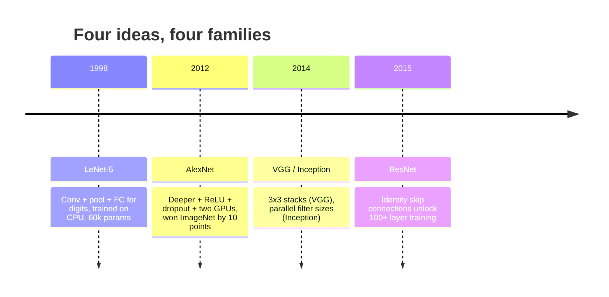
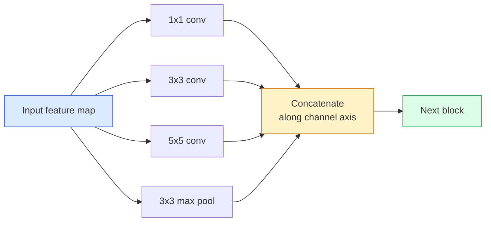
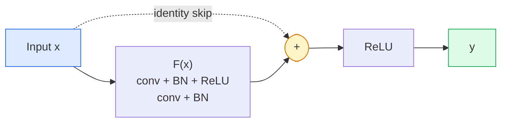

# CNNs：从 LeNet 到 ResNet

> 过去三十年的主流 CNN，本质上都是同一套 conv - nonlinearity - downsample 的配方，只是在上面多加了一个新想法。要按顺序学这些想法。

**类型:** 学习 + 实作
**语言:** Python
**先修:** 第 3 阶段第 11 课（PyTorch）, 第 4 阶段第 01 课（Image Fundamentals）, 第 4 阶段第 02 课（Convolutions from Scratch）
**时长:** ~75 分钟

## 学习目标

- 梳理 LeNet-5 -> AlexNet -> VGG -> Inception -> ResNet 的架构谱系，并说出每一代的单一新想法。
- 在 PyTorch 里实现 LeNet-5、一个 VGG 风格 block 和一个 ResNet BasicBlock，且每个都控制在 40 行以内。
- 解释为什么 residual connection 能把一个 1000 层网络从“根本训不动”变成 SOTA。
- 读懂现代 backbone（ResNet-18、ResNet-50），并在看源码前先预测它的输出形状、感受野和参数量。

## 问题是什么

2011 年，最好的 ImageNet 分类器大约只有 74% 的 top-5 accuracy。2012 年 AlexNet 做到了 85%。2015 年 ResNet 做到了 96%。没有新数据，没有新一代 GPU。提升来自架构想法。一个合格的视觉工程师必须知道哪个想法来自哪篇论文，因为你在 2026 年交付的生产 backbone，本质上都是这些积木的重新组合。更重要的是，这些想法还会继续迁移：grouped conv 从 CNN 跑到了 transformer，residual connection 从 ResNet 跑到了所有 LLM，batch normalisation 现在也活在 diffusion model 里。

按顺序学习这些网络，也能帮你避免一个常见错误：看到问题就去拿最大的可用模型，结果其实一个 LeNet 级别的网络就够了。MNIST 不需要 ResNet。知道每个家族的 scaling 曲线，才能决定自己该坐在哪一段。

## 核心概念

### 改变视觉的四个想法



经典视觉里，没有任何东西像这四次跃迁一样重要。

### LeNet-5（1998）

Yann LeCun 的数字识别器。6 万个参数。两个 conv-pool block，两个全连接层，tanh 激活。它定义了每个 CNN 都会继承的模板：

```
input (1, 32, 32)
  conv 5x5 -> (6, 28, 28)
  avg pool 2x2 -> (6, 14, 14)
  conv 5x5 -> (16, 10, 10)
  avg pool 2x2 -> (16, 5, 5)
  flatten -> 400
  dense -> 120
  dense -> 84
  dense -> 10
```

现代世界里所谓的 CNN - 交替进行卷积和下采样，再喂给一个小型分类头 - 本质上就是 LeNet，只不过层数更多、通道更宽、激活函数更好。

### AlexNet（2012）

三个改变合在一起，直接突破了 ImageNet：

1. **ReLU** 代替 tanh。梯度不再那么容易消失，训练速度提升了 6 倍。
2. **Dropout** 用在全连接头里。正则化变成了一层，而不是一个小技巧。
3. **深度和宽度**。5 个卷积层、3 个全连接层、6000 万参数，用两块 GPU 训练，并把模型切分到两块卡上。

论文里的 Figure 2 仍然把 GPU split 画成两条并行流。那只是硬件上的折中，不是架构洞见；但上面那三个想法，今天你用的每个模型里都还在。

### VGG（2014）

VGG 问的是：如果我只用 3x3 卷积，然后把网络加深，会怎样？

```
stack:   conv 3x3 -> conv 3x3 -> pool 2x2
repeat:  16 or 19 conv layers
```

两个 3x3 卷积看到的输入区域，和一个 5x5 卷积一样，都是 5x5，但参数更少（2*9*C^2 = 18C^2，对比 25*C^2），中间还多一个 ReLU。VGG 把这个观察变成了一整套架构。它的简单性 - 只有一种 block，重复堆叠 - 让它成了后续一切工作的参考点。

代价是：1.38 亿参数、训练慢、推理贵。

### Inception（2014，同年）

Google 对“我该选多大的卷积核？”的答案是：全都上，并行跑。



每个分支各司其职 - 1x1 负责通道混合，3x3 负责局部纹理，5x5 负责更大模式，pooling 负责平移不变特征 - concat 之后，下一层可以自己挑哪个分支有用。Inception v1 在每个分支里都用了 1x1 卷积做 bottleneck，避免参数量失控。

### 退化问题

到了 2015 年，VGG-19 能工作，VGG-32 却不行。深层按理说应该更强，但在 20 层左右之后，训练和测试 loss 都开始变差。这不是 overfitting，而是优化器没法找到有用权重，因为梯度会在每一层里乘性缩小。

```
Plain deep network:
  y = f_L( f_{L-1}( ... f_1(x) ... ) )

Gradient wrt early layer:
  dL/dW_1 = dL/dy * df_L/df_{L-1} * ... * df_2/df_1 * df_1/dW_1

Each multiplicative term has magnitude roughly (weight magnitude) * (activation gain).
Stack 100 of them with gains < 1 and the gradient is effectively zero.
```

VGG 能撑到 19 层，是因为 batch norm（同时期发布）把激活尺度控制住了。但即便如此，batch norm 也救不了 30 多层以上的深度。

### ResNet（2015）

He、Zhang、Ren、Sun 提出一个改动，解决了这一切：

```
standard block:   y = F(x)
residual block:   y = F(x) + x
```

`+ x` 的意思是：只要把 `F(x)` 压到 0，这一层就可以什么都不做。于是一个 1000 层 ResNet，最差也不会比 1 层网络更糟，因为每个额外 block 都有一条简单的逃生通道。有了这个保证，优化器才愿意把每个 block 做得“稍微有用一点”；而“稍微有用一点”堆 100 层之后，就成了 SOTA。



这个 block 的两个变体无处不在：

- **BasicBlock**（ResNet-18、ResNet-34）：两个 3x3 卷积，skip 包住两层。
- **Bottleneck**（ResNet-50、-101、-152）：1x1 降维，3x3 中间层，1x1 升维，skip 包住三层。当通道数很高时，它更省。

如果 skip 必须跨过 downsample（stride=2），identity path 会被一个 1x1、stride=2 的卷积替代，用来对齐形状。

### residual 为什么不只属于视觉

这个想法真正重要的地方，不是图像分类本身，而是它把深层网络从“只能祈祷梯度别死”变成了可靠、可扩展的工程工具。下一阶段你会看到的每个 transformer block，里面都有完全一样的 skip connection。没有 ResNet，就没有 GPT。

```figure
pooling
```

## 动手实现

### 第 1 步：LeNet-5

一个尽量忠实的 LeNet。tanh 激活，平均池化。唯一向现代妥协的地方，是下游用的是 `nn.CrossEntropyLoss`，而不是原论文里的 Gaussian connections。

```python
import torch
import torch.nn as nn
import torch.nn.functional as F

class LeNet5(nn.Module):
    def __init__(self, num_classes=10):
        super().__init__()
        self.conv1 = nn.Conv2d(1, 6, kernel_size=5)
        self.conv2 = nn.Conv2d(6, 16, kernel_size=5)
        self.pool = nn.AvgPool2d(2)
        self.fc1 = nn.Linear(16 * 5 * 5, 120)
        self.fc2 = nn.Linear(120, 84)
        self.fc3 = nn.Linear(84, num_classes)

    def forward(self, x):
        x = self.pool(torch.tanh(self.conv1(x)))
        x = self.pool(torch.tanh(self.conv2(x)))
        x = torch.flatten(x, 1)
        x = torch.tanh(self.fc1(x))
        x = torch.tanh(self.fc2(x))
        return self.fc3(x)

net = LeNet5()
x = torch.randn(1, 1, 32, 32)
print(f"output: {net(x).shape}")
print(f"params: {sum(p.numel() for p in net.parameters()):,}")
```

预期输出：`output: torch.Size([1, 10])`、`params: 61,706`。这就是开启现代视觉时代的那个完整数字分类器。

### 第 2 步：一个 VGG block

一个可复用 block：两个 3x3 卷积、ReLU、batch norm、max pool。

```python
class VGGBlock(nn.Module):
    def __init__(self, in_c, out_c):
        super().__init__()
        self.conv1 = nn.Conv2d(in_c, out_c, kernel_size=3, padding=1)
        self.bn1 = nn.BatchNorm2d(out_c)
        self.conv2 = nn.Conv2d(out_c, out_c, kernel_size=3, padding=1)
        self.bn2 = nn.BatchNorm2d(out_c)
        self.pool = nn.MaxPool2d(2)

    def forward(self, x):
        x = F.relu(self.bn1(self.conv1(x)))
        x = F.relu(self.bn2(self.conv2(x)))
        return self.pool(x)

class MiniVGG(nn.Module):
    def __init__(self, num_classes=10):
        super().__init__()
        self.stack = nn.Sequential(
            VGGBlock(3, 32),
            VGGBlock(32, 64),
            VGGBlock(64, 128),
        )
        self.head = nn.Sequential(
            nn.AdaptiveAvgPool2d(1),
            nn.Flatten(),
            nn.Linear(128, num_classes),
        )

    def forward(self, x):
        return self.head(self.stack(x))

net = MiniVGG()
x = torch.randn(1, 3, 32, 32)
print(f"output: {net(x).shape}")
print(f"params: {sum(p.numel() for p in net.parameters()):,}")
```

CIFAR 大小输入上堆 3 个 VGG block，再接一个自适应池化和一个线性层。参数量大约 29 万。做 CIFAR-10 够用了。

### 第 3 步：ResNet BasicBlock

ResNet-18 和 ResNet-34 的核心积木。

```python
class BasicBlock(nn.Module):
    def __init__(self, in_c, out_c, stride=1):
        super().__init__()
        self.conv1 = nn.Conv2d(in_c, out_c, kernel_size=3, stride=stride, padding=1, bias=False)
        self.bn1 = nn.BatchNorm2d(out_c)
        self.conv2 = nn.Conv2d(out_c, out_c, kernel_size=3, stride=1, padding=1, bias=False)
        self.bn2 = nn.BatchNorm2d(out_c)
        if stride != 1 or in_c != out_c:
            self.shortcut = nn.Sequential(
                nn.Conv2d(in_c, out_c, kernel_size=1, stride=stride, bias=False),
                nn.BatchNorm2d(out_c),
            )
        else:
            self.shortcut = nn.Identity()

    def forward(self, x):
        out = F.relu(self.bn1(self.conv1(x)))
        out = self.bn2(self.conv2(out))
        out = out + self.shortcut(x)
        return F.relu(out)
```

卷积层上用 `bias=False` 是 batch norm 的惯例 - BN 里的 beta 参数已经负责偏置了，再让 conv 带一份 bias 只是浪费。`shortcut` 只有在 stride 或通道数变化时才需要真正的卷积；否则它就是一个空操作 identity。

### 第 4 步：一个小型 ResNet

堆四组 BasicBlock，得到一个能处理 CIFAR 大小输入的 ResNet。

```python
class TinyResNet(nn.Module):
    def __init__(self, num_classes=10):
        super().__init__()
        self.stem = nn.Sequential(
            nn.Conv2d(3, 32, kernel_size=3, stride=1, padding=1, bias=False),
            nn.BatchNorm2d(32),
            nn.ReLU(inplace=True),
        )
        self.layer1 = self._make_group(32, 32, num_blocks=2, stride=1)
        self.layer2 = self._make_group(32, 64, num_blocks=2, stride=2)
        self.layer3 = self._make_group(64, 128, num_blocks=2, stride=2)
        self.layer4 = self._make_group(128, 256, num_blocks=2, stride=2)
        self.head = nn.Sequential(
            nn.AdaptiveAvgPool2d(1),
            nn.Flatten(),
            nn.Linear(256, num_classes),
        )

    def _make_group(self, in_c, out_c, num_blocks, stride):
        blocks = [BasicBlock(in_c, out_c, stride=stride)]
        for _ in range(num_blocks - 1):
            blocks.append(BasicBlock(out_c, out_c, stride=1))
        return nn.Sequential(*blocks)

    def forward(self, x):
        x = self.stem(x)
        x = self.layer1(x)
        x = self.layer2(x)
        x = self.layer3(x)
        x = self.layer4(x)
        return self.head(x)

net = TinyResNet()
x = torch.randn(1, 3, 32, 32)
print(f"output: {net(x).shape}")
print(f"params: {sum(p.numel() for p in net.parameters()):,}")
```

每组两个 block。第 2、3、4 组的开头用 stride 2。每次下采样时通道数翻倍。参数量大约 280 万。这就是能稳定扩展到 ResNet-152 的标准配方。

### 第 5 步：比较参数效率

把同一个输入送进这三个网络，比较参数数量。

```python
def summary(name, net, x):
    y = net(x)
    params = sum(p.numel() for p in net.parameters())
    print(f"{name:12s}  input {tuple(x.shape)} -> output {tuple(y.shape)}  params {params:>10,}")

x = torch.randn(1, 3, 32, 32)
summary("LeNet5",     LeNet5(),       torch.randn(1, 1, 32, 32))
summary("MiniVGG",    MiniVGG(),      x)
summary("TinyResNet", TinyResNet(),   x)
```

三个模型，三个时代，参数量差了三个数量级。对于 CIFAR-10 的准确率，大致可以把它们理解成：LeNet 60%，MiniVGG 89%，TinyResNet 在训练几个 epoch 后能到 93%。

## 使用方式

`torchvision.models` 里已经给你准备好了上述所有网络的预训练版本。各家家族的调用签名完全一样，这正是 backbone 抽象的意义。

```python
from torchvision.models import resnet18, ResNet18_Weights, vgg16, VGG16_Weights

r18 = resnet18(weights=ResNet18_Weights.IMAGENET1K_V1)
r18.eval()

print(f"ResNet-18 params: {sum(p.numel() for p in r18.parameters()):,}")
print(r18.layer1[0])
print()

v16 = vgg16(weights=VGG16_Weights.IMAGENET1K_V1)
v16.eval()
print(f"VGG-16   params: {sum(p.numel() for p in v16.parameters()):,}")
```

ResNet-18 有 1170 万参数。VGG-16 有 1.38 亿。ImageNet top-1 accuracy 却很接近（69.8% vs 71.6%）。residual connection 给你带来的是 12 倍的参数效率提升。这也是为什么 ResNet 变体从 2016 年一路统治到 ViT 在 2021 年出现为止 - 而且在计算资源受限的真实部署里，它们到现在依然主导。

做迁移学习时，套路永远一样：加载预训练权重，冻结 backbone，替换分类头。

```python
for p in r18.parameters():
    p.requires_grad = False
r18.fc = nn.Linear(r18.fc.in_features, 10)
```

三行。你现在得到了一个 10 类 CIFAR 分类器，而且直接继承了 ImageNet 为你买单的表示能力。

## 交付物

这一课会产出：

- `outputs/prompt-backbone-selector.md` - 一个提示词，用来根据任务、数据集大小和算力预算挑选合适的 CNN 家族（LeNet / VGG / ResNet / MobileNet / ConvNeXt）。
- `outputs/skill-residual-block-reviewer.md` - 一个 skill，读取 PyTorch 模块并标出 skip connection 错误（stride 变化时缺少 shortcut、shortcut 激活顺序、BN 在 addition 前后的位置）。

## 练习

1. **（Easy）** 逐层手算 `TinyResNet` 的参数量，并和 `sum(p.numel() for p in net.parameters())` 对比。参数预算主要花在 conv、BN 还是 classifier head 上？
2. **（Medium）** 实现 Bottleneck block（1x1 -> 3x3 -> 1x1，并带 skip），并用它搭一个 CIFAR 版 ResNet-50。和 `TinyResNet` 比参数量。
3. **（Hard）** 去掉 `BasicBlock` 里的 skip connection，分别训练一个 34 层的“plain”网络和一个 34 层 ResNet，在 CIFAR-10 上各训 10 个 epoch。画出两者的训练 loss 随 epoch 的变化。复现 He 等人 Figure 1 里的结果：plain 深层网络收敛到的 loss 反而比更浅的 twin 更高。

## 关键术语

| Term | 常见说法 | 实际含义 |
|------|----------|----------|
| Backbone | “模型本体” | 产生特征图、再喂给任务头的卷积 block 堆叠 |
| Residual connection | “跳连” | `y = F(x) + x`；让优化器通过把 F 设为 0 学到 identity，从而使任意深度都能训练 |
| BasicBlock | “两个 3x3 卷积加 skip” | ResNet-18/34 的积木：conv-BN-ReLU-conv-BN-add-ReLU |
| Bottleneck | “1x1 降、3x3、中间、1x1 升” | ResNet-50/101/152 的 block；当通道数高时更省，因为 3x3 在较窄宽度上运行 |
| Degradation problem | “越深越差” | 在 20 层左右的 plain conv 网络里，训练和测试误差都会上升；靠 residual connection 解决，而不是靠更多数据 |
| Stem | “第一层” | 把 3 通道输入变成基础特征宽度的初始卷积；ImageNet 通常是 7x7 stride 2，CIFAR 通常是 3x3 stride 1 |
| Head | “分类头” | backbone 最后一层之后的部分：adaptive pool、flatten、linear(s) |
| Transfer learning | “预训练权重” | 加载 ImageNet 训练好的 backbone，只微调你自己的任务头 |

## 延伸阅读

- [Deep Residual Learning for Image Recognition (He et al., 2015)](https://arxiv.org/abs/1512.03385) - ResNet 论文；每一幅图都值得细看
- [Very Deep Convolutional Networks (Simonyan & Zisserman, 2014)](https://arxiv.org/abs/1409.1556) - VGG 论文；“为什么 3x3” 的最佳参考
- [ImageNet Classification with Deep CNNs (Krizhevsky et al., 2012)](https://papers.nips.cc/paper_files/paper/2012/hash/c399862d3b9d6b76c8436e924a68c45b-Abstract.html) - AlexNet；终结手工特征时代的论文
- [Going Deeper with Convolutions (Szegedy et al., 2014)](https://arxiv.org/abs/1409.4842) - Inception v1；并行滤波思想今天还在视觉 transformer 里出现
