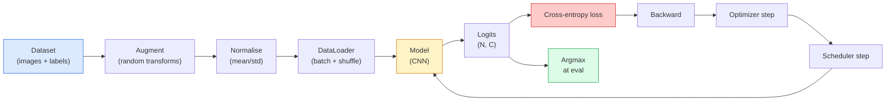

# 图像分类

> 分类器就是一个把像素映射到类别概率分布的函数。剩下的都是管道工程。

**Type:** Build
**Languages:** Python
**Prerequisites:** Phase 2 Lesson 09 (Model Evaluation), Phase 3 Lesson 10 (Mini Framework), Phase 4 Lesson 03 (CNNs)
**Time:** ~75 分钟

## Learning Objectives

- 在 CIFAR-10 上搭建一个端到端图像分类管线：数据集、增强、模型、训练循环、评估。
- 解释每个组件（dataloader、loss、optimizer、scheduler、augmentation）的作用，并预测其中任意一个出错时会如何体现在 loss 曲线上。
- 从零实现 mixup、cutout 和 label smoothing，并说明各自什么时候值得加。
- 读取 confusion matrix 和按类别的 precision / recall 表，定位聚合准确率之外的数据集和模型问题。

## The Problem

几乎所有能上线的视觉任务，最终都能在某种层面上归结为图像分类。检测本质上是在给区域分类。分割本质上是在给像素分类。检索本质上是在按和类别中心的相似度排序。把分类这件事做好 - 数据集循环、增强策略、loss、评估 - 是能迁移到本阶段所有其他任务的核心能力。

大多数分类 bug 不在模型里，而在管道里：归一化坏了、训练集没打乱、增强把标签扭歪了、验证集污染了训练数据、学习率在第 30 个 epoch 后悄悄发散了。一个正确配置下在 CIFAR-10 上能到 93% 的 CNN，换成坏配置后常常只能拿到 70% 到 75%，而且 loss 曲线在整个过程中看起来还挺合理。

这一课要把整条管线手工接起来，这样每个环节都能检查。你不会用 `torchvision.datasets` 里可能藏 bug 的东西。

## The Concept

### 分类管线



这条循环里的每一行都可能藏 bug。Cross-entropy 接收的是原始 logits，不是 softmax 后的输出，所以在 loss 前先写 `model(x).softmax()`，会悄悄算出错误梯度。数据增强只作用于输入，不作用于标签 - mixup 除外，因为它连标签也一起混。`optimizer.zero_grad()` 必须每步都调用一次；不清零会把梯度累积起来，看起来就像学习率疯狂不稳定。每一种 bug 都不会报错，只会把学习曲线压平。

### Cross-entropy、logits 和 softmax

分类器对每张图输出 `C` 个数，叫 logits。做 softmax 以后，它们才会变成概率分布：

```
softmax(z)_i = exp(z_i) / sum_j exp(z_j)
```

Cross-entropy 衡量的是正确类别的负对数概率：

```
CE(z, y) = -log( softmax(z)_y )
        = -z_y + log( sum_j exp(z_j) )
```

右边这个写法是数值上更稳定的形式（log-sum-exp）。PyTorch 的 `nn.CrossEntropyLoss` 把 softmax + NLL 融成了一个算子，并且直接接收原始 logits。你如果先自己做 softmax，几乎一定是在造 bug - 你会算出 log(softmax(softmax(z)))，这是没有意义的量。

### 为什么增强有效

CNN 通过权重共享，对平移有归纳偏置，但并没有对 crop、翻转、颜色抖动或者遮挡的内建不变性。要教会它这些不变性，唯一办法就是给它看会触发这些不变性的像素。训练时的每一个随机变换，本质上都在说：“这两张图标签相同；学会忽略它们之间的差异。”

```
Original crop:  "dog facing left"
Flip:           "dog facing right"       <- same label, different pixels
Rotate(+15):    "dog, slight tilt"
Colour jitter:  "dog in warmer light"
RandomErasing:  "dog with patch missing"
```

规则是：增强必须保留标签。数字上的 cutout 和旋转可能会把 “6” 变成 “9”；这种数据集要用更小的旋转范围，并且选择尊重数字不变性的增强。

### Mixup 和 cutmix

普通增强只变像素，不变 one-hot 标签。**Mixup** 和 **cutmix** 则会同时插值两者。

```
Mixup:
  lambda ~ Beta(a, a)
  x = lambda * x_i + (1 - lambda) * x_j
  y = lambda * y_i + (1 - lambda) * y_j

Cutmix:
  paste a random rectangle of x_j into x_i
  y = area-weighted mix of y_i and y_j
```

它们的作用是：让模型不再死记硬背尖锐的 one-hot 目标，而是学会在类别之间插值。训练 loss 会变高，但测试准确率会变高。对于任何分类器来说，这都是最便宜的鲁棒性升级之一。

### Label smoothing

它和 mixup 很像。你不再拿 `[0, 0, 1, 0, 0]` 去训练，而是拿 `[eps/C, eps/C, 1-eps, eps/C, eps/C]` 这样的软目标，`eps` 取 0.1 这类小值。这样能防止模型输出极端尖锐的 logits，并且几乎不花成本就能改善校准。PyTorch 1.10 起，`nn.CrossEntropyLoss(label_smoothing=0.1)` 已经内建支持。

### 超越准确率的评估

聚合准确率会掩盖不平衡问题。一个 90-10 的二分类器如果永远猜多数类，照样能拿到 90%。真正能告诉你问题在哪儿的工具有：

- **Per-class accuracy** - 每个类别一个数；可以立刻暴露表现差的类别。
- **Confusion matrix** - C x C 网格，行 i 列 j 表示真实类别 i 被预测成 j 的次数；对角线是正确，非对角线就是模型出问题的地方。
- **Top-1 / Top-5** - 正确类别是否落在前 1 个或前 5 个预测里；ImageNet 里像 “Norwich terrier” 和 “Norfolk terrier” 这种类别本来就很像，所以 Top-5 很重要。
- **Calibration（ECE）** - 一个 0.8 置信度的预测，真的有 80% 的概率是对的吗？现代网络普遍过度自信；可以用 temperature scaling 或 label smoothing 修。

```figure
receptive-field
```

## Build It

### 第 1 步：一个确定性的合成数据集

CIFAR-10 是落盘数据。为了让这一课可复现、跑得快，我们先造一个看起来像 CIFAR 的合成数据集 - 32x32 RGB 图像，每个类别都有自己独特的结构，模型必须真的学。后面那条完全一样的管线，直接也能跑到真实 CIFAR-10 上。

```python
import numpy as np
import torch
from torch.utils.data import Dataset


def synthetic_cifar(num_per_class=1000, num_classes=10, seed=0):
    rng = np.random.default_rng(seed)
    X = []
    Y = []
    for c in range(num_classes):
        centre = rng.uniform(0, 1, (3,))
        freq = 2 + c
        for _ in range(num_per_class):
            yy, xx = np.meshgrid(np.linspace(0, 1, 32), np.linspace(0, 1, 32), indexing="ij")
            r = np.sin(xx * freq) * 0.5 + centre[0]
            g = np.cos(yy * freq) * 0.5 + centre[1]
            b = (xx + yy) * 0.5 * centre[2]
            img = np.stack([r, g, b], axis=-1)
            img += rng.normal(0, 0.08, img.shape)
            img = np.clip(img, 0, 1)
            X.append(img.astype(np.float32))
            Y.append(c)
    X = np.stack(X)
    Y = np.array(Y)
    idx = rng.permutation(len(X))
    return X[idx], Y[idx]


class ArrayDataset(Dataset):
    def __init__(self, X, Y, transform=None):
        self.X = X
        self.Y = Y
        self.transform = transform

    def __len__(self):
        return len(self.X)

    def __getitem__(self, i):
        img = self.X[i]
        if self.transform is not None:
            img = self.transform(img)
        img = torch.from_numpy(img).permute(2, 0, 1)
        return img, int(self.Y[i])
```

每个类别都有自己的配色和频率模式，再加高斯噪声，逼模型学信号而不是背像素。十个类别，每类一千张图，最后再打乱。

### 第 2 步：归一化和增强

每条视觉管线都少不了这两个变换。

```python
def standardize(mean, std):
    mean = np.array(mean, dtype=np.float32)
    std = np.array(std, dtype=np.float32)
    def _fn(img):
        return (img - mean) / std
    return _fn


def random_hflip(p=0.5):
    def _fn(img):
        if np.random.random() < p:
            return img[:, ::-1, :].copy()
        return img
    return _fn


def random_crop(pad=4):
    def _fn(img):
        h, w = img.shape[:2]
        padded = np.pad(img, ((pad, pad), (pad, pad), (0, 0)), mode="reflect")
        y = np.random.randint(0, 2 * pad)
        x = np.random.randint(0, 2 * pad)
        return padded[y:y + h, x:x + w, :]
    return _fn


def compose(*fns):
    def _fn(img):
        for fn in fns:
            img = fn(img)
        return img
    return _fn
```

裁剪前要用 reflect pad，不要用零填充，因为黑边会变成模型会学到的无用信号。

### 第 3 步：Mixup

在训练步里把两张图和两个标签一起混。作为 batch transform 实现，这样它和 forward pass 放在一起，而不是塞进 dataset 里。

```python
def mixup_batch(x, y, num_classes, alpha=0.2):
    if alpha <= 0:
        return x, torch.nn.functional.one_hot(y, num_classes).float()
    lam = float(np.random.beta(alpha, alpha))
    idx = torch.randperm(x.size(0), device=x.device)
    x_mixed = lam * x + (1 - lam) * x[idx]
    y_onehot = torch.nn.functional.one_hot(y, num_classes).float()
    y_mixed = lam * y_onehot + (1 - lam) * y_onehot[idx]
    return x_mixed, y_mixed


def soft_cross_entropy(logits, soft_targets):
    log_probs = torch.log_softmax(logits, dim=-1)
    return -(soft_targets * log_probs).sum(dim=-1).mean()
```

`soft_cross_entropy` 是针对 soft-label 分布的 cross-entropy。如果 target 恰好是 one-hot，它就退化成常规形式。

### 第 4 步：训练循环

完整配方：遍历数据一次，每个 batch 只反传一次，每个 epoch 只 step 一次 scheduler。

```python
import torch
import torch.nn as nn
from torch.utils.data import DataLoader
from torch.optim import SGD
from torch.optim.lr_scheduler import CosineAnnealingLR

def train_one_epoch(model, loader, optimizer, device, num_classes, use_mixup=True):
    model.train()
    total, correct, loss_sum = 0, 0, 0.0
    for x, y in loader:
        x, y = x.to(device), y.to(device)
        if use_mixup:
            x_m, y_soft = mixup_batch(x, y, num_classes)
            logits = model(x_m)
            loss = soft_cross_entropy(logits, y_soft)
        else:
            logits = model(x)
            loss = nn.functional.cross_entropy(logits, y, label_smoothing=0.1)
        optimizer.zero_grad()
        loss.backward()
        optimizer.step()
        loss_sum += loss.item() * x.size(0)
        total += x.size(0)
        # 使用 mixup 时，训练准确率和未混合标签 `y` 的匹配只是近似值，
        # 因为模型看到的是 soft target，而不是 y。
        # 把它当成一个粗略的进度信号即可；真正的性能要看 val accuracy。
        with torch.no_grad():
            pred = logits.argmax(dim=-1)
            correct += (pred == y).sum().item()
    return loss_sum / total, correct / total


@torch.no_grad()
def evaluate(model, loader, device, num_classes):
    model.eval()
    total, correct = 0, 0
    loss_sum = 0.0
    cm = torch.zeros(num_classes, num_classes, dtype=torch.long)
    for x, y in loader:
        x, y = x.to(device), y.to(device)
        logits = model(x)
        loss = nn.functional.cross_entropy(logits, y)
        pred = logits.argmax(dim=-1)
        for t, p in zip(y.cpu(), pred.cpu()):
            cm[t, p] += 1
        loss_sum += loss.item() * x.size(0)
        total += x.size(0)
        correct += (pred == y).sum().item()
    return loss_sum / total, correct / total, cm
```

每次写训练循环都要检查的五个不变量：

1. 训练前 `model.train()`，评估前 `model.eval()` - 切换 dropout 和 batchnorm 的行为。
2. `.backward()` 前先 `.zero_grad()`。
3. 累计指标时用 `.item()`，避免计算图一直挂着。
4. 评估时加 `@torch.no_grad()` - 省显存、省时间，也能避免 subtle 的误操作。
5. Argmax 应该对 raw logits 做，而不是对 softmax 做 - 结果一样，操作更少。

### 第 5 步：组合起来

使用上一课里的 `TinyResNet`，训练几个 epoch，再做评估。

```python
from main import synthetic_cifar, ArrayDataset
from main import standardize, random_hflip, random_crop, compose
from main import mixup_batch, soft_cross_entropy
from main import train_one_epoch, evaluate
# TinyResNet comes from the previous lesson (03-cnns-lenet-to-resnet).
# Adjust the import path to wherever you stored the previous lesson's code.
from cnns_lenet_to_resnet import TinyResNet  # example placeholder

X, Y = synthetic_cifar(num_per_class=500)
split = int(0.9 * len(X))
X_train, Y_train = X[:split], Y[:split]
X_val, Y_val = X[split:], Y[split:]

mean = [0.5, 0.5, 0.5]
std = [0.25, 0.25, 0.25]
train_tf = compose(random_hflip(), random_crop(pad=4), standardize(mean, std))
eval_tf = standardize(mean, std)

train_ds = ArrayDataset(X_train, Y_train, transform=train_tf)
val_ds = ArrayDataset(X_val, Y_val, transform=eval_tf)

train_loader = DataLoader(train_ds, batch_size=128, shuffle=True, num_workers=0)
val_loader = DataLoader(val_ds, batch_size=256, shuffle=False, num_workers=0)

device = "cuda" if torch.cuda.is_available() else "cpu"
model = TinyResNet(num_classes=10).to(device)
optimizer = SGD(model.parameters(), lr=0.1, momentum=0.9, weight_decay=5e-4, nesterov=True)
scheduler = CosineAnnealingLR(optimizer, T_max=10)

for epoch in range(10):
    tr_loss, tr_acc = train_one_epoch(model, train_loader, optimizer, device, 10, use_mixup=True)
    va_loss, va_acc, _ = evaluate(model, val_loader, device, 10)
    scheduler.step()
    print(f"epoch {epoch:2d}  lr {scheduler.get_last_lr()[0]:.4f}  "
          f"train {tr_loss:.3f}/{tr_acc:.3f}  val {va_loss:.3f}/{va_acc:.3f}")
```

在这个合成数据集上，五个 epoch 左右就能接近满分验证准确率，这正说明了问题：管线是对的，模型能学会它该学的东西。把数据集换成真实 CIFAR-10，不改任何代码，这套循环也能跑到大约 90%。

### 第 6 步：读 confusion matrix

只有准确率，从来都看不出模型到底哪里坏了。confusion matrix 才能看出来。

```python
def print_confusion(cm, labels=None):
    c = cm.shape[0]
    labels = labels or [str(i) for i in range(c)]
    print(f"{'':>6}" + "".join(f"{l:>5}" for l in labels))
    for i in range(c):
        row = cm[i].tolist()
        print(f"{labels[i]:>6}" + "".join(f"{v:>5}" for v in row))
    print()
    tp = cm.diag().float()
    fp = cm.sum(dim=0).float() - tp
    fn = cm.sum(dim=1).float() - tp
    prec = tp / (tp + fp).clamp_min(1)
    rec = tp / (tp + fn).clamp_min(1)
    f1 = 2 * prec * rec / (prec + rec).clamp_min(1e-9)
    for i in range(c):
        print(f"{labels[i]:>6}  prec {prec[i]:.3f}  rec {rec[i]:.3f}  f1 {f1[i]:.3f}")

_, _, cm = evaluate(model, val_loader, device, 10)
print_confusion(cm)
```

行表示真实类别，列表示预测类别。比如类别 3 和 5 之间出现一团大量的非对角线计数，说明模型总是把这两个类别搞混，这就能指导你做针对性数据收集或者类别专用增强。

## Use It

`torchvision` 已经把上面的东西封装成了惯用组件。真实 CIFAR-10 的完整管线只需要四行外加一个训练循环。

```python
from torchvision.datasets import CIFAR10
from torchvision.transforms import Compose, RandomCrop, RandomHorizontalFlip, ToTensor, Normalize

mean = (0.4914, 0.4822, 0.4465)
std = (0.2470, 0.2435, 0.2616)
train_tf = Compose([
    RandomCrop(32, padding=4, padding_mode="reflect"),
    RandomHorizontalFlip(),
    ToTensor(),
    Normalize(mean, std),
])
eval_tf = Compose([ToTensor(), Normalize(mean, std)])

train_ds = CIFAR10(root="./data", train=True,  download=True, transform=train_tf)
val_ds   = CIFAR10(root="./data", train=False, download=True, transform=eval_tf)
```

要注意两件事：mean/std 是 **数据集专属** 的 - 是根据 CIFAR-10 训练集算出来的，不是 ImageNet；而 reflect pad 是社区默认的裁剪策略。把 ImageNet 统计量直接抄到这里，会偷走你大约 1% 的准确率，而且没人会在有人专门做 profiling 之前发现。

## Ship It

这一课会产出：

- `outputs/prompt-classifier-pipeline-auditor.md` - 一个提示词，用来审计训练脚本是否满足上面那五条不变量，并找出第一个违例。
- `outputs/skill-classification-diagnostics.md` - 一个 skill，给它 confusion matrix 和类别名列表，它会总结每个类别的失败情况，并提出一个最有影响力的修复建议。

## Exercises

1. **（Easy）** 在合成数据集上，把同一个模型分别用和不用 mixup 训练 5 个 epoch。画出两组的 train / val loss。解释为什么 mixup 下 train loss 更高，但 val accuracy 却差不多甚至更好。
2. **（Medium）** 实现 Cutout - 在每张训练图里随机抹掉一个 8x8 方块 - 然后做一组消融：无增强、hflip+crop、hflip+crop+cutout、hflip+crop+mixup。报告每组的验证准确率。
3. **（Hard）** 搭一个 CIFAR-100 管线（100 类，输入大小不变），并把 ResNet-34 的训练结果复现到和公开准确率误差 1% 以内。附加项：扫三个学习率和两个 weight decay，记录到本地 CSV，输出最终的 confusion-matrix-top-confusions 表。

## Key Terms

| Term | What people say | What it actually means |
|------|----------------|------------------------|
| Logits | “原始输出” | 每张图在 softmax 之前的 C 个数；cross-entropy 要的就是它，而不是 softmax 之后的值 |
| Cross-entropy | “那个 loss” | 正确类别负对数概率；把 log-softmax 和 NLL 合在一个稳定算子里 |
| DataLoader | “batch 工具” | 给 dataset 加上 shuffle、batch 和（可选的）多 worker 加载；几乎一半训练 bug 最后都被怪到它头上 |
| Augmentation | “随机变换” | 训练时任何能保住标签的像素级变换；它在教 CNN 学会原本没有的不变性 |
| Mixup / Cutmix | “混两张图” | 把输入和标签一起混，让分类器学连续插值，而不是硬边界 |
| Label smoothing | “更软的目标” | 用 (1-eps, eps/(C-1), ...) 取代 one-hot；改善校准并略微提升准确率 |
| Top-k accuracy | “Top-5” | 正确类别是否出现在概率最高的 k 个预测里；常用于类别本来就模糊的数据集 |
| Confusion matrix | “错误都在哪” | C x C 表，(i, j) 表示真实类别 i 被预测成 j 的次数；对角线是对的，非对角线告诉你该修什么 |

## Further Reading

- [CS231n: Training Neural Networks](https://cs231n.github.io/neural-networks-3/) - 至今仍是单页里最清楚的训练管线讲解
- [Bag of Tricks for Image Classification (He et al., 2019)](https://arxiv.org/abs/1812.01187) - 把很多小技巧合起来，能给 ImageNet 上的 ResNet 带来 3-4% 提升
- [mixup: Beyond Empirical Risk Minimization (Zhang et al., 2017)](https://arxiv.org/abs/1710.09412) - 原始 mixup 论文；三页理论加上很有说服力的实验
- [Why temperature scaling matters (Guo et al., 2017)](https://arxiv.org/abs/1706.04599) - 证明现代网络校准不足，并用一个标量参数把它修好了
