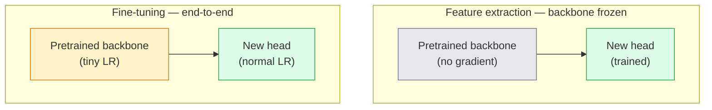

# 迁移学习与微调

> 别人已经花了上百万 GPU 小时教会网络什么是边缘、纹理和物体部件。你应该先借用这些特征，再开始训练自己的模型。

**类型:** 构建
**语言:** Python
**先修:** 第 4 阶段第 03 课（CNNs）, 第 4 阶段第 04 课（Image Classification）
**时长:** ~75 分钟

## 学习目标

- 区分 feature extraction 和 fine-tuning，并根据数据集大小、领域距离和算力预算选对方法。
- 加载一个预训练 backbone，替换分类头，并在 20 行以内只训练头部，跑出一个可用基线。
- 通过 discriminative learning rates 逐步解冻层，让早期的通用特征更新更小，后期的任务特定特征更新更大。
- 诊断三种常见失败：对解冻 block 学习率过高导致 feature drift、小数据集上 BN 统计量崩坏、以及 catastrophic forgetting。

## 问题是什么

在 ImageNet 上训练一个 ResNet-50，大约要花 2000 个 GPU 小时。绝大多数团队没有这个预算去给每个任务都从头训练。现实里，几乎所有团队交付的都是：一个预训练 backbone，加一个在几百到几千张任务图像上训练出来的新 head。

这不是偷懒。任何 ImageNet 训练出来的 CNN，它的第一个 conv block 都会学边缘和类似 Gabor 的滤波器；接下来几个 block 会学纹理和简单图案；中间 block 会学物体部件；最后的 block 会学越来越接近 1000 个 ImageNet 类别的组合。这个层级里的前 90% 几乎可以原封不动地迁移到医学影像、工业检测、卫星数据，以及你能想到的所有其他视觉任务里 - 因为自然图像里边缘和纹理的词汇量是有限的。最后那 10% 才是你真正要训练的部分。

迁移学习里有三个坑等着你：学习率太高把预训练特征毁掉、冻结太多导致模型学不到新信息、以及 BatchNorm 的 running statistics 被带偏到一个网络从没在上面学过的小数据分布。我们会把这三个坑都故意走一遍。

## 核心概念

### Feature extraction 与 fine-tuning

根据你对预训练特征的信任程度，以及你手头有多少数据，分成两种模式。



经验法则：

| Dataset size | Domain distance | Recipe |
|--------------|-----------------|--------|
| < 1k images | close to ImageNet | 冻结 backbone，只训练 head |
| 1k-10k | close | 冻结前 2-3 个 stage，微调剩下的部分 |
| 10k-100k | any | 端到端微调，并使用 discriminative LR |
| 100k+ | far | 全部微调；如果领域足够远，甚至可以考虑从头训练 |

“接近 ImageNet” 大致指自然 RGB 照片，而且内容看起来像物体。医学 CT、俯视卫星图像、显微图像都属于远领域 - 特征依然有帮助，但你需要让更多层去适应。

### 为什么冻结会有用

CNN 在 ImageNet 上学到的特征并不是只针对 1000 个类别。它们是针对自然图像统计规律的：特定方向的边缘、纹理、对比度模式、形状原语。这些统计规律在几乎所有人类能命名的视觉领域里都很稳定。所以，一个在 ImageNet 上训练好的模型，只换一个新的 linear head，直接 zero-shot 到 CIFAR-10，通常也能拿到 80% 以上的准确率。head 学的是：在这些已经学到的特征里，哪些更适合当前任务。

### Discriminative learning rates

当你真的解冻时，早期层应该比后期层训练得更慢。早期层编码的是你想保留的通用特征；后期层编码的是你需要大幅调整的任务特定结构。

```
Typical recipe:

  stage 0 (stem + first group): lr = base_lr / 100    (mostly fixed)
  stage 1:                       lr = base_lr / 10
  stage 2:                       lr = base_lr / 3
  stage 3 (last backbone group): lr = base_lr
  head:                          lr = base_lr  (or slightly higher)
```

在 PyTorch 里，这只是传给 optimizer 的一组参数组。一个模型，五个学习率，没有额外代码。

### BatchNorm 问题

BN 层保存着 `running_mean` 和 `running_var` 缓冲区，这些值是用 ImageNet 统计出来的。如果你的任务分布不同 - 光照不同、传感器不同、颜色空间不同 - 那这些缓冲区就是错的。优先级从高到低有三种处理方式：

1. **Fine-tune 时让 BN 保持 train mode。** 让 BN 连同其他参数一起更新 running statistics。任务数据量中等（>= 5k 样本）时，这是默认选项。
2. **把 BN 冻结在 eval mode。** 保留 ImageNet 统计量，只训练权重。当你的数据集小到 BN 的移动平均会很 noisy 时，这是正确做法。
3. **把 BN 换成 GroupNorm。** 彻底去掉移动平均问题。检测和分割 backbone 里经常用这一招，因为每张卡上的 batch size 太小。

这一步做错了，准确率会悄悄掉 5-15%。

### 头部设计

分类头通常就是 1 到 3 层线性层，加一个可选 dropout。每个 torchvision backbone 都自带一个默认头，你只需要替换它：

```
backbone.fc = nn.Linear(backbone.fc.in_features, num_classes)          # ResNet
backbone.classifier[1] = nn.Linear(..., num_classes)                    # EfficientNet, MobileNet
backbone.heads.head = nn.Linear(..., num_classes)                       # torchvision ViT
```

对于小数据集，一个线性层通常就够了。任务分布离 backbone 的训练分布更远时，加入隐藏层（Linear -> ReLU -> Dropout -> Linear）会更有帮助。

### Layer-wise LR decay

这是现代 fine-tuning 中更平滑的一种 discriminative LR 版本（BEiT、DINOv2、ViT-B fine-tunes 都会用）。它不再按 stage 分组，而是让每一层的学习率都比上一层小一点：

```
lr_layer_k = base_lr * decay^(L - k)
```

当 decay = 0.75、L = 12 个 transformer block 时，第一层的学习率大约只有 head 的 `0.75^11 ≈ 0.04x`。这对 transformer fine-tune 比 CNN 更重要；CNN 里通常按 stage 分组就够了。

### 要看什么指标

迁移学习跑实验时，你需要两个在从零训练里不会额外追踪的数：

- **Pretrained-only accuracy** - backbone 冻结时，head 的准确率。这是你的下限。
- **Fine-tuned accuracy** - 同一个模型端到端微调后的准确率。这是你的上限。

如果 fine-tuned 比 pretrained-only 还差，说明你在学习率或者 BN 上有 bug。两个数都要打印。

## 动手实现

### 第 1 步：加载一个预训练 backbone 并检查它

```python
import torch
import torch.nn as nn
from torchvision.models import resnet18, ResNet18_Weights

backbone = resnet18(weights=ResNet18_Weights.IMAGENET1K_V1)
print(backbone)
print()
print("classifier head:", backbone.fc)
print("feature dim:", backbone.fc.in_features)
```

`ResNet18` 有四个 stage（`layer1..layer4`），外加一个 stem 和一个 `fc` head。每个 torchvision 分类 backbone 都有类似结构。

### 第 2 步：Feature extraction - 冻结全部，只换 head

```python
def make_feature_extractor(num_classes=10):
    model = resnet18(weights=ResNet18_Weights.IMAGENET1K_V1)
    for p in model.parameters():
        p.requires_grad = False
    model.fc = nn.Linear(model.fc.in_features, num_classes)
    return model

model = make_feature_extractor(num_classes=10)
trainable = sum(p.numel() for p in model.parameters() if p.requires_grad)
frozen = sum(p.numel() for p in model.parameters() if not p.requires_grad)
print(f"trainable: {trainable:>10,}")
print(f"frozen:    {frozen:>10,}")
```

只有 `model.fc` 可训练。backbone 是一个冻结的特征提取器。

### 第 3 步：Discriminative fine-tuning

一个工具函数，用来按 stage 生成不同学习率的参数组。

```python
def discriminative_param_groups(model, base_lr=1e-3, decay=0.3):
    stages = [
        ["conv1", "bn1"],
        ["layer1"],
        ["layer2"],
        ["layer3"],
        ["layer4"],
        ["fc"],
    ]
    groups = []
    for i, names in enumerate(stages):
        lr = base_lr * (decay ** (len(stages) - 1 - i))
        params = [p for n, p in model.named_parameters()
                  if any(n.startswith(k) for k in names)]
        if params:
            groups.append({"params": params, "lr": lr, "name": "_".join(names)})
    return groups

model = resnet18(weights=ResNet18_Weights.IMAGENET1K_V1)
model.fc = nn.Linear(model.fc.in_features, 10)
for p in model.parameters():
    p.requires_grad = True

groups = discriminative_param_groups(model)
for g in groups:
    print(f"{g['name']:>10s}  lr={g['lr']:.2e}  params={sum(p.numel() for p in g['params']):>8,}")
```

`decay=0.3` 的意思是每个 stage 的训练速率都是下一个 stage 的 30%。`fc` 用 `base_lr`，`layer4` 用 `0.3 * base_lr`，`conv1` 用 `0.3^5 * base_lr ≈ 0.00243 * base_lr`。看起来很极端，但实测有效。

### 第 4 步：BatchNorm 处理

一个冻结 BN running statistics、但不冻结权重的辅助函数。

```python
def freeze_bn_stats(model):
    for m in model.modules():
        if isinstance(m, (nn.BatchNorm1d, nn.BatchNorm2d, nn.BatchNorm3d)):
            m.eval()
            for p in m.parameters():
                p.requires_grad = False
    return model
```

每个 epoch 开始时，在调用 `model.train()` 之后再调用它。`model.train()` 会把所有东西切回训练模式；这个函数只把 BN 层单独改回去。

### 第 5 步：一个最小的端到端微调循环

```python
from torch.optim import SGD
from torch.utils.data import DataLoader
from torch.optim.lr_scheduler import CosineAnnealingLR
import torch.nn.functional as F

def fine_tune(model, train_loader, val_loader, device, epochs=5, base_lr=1e-3, freeze_bn=False):
    model = model.to(device)
    groups = discriminative_param_groups(model, base_lr=base_lr)
    optimizer = SGD(groups, momentum=0.9, weight_decay=1e-4, nesterov=True)
    scheduler = CosineAnnealingLR(optimizer, T_max=epochs)

    for epoch in range(epochs):
        model.train()
        if freeze_bn:
            freeze_bn_stats(model)
        tr_loss, tr_correct, tr_total = 0.0, 0, 0
        for x, y in train_loader:
            x, y = x.to(device), y.to(device)
            logits = model(x)
            loss = F.cross_entropy(logits, y, label_smoothing=0.1)
            optimizer.zero_grad()
            loss.backward()
            optimizer.step()
            tr_loss += loss.item() * x.size(0)
            tr_total += x.size(0)
            tr_correct += (logits.argmax(-1) == y).sum().item()
        scheduler.step()

        model.eval()
        va_total, va_correct = 0, 0
        with torch.no_grad():
            for x, y in val_loader:
                x, y = x.to(device), y.to(device)
                pred = model(x).argmax(-1)
                va_total += x.size(0)
                va_correct += (pred == y).sum().item()
        print(f"epoch {epoch}  train {tr_loss/tr_total:.3f}/{tr_correct/tr_total:.3f}  "
              f"val {va_correct/va_total:.3f}")
    return model
```

按上面的配方，在 CIFAR-10 上跑 5 个 epoch，`ResNet18-IMAGENET1K_V1` 可以从大约 70% 的 zero-shot linear-probe accuracy 提升到大约 93% 的 fine-tuned accuracy。只训练 head 的话，通常会卡在 86% 左右，而 backbone 一直没动。

### 第 6 步：渐进式解冻

一种从后往前、每个 epoch 解冻一组层的 schedule。它能减少 feature drift，但要多花一点 epoch。

```python
def progressive_unfreeze_schedule(model):
    stages = ["layer4", "layer3", "layer2", "layer1"]
    yielded = set()

    def start():
        for p in model.parameters():
            p.requires_grad = False
        for p in model.fc.parameters():
            p.requires_grad = True

    def unfreeze(epoch):
        if epoch < len(stages):
            name = stages[epoch]
            yielded.add(name)
            for n, p in model.named_parameters():
                if n.startswith(name):
                    p.requires_grad = True
            return name
        return None

    return start, unfreeze
```

在第一个 epoch 前调用一次 `start()`。每个 epoch 开头调用 `unfreeze(epoch)`。当可训练参数集合变化时，记得重建 optimizer；否则被冻结参数里缓存的 moment 还在，会把它搞乱。

## 使用方式

对大多数真实任务来说，`torchvision.models` 加三行就够了。上面这些更重的机制，只有在你碰到库默认值解决不了的问题时才有价值。

```python
from torchvision.models import resnet50, ResNet50_Weights

model = resnet50(weights=ResNet50_Weights.IMAGENET1K_V2)
model.fc = nn.Linear(model.fc.in_features, num_classes)
optimizer = torch.optim.AdamW(model.parameters(), lr=1e-4, weight_decay=1e-4)
```

另外两个生产级默认值：

- `timm` 提供了大约 800 个预训练视觉 backbone，API 也统一（`timm.create_model("resnet50", pretrained=True, num_classes=10)`）。只要你的 fine-tune 超出 torchvision 自带 zoo，`timm` 就是标准选择。
- 对 transformer 来说，`transformers.AutoModelForImageClassification.from_pretrained(name, num_labels=N)` 会给你 ViT / BEiT / DeiT，加载语义和文本模型一样。

## 交付物

这一课会产出：

- `outputs/prompt-fine-tune-planner.md` - 一个提示词，根据数据集大小、领域距离和算力预算，在 feature extraction、progressive fine-tuning 和 end-to-end fine-tuning 之间做选择。
- `outputs/skill-freeze-inspector.md` - 一个 skill，给它一个 PyTorch 模型，就能报告哪些参数是可训练的、哪些 BatchNorm 层处于 eval mode，以及 optimizer 是否真的拿到了可训练参数。

## 练习

1. **（Easy）** 在同一个 synthetic-CIFAR 数据集上，把 `ResNet18` 分别当作线性探针（backbone 冻结）和全量 fine-tune 训练。把两个准确率并排报出来。解释哪个差距说明特征迁移得很好，哪个差距说明它没有。
2. **（Medium）** 故意引入一个 bug：把 backbone stage 的 `base_lr` 设成 `1e-1`，而不是 head 的学习率。展示训练 loss 如何爆炸，然后用 `discriminative_param_groups` 把它救回来。记录每个 stage 从哪个学习率开始发散。
3. **（Hard）** 取一个医学影像数据集（例如 CheXpert-small、PatchCamelyon 或 HAM10000），比较三种模式：(a) ImageNet 预训练 + 冻结 backbone + linear head；(b) ImageNet 预训练 + 端到端 fine-tune；(c) 从头训练。报告每种模式的准确率和算力成本。数据量多大时，从头训练才开始有竞争力？

## 关键术语

| Term | 常见说法 | 实际含义 |
|------|----------|----------|
| Feature extraction | “冻结 backbone，只训 head” | backbone 参数冻结，只有新的 classifier head 接收梯度 |
| Fine-tuning | “端到端重训” | 所有参数都可训练，通常学习率比从头训练小得多 |
| Discriminative LR | “早期层更小的 LR” | optimizer 里按参数组设置不同学习率，早期 stage 的 LR 只是后期的一部分 |
| Layer-wise LR decay | “平滑的 LR 梯度” | 每层学习率乘上 decay^(L - k)；transformer fine-tune 里很常见 |
| Catastrophic forgetting | “模型把 ImageNet 忘了” | 学习率太高，把预训练特征在新任务信号来得及稳定之前就覆盖掉了 |
| BN statistics drift | “running mean 错了” | BatchNorm 的 running_mean / var 是按另一种分布算的，静默地伤害准确率 |
| Linear probe | “冻结 backbone + 线性头” | 对预训练特征的评估 - 冻结表示上最佳线性分类器的准确率 |
| Catastrophic collapse | “全都预测成一个类” | fine-tune 时 LR 太高，特征被毁掉，head 的梯度还没稳住就塌了 |

## 延伸阅读

- [How transferable are features in deep neural networks? (Yosinski et al., 2014)](https://arxiv.org/abs/1411.1792) - 量化各层特征可迁移性的论文
- [Universal Language Model Fine-tuning (ULMFiT, Howard & Ruder, 2018)](https://arxiv.org/abs/1801.06146) - 原始的 discriminative LR / progressive unfreezing 配方；这些想法可以直接迁移到视觉
- [timm documentation](https://huggingface.co/docs/timm) - 现代视觉 backbone 和它们 fine-tune 默认值的参考
- [A Simple Framework for Linear-Probe Evaluation (Kornblith et al., 2019)](https://arxiv.org/abs/1805.08974) - 为什么 linear-probe accuracy 很重要，以及该怎么正确报告
