# 目标检测：从零实现 YOLO

> 检测本质上就是分类加回归，只不过是在特征图的每个位置都做一次，然后再用非极大值抑制清理重复框。

**Type:** Build
**Languages:** Python
**Prerequisites:** Phase 4 Lesson 03 (CNNs), Phase 4 Lesson 04 (Image Classification), Phase 4 Lesson 05 (Transfer Learning)
**Time:** ~75 分钟

## Learning Objectives

- 解释 grid + anchor 的设计如何把检测变成稠密预测问题，并说清输出张量里每个数字分别代表什么。
- 计算框之间的 Intersection-over-Union，并从零实现 non-maximum suppression。
- 在一个预训练 backbone 上搭出一个最小 YOLO 风格 head，包括分类、objectness 和框回归损失。
- 读懂检测指标行（precision@0.5、recall、mAP@0.5、mAP@0.5:0.95），并判断下一步该调哪个旋钮。

## The Problem

分类是在说“这张图里有一只狗”。检测是在说“像素 (112, 40, 280, 210) 这里有一只狗，(400, 180, 560, 310) 这里有一只猫，画面里没有别的东西”。这种结构上的变化 - 预测的是一组带标签的框，而不是每张图一个标签 - 正是所有自动驾驶系统、监控产品、文档版面解析器和工厂视觉产线依赖的东西。

检测也是视觉里所有工程取舍同时出现的地方。你要框准（回归头），你要每个框的类别对（分类头），你要模型知道什么时候什么都不该报（objectness 分数），你还要每个真实物体只出一个预测（non-maximum suppression）。少了其中任何一个，管线就会漏掉物体、报出幻觉框，或者把同一个物体重复预测十五遍，只是位置略有不同。

YOLO（You Only Look Once，Redmon 等，2016）是第一个把这一切用一次卷积网络前向传播就跑到实时的设计，而今天现代检测器（YOLOv8、YOLOv9、YOLO-NAS、RT-DETR）沿用的，依然是同样的结构思路。学会核心之后，后面的所有变体都只是对同一套零件的重新排列。

## The Concept

### 把检测看成稠密预测

分类器每张图输出 C 个数。YOLO 风格的检测器每张图输出 `(S x S x (5 + C))` 个数，其中 S 是空间网格尺寸。

```mermaid
flowchart LR
    IMG["Input 416x416 RGB"] --> BB["Backbone<br/>(ResNet, DarkNet, ...)"]
    BB --> FM["Feature map<br/>(C_feat, 13, 13)"]
    FM --> HEAD["Detection head<br/>(1x1 convs)"]
    HEAD --> OUT["Output tensor<br/>(13, 13, B * (5 + C))"]
    OUT --> DEC["Decode<br/>(grid + sigmoid + exp)"]
    DEC --> NMS["Non-max suppression"]
    NMS --> RESULT["Final boxes"]

    style IMG fill:#dbeafe,stroke:#2563eb
    style HEAD fill:#fef3c7,stroke:#d97706
    style NMS fill:#fecaca,stroke:#dc2626
    style RESULT fill:#dcfce7,stroke:#16a34a
```



每个 `S * S` 网格单元会预测 `B` 个框。每个框包含：

- 4 个表示几何的数：`tx, ty, tw, th`。
- 1 个 objectness 分数：“这个单元中心是不是有物体？”
- C 个类别概率。

每个单元的总数就是 `B * (5 + C)`。以 VOC 为例，`S=13, B=2, C=20` 时，每个单元一共 50 个数。

### 为什么要 grid 和 anchor

如果直接做回归，模型会为每个物体预测绝对坐标 `(x, y, w, h)`。这对卷积网络来说很难，因为图像平移时，所有预测也不该跟着一起平移；每个物体都应该锚定在某个空间位置上。grid 的做法是：把每个 ground-truth 框分配给中心落入其中的那个网格单元，只有这个单元负责这个物体。

anchor 解决的是第二个问题。一层 3x3 卷积不可能轻易从 16 像素感受野的特征单元里回归出一个 500 像素宽的框。于是我们先给每个单元预定义 `B` 个 prior box 形状（anchors），再让模型预测相对这些 anchor 的小偏移。模型学的是选对 anchor，再做小幅修正，而不是从零开始回归。

```
Anchor box priors (example for 416x416 input):

  small:   (30,  60)
  medium:  (75,  170)
  large:   (200, 380)

At each grid cell, every anchor emits (tx, ty, tw, th, obj, c_1, ..., c_C).
```

现代检测器常会用 FPN，在不同分辨率上使用不同的 anchor 集合 - 浅层高分辨率特征图用小 anchor，深层低分辨率特征图用大 anchor。思路一样，只是尺度更多。

### 解码预测

原始的 `tx, ty, tw, th` 不是框坐标，而是要在绘图前转换的回归目标：

```
centre x  = (sigmoid(tx) + cell_x) * stride
centre y  = (sigmoid(ty) + cell_y) * stride
width     = anchor_w * exp(tw)
height    = anchor_h * exp(th)
```

`sigmoid` 把中心偏移限制在单元内部。`exp` 让宽高可以相对 anchor 自由缩放而不会翻成负值。`stride` 把网格坐标重新映射回像素。这个解码步骤从 v2 之后的每个 YOLO 版本都一样。

### IoU

检测里两个框之间通用的相似度指标：

```
IoU(A, B) = area(A intersect B) / area(A union B)
```

IoU = 1 表示完全一致；IoU = 0 表示没有重叠。预测框和 ground-truth 框之间的 IoU，决定了一个预测能不能算 true positive（通常要求 IoU >= 0.5）。预测和预测之间的 IoU，则是 NMS 用来去重的依据。

### Non-maximum suppression

用卷积网络训练出来的相邻 anchor，常常会对同一个物体预测出多个重叠框。NMS 会保留置信度最高的那个预测，并删掉所有 IoU 超过阈值的其他预测。

```
NMS(boxes, scores, iou_threshold):
    sort boxes by score descending
    keep = []
    while boxes not empty:
        pick the top-scoring box, add to keep
        remove every box with IoU > iou_threshold to the picked box
    return keep
```

常见阈值是 0.45。最近的检测器会用 `soft-NMS`、`DIoU-NMS`，或者直接让模型学会抑制（RT-DETR），但这个步骤的结构目的始终不变。

### Loss

YOLO 的 loss 是三个 loss 加权之后的结果：

```
L = lambda_coord * L_box(pred, target, where obj=1)
  + lambda_obj   * L_obj(pred, 1,     where obj=1)
  + lambda_noobj * L_obj(pred, 0,     where obj=0)
  + lambda_cls   * L_cls(pred, target, where obj=1)
```

只有包含物体的单元才会参与框回归和分类 loss。没有物体的单元只贡献 objectness loss（教模型保持安静）。`lambda_noobj` 通常会设得比较小（大约 0.5），因为绝大多数单元都是空的，否则它们会在总 loss 里占主导。

现代变体会把 MSE 框损失换成 CIoU / DIoU（直接优化 IoU），在类别不平衡上用 focal loss，并用 quality focal loss 平衡 objectness。三部分结构不变。

### 检测指标

Accuracy 不适用于检测。真正有用的四个数是：

- **Precision@IoU=0.5** - 在被算作 positive 的预测里，有多少是真的对的。
- **Recall@IoU=0.5** - 在所有真实物体里，我们找到了多少。
- **AP@0.5** - 在 IoU 阈值 0.5 下的 precision-recall 曲线面积；每个类别一个数。
- **mAP@0.5:0.95** - 在 IoU 阈值 0.5、0.55、...、0.95 下 AP 的平均值。COCO 指标；最严格，也最有信息量。

这四个都要报。如果一个 detector 在 mAP@0.5 上很强，但在 mAP@0.5:0.95 上很弱，说明它大概找到了位置，但框得不够紧；这时应该改进 box-regression loss。一个 detector 如果 precision 高、recall 低，说明它太保守；要降低 confidence threshold，或者提高 objectness 权重。

## Build It

### 第 1 步：IoU

这一课的核心工具。它处理的是 `(x1, y1, x2, y2)` 格式的两个框数组。

```python
import numpy as np

def box_iou(boxes_a, boxes_b):
    ax1, ay1, ax2, ay2 = boxes_a[:, 0], boxes_a[:, 1], boxes_a[:, 2], boxes_a[:, 3]
    bx1, by1, bx2, by2 = boxes_b[:, 0], boxes_b[:, 1], boxes_b[:, 2], boxes_b[:, 3]

    inter_x1 = np.maximum(ax1[:, None], bx1[None, :])
    inter_y1 = np.maximum(ay1[:, None], by1[None, :])
    inter_x2 = np.minimum(ax2[:, None], bx2[None, :])
    inter_y2 = np.minimum(ay2[:, None], by2[None, :])

    inter_w = np.clip(inter_x2 - inter_x1, 0, None)
    inter_h = np.clip(inter_y2 - inter_y1, 0, None)
    inter = inter_w * inter_h

    area_a = (ax2 - ax1) * (ay2 - ay1)
    area_b = (bx2 - bx1) * (by2 - by1)
    union = area_a[:, None] + area_b[None, :] - inter
    return inter / np.clip(union, 1e-8, None)
```

返回的是一个 `(N_a, N_b)` 的 pairwise IoU 矩阵。要和单个 ground-truth 框比较时，把其中一个数组做成 `(1, 4)` 形状就行。

### 第 2 步：Non-max suppression

```python
def nms(boxes, scores, iou_threshold=0.45):
    order = np.argsort(-scores)
    keep = []
    while len(order) > 0:
        i = order[0]
        keep.append(i)
        if len(order) == 1:
            break
        rest = order[1:]
        ious = box_iou(boxes[[i]], boxes[rest])[0]
        order = rest[ious <= iou_threshold]
    return np.array(keep, dtype=np.int64)
```

确定性，排序部分是 `O(N log N)`，和输入相同时，行为与 `torchvision.ops.nms` 一致。

### 第 3 步：框编码和解码

把像素坐标和网络实际回归的 `(tx, ty, tw, th)` 目标互相转换。

```python
def encode(box_xyxy, cell_x, cell_y, stride, anchor_wh):
    x1, y1, x2, y2 = box_xyxy
    cx = 0.5 * (x1 + x2)
    cy = 0.5 * (y1 + y2)
    w = x2 - x1
    h = y2 - y1
    tx = cx / stride - cell_x
    ty = cy / stride - cell_y
    tw = np.log(w / anchor_wh[0] + 1e-8)
    th = np.log(h / anchor_wh[1] + 1e-8)
    return np.array([tx, ty, tw, th])


def decode(tx_ty_tw_th, cell_x, cell_y, stride, anchor_wh):
    tx, ty, tw, th = tx_ty_tw_th
    cx = (sigmoid(tx) + cell_x) * stride
    cy = (sigmoid(ty) + cell_y) * stride
    w = anchor_wh[0] * np.exp(tw)
    h = anchor_wh[1] * np.exp(th)
    return np.array([cx - w / 2, cy - h / 2, cx + w / 2, cy + h / 2])


def sigmoid(x):
    return 1.0 / (1.0 + np.exp(-x))
```

测试方法：先 encode 一个框，再 decode 回去 - 你应该能得到和原框非常接近的结果（只要 `tx` 不处在 sigmoid 之后的完美可逆范围里，就不会完全一模一样）。

### 第 4 步：一个最小 YOLO head

在特征图上做一个 1x1 卷积，然后 reshape 成 `(B, S, S, num_anchors, 5 + C)`。

```python
import torch
import torch.nn as nn

class YOLOHead(nn.Module):
    def __init__(self, in_c, num_anchors, num_classes):
        super().__init__()
        self.num_anchors = num_anchors
        self.num_classes = num_classes
        self.conv = nn.Conv2d(in_c, num_anchors * (5 + num_classes), kernel_size=1)

    def forward(self, x):
        n, _, h, w = x.shape
        y = self.conv(x)
        y = y.view(n, self.num_anchors, 5 + self.num_classes, h, w)
        y = y.permute(0, 3, 4, 1, 2).contiguous()
        return y
```

输出形状是 `(N, H, W, num_anchors, 5 + C)`。最后一维包含 `[tx, ty, tw, th, obj, cls_0, ..., cls_{C-1}]`。

### 第 5 步：ground-truth 分配

对每个 ground-truth 框，决定由哪个 `(cell, anchor)` 负责。

```python
def assign_targets(boxes_xyxy, classes, anchors, stride, grid_size, num_classes):
    num_anchors = len(anchors)
    target = np.zeros((grid_size, grid_size, num_anchors, 5 + num_classes), dtype=np.float32)
    has_obj = np.zeros((grid_size, grid_size, num_anchors), dtype=bool)

    for box, cls in zip(boxes_xyxy, classes):
        x1, y1, x2, y2 = box
        cx, cy = 0.5 * (x1 + x2), 0.5 * (y1 + y2)
        gx, gy = int(cx / stride), int(cy / stride)
        bw, bh = x2 - x1, y2 - y1

        ious = np.array([
            (min(bw, aw) * min(bh, ah)) / (bw * bh + aw * ah - min(bw, aw) * min(bh, ah))
            for aw, ah in anchors
        ])
        best = int(np.argmax(ious))
        aw, ah = anchors[best]

        target[gy, gx, best, 0] = cx / stride - gx
        target[gy, gx, best, 1] = cy / stride - gy
        target[gy, gx, best, 2] = np.log(bw / aw + 1e-8)
        target[gy, gx, best, 3] = np.log(bh / ah + 1e-8)
        target[gy, gx, best, 4] = 1.0
        target[gy, gx, best, 5 + cls] = 1.0
        has_obj[gy, gx, best] = True
    return target, has_obj
```

anchor 的选择规则是“和 ground truth 形状 IoU 最好的那个” - 这是一种便宜的近似，和 YOLOv2/v3 的分配方式一致。v5 及之后版本用的是更复杂的策略（task-aligned matching、dynamic k），但本质上还是对这个思路的改良。

### 第 6 步：三个 loss

```python
def yolo_loss(pred, target, has_obj, lambda_coord=5.0, lambda_obj=1.0, lambda_noobj=0.5, lambda_cls=1.0):
    has_obj_t = torch.from_numpy(has_obj).bool()
    target_t = torch.from_numpy(target).float()

    # box-regression loss: only on cells with objects
    box_pred = pred[..., :4][has_obj_t]
    box_true = target_t[..., :4][has_obj_t]
    loss_box = torch.nn.functional.mse_loss(box_pred, box_true, reduction="sum")

    # objectness loss
    obj_pred = pred[..., 4]
    obj_true = target_t[..., 4]
    loss_obj_pos = torch.nn.functional.binary_cross_entropy_with_logits(
        obj_pred[has_obj_t], obj_true[has_obj_t], reduction="sum")
    loss_obj_neg = torch.nn.functional.binary_cross_entropy_with_logits(
        obj_pred[~has_obj_t], obj_true[~has_obj_t], reduction="sum")

    # classification loss on cells with objects
    cls_pred = pred[..., 5:][has_obj_t]
    cls_true = target_t[..., 5:][has_obj_t]
    loss_cls = torch.nn.functional.binary_cross_entropy_with_logits(
        cls_pred, cls_true, reduction="sum")

    total = (lambda_coord * loss_box
             + lambda_obj * loss_obj_pos
             + lambda_noobj * loss_obj_neg
             + lambda_cls * loss_cls)
    return total, {"box": loss_box.item(), "obj_pos": loss_obj_pos.item(),
                   "obj_neg": loss_obj_neg.item(), "cls": loss_cls.item()}
```

五个超参数，几乎每个 YOLO 教程都不是写死就是扫过。比例很关键：`lambda_coord=5, lambda_noobj=0.5` 就是原始 YOLOv1 的设定，现在也仍然是个不错的默认值。

### 第 7 步：推理管线

把原始 head 输出解码、做 sigmoid / exp 转换、按 objectness 设阈值，再做 NMS。

```python
def postprocess(pred_tensor, anchors, stride, img_size, conf_threshold=0.25, iou_threshold=0.45):
    pred = pred_tensor.detach().cpu().numpy()
    grid_h, grid_w = pred.shape[1], pred.shape[2]
    num_anchors = len(anchors)

    boxes, scores, classes = [], [], []
    for gy in range(grid_h):
        for gx in range(grid_w):
            for a in range(num_anchors):
                tx, ty, tw, th, obj, *cls = pred[0, gy, gx, a]
                score = sigmoid(obj) * sigmoid(np.array(cls)).max()
                if score < conf_threshold:
                    continue
                cls_idx = int(np.argmax(cls))
                cx = (sigmoid(tx) + gx) * stride
                cy = (sigmoid(ty) + gy) * stride
                w = anchors[a][0] * np.exp(tw)
                h = anchors[a][1] * np.exp(th)
                boxes.append([cx - w / 2, cy - h / 2, cx + w / 2, cy + h / 2])
                scores.append(float(score))
                classes.append(cls_idx)

    if not boxes:
        return np.zeros((0, 4)), np.zeros((0,)), np.zeros((0,), dtype=int)
    boxes = np.array(boxes)
    scores = np.array(scores)
    classes = np.array(classes)
    keep = nms(boxes, scores, iou_threshold)
    return boxes[keep], scores[keep], classes[keep]
```

这就是完整的评估路径：head -> decode -> threshold -> NMS。

## Use It

`torchvision.models.detection` 已经给你提供了生产级 detector，概念结构和上面完全一致。加载一个预训练模型只要三行。

```python
import torch
from torchvision.models.detection import fasterrcnn_resnet50_fpn_v2

model = fasterrcnn_resnet50_fpn_v2(weights="DEFAULT")
model.eval()
with torch.no_grad():
    predictions = model([torch.randn(3, 400, 600)])
print(predictions[0].keys())
print(f"boxes:  {predictions[0]['boxes'].shape}")
print(f"scores: {predictions[0]['scores'].shape}")
print(f"labels: {predictions[0]['labels'].shape}")
```

对于实时推理管线，`ultralytics`（YOLOv8/v9）是标准选择：`from ultralytics import YOLO; model = YOLO('yolov8n.pt'); model(img)`。模型内部会处理解码和 NMS，并返回你在上面自己搭出来的同样三元组：`boxes / scores / labels`。

## Ship It

这一课会产出：

- `outputs/prompt-detection-metric-reader.md` - 一个提示词，把 `precision, recall, AP, mAP@0.5:0.95` 这一行转成一句诊断，再给出下一步最有用的实验。
- `outputs/skill-anchor-designer.md` - 一个 skill，给它 ground-truth box 数据集，它会对 `(w, h)` 做 k-means，返回每个 FPN 层的 anchor 集合，以及帮你决定 anchor 数量所需的覆盖统计。

## Exercises

1. **（Easy）** 实现 `box_iou`，并拿它和 `torchvision.ops.box_iou` 在 1000 对随机 box 上对比。验证最大绝对误差小于 `1e-6`。
2. **（Medium）** 把 `yolo_loss` 改成使用 `CIoU` 框损失，而不是 MSE。用一个 100 张图的合成数据集说明：在相同 epoch 数下，CIoU 收敛出的最终 mAP@0.5:0.95 比 MSE 更好。
3. **（Hard）** 实现多尺度推理：把同一张图以三种分辨率送进模型，合并所有框预测，最后只做一次 NMS。和单尺度推理相比，在留出的验证集上测 mAP 提升。

## Key Terms

| Term | What people say | What it actually means |
|------|----------------|------------------------|
| Anchor | “框先验” | 预先定义好的框形状，模型在每个网格单元上预测的是偏移量，而不是绝对坐标 |
| IoU | “重叠度” | 两个框的 intersection-over-union；检测里通用的相似度指标 |
| NMS | “去重” | 贪心算法，保留最高分预测，删除所有超过阈值的重叠框 |
| Objectness | “这里有没有东西” | 每个 anchor、每个网格单元的标量，预测这个单元中心有没有物体 |
| Grid stride | “下采样倍数” | 每个网格单元对应多少像素；416 像素输入、13 网格头时 stride 是 32 |
| mAP | “平均准确率” | precision-recall 曲线面积的平均值，再对类别和（COCO 下的）IoU 阈值求平均 |
| AP@0.5 | “PASCAL VOC AP” | IoU 阈值 0.5 下的 average precision；这个指标比较宽松 |
| mAP@0.5:0.95 | “COCO AP” | 在 IoU 0.5..0.95、步长 0.05 上取平均；更严格，也是当前社区标准 |

## Further Reading

- [YOLOv1: You Only Look Once (Redmon et al., 2016)](https://arxiv.org/abs/1506.02640) - 奠基论文；后面的每个 YOLO 都是在这个结构上迭代
- [YOLOv3 (Redmon & Farhadi, 2018)](https://arxiv.org/abs/1804.02767) - 引入多尺度 FPN 风格 head 的论文；到今天仍是最清楚的图
- [Ultralytics YOLOv8 docs](https://docs.ultralytics.com) - 当前生产参考；包括数据集格式、增强、训练配方
- [The Illustrated Guide to Object Detection (Jonathan Hui)](https://jonathan-hui.medium.com/object-detection-series-24d03a12f904) - 最好的纯英文口语版全景导览；理解 DETR、RetinaNet、FCOS 和 YOLO 之间关系的无价资料
