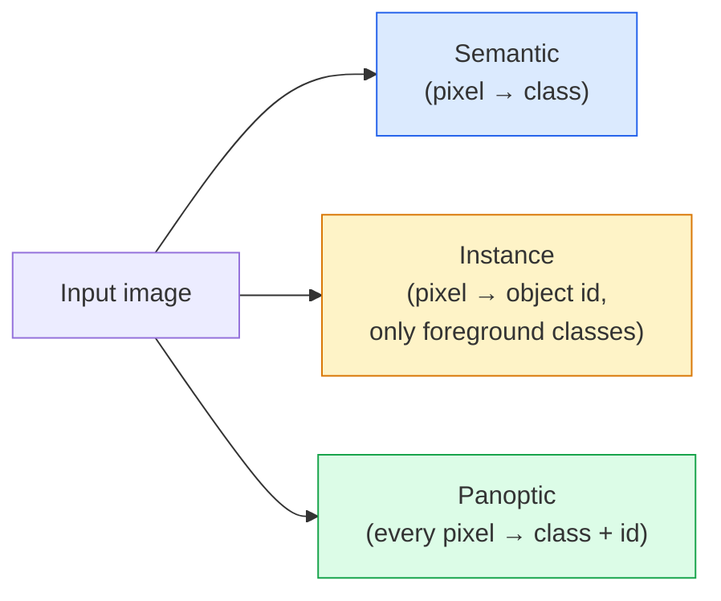
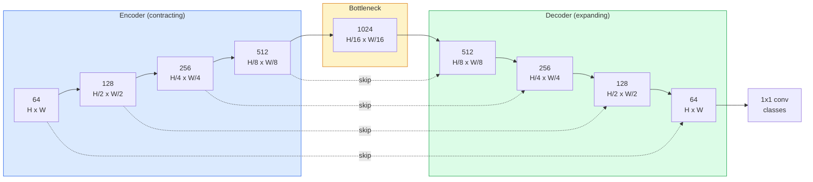

# 语义分割：U-Net

> 分割本质上就是对每个像素做分类。U-Net 之所以能成，是因为它把一个下采样 encoder 和一个上采样 decoder 配在一起，并在它们之间用 skip connection 连接起来。

**Type:** Build
**Languages:** Python
**Prerequisites:** Phase 4 Lesson 03 (CNNs), Phase 4 Lesson 04 (Image Classification)
**Time:** ~75 分钟

## Learning Objectives

- 区分语义分割、实例分割和全景分割，并为给定问题选择正确任务。
- 从零在 PyTorch 中搭建一个 U-Net：encoder block、bottleneck、带转置卷积的 decoder，以及 skip connection。
- 实现逐像素 cross-entropy、Dice loss，以及当前医学和工业分割里常用的组合 loss。
- 读取按类别的 IoU 和 Dice 指标，判断差分数是来自小目标召回、边界精度，还是类别不平衡。

## The Problem

分类是每张图一个标签。检测是每张图几个框。分割是每张图每个像素一个标签。对于大小为 `H x W` 的输入，输出要么是 `H x W` 形状的张量（语义分割），要么是 `H x W x N_instances`（实例分割）。这意味着每张图不是一个预测，而是成百上百万个预测。

分割之所以支撑了几乎所有稠密预测视觉产品，是因为它要解决的是那些必须知道精确轮廓的任务：医学影像（肿瘤掩膜）、自动驾驶（道路、车道、障碍物）、卫星图像（建筑轮廓、农作物边界）、文档解析（版面区域）、机器人（可抓取区域）。这些任务没有一个能靠给物体画个框就解决，它们都需要精确轮廓。

这个架构问题说起来简单，做起来并不简单：你既要网络看到图像的全局上下文（这是什么场景），又要它保留局部像素细节（到底哪个像素是道路，哪个是人行道）。标准 CNN 会通过压缩空间来换上下文，但这样会丢细节。U-Net 就是第一个把两者都拿到的设计。

## The Concept

### 语义、实例、全景分割



- **Semantic** 说的是“这个像素是道路，那个像素是车”。挨着的两辆车会被合成一个连通块。
- **Instance** 说的是“这个像素属于第 3 辆车，那个像素属于第 5 辆车”。它会忽略背景类（stuff = 天空、道路、草地）。
- **Panoptic** 把两者统一起来：每个像素都有类别，每个实例都有唯一 id，stuff 和 things 都被分割。

这一课讲的是语义分割。下一课（Mask R-CNN）讲实例分割。

### U-Net 的形状



encoder 会四次把空间分辨率减半，同时把通道数翻倍。decoder 则反过来：四次把空间分辨率翻倍，同时把通道数减半。skip connection 会在每个分辨率上，把对应的 encoder 特征和 decoder 特征 concat 到一起。最后的 1x1 conv 把 `64 -> num_classes`，输出回到原始分辨率。

skip connection 必不可少的原因是：decoder 到输出像素级预测时，看到的只剩小特征图了。如果没有 skip，它就无法准确定位边缘，因为那些信息在 encoder 里已经被压缩掉了。skip connection 把 encoder 下采样时算出来的高分辨率特征图直接送回给它。

### 转置卷积 vs 双线性上采样

decoder 必须扩展空间维度。有两种选择：

- **Transposed convolution**（`nn.ConvTranspose2d`） - 可学习上采样。是历史上的 U-Net 默认做法。但如果 stride 和 kernel size 配得不合适，容易产生 checkerboard artifact。
- **Bilinear upsample + 3x3 conv** - 先平滑上采样，再接卷积。artifact 更少，参数更少，现在是更常见的默认做法。

两种都能在实际中见到。对第一个 U-Net 来说，bilinear 更稳妥。

### 像素网格上的 cross-entropy

对于 C 类语义分割，模型输出是 `(N, C, H, W)`。target 是 `(N, H, W)` 的整数类别 id。cross-entropy 和分类时完全一样，只是应用在每个空间位置上：

```
Loss = mean over (n, h, w) of -log( softmax(logits[n, :, h, w])[target[n, h, w]] )
```

PyTorch 的 `F.cross_entropy` 原生支持这种形状，不需要 reshape。

### 为什么需要 Dice loss

Cross-entropy 对每个像素一视同仁。当某个类别在画面里占比极小的时候，这就错了（医学影像里很常见：99% 背景，1% 肿瘤）。网络只要整张图都预测背景，就能拿到 99% accuracy，但一点用都没有。

Dice loss 通过直接优化预测掩膜和真实掩膜的重叠来解决这个问题：

```
Dice(p, y) = 2 * sum(p * y) / (sum(p) + sum(y) + epsilon)
Dice_loss = 1 - Dice
```

其中 `p` 是该类别的 sigmoid / softmax 概率图，`y` 是二值 ground-truth mask。只有重叠完全正确时，loss 才会为 0。因为它是比例型的，类别不平衡的影响就小了。

实际里通常会用 **组合 loss**：

```
L = L_cross_entropy + lambda * L_dice       (lambda ~ 1)
```

Cross-entropy 在训练前期给出稳定梯度；Dice 则把训练后期的重点放在掩膜形状上。这套组合是医学影像的默认配方，在任何类别不平衡的数据集上都很难被超越。

### 评估指标

- **Pixel accuracy** - 预测正确的像素百分比。便宜，但在不平衡数据上会和分类里的 accuracy 一样失真。
- **IoU per class** - 每个类别掩膜的 intersection-over-union；各类别求平均就是 mIoU。
- **Dice（像素版 F1）** - 和 IoU 类似；`Dice = 2 * IoU / (1 + IoU)`。医学影像更喜欢 Dice，驱动领域更喜欢 IoU；两者是单调对应的。
- **Boundary F1** - 测预测边界和真实边界有多接近，即使是很小的偏移也会被惩罚。对半导体检测这类高精度任务很重要。

报告时要写每个类别的 IoU，而不只是 mIoU。平均 mIoU 会掩盖某个类别只有 15% 而另外九个类别都有 85% 的情况。

### 输入分辨率的取舍

U-Net 的 encoder 会四次把分辨率减半，所以输入尺寸必须能被 16 整除。医学图像常见 512x512 或 1024x1024。自动驾驶裁剪常见 2048x1024。U-Net 的显存成本和 `H * W * C_max` 成正比；在 1024x1024 输入、1024 bottleneck channels 的情况下，前向传播已经会吃掉好几 GB 显存。

两个标准解决办法：
1. 把输入切成块 - 用 256x256 tile，带重叠，再拼回去。
2. 把 bottleneck 换成 dilated convolution：保持更高空间分辨率，同时扩大感受野（DeepLab 家族）。

对第一个模型来说，256x256 输入、64 通道基宽的 U-Net 在 8 GB 显存上就能舒服训练。

## Build It

### 第 1 步：encoder block

两个 3x3 卷积，加 batch norm 和 ReLU。第一个卷积改变通道数，第二个保持不变。

```python
import torch
import torch.nn as nn
import torch.nn.functional as F

class DoubleConv(nn.Module):
    def __init__(self, in_c, out_c):
        super().__init__()
        self.net = nn.Sequential(
            nn.Conv2d(in_c, out_c, kernel_size=3, padding=1, bias=False),
            nn.BatchNorm2d(out_c),
            nn.ReLU(inplace=True),
            nn.Conv2d(out_c, out_c, kernel_size=3, padding=1, bias=False),
            nn.BatchNorm2d(out_c),
            nn.ReLU(inplace=True),
        )

    def forward(self, x):
        return self.net(x)
```

这个 block 会在后面反复复用。`bias=False` 是因为 BN 的 beta 已经负责 bias 了。

### 第 2 步：down 和 up block

```python
class Down(nn.Module):
    def __init__(self, in_c, out_c):
        super().__init__()
        self.net = nn.Sequential(
            nn.MaxPool2d(2),
            DoubleConv(in_c, out_c),
        )

    def forward(self, x):
        return self.net(x)


class Up(nn.Module):
    def __init__(self, in_c, out_c):
        super().__init__()
        self.up = nn.Upsample(scale_factor=2, mode="bilinear", align_corners=False)
        self.conv = DoubleConv(in_c, out_c)

    def forward(self, x, skip):
        x = self.up(x)
        if x.shape[-2:] != skip.shape[-2:]:
            x = F.interpolate(x, size=skip.shape[-2:], mode="bilinear", align_corners=False)
        x = torch.cat([skip, x], dim=1)
        return self.conv(x)
```

只比较空间维度的 shape 检查（`shape[-2:]`）可以处理那些尺寸不能被 16 整除的输入；如果有必要，就用一次安全的 `F.interpolate` 把 tensor 对齐后再 concat。比较完整 shape 也会因为通道数不同而触发，但那应该是一个大声报错的问题，而不是静默插值。

### 第 3 步：U-Net

```python
class UNet(nn.Module):
    def __init__(self, in_channels=3, num_classes=2, base=64):
        super().__init__()
        self.inc = DoubleConv(in_channels, base)
        self.d1 = Down(base, base * 2)
        self.d2 = Down(base * 2, base * 4)
        self.d3 = Down(base * 4, base * 8)
        self.d4 = Down(base * 8, base * 16)
        self.u1 = Up(base * 16 + base * 8, base * 8)
        self.u2 = Up(base * 8 + base * 4, base * 4)
        self.u3 = Up(base * 4 + base * 2, base * 2)
        self.u4 = Up(base * 2 + base, base)
        self.outc = nn.Conv2d(base, num_classes, kernel_size=1)

    def forward(self, x):
        x1 = self.inc(x)
        x2 = self.d1(x1)
        x3 = self.d2(x2)
        x4 = self.d3(x3)
        x5 = self.d4(x4)
        x = self.u1(x5, x4)
        x = self.u2(x, x3)
        x = self.u3(x, x2)
        x = self.u4(x, x1)
        return self.outc(x)

net = UNet(in_channels=3, num_classes=2, base=32)
x = torch.randn(1, 3, 256, 256)
print(f"output: {net(x).shape}")
print(f"params: {sum(p.numel() for p in net.parameters()):,}")
```

输出形状 `(1, 2, 256, 256)` - 空间大小和输入一样，通道数是 `num_classes`。`base=32` 时参数量大约 770 万。

### 第 4 步：Loss

```python
def dice_loss(logits, targets, num_classes, eps=1e-6):
    probs = F.softmax(logits, dim=1)
    targets_one_hot = F.one_hot(targets, num_classes).permute(0, 3, 1, 2).float()
    dims = (0, 2, 3)
    intersection = (probs * targets_one_hot).sum(dim=dims)
    denom = probs.sum(dim=dims) + targets_one_hot.sum(dim=dims)
    dice = (2 * intersection + eps) / (denom + eps)
    return 1 - dice.mean()


def combined_loss(logits, targets, num_classes, lam=1.0):
    ce = F.cross_entropy(logits, targets)
    dc = dice_loss(logits, targets, num_classes)
    return ce + lam * dc, {"ce": ce.item(), "dice": dc.item()}
```

Dice 是按类别先算，再求平均（macro Dice）。`eps` 是为了防止某个 batch 里压根没有某个类别时分母为 0。

### 第 5 步：IoU 指标

```python
@torch.no_grad()
def iou_per_class(logits, targets, num_classes):
    preds = logits.argmax(dim=1)
    ious = torch.zeros(num_classes)
    for c in range(num_classes):
        pred_c = (preds == c)
        true_c = (targets == c)
        inter = (pred_c & true_c).sum().float()
        union = (pred_c | true_c).sum().float()
        ious[c] = (inter / union) if union > 0 else torch.tensor(float("nan"))
    return ious
```

返回长度为 C 的向量。`nan` 表示这个 batch 里没有该类别 - 算 mIoU 时不要把这些类别简单平均进去。

### 第 6 步：合成数据集，做端到端验证

在有颜色背景上生成简单形状，让网络必须学形状，而不是学像素颜色。

```python
import numpy as np
from torch.utils.data import Dataset, DataLoader

def synthetic_segmentation(num_samples=200, size=64, seed=0):
    rng = np.random.default_rng(seed)
    images = np.zeros((num_samples, size, size, 3), dtype=np.float32)
    masks = np.zeros((num_samples, size, size), dtype=np.int64)
    for i in range(num_samples):
        bg = rng.uniform(0, 1, (3,))
        images[i] = bg
        masks[i] = 0
        num_shapes = rng.integers(1, 4)
        for _ in range(num_shapes):
            cls = int(rng.integers(1, 3))
            color = rng.uniform(0, 1, (3,))
            cx, cy = rng.integers(10, size - 10, size=2)
            r = int(rng.integers(4, 12))
            yy, xx = np.meshgrid(np.arange(size), np.arange(size), indexing="ij")
            if cls == 1:
                mask = (xx - cx) ** 2 + (yy - cy) ** 2 < r ** 2
            else:
                mask = (np.abs(xx - cx) < r) & (np.abs(yy - cy) < r)
            images[i][mask] = color
            masks[i][mask] = cls
        images[i] += rng.normal(0, 0.02, images[i].shape)
        images[i] = np.clip(images[i], 0, 1)
    return images, masks


class SegDataset(Dataset):
    def __init__(self, images, masks):
        self.images = images
        self.masks = masks

    def __len__(self):
        return len(self.images)

    def __getitem__(self, i):
        img = torch.from_numpy(self.images[i]).permute(2, 0, 1).float()
        mask = torch.from_numpy(self.masks[i]).long()
        return img, mask
```

三个类别：背景（0）、圆（1）、方块（2）。网络必须学会区分形状。

### 第 7 步：训练循环

```python
def train_one_epoch(model, loader, optimizer, device, num_classes):
    model.train()
    loss_sum, total = 0.0, 0
    iou_sum = torch.zeros(num_classes)
    for x, y in loader:
        x, y = x.to(device), y.to(device)
        logits = model(x)
        loss, _ = combined_loss(logits, y, num_classes)
        optimizer.zero_grad()
        loss.backward()
        optimizer.step()
        loss_sum += loss.item() * x.size(0)
        total += x.size(0)
        iou_sum += iou_per_class(logits, y, num_classes).nan_to_num(0)
    return loss_sum / total, iou_sum / len(loader)
```

在这个合成数据集上跑 10 到 30 个 epoch，shape 类别的 mIoU 很快就会超过 0.9。注意 `nan_to_num(0)` 把一个 batch 里没有出现的类别当成 0；如果你要准确算 per-class IoU，应该按类别是否出现来 mask，并且在评估时用 `torch.nanmean` 做 batch 间平均，而不是在这里直接平均。

## Use It

生产里，`segmentation_models_pytorch`（“smp”）把所有标准分割架构都包好了，并且可以搭配任意 torchvision 或 timm backbone。三行就够：

```python
import segmentation_models_pytorch as smp

model = smp.Unet(
    encoder_name="resnet34",
    encoder_weights="imagenet",
    in_channels=3,
    classes=3,
)
```

真实工作里还值得知道：
- **DeepLabV3+** 用 dilated conv 替代基于 max-pool 的下采样，让 bottleneck 保留更高分辨率；在卫星和驾驶数据上边界更快更准。
- **SegFormer** 用层级式 transformer 替换卷积 encoder；在很多基准上是当前 SOTA。
- **Mask2Former** / **OneFormer** 把语义、实例和全景分割统一到了一个架构里。

这三者都可以在 `smp` 或 `transformers` 里用同样的数据加载方式直接替换。

## Ship It

这一课会产出：

- `outputs/prompt-segmentation-task-picker.md` - 一个提示词，根据给定任务在语义分割、实例分割和全景分割之间做选择，并指出该用哪种架构。
- `outputs/skill-segmentation-mask-inspector.md` - 一个 skill，输入类别分布、预测 mask 统计和类别名，它会总结每个类别的失败情况，并指出哪些类别最容易被低估或边界被抹平。

## Exercises

1. **（Easy）** 为二分类分割任务实现 `bce_dice_loss`（前景 vs 背景）。在一个二类合成数据集上验证：当前景只占像素的 5% 时，组合 loss 比单独 BCE 收敛更快。
2. **（Medium）** 把 `nn.Upsample + conv` 的 up block 替换成 `nn.ConvTranspose2d` 版本。在合成数据集上训练两者并比较 mIoU。观察转置卷积版本里 checkerboard artifact 出现在哪里。
3. **（Hard）** 选一个真实分割数据集（Oxford-IIIT Pets、Cityscapes mini split，或者某个医学子集），把 U-Net 训练到和 `smp.Unet` 参考结果相差 2 IoU 点以内。报告每个类别的 IoU，并指出哪些类别最受益于在 loss 里加入 Dice。

## Key Terms

| Term | What people say | What it actually means |
|------|----------------|------------------------|
| Semantic segmentation | “给每个像素打标签” | 对每个像素做 C 类分类；同类的不同实例会合并 |
| Instance segmentation | “给每个物体打标签” | 区分同一类别的不同实例；只处理前景物体 |
| Panoptic segmentation | “语义 + 实例” | 每个像素都有类别；每个 thing 实例也有唯一 id |
| Skip connection | “U-Net bridge” | 把 encoder 特征 concat 到同分辨率 decoder 特征里；保留高频细节 |
| Transposed conv | “反卷积” | 可学习上采样；可能产生 checkerboard artifact |
| Dice loss | “重叠损失” | 1 - 2|A ∩ B| / (|A| + |B|)；直接优化 mask 重叠，对类别不平衡很稳 |
| mIoU | “平均交并比” | 各类别 IoU 的平均；分割任务的社区标准指标 |
| Boundary F1 | “边界准确率” | 只在边界像素上计算的 F1；对精度要求很高的任务很重要 |

## Further Reading

- [U-Net: Convolutional Networks for Biomedical Image Segmentation (Ronneberger et al., 2015)](https://arxiv.org/abs/1505.04597) - 原始论文；大家都爱抄的那张图在第 2 页
- [Fully Convolutional Networks (Long et al., 2015)](https://arxiv.org/abs/1411.4038) - 第一篇把分割真正做成端到端卷积问题的论文
- [segmentation_models_pytorch](https://github.com/qubvel/segmentation_models.pytorch) - 生产级分割的参考；标准架构和标准 loss 都有
- [Lessons learned from training SOTA segmentation (kaggle.com competitions)](https://www.kaggle.com/code/iafoss/carvana-unet-pytorch) - 一个关于 TTA、伪标签和 class weight 为什么在真实数据上重要的 walkthrough
