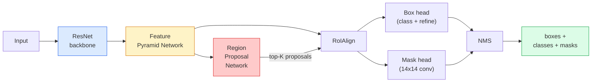

# 实例分割：Mask R-CNN

> 在 Faster R-CNN 检测器上加一个很小的 mask 分支，你就得到了实例分割。难点在 RoIAlign，而且它比看起来更难。

**类型:** 构建 + 学习
**语言:** Python
**先修:** 第 4 阶段第 06 课（YOLO）, 第 4 阶段第 07 课（U-Net）
**时长:** ~75 分钟

## 学习目标

- 端到端梳理 Mask R-CNN 的架构：backbone、FPN、RPN、RoIAlign、box head、mask head。
- 从零实现 RoIAlign，并解释为什么 RoIPool 现在不再使用。
- 用 torchvision 的 `maskrcnn_resnet50_fpn_v2` 预训练模型做生产级实例掩膜，并正确读取它的输出格式。
- 在一个小型自定义数据集上微调 Mask R-CNN：替换 box head 和 mask head，同时冻结 backbone。

## 问题是什么

语义分割给你的是“每个类别一张 mask”。实例分割给你的是“每个物体一张 mask”，即使两个物体属于同一类别。计数、跨帧跟踪，以及度量东西的形状（比如墙里每块砖的框、显微镜下每个细胞的轮廓），都需要实例分割。

Mask R-CNN（He 等，2017）把实例分割重写成“检测 + 一张 mask”后，问题就被解决了。这个设计非常干净，以至于接下来的五年里，几乎每篇实例分割论文都是 Mask R-CNN 变体；而 torchvision 的实现到今天依然是中小型数据集的生产默认方案。

真正难的工程问题在采样：当 proposal box 的四个角都不对齐像素边界时，怎么从里面裁出一个固定大小的特征区域？这一步如果做错，会让全局的 mAP 掉好几十分之一。答案就是 RoIAlign。

## 核心概念

### 架构



有五个部分需要理解：

1. **Backbone** - 在 ImageNet 上预训练过的 ResNet-50 或 ResNet-101。会输出 strides 为 4、8、16、32 的一组特征图。
2. **FPN（Feature Pyramid Network）** - 自顶向下加 lateral connection，让每个层级都拥有 C 通道、语义丰富的特征。检测时会根据物体大小去查对应的 FPN 层。
3. **RPN（Region Proposal Network）** - 一个小卷积头，在每个 anchor 位置上预测“这里有没有物体？”以及“怎么把这个框修得更准？”。每张图会产生大约 1000 个 proposal。
4. **RoIAlign** - 从任意 FPN 层、任意 box 中采样固定大小（比如 7x7）的特征块。用双线性采样，不做量化。
5. **Heads** - 一个两层的 box head，负责修框和分类；再加一个小卷积 head，给每个 proposal 输出一个 `28x28` 的二值 mask。

### 为什么用 RoIAlign，而不是 RoIPool

原始 Fast R-CNN 用的是 RoIPool：它会把 proposal box 切成网格，对每个小格取最大特征，并把所有坐标都四舍五入成整数。这个四舍五入会让特征图和输入像素坐标错位一个完整 feature-map 像素 - 在 224x224 图像上看起来不大，但在特征图 stride=32 时就很致命。

```
RoIPool:
  box (34.7, 51.3, 98.2, 142.9)
  round -> (34, 51, 98, 142)
  split grid -> round each cell boundary
  misalignment accumulates at every step

RoIAlign:
  box (34.7, 51.3, 98.2, 142.9)
  sample at exact float coordinates using bilinear interpolation
  no rounding anywhere
```

RoIAlign 在 COCO 上能白捡 3-4 个点的 mask AP。现在所有关心定位精度的 detector 都在用它 - YOLOv7 seg、RT-DETR、Mask2Former 都一样。

### RPN 用一句话解释

在特征图的每个位置放 K 个不同大小和形状的 anchor box。为每个 anchor 预测一个 objectness 分数，以及一个把这个 anchor 修成更合适框的回归偏移。把分数最高的约 1000 个框留下，做 NMS（IoU 0.7），然后把剩下的交给后面的 head。RPN 用自己的小 loss 训练 - 结构和第 6 课的 YOLO loss 一样，只不过只有两个类别（object / no object）。

### mask head

对每个 proposal（经过 RoIAlign 之后），mask head 都是一个很小的 FCN：四个 3x3 conv、一个 2x deconv、最后一个 1x1 conv，在 `28x28` 分辨率上输出 `num_classes` 个通道。最后只保留预测类别对应的那个通道，其余忽略。这就把 mask 预测和分类解耦了。

然后把 28x28 的 mask 上采样到 proposal 的原始像素大小，得到最终二值 mask。

### Loss

Mask R-CNN 有四个 loss，加起来就是总损失：

```
L = L_rpn_cls + L_rpn_box + L_box_cls + L_box_reg + L_mask
```

- `L_rpn_cls`、`L_rpn_box` - RPN proposal 的 objectness 和框回归。
- `L_box_cls` - head 分类器上的 `(C+1)` 类 cross-entropy（包含 background）。
- `L_box_reg` - head 框修正的 smooth L1。
- `L_mask` - `28x28` mask 输出上的逐像素 binary cross-entropy。

每个 loss 都有自己的默认权重；torchvision 实现里可以把它们作为构造函数参数。

### 输出格式

`torchvision.models.detection.maskrcnn_resnet50_fpn_v2` 会返回一个 dict 列表，每张图一个：

```
{
    "boxes":  (N, 4) in (x1, y1, x2, y2) pixel coordinates,
    "labels": (N,) class IDs, 0 = background so indices are 1-based,
    "scores": (N,) confidence scores,
    "masks":  (N, 1, H, W) float masks in [0, 1] — threshold at 0.5 for binary,
}
```

mask 已经是整张图的分辨率了。`28x28` 的 head 输出内部已经被上采样过。

## 动手实现

### 第 1 步：从零实现 RoIAlign

这是 Mask R-CNN 里最适合“看代码比看文字更清楚”的部分。

```python
import torch
import torch.nn.functional as F

def roi_align_single(feature, box, output_size=7, spatial_scale=1 / 16.0):
    """
    feature: (C, H, W) single-image feature map
    box: (x1, y1, x2, y2) in original image pixel coordinates
    output_size: side of the output grid (7 for box head, 14 for mask head)
    spatial_scale: reciprocal of the feature map stride
    """
    C, H, W = feature.shape
    x1, y1, x2, y2 = [c * spatial_scale - 0.5 for c in box]
    bin_w = (x2 - x1) / output_size
    bin_h = (y2 - y1) / output_size

    grid_y = torch.linspace(y1 + bin_h / 2, y2 - bin_h / 2, output_size)
    grid_x = torch.linspace(x1 + bin_w / 2, x2 - bin_w / 2, output_size)
    yy, xx = torch.meshgrid(grid_y, grid_x, indexing="ij")

    gx = 2 * (xx + 0.5) / W - 1
    gy = 2 * (yy + 0.5) / H - 1
    grid = torch.stack([gx, gy], dim=-1).unsqueeze(0)
    sampled = F.grid_sample(feature.unsqueeze(0), grid, mode="bilinear",
                            align_corners=False)
    return sampled.squeeze(0)
```

每个数都是在双线性采样的位置上取出来的。没有四舍五入，没有量化，也没有梯度丢失。

### 第 2 步：和 torchvision 的 RoIAlign 对比

```python
from torchvision.ops import roi_align

feature = torch.randn(1, 16, 50, 50)
boxes = torch.tensor([[0, 10, 20, 100, 90]], dtype=torch.float32)  # (batch_idx, x1, y1, x2, y2)

ours = roi_align_single(feature[0], boxes[0, 1:].tolist(), output_size=7, spatial_scale=1/4)
theirs = roi_align(feature, boxes, output_size=(7, 7), spatial_scale=1/4, sampling_ratio=1, aligned=True)[0]

print(f"shape ours:   {tuple(ours.shape)}")
print(f"shape theirs: {tuple(theirs.shape)}")
print(f"max|diff|:    {(ours - theirs).abs().max().item():.3e}")
```

当 `sampling_ratio=1` 且 `aligned=True` 时，这两个结果的差异能控制在 `1e-5` 以内。

### 第 3 步：加载一个预训练 Mask R-CNN

```python
import torch
from torchvision.models.detection import maskrcnn_resnet50_fpn_v2, MaskRCNN_ResNet50_FPN_V2_Weights

model = maskrcnn_resnet50_fpn_v2(weights=MaskRCNN_ResNet50_FPN_V2_Weights.DEFAULT)
model.eval()
print(f"params: {sum(p.numel() for p in model.parameters()):,}")
print(f"classes (including background): {len(model.roi_heads.box_predictor.cls_score.out_features * [0])}")
```

参数量 4600 万，91 个类别（COCO）。第一个类别（id 0）是 background；真正被模型检测的类别从 id 1 开始。

### 第 4 步：推理

```python
with torch.no_grad():
    x = torch.randn(3, 400, 600)
    predictions = model([x])
p = predictions[0]
print(f"boxes:  {tuple(p['boxes'].shape)}")
print(f"labels: {tuple(p['labels'].shape)}")
print(f"scores: {tuple(p['scores'].shape)}")
print(f"masks:  {tuple(p['masks'].shape)}")
```

mask tensor 的形状是 `(N, 1, H, W)`。把它阈值化到 0.5，就能得到每个物体的二值 mask：

```python
binary_masks = (p['masks'] > 0.5).squeeze(1)  # (N, H, W) boolean
```

### 第 5 步：替换 head 以适配自己的类别数

常见的 fine-tune 配方：复用 backbone、FPN 和 RPN；替换两个分类 head。

```python
from torchvision.models.detection.faster_rcnn import FastRCNNPredictor
from torchvision.models.detection.mask_rcnn import MaskRCNNPredictor

def build_custom_maskrcnn(num_classes):
    model = maskrcnn_resnet50_fpn_v2(weights=MaskRCNN_ResNet50_FPN_V2_Weights.DEFAULT)
    in_features = model.roi_heads.box_predictor.cls_score.in_features
    model.roi_heads.box_predictor = FastRCNNPredictor(in_features, num_classes)
    in_features_mask = model.roi_heads.mask_predictor.conv5_mask.in_channels
    hidden_layer = 256
    model.roi_heads.mask_predictor = MaskRCNNPredictor(in_features_mask, hidden_layer, num_classes)
    return model

custom = build_custom_maskrcnn(num_classes=5)
print(f"custom cls_score.out_features: {custom.roi_heads.box_predictor.cls_score.out_features}")
```

`num_classes` 必须把 background 也算进去，所以一个有 4 个物体类别的数据集，应该设 `num_classes=5`。

### 第 6 步：冻结不需要训练的部分

小数据集上，冻结 backbone 和 FPN。只让 RPN 的 objectness + regression 和两个 head 学习。

```python
def freeze_backbone_and_fpn(model):
    # torchvision Mask R-CNN packs the FPN inside `model.backbone` (as
    # `model.backbone.fpn`), so iterating `model.backbone.parameters()` covers
    # both the ResNet feature layers and the FPN lateral/output convs.
    for p in model.backbone.parameters():
        p.requires_grad = False
    return model

custom = freeze_backbone_and_fpn(custom)
trainable = sum(p.numel() for p in custom.parameters() if p.requires_grad)
print(f"trainable after freeze: {trainable:,}")
```

在 500 张图的数据集上，这一步往往就是“能收敛”和“过拟合”的差别。

## 使用方式

torchvision 里 Mask R-CNN 的完整训练循环大约 40 行，而且换任务时基本不用改 - 换数据集就行。

```python
def train_step(model, images, targets, optimizer):
    model.train()
    loss_dict = model(images, targets)
    losses = sum(loss for loss in loss_dict.values())
    optimizer.zero_grad()
    losses.backward()
    optimizer.step()
    return {k: v.item() for k, v in loss_dict.items()}
```

`targets` 列表里的每张图都必须有一个 dict，里面包含 `boxes`、`labels` 和 `masks`（形状是 `(num_instances, H, W)` 的二值 tensor）。训练时模型会返回四个 loss 的 dict；评估时会返回一个预测列表。这一切都取决于 `model.training`。

`pycocotools` evaluator 会同时给 box 和 mask 算 mAP@IoU=0.5:0.95；这两个数都要看，才能知道是 box head 卡住了，还是 mask head 卡住了。

## 交付物

这一课会产出：

- `outputs/prompt-instance-vs-semantic-router.md` - 一个提示词，问三个问题后决定用实例分割、语义分割还是全景分割，并给出该从哪个模型开始。
- `outputs/skill-mask-rcnn-head-swapper.md` - 一个 skill，给定新的 `num_classes`，就能自动生成替换任意 torchvision 检测模型 head 所需的 10 行代码。

## 练习

1. **（Easy）** 用 100 个随机框，把你的 RoIAlign 和 `torchvision.ops.roi_align` 比较一下。报告最大绝对误差。另外再跑一次 RoIPool（2017 年前的行为），展示它在靠近边界的框上会偏离 feature map 大约 1-2 个像素。
2. **（Medium）** 在一个 50 张图的自定义数据集上微调 `maskrcnn_resnet50_fpn_v2`（任意两个类别：气球、鱼、坑洞、logo 都行）。冻结 backbone，训练 20 个 epoch，报告 mask AP@0.5。
3. **（Hard）** 把 Mask R-CNN 的 mask head 改成输出 56x56 而不是 28x28。比较修改前后在 mAP@IoU=0.75 上的变化。解释这个提升（或没有提升）为什么符合“边界精度 / 显存”之间的权衡。

## 关键术语

| Term | 常见说法 | 实际含义 |
|------|----------|----------|
| Mask R-CNN | “检测加 mask” | Faster R-CNN + 一个小型 FCN head，为每个 proposal、每个类别预测 28x28 mask |
| FPN | “特征金字塔” | 自顶向下 + lateral connection，让每个 stride 层都有 C 通道的语义特征 |
| RPN | “proposal 生成器” | 一个小卷积 head，每张图产生大约 1000 个 object / no-object proposal |
| RoIAlign | “不四舍五入的裁剪” | 从任意 float 坐标框里，用双线性采样取出固定大小特征网格 |
| RoIPool | “2017 前的裁剪” | 和 RoIAlign 目的相同，但会四舍五入 box 坐标；已经过时 |
| Mask AP | “实例 mAP” | 用 mask IoU 而不是 box IoU 计算的 average precision；COCO 实例分割指标 |
| Binary mask head | “按类 mask” | 为每个 proposal 的每个类别预测一个二值 mask；最后只保留预测类别对应的通道 |
| Background class | “类别 0” | “没有物体”的兜底类别；真实类别从 1 开始编号 |

## 延伸阅读

- [Mask R-CNN (He et al., 2017)](https://arxiv.org/abs/1703.06870) - 原始论文；第 3 节关于 RoIAlign 的内容是必须精读的
- [FPN: Feature Pyramid Networks (Lin et al., 2017)](https://arxiv.org/abs/1612.03144) - FPN 论文；几乎所有现代 detector 都在用
- [torchvision Mask R-CNN tutorial](https://pytorch.org/tutorials/intermediate/torchvision_tutorial.html) - 微调循环的参考
- [Detectron2 model zoo](https://github.com/facebookresearch/detectron2/blob/main/MODEL_ZOO.md) - 生产实现与训练权重，几乎覆盖所有检测和分割变体
