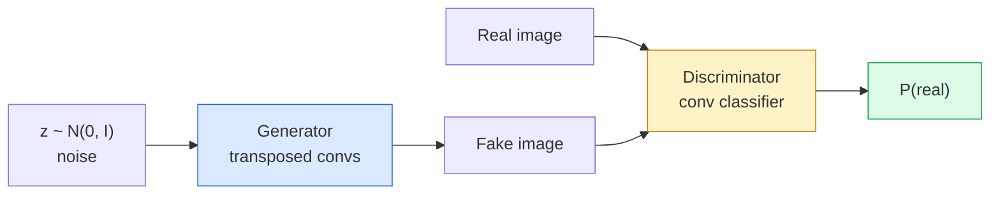
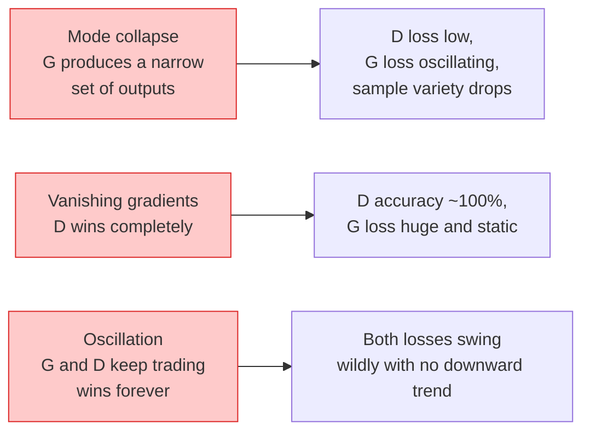

# 图像生成：GAN

> GAN 就是两个神经网络在一个固定博弈里对抗。一个负责画，一个负责挑错。它们会一起变强，直到画出来的东西能骗过 critic。

**类型:** 构建
**语言:** Python
**先修:** 第 4 阶段第 03 课（CNNs）, 第 3 阶段第 06 课（Optimizers）, 第 3 阶段第 07 课（Regularization）
**时长:** ~75 分钟

## 学习目标

- 解释生成器和判别器之间的 minimax 博弈，以及为什么平衡点对应 `p_model = p_data`。
- 在 PyTorch 中实现一个 DCGAN，并在 60 行以内让它生成结构连贯的 32x32 合成图像。
- 用三个标准技巧稳定 GAN 训练：non-saturating loss、spectral norm、TTUR（two-timescale update rule）。
- 读取训练曲线，区分健康收敛、mode collapse、振荡，以及判别器完全赢了的情况。

## 问题是什么

分类是在教网络把图像映射到标签。生成则是反过来：采样新的图像，让它们看起来像来自同一个分布。这里没有一个可以拿来 diff 的“正确输出”；你要做的只是去模仿某个分布。

标准 loss（MSE、cross-entropy）无法直接衡量“这个样本是不是来自真实分布”。逐像素误差只会得到模糊平均图，而不会得到真实感很强的样本。突破点是把 loss 学出来：训练第二个网络，让它负责区分真伪，再用它的判断去推动生成器。

GAN（Goodfellow 等，2014）定义了这个框架。到 2018 年，StyleGAN 已经能生成 1024x1024、肉眼几乎和照片无异的人脸。后来 diffusion model 在质量和可控性上接过了王座，但所有让 diffusion 变得实用的技巧 - 归一化选择、潜空间、特征损失 - 最早都是在 GAN 上被理解清楚的。

## 核心概念

### 两个网络



**Generator** G 接收一个噪声向量 `z`，输出一张图。**Discriminator** D 接收一张图，输出一个标量：这张图是真的概率有多大。

### 这个博弈

G 想让 D 说错。D 想说对。形式化地：

```
min_G max_D  E_x[log D(x)] + E_z[log(1 - D(G(z)))]
```

从右往左读：D 在最大化自己对真图（`log D(real)`）和假图（`log (1 - D(fake))`）的判断准确率。G 在最小化 D 对假图的准确率 - 它想让 `D(G(z))` 变高。

Goodfellow 证明了这个 minimax 在全局平衡点上会满足 `p_G = p_data`，D 在所有地方都输出 0.5，而生成分布和真实分布之间的 Jensen-Shannon divergence 为 0。难点在于怎么到达那里。

### Non-saturating loss

上面那个形式数值上不稳定。训练早期，`D(G(z))` 对每个假样本都接近 0，所以 `log(1 - D(G(z)))` 对 G 来说梯度会消失。修复方式是：把 G 的 loss 翻过来。

```
L_D = -E_x[log D(x)] - E_z[log(1 - D(G(z)))]
L_G = -E_z[log D(G(z))]                          # non-saturating
```

这样一来，当 `D(G(z))` 接近 0 时，G 的 loss 很大，梯度也就有信息量了。今天所有现代 GAN 都用这个版本训练。

### DCGAN 的架构规则

Radford、Metz、Chintala（2015）把多年失败实验总结成了五条能让 GAN 训练稳定的规则：

1. 用 stride conv 代替 pooling（两个网络都一样）。
2. 在 generator 和 discriminator 里都用 batch norm，但 G 的输出层和 D 的输入层除外。
3. 在更深的架构里去掉全连接层。
4. G 除了输出层外都用 ReLU（输出层用 tanh，把输出限制在 [-1, 1]）。
5. D 在所有层都用 LeakyReLU（`negative_slope=0.2`）。

今天所有基于卷积的 GAN（StyleGAN、BigGAN、GigaGAN）仍然都是从这些规则出发，再一块一块替换掉其中的部分。

### 失败模式和它们的特征



- **Mode collapse**：G 找到了一个能骗过 D 的图，然后只会生成这一种。修法：加 minibatch discrimination、spectral norm，或者 label conditioning。
- **判别器赢太快**：D 变得太强，G 的梯度消失。修法：缩小 D、降低 D 的学习率，或者对真实标签做 label smoothing。
- **振荡**：两个网络不断互相赢，但始终到不了平衡。修法：TTUR（D 比 G 快 2-4 倍），或者切换成 Wasserstein loss。

### 评估

GAN 没有 ground truth，那怎么知道它在工作？

- **样本检查** - 每个 epoch 结束时直接看 64 张样本。这是硬要求。
- **FID（Fréchet Inception Distance）** - 真实集和生成集在 Inception-v3 特征空间里的分布距离。越低越好。社区标准。
- **Inception Score** - 更老，也更脆弱；优先用 FID。
- **生成模型的 Precision / Recall** - 分别衡量质量（precision）和覆盖度（recall）。比单独看 FID 更有信息量。

对于一个小型合成数据实验，直接看样本就够了。

## 动手实现

### 第 1 步：生成器

一个小型 DCGAN generator，输入 64 维噪声，输出 32x32 图像。

```python
import torch
import torch.nn as nn

class Generator(nn.Module):
    def __init__(self, z_dim=64, img_channels=3, feat=64):
        super().__init__()
        self.net = nn.Sequential(
            nn.ConvTranspose2d(z_dim, feat * 4, kernel_size=4, stride=1, padding=0, bias=False),
            nn.BatchNorm2d(feat * 4),
            nn.ReLU(inplace=True),
            nn.ConvTranspose2d(feat * 4, feat * 2, kernel_size=4, stride=2, padding=1, bias=False),
            nn.BatchNorm2d(feat * 2),
            nn.ReLU(inplace=True),
            nn.ConvTranspose2d(feat * 2, feat, kernel_size=4, stride=2, padding=1, bias=False),
            nn.BatchNorm2d(feat),
            nn.ReLU(inplace=True),
            nn.ConvTranspose2d(feat, img_channels, kernel_size=4, stride=2, padding=1, bias=False),
            nn.Tanh(),
        )

    def forward(self, z):
        return self.net(z.view(z.size(0), -1, 1, 1))
```

四层 transposed conv，每层都用 `kernel_size=4, stride=2, padding=1`，这样空间尺寸就能整齐翻倍。最后用 tanh 把输出限制在 [-1, 1]。

### 第 2 步：判别器

生成器的镜像。LeakyReLU、stride conv，最后输出一个标量 logit。

```python
class Discriminator(nn.Module):
    def __init__(self, img_channels=3, feat=64):
        super().__init__()
        self.net = nn.Sequential(
            nn.Conv2d(img_channels, feat, kernel_size=4, stride=2, padding=1),
            nn.LeakyReLU(0.2, inplace=True),
            nn.Conv2d(feat, feat * 2, kernel_size=4, stride=2, padding=1, bias=False),
            nn.BatchNorm2d(feat * 2),
            nn.LeakyReLU(0.2, inplace=True),
            nn.Conv2d(feat * 2, feat * 4, kernel_size=4, stride=2, padding=1, bias=False),
            nn.BatchNorm2d(feat * 4),
            nn.LeakyReLU(0.2, inplace=True),
            nn.Conv2d(feat * 4, 1, kernel_size=4, stride=1, padding=0),
        )

    def forward(self, x):
        return self.net(x).view(-1)
```

最后一层卷积会把 `4x4` 特征图压成 `1x1`。输出是每张图一个标量；sigmoid 只在算 loss 时再加。

### 第 3 步：训练一步

每个 batch 都先更新一次 D，再更新一次 G。

```python
import torch.nn.functional as F

def train_step(G, D, real, z, opt_g, opt_d, device):
    real = real.to(device)
    bs = real.size(0)

    # D step
    opt_d.zero_grad()
    d_real = D(real)
    d_fake = D(G(z).detach())
    loss_d = (F.binary_cross_entropy_with_logits(d_real, torch.ones_like(d_real))
              + F.binary_cross_entropy_with_logits(d_fake, torch.zeros_like(d_fake)))
    loss_d.backward()
    opt_d.step()

    # G step
    opt_g.zero_grad()
    d_fake = D(G(z))
    loss_g = F.binary_cross_entropy_with_logits(d_fake, torch.ones_like(d_fake))
    loss_g.backward()
    opt_g.step()

    return loss_d.item(), loss_g.item()
```

在 D step 里用 `G(z).detach()` 非常关键：更新 D 时不希望梯度流进 G。忘了这一步，是最经典的新手 bug。

### 第 4 步：在合成形状上跑完整训练循环

```python
from torch.utils.data import DataLoader, TensorDataset
import numpy as np

def synthetic_images(num=2000, size=32, seed=0):
    rng = np.random.default_rng(seed)
    imgs = np.zeros((num, 3, size, size), dtype=np.float32) - 1.0
    for i in range(num):
        r = rng.uniform(6, 12)
        cx, cy = rng.uniform(r, size - r, size=2)
        yy, xx = np.meshgrid(np.arange(size), np.arange(size), indexing="ij")
        mask = (xx - cx) ** 2 + (yy - cy) ** 2 < r ** 2
        color = rng.uniform(-0.5, 1.0, size=3)
        for c in range(3):
            imgs[i, c][mask] = color[c]
    return torch.from_numpy(imgs)

device = "cuda" if torch.cuda.is_available() else "cpu"
data = synthetic_images()
loader = DataLoader(TensorDataset(data), batch_size=64, shuffle=True)

G = Generator(z_dim=64, img_channels=3, feat=32).to(device)
D = Discriminator(img_channels=3, feat=32).to(device)
opt_g = torch.optim.Adam(G.parameters(), lr=2e-4, betas=(0.5, 0.999))
opt_d = torch.optim.Adam(D.parameters(), lr=2e-4, betas=(0.5, 0.999))

for epoch in range(10):
    for (batch,) in loader:
        z = torch.randn(batch.size(0), 64, device=device)
        ld, lg = train_step(G, D, batch, z, opt_g, opt_d, device)
    print(f"epoch {epoch}  D {ld:.3f}  G {lg:.3f}")
```

`Adam(lr=2e-4, betas=(0.5, 0.999))` 是 DCGAN 的默认设置 - 低一点的 beta1 可以避免动量项把对抗博弈“稳定”得过头。

### 第 5 步：采样

```python
@torch.no_grad()
def sample(G, n=16, z_dim=64, device="cpu"):
    G.eval()
    z = torch.randn(n, z_dim, device=device)
    imgs = G(z)
    imgs = (imgs + 1) / 2
    return imgs.clamp(0, 1)
```

采样前一定要切到 eval mode。对 DCGAN 来说这很重要，因为这时用的是 batch norm 的 running stats，而不是当前 batch 的统计量。

### 第 6 步：Spectral norm

判别器里可以直接替换 BN 的一个模块，保证网络是 1-Lipschitz。它能修复大部分“D 赢得太快”的问题。

```python
from torch.nn.utils import spectral_norm

def build_sn_discriminator(img_channels=3, feat=64):
    return nn.Sequential(
        spectral_norm(nn.Conv2d(img_channels, feat, 4, 2, 1)),
        nn.LeakyReLU(0.2, inplace=True),
        spectral_norm(nn.Conv2d(feat, feat * 2, 4, 2, 1)),
        nn.LeakyReLU(0.2, inplace=True),
        spectral_norm(nn.Conv2d(feat * 2, feat * 4, 4, 2, 1)),
        nn.LeakyReLU(0.2, inplace=True),
        spectral_norm(nn.Conv2d(feat * 4, 1, 4, 1, 0)),
    )
```

把 `Discriminator` 换成 `build_sn_discriminator()`，很多时候就不需要 TTUR 了。spectral norm 是你能做的最简单、最有效的鲁棒性升级之一。

## 使用方式

如果要做认真一点的生成，要么用预训练权重，要么直接换 diffusion。两个常用库：

- `torch_fidelity` 可以直接给你的 generator 算 FID / IS，不用自己写评估代码。
- `pytorch-gan-zoo`（老库）和 `StudioGAN` 提供了 DCGAN、WGAN-GP、SN-GAN、StyleGAN、BigGAN 的可测实现。

到了 2026 年，GAN 仍然是这些场景的好选择：实时图像生成（延迟 <10 ms）、风格迁移、以及需要精准控制的图像到图像翻译（Pix2Pix、CycleGAN）。photorealism 和 text conditioning 这两项则是 diffusion 的强项。

## 交付物

这一课会产出：

- `outputs/prompt-gan-training-triage.md` - 一个提示词，读训练曲线描述后判断失败模式（mode collapse、D-wins、oscillation）以及最推荐的修复方法。
- `outputs/skill-dcgan-scaffold.md` - 一个 skill，会根据 `z_dim`、目标 `image_size` 和 `num_channels` 写出 DCGAN 骨架，包括训练循环和样本保存器。

## 练习

1. **（Easy）** 在合成圆形数据集上训练上面的 DCGAN，并在每个 epoch 结束时保存 16 张样本的网格图。到第几个 epoch 时，生成出来的圆才明显像圆？
2. **（Medium）** 把判别器里的 batch norm 换成 spectral norm。把两个版本并排训练。哪个收敛更快？哪个在三个随机种子下方差更小？
3. **（Hard）** 实现 conditional DCGAN：把类别标签同时输入 G 和 D（G 里把 one-hot 拼到噪声上，D 里把类别 embedding 通道拼进去）。在第 7 课的合成“圆 vs 方块”数据集上训练，并用特定标签采样，证明 class conditioning 确实生效。

## 关键术语

| Term | 常见说法 | 实际含义 |
|------|----------|----------|
| Generator (G) | “画图网络” | 把噪声映射到图像；训练目标是骗过判别器 |
| Discriminator (D) | “裁判” | 二分类器；训练目标是区分真实图像和生成图像 |
| Minimax | “这个博弈” | 对抗损失对 G 取 min、对 D 取 max；平衡点是 `p_G = p_data` |
| Non-saturating loss | “数值更稳的版本” | G 的 loss 用 `-log(D(G(z)))`，而不是 `log(1 - D(G(z)))`，避免训练早期梯度消失 |
| Mode collapse | “生成器只会一招” | G 只产生数据分布里很小的一部分；可以用 SN、minibatch discrimination 或更大的 batch 修 |
| TTUR | “两个学习率” | D 的学习速度比 G 快，通常快 2-4 倍；能稳定训练 |
| Spectral norm | “1-Lipschitz 层” | 约束每层 Lipschitz 常数的权重归一化；防止 D 变得过于陡峭 |
| FID | “Fréchet Inception Distance” | 真实集和生成集在 Inception-v3 特征分布上的距离；标准评估指标 |

## 延伸阅读

- [Generative Adversarial Networks (Goodfellow et al., 2014)](https://arxiv.org/abs/1406.2661) - 一切的起点
- [DCGAN (Radford, Metz, Chintala, 2015)](https://arxiv.org/abs/1511.06434) - 让 GAN 可训练的架构规则
- [Spectral Normalization for GANs (Miyato et al., 2018)](https://arxiv.org/abs/1802.05957) - 最有用的稳定化技巧之一
- [StyleGAN3 (Karras et al., 2021)](https://arxiv.org/abs/2106.12423) - GAN 里的 SOTA；像把过去十年所有技巧做成了一张精选专辑
