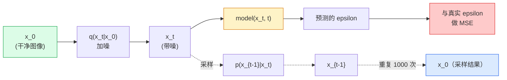

# 图像生成：扩散模型

> 扩散模型学的是去噪。让它从一张带噪图里每次去掉一点点噪声，反向重复一千次，你就得到了一个图像生成器。

**Type:** Build
**Languages:** Python
**Prerequisites:** 第 4 阶段第 07 课（U-Net）, 第 1 阶段第 06 课（概率）, 第 3 阶段第 06 课（优化器）
**Time:** ~75 分钟

## 学习目标

- 推导前向加噪过程 `x_0 -> x_1 -> ... -> x_T`，并解释为什么任意时刻都成立闭式形式 `q(x_t | x_0)`
- 实现一个 DDPM 风格的训练目标，回归每一步加入的噪声，并实现一个从纯噪声一步步回到图像的采样器
- 构建一个带时间条件的小型 U-Net，体量足以在 CPU 上训练，用来预测任意时间步的噪声
- 说明 DDPM 和 DDIM 采样的区别，以及各自适用的场景（第 23 课会深入讲流匹配和 rectified flow）

## 问题是什么

GAN 的生成方式是一锤子买卖：输入噪声，输出图像，一次前向传播就结束了。它速度快，但训练难。扩散模型则是迭代式生成：先从纯噪声开始，分很多小步去噪，图像慢慢显现出来。它速度慢，但训练容易。过去五年里，后者的优势已经压倒了前者：任何小团队都能训练出一个还不错的扩散模型；而 GAN 的训练更像一门靠大量失败实验磨出来的手艺。

除了训练稳定性，扩散模型真正重要的是它的迭代结构，这也是现代图像生成能力的来源：文本条件、补全、图像编辑、超分辨率、可控风格，几乎都建立在这套结构上。采样循环里的每一步，都是注入新约束的入口。这正是 Stable Diffusion、Imagen、DALL-E 3、Midjourney，以及你会实际用到的所有可控图像模型为什么都基于扩散。

这节课会搭建最小版 DDPM：前向加噪、反向去噪、训练循环。下一课（Stable Diffusion）会把它接入真实系统，加入 VAE、文本编码器和 classifier-free guidance。

## 核心概念

### 前向过程

拿一张图像 `x_0`。先加一点高斯噪声，得到 `x_1`。再加一点，得到 `x_2`。这样一直做 T 步，直到 `x_T` 几乎和纯高斯噪声没什么区别。

```text
q(x_t | x_{t-1}) = N(x_t; sqrt(1 - beta_t) * x_{t-1},  beta_t * I)
```

`beta_t` 是一个很小的方差调度，通常在 T=1000 步里从 0.0001 线性增长到 0.02。每一步都会稍微削弱信号，同时注入新的噪声。

### 闭式跳跃

逐步加噪是一个马尔可夫链，但数学会折叠起来：你可以直接从 `x_0` 一步采样得到 `x_t`。

```text
定义 alpha_t = 1 - beta_t
定义 alpha_bar_t = prod_{s=1..t} alpha_s

则：
  q(x_t | x_0) = N(x_t; sqrt(alpha_bar_t) * x_0,  (1 - alpha_bar_t) * I)

等价地：
  x_t = sqrt(alpha_bar_t) * x_0 + sqrt(1 - alpha_bar_t) * epsilon
  其中 epsilon ~ N(0, I)
```

这一条公式就是扩散模型之所以实用的根本原因。训练时你只要随机选一个 `t`，直接从 `x_0` 采样出 `x_t`，然后一步完成训练，不需要模拟完整的马尔可夫链。

### 反向过程

前向过程是固定的。反向过程 `p(x_{t-1} | x_t)` 才是神经网络要学的内容。扩散模型不会直接预测 `x_{t-1}`；它们预测的是第 t 步加入的噪声 `epsilon`，再由数学公式推导出 `x_{t-1}`。



### 训练损失

每个训练步骤都这样做：

1. 取一张真实图像 `x_0`。
2. 从 [1, T] 中均匀采样一个时间步 `t`。
3. 采样噪声 `epsilon ~ N(0, I)`。
4. 计算 `x_t = sqrt(alpha_bar_t) * x_0 + sqrt(1 - alpha_bar_t) * epsilon`。
5. 用网络预测 `epsilon_theta(x_t, t)`。
6. 最小化 `|| epsilon - epsilon_theta(x_t, t) ||^2`。

就是这么简单。神经网络学到的是任意时间步下的噪声预测。损失函数就是 MSE。没有对抗博弈，没有模式崩塌，也没有震荡发散。

### 采样器（DDPM）

生成时：从 `x_T ~ N(0, I)` 开始，一步一步往回走。

```text
for t = T, T-1, ..., 1:
    eps = model(x_t, t)
    x_{t-1} = (1 / sqrt(alpha_t)) * (x_t - (beta_t / sqrt(1 - alpha_bar_t)) * eps) + sqrt(beta_t) * z
    其中 z ~ N(0, I) if t > 1, else 0
return x_0
```

关键点在于：虽然一般情况下反向条件分布没有已知闭式解，但对于这个特定的高斯前向过程，反向过程是可以推出来的。那些看起来很难看的系数，本质上就是贝叶斯公式给你的答案。

### 为什么是 1000 步

前向噪声调度会被设计成每一步只增加一点点噪声，这样反向每一步就都接近高斯，网络更容易建模。步数太少，反向分布离高斯太远，网络学不好。步数太多，采样会变得很慢，收益却越来越小。T=1000 配合线性调度，就是 DDPM 的默认做法。

### DDIM：快 20 倍的采样

训练方式不变，变化的是采样。DDIM（Song et al., 2020）定义了一个确定性的反向过程，可以在不重新训练的前提下跳过一些时间步。用 DDIM 采样 50 步，效果可以接近 DDPM 的 1000 步。几乎所有生产系统都会用 DDIM 或更快的变体（比如 DPM-Solver、Euler ancestral）。

### 时间条件

网络 `epsilon_theta(x_t, t)` 需要知道自己现在在去噪哪个时间步。现代扩散模型通常用正弦时间嵌入来注入 `t`（思路和 transformer 的位置编码一样），然后把它加到 U-Net 各层的特征图中。

```text
t_embedding = sinusoidal(t)
feature_map += MLP(t_embedding)
```

如果没有时间条件，网络就只能从图像本身猜测噪声强度，这也能工作，但样本效率会差很多。

## Build It

### 第 1 步：噪声调度

```python
import torch

def linear_beta_schedule(T=1000, beta_start=1e-4, beta_end=2e-2):
    return torch.linspace(beta_start, beta_end, T)


def precompute_schedule(betas):
    alphas = 1.0 - betas
    alphas_cumprod = torch.cumprod(alphas, dim=0)
    return {
        "betas": betas,
        "alphas": alphas,
        "alphas_cumprod": alphas_cumprod,
        "sqrt_alphas_cumprod": torch.sqrt(alphas_cumprod),
        "sqrt_one_minus_alphas_cumprod": torch.sqrt(1.0 - alphas_cumprod),
        "sqrt_recip_alphas": torch.sqrt(1.0 / alphas),
    }

schedule = precompute_schedule(linear_beta_schedule(T=1000))
```

先预计算一次，训练和采样时再按索引取出来。

### 第 2 步：前向扩散（`q_sample`）

```python
def q_sample(x0, t, noise, schedule):
    sqrt_a = schedule["sqrt_alphas_cumprod"][t].view(-1, 1, 1, 1)
    sqrt_one_minus_a = schedule["sqrt_one_minus_alphas_cumprod"][t].view(-1, 1, 1, 1)
    return sqrt_a * x0 + sqrt_one_minus_a * noise
```

一行闭式公式。`t` 是一个批次里的时间步，每张图对应一个。

### 第 3 步：一个很小的时间条件 U-Net

```python
import torch.nn as nn
import torch.nn.functional as F
import math

def timestep_embedding(t, dim=64):
    half = dim // 2
    freqs = torch.exp(-math.log(10000) * torch.arange(half, device=t.device) / half)
    args = t[:, None].float() * freqs[None]
    emb = torch.cat([args.sin(), args.cos()], dim=-1)
    return emb


class TinyUNet(nn.Module):
    def __init__(self, img_channels=3, base=32, t_dim=64):
        super().__init__()
        self.t_mlp = nn.Sequential(
            nn.Linear(t_dim, base * 4),
            nn.SiLU(),
            nn.Linear(base * 4, base * 4),
        )
        self.t_dim = t_dim
        self.enc1 = nn.Conv2d(img_channels, base, 3, padding=1)
        self.enc2 = nn.Conv2d(base, base * 2, 4, stride=2, padding=1)
        self.mid = nn.Conv2d(base * 2, base * 2, 3, padding=1)
        self.dec1 = nn.ConvTranspose2d(base * 2, base, 4, stride=2, padding=1)
        self.dec2 = nn.Conv2d(base * 2, img_channels, 3, padding=1)
        self.time_proj = nn.Linear(base * 4, base * 2)

    def forward(self, x, t):
        t_emb = timestep_embedding(t, self.t_dim)
        t_emb = self.t_mlp(t_emb)
        t_proj = self.time_proj(t_emb)[:, :, None, None]

        h1 = F.silu(self.enc1(x))
        h2 = F.silu(self.enc2(h1)) + t_proj
        h3 = F.silu(self.mid(h2))
        d1 = F.silu(self.dec1(h3))
        d2 = torch.cat([d1, h1], dim=1)
        return self.dec2(d2)
```

两层 U-Net，在瓶颈处注入时间条件。真正处理大图时，可以继续加深和加宽。

### 第 4 步：训练循环

```python
def train_step(model, x0, schedule, optimizer, device, T=1000):
    model.train()
    x0 = x0.to(device)
    bs = x0.size(0)
    t = torch.randint(0, T, (bs,), device=device)
    noise = torch.randn_like(x0)
    x_t = q_sample(x0, t, noise, schedule)
    pred = model(x_t, t)
    loss = F.mse_loss(pred, noise)
    optimizer.zero_grad()
    loss.backward()
    optimizer.step()
    return loss.item()
```

这就是完整训练循环。没有 GAN 对抗游戏，没有特殊损失，一个 MSE 调用就够了。

### 第 5 步：采样器（DDPM）

```python
@torch.no_grad()
def sample(model, schedule, shape, T=1000, device="cpu"):
    model.eval()
    x = torch.randn(shape, device=device)
    betas = schedule["betas"].to(device)
    sqrt_one_minus_a = schedule["sqrt_one_minus_alphas_cumprod"].to(device)
    sqrt_recip_alphas = schedule["sqrt_recip_alphas"].to(device)

    for t in reversed(range(T)):
        t_batch = torch.full((shape[0],), t, dtype=torch.long, device=device)
        eps = model(x, t_batch)
        coef = betas[t] / sqrt_one_minus_a[t]
        mean = sqrt_recip_alphas[t] * (x - coef * eps)
        if t > 0:
            x = mean + torch.sqrt(betas[t]) * torch.randn_like(x)
        else:
            x = mean
    return x
```

生成一批样本要跑 1000 次前向传播。在真实项目里，你会把它换成 50 步的 DDIM 采样器。

### 第 6 步：DDIM 采样器（确定性，快约 20 倍）

```python
@torch.no_grad()
def sample_ddim(model, schedule, shape, steps=50, T=1000, device="cpu", eta=0.0):
    model.eval()
    x = torch.randn(shape, device=device)
    alphas_cumprod = schedule["alphas_cumprod"].to(device)

    ts = torch.linspace(T - 1, 0, steps + 1).long()
    for i in range(steps):
        t = ts[i]
        t_prev = ts[i + 1]
        t_batch = torch.full((shape[0],), t, dtype=torch.long, device=device)
        eps = model(x, t_batch)
        a_t = alphas_cumprod[t]
        a_prev = alphas_cumprod[t_prev] if t_prev >= 0 else torch.tensor(1.0, device=device)
        x0_pred = (x - torch.sqrt(1 - a_t) * eps) / torch.sqrt(a_t)
        sigma = eta * torch.sqrt((1 - a_prev) / (1 - a_t) * (1 - a_t / a_prev))
        dir_xt = torch.sqrt(1 - a_prev - sigma ** 2) * eps
        noise = sigma * torch.randn_like(x) if eta > 0 else 0
        x = torch.sqrt(a_prev) * x0_pred + dir_xt + noise
    return x
```

`eta=0` 时是完全确定性的（同一个噪声输入总会得到同一个输出）。`eta=1` 就回到了 DDPM。

## Use It

生产场景里可以直接用 `diffusers`：

```python
from diffusers import DDPMScheduler, UNet2DModel

unet = UNet2DModel(sample_size=32, in_channels=3, out_channels=3, layers_per_block=2)
scheduler = DDPMScheduler(num_train_timesteps=1000)
```

这个库提供了现成的调度器（DDPM、DDIM、DPM-Solver、Euler、Heun）、可配置的 U-Net、文本到图像和图像到图像的 pipeline，以及 LoRA 微调辅助工具。

做研究时，`k-diffusion`（Katherine Crowson）保留了最忠实的参考实现，也有最好的采样变体。

## Ship It

这节课会产出：

- `outputs/prompt-diffusion-sampler-picker.md` - 一个提示词，根据质量目标、延迟预算和条件类型，选择 DDPM / DDIM / DPM-Solver / Euler。
- `outputs/skill-noise-schedule-designer.md` - 一个技能，用来根据 T 和目标污染程度生成线性、余弦或 sigmoid 的 beta 调度，并附带信噪比随时间变化的诊断图。

## 练习

1. **(Easy)** 可视化前向过程：取一张图像，画出 `t in [0, 100, 250, 500, 750, 1000]` 时的 `x_t`。验证 `x_1000` 看起来是不是已经接近纯高斯噪声。
2. **(Medium)** 在 synthetic-circles 数据集上训练 TinyUNet 20 个 epoch，并采样 16 张圆形图。比较 DDPM（1000 步）和 DDIM（50 步）采样 - 它们会不会从同一个噪声种子生成相似图像？
3. **(Hard)** 实现余弦噪声调度（Nichol & Dhariwal, 2021）：`alpha_bar_t = cos^2((t/T + s) / (1 + s) * pi / 2)`。用线性和余弦两种调度训练同一个模型，并展示余弦调度在低步数采样时效果更好。

## 关键术语

| Term | 说法 | 实际含义 |
|------|------|----------|
| Forward process | “随着时间加噪” | 一个固定的马尔可夫链，把图像逐步腐蚀成高斯噪声 |
| Reverse process | “一步一步去噪” | 从噪声回到图像的学习到的分布 |
| Epsilon prediction | “预测噪声” | 训练目标：`epsilon_theta(x_t, t)` 预测第 t 步加入的噪声 |
| Beta schedule | “噪声量” | 长度为 T 的小方差序列，定义每一步注入多少噪声 |
| alpha_bar_t | “累计保留系数” | 到时间 t 为止 `(1 - beta_s)` 的连乘；t 越大，剩下的信号越少 |
| DDPM sampler | “祖先式、随机采样” | 按条件高斯分布采样每个 `x_{t-1}`；共 1000 步 |
| DDIM sampler | “确定性、快速” | 把采样重写成确定性 ODE；20-100 步，质量相近 |
| Time conditioning | “告诉模型当前是哪个 t” | 把 t 的正弦嵌入注入 U-Net，让模型知道当前噪声级别 |

## 延伸阅读

- [Denoising Diffusion Probabilistic Models (Ho et al., 2020)](https://arxiv.org/abs/2006.11239) - 让扩散模型真正实用、并在 FID 上击败 GAN 的论文
- [Improved DDPM (Nichol & Dhariwal, 2021)](https://arxiv.org/abs/2102.09672) - 余弦调度和 v-parameterisation
- [DDIM (Song, Meng, Ermon, 2020)](https://arxiv.org/abs/2010.02502) - 让实时推理成为可能的确定性采样器
- [Elucidating the Design Space of Diffusion (Karras et al., 2022)](https://arxiv.org/abs/2206.00364) - 对扩散设计空间的统一视角；目前最好的参考资料之一
