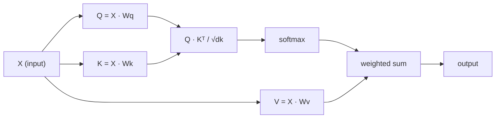

# 从零实现 Self-Attention

> Attention 就像一个查找表，每个词都会问一句“谁对我最重要？” - 然后模型学会回答这个问题。

**类型:** 构建
**语言:** Python
**先修:** 第 3 阶段（深度学习核心）, 第 5 阶段第 10 课（Sequence-to-Sequence）
**时长:** ~90 分钟

## 学习目标

- 使用纯 NumPy 从零实现缩放点积 self-attention，包括 query / key / value 投影和 softmax 加权求和
- 搭建一个 multi-head attention 层，能够拆分 heads、并行计算 attention、再把结果拼接起来
- 追踪 attention matrix 如何捕捉 token 之间的关系，并解释为什么用 `sqrt(d_k)` 做缩放能避免 softmax 饱和
- 应用 causal mask，把双向 attention 改成自回归（decoder 风格）attention

## 问题是什么

RNN 一次处理一个 token。等你走到第 50 个 token 时，第 1 个 token 的信息已经经过 50 次压缩。长程依赖会被压进一个固定大小的 hidden state 里，这个瓶颈不是加一点 LSTM gate 就能彻底解决的。

2014 年的 Bahdanau attention 论文给出了一个修补方案：让 decoder 回头看每一个 encoder 位置，并决定当前步骤该关注哪些位置。但它本质上还是挂在 RNN 上。2017 年的《Attention Is All You Need》问了一个更尖锐的问题：如果 attention 是唯一机制会怎样？不要 recurrence，不要卷积，只要 attention。

Self-attention 让序列里的每个位置都能在一次并行步骤里看见其他所有位置。这也是 Transformer 之所以又快、又能扩展、又最终胜出的原因。

## 核心概念

### 把 attention 想成一次数据库查询

可以把 attention 理解成一个软数据库查询：

```
传统数据库：
  Query: "capital of France"  -->  精确匹配  -->  "Paris"

Attention：
  Query: "capital of France"  -->  与所有 keys 的相似度  -->  对所有 values 做加权混合
```

每个 token 都会生成三个向量：
- **Query (Q)**：我在找什么？
- **Key (K)**：我包含什么？
- **Value (V)**：如果我被选中，我能提供什么信息？

query 和所有 keys 的点积会得到 attention score。分数越高，说明这个 key 和 query 越匹配。然后这些分数会给 values 加权。最终输出就是 values 的加权和。

### Q、K、V 的计算

每个 token embedding 都会经过三组可学习的权重矩阵投影：

```
输入 embedding（n 个 token 的序列，每个 token 是 d 维）：

  X = [x1, x2, x3, ..., xn]       shape: (n, d)

三组权重矩阵：

  Wq  shape: (d, dk)
  Wk  shape: (d, dk)
  Wv  shape: (d, dv)

投影：

  Q = X @ Wq    shape: (n, dk)      每个 token 的 query
  K = X @ Wk    shape: (n, dk)      每个 token 的 key
  V = X @ Wv    shape: (n, dv)      每个 token 的 value
```

从单个 token 看，结构大致是这样：

```
             Wq
  x_i ------[*]------> q_i    "我在找什么？"
       |
       |     Wk
       +----[*]------> k_i    "我包含什么？"
       |
       |     Wv
       +----[*]------> v_i    "如果被选中，我能提供什么？"
```

### Attention matrix

当你拿到所有 token 的 Q、K、V 之后，attention score 就会形成一个矩阵：

```
Scores = Q @ K^T    shape: (n, n)

              k1    k2    k3    k4    k5
        +-----+-----+-----+-----+-----+
   q1   | 2.1 | 0.3 | 0.1 | 0.8 | 0.2 |   <- q1 对每个 key 的关注程度
        +-----+-----+-----+-----+-----+
   q2   | 0.4 | 1.9 | 0.7 | 0.1 | 0.3 |
        +-----+-----+-----+-----+-----+
   q3   | 0.2 | 0.6 | 2.3 | 0.5 | 0.1 |
        +-----+-----+-----+-----+-----+
   q4   | 0.9 | 0.1 | 0.4 | 1.7 | 0.6 |
        +-----+-----+-----+-----+-----+
   q5   | 0.1 | 0.3 | 0.2 | 0.5 | 2.0 |
        +-----+-----+-----+-----+-----+

每一行：一个 token 对整段序列的注意力分布
```

可以把它看成 query 逐个扫过所有 keys：每一行给所有 token 打分，softmax 把分数变成权重，再用这些权重对 values 做混合，得到 context vector。

```figure
attention-matrix
```

### 为什么要缩放？

点积会随着维度 `d_k` 变大而变大。如果 `d_k = 64`，点积可能大到几十，softmax 就会进入梯度几乎消失的区域。解决办法是除以 `sqrt(d_k)`。

```
Scaled scores = (Q @ K^T) / sqrt(dk)
```

这样可以把数值控制在 softmax 还能给出有用梯度的范围里。

### Softmax 会把分数变成权重

Softmax 会把原始分数转换成每一行上的概率分布：

```
q1 的原始分数:   [2.1, 0.3, 0.1, 0.8, 0.2]
                            |
                         softmax
                            |
Attention 权重:   [0.52, 0.09, 0.07, 0.14, 0.08]   （总和约等于 1.0）
```

这样每个 token 就会得到一组权重，表示它应该对其他 token 关注多少。

### 对 values 做加权求和

每个 token 的最终输出，都是所有 value 向量的加权和：

```
output_i = sum( attention_weight[i][j] * v_j  for all j )

对于 token 1：
  output_1 = 0.52 * v1 + 0.09 * v2 + 0.07 * v3 + 0.14 * v4 + 0.08 * v5
```

### 完整流程



公式可以写成一行：

```
Attention(Q, K, V) = softmax( Q @ K^T / sqrt(dk) ) @ V
```

```figure
softmax-attention-scaling
```

## 动手实现

### 第 1 步：从零实现 softmax

Softmax 会把原始 logits 变成概率。为了数值稳定，要先减去最大值。

```python
import numpy as np

def softmax(x):
    shifted = x - np.max(x, axis=-1, keepdims=True)
    exp_x = np.exp(shifted)
    return exp_x / np.sum(exp_x, axis=-1, keepdims=True)

logits = np.array([2.0, 1.0, 0.1])
print(f"logits:  {logits}")
print(f"softmax: {softmax(logits)}")
print(f"sum:     {softmax(logits).sum():.4f}")
```

### 第 2 步：缩放点积 attention

这是核心函数。输入 Q、K、V 矩阵，返回 attention 输出和权重矩阵。

```python
def scaled_dot_product_attention(Q, K, V):
    dk = Q.shape[-1]
    scores = Q @ K.T / np.sqrt(dk)
    weights = softmax(scores)
    output = weights @ V
    return output, weights
```

### 第 3 步：带可学习投影的 SelfAttention 类

完整的 self-attention 模块，带 Wq、Wk、Wv 权重矩阵，并用 Xavier 风格初始化。

```python
class SelfAttention:
    def __init__(self, d_model, dk, dv, seed=42):
        rng = np.random.default_rng(seed)
        scale = np.sqrt(2.0 / (d_model + dk))
        self.Wq = rng.normal(0, scale, (d_model, dk))
        self.Wk = rng.normal(0, scale, (d_model, dk))
        scale_v = np.sqrt(2.0 / (d_model + dv))
        self.Wv = rng.normal(0, scale_v, (d_model, dv))
        self.dk = dk

    def forward(self, X):
        Q = X @ self.Wq
        K = X @ self.Wk
        V = X @ self.Wv
        output, weights = scaled_dot_product_attention(Q, K, V)
        return output, weights
```

### 第 4 步：把它跑到一句话上

给一句话造一些假的 embeddings，看看 attention 权重长什么样。

```python
sentence = ["The", "cat", "sat", "on", "the", "mat"]
n_tokens = len(sentence)
d_model = 8
dk = 4
dv = 4

rng = np.random.default_rng(42)
X = rng.normal(0, 1, (n_tokens, d_model))

attn = SelfAttention(d_model, dk, dv, seed=42)
output, weights = attn.forward(X)

print("Attention weights (each row: where that token looks):\n")
print(f"{'':>6}", end="")
for token in sentence:
    print(f"{token:>6}", end="")
print()

for i, token in enumerate(sentence):
    print(f"{token:>6}", end="")
    for j in range(n_tokens):
        w = weights[i][j]
        print(f"{w:6.3f}", end="")
    print()
```

### 第 5 步：用 ASCII 热力图可视化 attention

把 attention 权重映射成字符，快速看一下结构。

```python
def ascii_heatmap(weights, tokens, chars=" ░▒▓█"):
    n = len(tokens)
    print(f"\n{'':>6}", end="")
    for t in tokens:
        print(f"{t:>6}", end="")
    print()

    for i in range(n):
        print(f"{tokens[i]:>6}", end="")
        for j in range(n):
            level = int(weights[i][j] * (len(chars) - 1) / weights.max())
            level = min(level, len(chars) - 1)
            print(f"{'  ' + chars[level] + '   '}", end="")
        print()

ascii_heatmap(weights, sentence)
```

## 使用方式

PyTorch 的 `nn.MultiheadAttention` 做的事情，和我们上面实现的完全一样，只是再加上了 multi-head 拆分和输出投影：

```python
import torch
import torch.nn as nn

d_model = 8
n_heads = 2
seq_len = 6

mha = nn.MultiheadAttention(embed_dim=d_model, num_heads=n_heads, batch_first=True)

X_torch = torch.randn(1, seq_len, d_model)

output, attn_weights = mha(X_torch, X_torch, X_torch)

print(f"Input shape:            {X_torch.shape}")
print(f"Output shape:           {output.shape}")
print(f"Attention weight shape: {attn_weights.shape}")
print(f"\nAttn weights (averaged over heads):")
print(attn_weights[0].detach().numpy().round(3))
```

关键区别在于：multi-head attention 会并行运行多个 attention 函数，每个 head 都有自己的 Q、K、V 投影，维度都是 `dk = d_model / n_heads`，然后再把结果拼接起来。这样模型就能同时关注不同类型的关系。

## 交付物

这节课会产出：
- `outputs/prompt-attention-explainer.md` - 一个用数据库查询类比来解释 attention 的提示词

## 练习

1. 修改 `scaled_dot_product_attention`，让它支持一个可选的 mask 矩阵，在 softmax 前把某些位置设成负无穷（这就是 causal / decoder masking 的做法）
2. 从零实现 multi-head attention：把 Q、K、V 切成 `n_heads` 份，在每一份上跑 attention，拼接后再通过最终权重矩阵 Wo 投影
3. 取两句长度相同但内容不同的话，喂给同一个 SelfAttention 实例，比较 attention 模式。哪些变了？哪些没变？

## 关键术语

| Term | 常见说法 | 实际含义 |
|------|----------------|----------------------|
| Query (Q) | “问题向量” | 输入的可学习投影，表示这个 token 想找什么信息 |
| Key (K) | “标签向量” | 输入的可学习投影，表示这个 token 含有什么信息，会和 query 匹配 |
| Value (V) | “内容向量” | 输入的可学习投影，携带真正要聚合的信息 |
| Scaled dot-product attention | “attention 公式” | `softmax(QK^T / sqrt(dk)) @ V`，缩放可以避免高维下 softmax 饱和 |
| Self-attention | “token 看自己和别人” | Q、K、V 都来自同一序列，允许每个位置关注所有其他位置 |
| Attention weights | “关注程度” | 由 scaled dot product 经过 softmax 得到的概率分布 |
| Multi-head attention | “并行 attention” | 用不同投影并行跑多个 attention，再把结果拼接起来，得到更丰富的表示 |

## 延伸阅读

- [Attention Is All You Need (Vaswani et al., 2017)](https://arxiv.org/abs/1706.03762) - 原始 Transformer 论文
- [The Illustrated Transformer (Jay Alammar)](https://jalammar.github.io/illustrated-transformer/) - 最好的整套架构图解
- [The Annotated Transformer (Harvard NLP)](https://nlp.seas.harvard.edu/annotated-transformer/) - 带解释的逐行 PyTorch 实现
